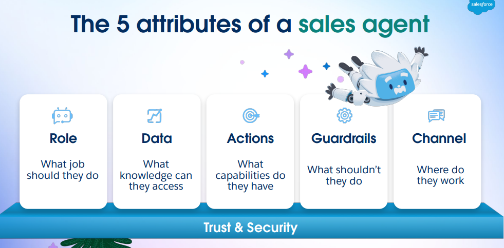
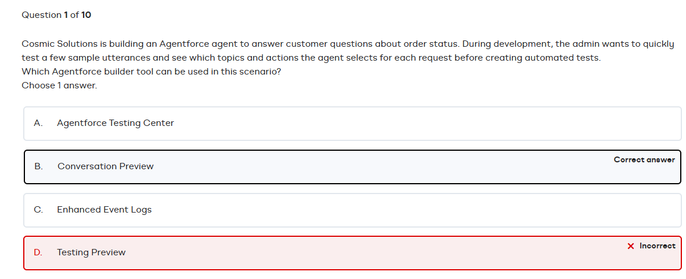
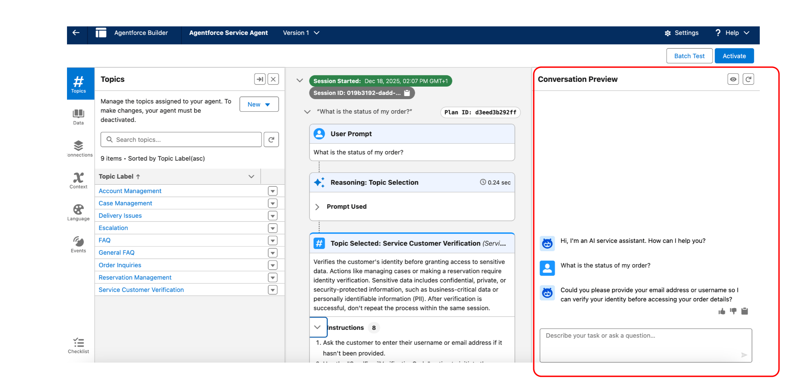

# Agentforce

This is an example guided of Salesforce Admin

## Fundamentals

Information from the website:



## QA





###  Agentforce Builder Tools

1.  Cosmic Solutions is building an Agentforce agent to answer customer questions about order status. During development, the admin wants to quickly test a few sample utterances and see which topics and actions the agent selects for each request before creating automated tests.

**Which Agentforce builder tool can be used in this scenario?**

```{r echo=FALSE, results='asis'}
# 1. Cargamos la librería
library(webexercises)

# 2. Definimos las alternativas. La correcta siempre lleva 'answer ='
opciones_agentforce <- c(
  "A. Agentforce Testing Center",
  answer = "B. Conversation Preview",
  "C. Enhanced Event Logs",
  "D. Testing Preview"
)

# 3. cat() inyecta el HTML directamente en la web
cat(longmcq(opciones_agentforce))

# Un pequeño salto de línea visual
cat("<br>\n\n")

# 4. Botón oculto con la explicación
cat(hide("Ver Explicación"))
cat("**La respuesta correcta es: B. Conversation Preview.**\n\n")
cat("Durante el desarrollo de un agente en **Agentforce**, la herramienta *Conversation Preview* te permite simular una conversación de prueba en tiempo real. Esto permite al administrador ver exactamente qué tópicos e instrucciones está seleccionando el agente basado en los *utterances* (frases) de prueba, sin necesidad de crear pruebas automatizadas todavía. Las opciones como *Testing Center* suelen usarse para despliegues más formales y pruebas a gran escala.")
cat(unhide())
```

# 
