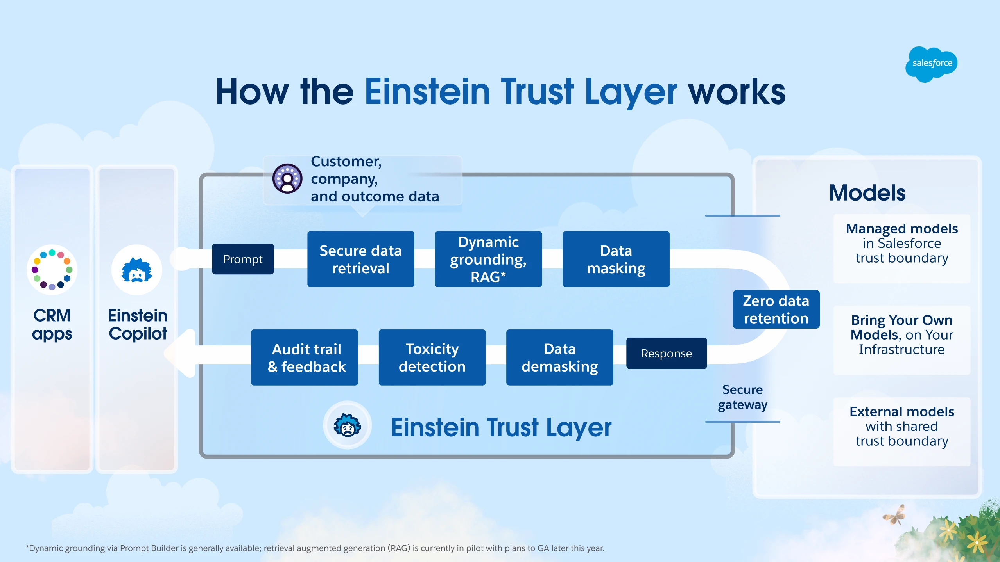

# Agentforce

This is an example guided of Salesforce Admin

## Fundamentals

Information from the website:




## QA {.unnumbered}

### Agentforce - Builder Tools {.unnumbered}

*Objective: Explain how to maintain, update, or install prompts and instructions in Agent Builder (light testing, conversation preview).*

1.  Cosmic Solutions is building an Agentforce agent to answer customer questions about order status. During development, the admin wants to quickly test a few sample utterances and see which topics and actions the agent selects for each request before creating automated tests.

**Which Agentforce builder tool can be used in this scenario?**

```{r echo=FALSE, results='asis'}
# 1. Cargamos la librería
library(webexercises)

# 2. Definimos las alternativas. La correcta siempre lleva 'answer ='
opciones_agentforce_1 <- c(
  "A. Agentforce Testing Center",
  answer = "B. Conversation Preview",
  "C. Enhanced Event Logs",
  "D. Testing Preview"
)

# 3. cat() inyecta el HTML directamente en la web
cat(longmcq(opciones_agentforce_1))

# Un pequeño salto de línea visual
cat("<br>\n\n")

# 4. Botón oculto con la explicación
cat(hide("Check"))
cat("**Correct Answer is: B. Conversation Preview.**\n\n")
cat("In this scenario, the admin needs to interact with the agent in real time to observe how topics and actions are selected for specific utterances. The Conversation Preview panel in Agentforce Builder allows for manual testing during development, providing immediate feedback on the agent’s behavior and decision-making.

Agentforce Testing Center is designed for batch testing large volumes of utterances and is better suited for automated, large-scale validation. Enhanced Event Logs allow admins to review recorded conversation events after interactions occur, but they do not provide real-time testing during development.
Testing Preview is not an actual Agentforce tool and does not exist.")

cat(unhide())
```


2.  A Salesforce Administrator needs to configure a solution where support agents receive a generated synopsis of lengthy case history to improve efficiency, while simultaneously ensuring that all cases marked with a "High" priority are immediately and predictably reassigned to a specific queue for compliance purposes. Which solution design aligns with te best practices for selecting between AI and tradicional automation?

```{r echo=FALSE, results='asis'}

# 2. Definimos las alternativas. La correcta siempre lleva 'answer ='
opciones_agentforce_2 <- c(
  answer = "A. Use Agentforce to generate the case synopsis and a case assignment rule to handle the priority-based reassignment.",
  "B. Create a screen flow to handle the case synopsis generation and use Agentforce to monitor for high-priority cases.",
  "C. Implement Agentforce to handle both the case synopsis generation and the priority-based reassignment to unify the process.",
  "D. Configure Agentforce to handle the case reassignment and use a record-triggered flow to generate the case synopsis."
)

# 3. cat() inyecta el HTML directamente en la web
cat(longmcq(opciones_agentforce_2))

# Un pequeño salto de línea visual
cat("<br>\n\n")

# 4. Botón oculto con la explicación
cat(hide("Check"))
cat("**Correct Answer is: B. Conversation Preview.**\n\n")
cat("
The best practice is to use artificial intelligence for tasks that require interpretation, such as summarizing unstructured data, while relying on traditional automation for tasks requiring certainty. AI is ideal for generating synopses from lengthy histories as it can reason and condense information contextually. In contrast, compliance-driven actions like reassignment based on priority require deterministic, predictable outcomes, which are best handled by tools such as case assignment rules to ensure the action happens exactly the same way every time.")

cat(unhide())

```

3.  
