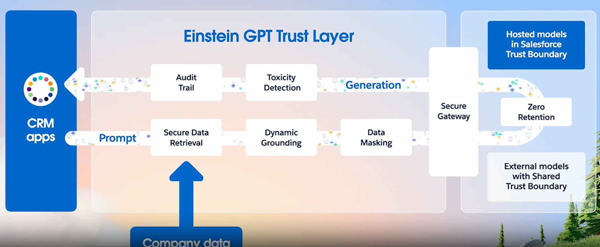
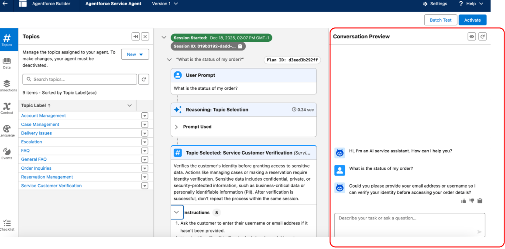

# Agentforce 8%

The first chapter of this documentation is abount Agentforce, the newest technology of Salesforce that is interacting with a contect on which is changing faster every year.

## Fundamentals

A simple resume from the website, What are the 5 attributes of Sales Agent?

{width="841"}

How do I trust Generative AI?

Einstein GPT Trust Layer\

{width="907"}


### AI Sales Agents

Sales Agents:

$$
\text{AI Sales Agents}_{} \to
\text{Agent Type}_{🤖} = \begin{cases}
\text{SDR Agent}& \text{  , Sales Development Representative}\\
\\
\text{Sales Coach} & \text{   , Situacion 2}\\
\\
\end{cases}
$$

$$
\text{AI Sales Agents}_{} \to
\text{Agent Type}_{} = \begin{cases}
\text{Prospecting}& \text{  , Situacion 1}\\
\\
\text{Agentforce Engagement} & \text{   , Situacion 2}\\
\\
\text{Sales Management} & \text{   , Situacion 2}\\
\\
\text{Sales Coaching} & \text{   , Situacion 2}\\
\\
\end{cases}
$$

## Q&A {.unnumbered}

### Agentforce - Builder Tools {.unnumbered}

#### *Objective: Explain how to maintain, update, or install prompts and instructions in Agent Builder (light testing, conversation preview).*{.unnumbered}

1.  Cosmic Solutions is building an Agentforce agent to answer customer questions about order status. During development, the admin wants to quickly test a few sample utterances and see which topics and actions the agent selects for each request before creating automated tests.

**Which Agentforce builder tool can be used in this scenario?**

```{r echo=FALSE, results='asis'}
# 1. Cargamos la librería
library(webexercises)

# 2. Definimos las alternativas. La correcta siempre lleva 'answer ='
opciones_agentforce_1 <- c(
  "A. Agentforce Testing Center",
  answer = "B. Conversation Preview",
  "C. Enhanced Event Logs",
  "D. Testing Preview"
)

# 3. cat() inyecta el HTML directamente en la web
cat(longmcq(opciones_agentforce_1))

# Un pequeño salto de línea visual
cat("<br>\n\n")

# 4. Botón oculto con la explicación
cat(hide("Check"))
cat("**Correct Answer is: B. Conversation Preview.**\n\n")
cat("In this scenario, the admin needs to interact with the agent in real time to observe how topics and actions are selected for specific utterances. The Conversation Preview panel in Agentforce Builder allows for manual testing during development, providing immediate feedback on the agent’s behavior and decision-making.

Agentforce Testing Center is designed for batch testing large volumes of utterances and is better suited for automated, large-scale validation. Enhanced Event Logs allow admins to review recorded conversation events after interactions occur, but they do not provide real-time testing during development.
Testing Preview is not an actual Agentforce tool and does not exist.")

cat(unhide())
```



2.  A Salesforce Administrator needs to configure a solution where support agents receive a generated synopsis of lengthy case history to improve efficiency, while simultaneously ensuring that all cases marked with a "High" priority are immediately and predictably reassigned to a specific queue for compliance purposes. Which solution design aligns with te best practices for selecting between AI and traditional automation?

```{r echo=FALSE, results='asis'}

# 2. Definimos las alternativas. La correcta siempre lleva 'answer ='
opciones_agentforce_2 <- c(
  answer = "A. Use Agentforce to generate the case synopsis and a case assignment rule to handle the priority-based reassignment.",
  "B. Create a screen flow to handle the case synopsis generation and use Agentforce to monitor for high-priority cases.",
  "C. Implement Agentforce to handle both the case synopsis generation and the priority-based reassignment to unify the process.",
  "D. Configure Agentforce to handle the case reassignment and use a record-triggered flow to generate the case synopsis."
)

# 3. cat() inyecta el HTML directamente en la web
cat(longmcq(opciones_agentforce_2))

# Un pequeño salto de línea visual
cat("<br>\n\n")

# 4. Botón oculto con la explicación
cat(hide("Check"))
cat("**Correct Answer is: A.**\n\n")
cat("
The best practice is to use artificial intelligence for tasks that require interpretation, such as summarizing unstructured data, while relying on traditional automation for tasks requiring certainty. AI is ideal for generating synopses from lengthy histories as it can reason and condense information contextually. In contrast, compliance-driven actions like reassignment based on priority require deterministic, predictable outcomes, which are best handled by tools such as case assignment rules to ensure the action happens exactly the same way every time.")

cat(unhide())

```

#### Describe the capabilities and use cases of Agentforce (scenarios about use cases, when it’s appropriate to use AI, security, troubleshooting agent permissions).

3.  A sales manager asks Agentforce to summarize a specific confidential Opportunity record but receives a response the information cannot be retrieved. An administrator verifies that the Opportunity exists and that other managers can successfully access it using Agentforce. What is the primary security mechanism causing this results?

```{r echo=FALSE, results='asis'}

    # 2. Definimos las alternativas. La correcta siempre lleva 'answer ='
    opciones_agentforce_3 <- c(
      answer = "A. The AI agent inherits the requesting user's permissions and strictly respects their sharing and field-level security.",
      "B.The AI agent is restricted by a separate permission set that specifically limits its access to confidential recod types",
      "C. The Einstein Trust Layer has automatically redacted the sensitive financial fields from the AI agent's view preventing the summary.",
      "D. The AI agent configuration lacks the 'View All Data' system permission required to search private records."
    )

    # 3. cat() inyecta el HTML directamente en la web
    cat(longmcq(opciones_agentforce_3))

    # Un pequeño salto de línea visual
    cat("<br>\n\n")

    # 4. Botón oculto con la explicación
    cat(hide("Check"))
    cat("**Correct Answer is: A. Inherits.**\n\n")
    cat("Agentforce operates by inheriting the access permissions of the user interacting with it. If the sales manager does not have the necessary object, field, or record-level access, such as sharing rules, to view the specific Opportunity record, the AI agent will be unable to retrieve or display that information.

    Agentforce does not use a separate, overriding permission set for record access, nor does it require 'View All Data' to function. Agentforce strictly mirrors the user's access context. While the Einstein Trust Layer handles data masking to protect sensitive information during processing, the inability to retrieve a record entirely is caused by standard Salesforce sharing restrictions rather than Trust Layer redaction.")

    cat(unhide())


```

4.  A support agent attempts to use Agentforce to update the "Escalated" checkbox on a Case record during a conversation. The agent acknowledges the request but fails to complete the update, returning an error message indicating it cannot modify the record. An administrator confirms the Agentforce action is correctly configured and active.What is the most likely cause of this issue?\

```{r echo=FALSE, results='asis'}
    # 2. Definimos las alternativas. La correcta siempre lleva 'answer ='
    opciones_agentforce_4 <- c(
      "A. The support agent does not have the 'Customize Application' permission required to invoke Agent actions",
      "B. The Einstein Trust Layer detected sensitive data and blocked the write operation.",
      "C. The Escalated field is not include in the Agentforce Service Agent's creating prompt.",
      answer = "D. The support agent's profile lacks field-level security access for the Escalated field."
    )

    # 3. cat() inyecta el HTML directamente en la web
    cat(longmcq(opciones_agentforce_4))


    # Un pequeño salto de línea visual
    cat("<br>\n\n")

    # 4. Botón oculto con la explicación
    cat(hide("Check"))
    cat("**Correct Answer is: D. Conversation Preview.**\n\n")
    cat("Agentforce operates by strictly inheriting the permissions of the user interacting with it. If the user does not have specific Edit access to a field via field-level security (FLS) in their profile or permission sets, the AI agent will be unable to modify that field, even if the Agent action itself is active and valid.

    The Einstein Trust Layer focuses on data masking and safety policies (like preventing toxic output) rather than blocking standard field updates based on user permissions. Prompts provide instructions and context, but they do not control the underlying database permissions required to commit a change. Customize Application is a high-level administrative permission such that end users do not need it to perform standard record updates through the AI agent.")

    cat(unhide())
```

5.  The sales director at Cosmic Containers is facing a challenge with a high volume of inbound leads. The sales team is unable to respond quickly enough, resulting in missed opportunities. The director needs a solution that can autonomously engage with these leads 24/7, answer initial product questions, and schedule meetings directly on the sales representatives' calendars. Which Agentforce agent type is specifically designed to meet these requirements?

```{r echo=FALSE, results='asis'}
    # 2. Definimos las alternativas. La correcta siempre lleva 'answer ='
    opciones_agentforce_5 <- c(
      "A. Agentforce Sales Coach",
      answer = "B. Agentforce SDR",
      "C. Agentforce Employee Agent",
      "D. Agentforce Service Agent"
    )


    # 3. cat() inyecta el HTML directamente en la web
    cat(longmcq(opciones_agentforce_5))


    # Un pequeño salto de línea visual
    cat("<br>\n\n")

    # 4. Botón oculto con la explicación
    cat(hide("Check"))
    cat("**Correct Answer is: B. Agentforce SDR Preview.**\n\n")
    cat("Agentforce SDR (Sales Development Representative) is explicitly designed to handle high-volume inbound lead engagement. It operates 24/7 and is capable of answering product questions and scheduling meetings for human sales representatives.

    The Agentforce Service Agent is built for customer support scenarios, such as resolving cases and inquiries, rather than sales prospecting. The Agentforce Sales Coach is an internal-facing agent designed to role-play with sales reps and provide feedback on their pitches, not to interact directly with external leads. The Agentforce Employee Agent focuses on assisting internal employees with administrative tasks and information retrieval, not external sales engagement.")

    "https://help.salesforce.com/s/articleView?id=sales.sales_cloud_agents.htm&type=5"

    cat(unhide())

```

[https://help.salesforce.com/s/articleView?id=sales.sales_agents_coach_parent.htm&type=5https://help.salesforce.com/s/articleView?id=sales.sales_agents_coach_parent.htm&type=5](https://help.salesforce.com/s/articleView?id=sales.sales_agents_coach_parent.htm&type=5){.uri}

6.  An administrator wants to ensure that when Agentforce generates email drafts, sensitive customer credit card numbers stored in the case description are never visible to an external Large Language Model (LLM) provider. Which Einstein Trust Layer capability directly prevents this sensitive data from being shared with the LLM?

```{r echo=FALSE, results='asis'}
# 2. Definimos las alternativas. La correcta siempre lleva 'answer ='
opciones_agentforce_6 <- c(
  "A. Zero Data Retention",
  "B. Toxic Language Detection ",
  "C. Prompt Defense",
  answer ="D. PII/ Data Masking "
)


# 3. cat() inyecta el HTML directamente en la web
cat(longmcq(opciones_agentforce_6))

# Un pequeño salto de línea visual
cat("<br>\n\n")

# 4. Botón oculto con la explicación
cat(hide("Check"))
cat("**Correct Answer is: D. PII/ Data Masking**\n\n")
cat("The PII/Data Masking feature of the Einstein Trust Layer is responsible for identifying sensitive information, such as credit card numbers, email addresses, or social security numbers, within a prompt and replacing it with generic placeholder text (e.g., [CREDIT_CARD_NUMBER]) before the request is sent to the external LLM. This ensures that the third-party model never receives or processes the actual sensitive data, keeping it securely inside the Salesforce boundary.
Zero Data Retention is a policy agreement that ensures an external LLM provider does not store or train their models on the data sent to them, but it does not prevent the data from being sent in the first place. Prompt Defense is designed to detect and block 'jailbreaking' attempts or malicious prompts that try to bypass safety controls, not to hide data. Toxic Language Detection scans the AI's output to prevent the generation of harmful or offensive content, but it does not protect sensitive input data from reaching the model.")


cat(unhide())


```

<https://help.salesforce.com/s/articleView?id=ai.generative_ai_trust_layer.htm&type=5>

7.  A service agent asks Agentforce to summarize a high-priority case managed by a different regional team. Although the administrator confirms the case exists in Salesforce, Agentforce responds that it cannot find the record. The service agent also cannot find this case when performing a manual global search. What is the most likely reason for this behavior?

```{r echo=FALSE, results='asis'}
    # 2. Definimos las alternativas. La correcta siempre lleva 'answer ='
    opciones_agentforce_7 <- c(
      "A. The Agentforce Service Agent User profile lacks the 'View All Data' system permission required to search across regions ",
      "B. The Einstein Trust Layer has flagged the case content as sensitive and blocked the agent from accesssing it.",
      answer = "C. The Organization-Wide Default sharing settings for Cases is set to Private, and no sharing rule grants access to the agent.",
      "D. The case record has not been indexed by the Einstein Search engine yet."
    )


    # 3. cat() inyecta el HTML directamente en la web
    cat(longmcq(opciones_agentforce_7))

    # Un pequeño salto de línea visual
    cat("<br>\n\n")

    # 4. Botón oculto con la explicación
    cat(hide("Check"))
    cat("**Correct Answer is: C.**\n\n")
    cat("Agentforce operates strictly within the boundaries of the user’s permissions and visibility settings. It creates a plan and executes actions using the requesting user's security access. If the organization's sharing model is set to Private and no sharing rules or manual sharing mechanisms grant the user access to that specific record, the AI agent effectively 'cannot see' it and will report that the information is unavailable.

    The Einstein Trust Layer is responsible for masking sensitive data and enforcing safety policies, but it does not control record-level visibility or hide the existence of records based on ownership. Granting 'View All Data' is a security risk and is not required for standard agent operations, as the agent simply needs the same access as the user it is assisting. While search indexing issues can occur, the scenario describes a classic access control issue where the user (and therefore the AI agent) lacks visibility due to restrictive sharing settings.")

    cat(unhide())

```

8.  An HR manager at Cosmic Kicks wants to deploy an AI agent to assist internal staff. The goal is to allow employees to ask questions about company benefits, retrieve their remaining time-off balance, and submit IT help desk tickets using natural language. Which AI agent type is best suited for this internal productivity scenario?

```{r echo=FALSE, results='asis'}
# 2. Definimos las alternativas. La correcta siempre lleva 'answer ='
opciones_agentforce_8 <- c(
  "A. Agentforce SDR. ",
  answer ="B. Agentforce Employee Agent",
  "C. Agentforce Service Agent",
  "D.Agentforce Sales Coach"
)

# 3. cat() inyecta el HTML directamente en la web
cat(longmcq(opciones_agentforce_8))

# Un pequeño salto de línea visual
cat("<br>\n\n")

# 4. Botón oculto con la explicación
cat(hide("Check"))
cat("**Correct Answer is: B.**\n\n")
cat("The Agentforce Employee Agent is specifically designed to support internal employees by integrating with enterprise systems to answer questions and automate administrative tasks. Unlike customer-facing agents, the Employee Agent operates as a teammate in internal channels (like Slack or Salesforce) to assist with HR inquiries, IT tickets, and general productivity workflows.

The Agentforce Service Agent is designed for external customer support scenarios, such as resolving cases and inquiries for clients, rather than internal employee productivity. The Agentforce Sales Coach is tailored for role-playing and training sales representatives, not for general HR or IT assistance. The Agentforce SDR is built for outbound sales development and lead qualification, making it unsuitable for internal administrative use cases.")

cat(unhide())
```

9.  CosmicTech Solutions is implementing custom agent actions to enhance its customer service processes. The development team needs to ensure that each action is correctly configured and functions as expected.\
    Which core component of a custom agent action should the development team review during configuration?

```{r echo=FALSE, results='asis'}
# 2. Definimos las alternativas. La correcta siempre lleva 'answer ='
opciones_agentforce_9 <- c(
  "A. Classification Descriptions",
  "B. Context Variables",
  "C. Language Settings",
  answer ="D. Action Instructions"
)

# 3. cat() inyecta el HTML directamente en la web
cat(longmcq(opciones_agentforce_9))

# Un pequeño salto de línea visual
cat("<br>\n\n")

# 4. Botón oculto con la explicación
cat(hide("Check"))
cat("**Correct Answer is: D.**\n\n")
cat("Instructions guide the agent in deciding how to use the actions within a topic across different use cases. They define what the action does and when it's used. Ensuring that the action instructions are properly configured is essential for making sure the agent performs tasks as expected and meets the desired outcomes.

Context variables, classification descriptions, and language settings are important, but do not directly define the core functionality or behavior of the action.")

cat(unhide())
```

10. Cosmic Care Solutions is evaluating ways to improve its customer support operations. The leadership team is deciding between implementing Einstein bots or adopting Salesforce Agentforce Service Agent. They want a solution that can independently handle customer conversations, take actions in Salesforce, and reduce the need for constant human intervention and scripted workflows.\
    Which statement best describes the key difference between traditional bots and Agentforce Service Agent?

```{r echo=FALSE, results='asis'}
    # 2. Definimos las alternativas. La correcta siempre lleva 'answer ='
    opciones_agentforce_6 <- c(
      "A. Bots and Agentforce Service Agent both rely mainly on scripted conversations, but Agentforce Service Agent requires larger training datasets to operate effectively",
      "B. Bots are fully autonomous and capable of proactive decision-making, whereas Agentforce Service Agent is mainly designed to route cases to human services reps.",
      answer = "C. Bots depend on predefined scripts and human assitance, while Agentforce Service Agent uses AI reasoning to autonomously manage realistic conversations and complete actions."
      
    )

    # 3. cat() inyecta el HTML directamente en la web
    cat(longmcq(opciones_agentforce_6))

    # Un pequeño salto de línea visual
    cat("<br>\n\n")

    # 4. Botón oculto con la explicación
    cat(hide("Check"))
    cat("**Correct Answer is: C.**\n\n")
    cat("Traditional bots rely heavily on scripted conversations, predefined flows, and human support for handling more complex situations. In contrast, Agentforce Service Agent uses Salesforce’s AI reasoning engine to autonomously engage in realistic customer conversations, complete actions in Salesforce, and proactively support customer service goals with less manual setup and intervention.")

    cat(unhide())
```

### Explain the various organization security controls


- An administrator has created and activated an Employee Agent in Agentforce to assist the sales team with internal querires abount accounts, opportunities, and company knowledge.
However, the agent is not visible to the sales users, even though their profiles have standard object permissions.
What is the correct step to make this Employee Agent available to the sales user?

```{r c_and_s_1, echo=FALSE, results='asis'}
# 2. Definimos las alternativas. La correcta siempre lleva 'answer ='
opciones_c_and_s_1 <- c(
  "A. Assign the dedicated agent user (auto-generated for the Employee Agent) to a permission set with the 'View All Records' and 'View All fields' permissions on relvant objects. ",
  answer ="B. In the Agentforce Agents Setup page, open the agent details and add the sales users' profiles or permission sets directtly to the Agent Accesss tab on the agent record. ",
  "C. In the configuration page of a permission set assigned to the sales users, clikc Agent Access, Edit, and move the specific Employee Agent t the Enabed Agents list.",
  "D. Ensure the sales users have the 'Connect Agent to Lightning Experience' permission enabled in their profiles, as this controls agent visibility in the internal UI."
)

# 3. cat() inyecta el HTML directamente en la web
cat(longmcq(opciones_c_and_s_1))

# Un pequeño salto de línea visual
cat("<br>\n\n")

# 4. Botón oculto con la explicación
cat(hide("Check"))
cat("**Correct Answer is: A.**\n\n")
cat("For Agentforce agents, user access and visibility are controlled via the Agent Access tab in permission sets or profiles assigned to end users. Therefore, to allow the sales users to access and interact with the agent, the agent must be enabled in the profile or permission set assigned to them via the Agent Access settings.

Employee Agents run in the logged-in user's context and do not run on behalf of a dedicated agent user, unlike the Agentforce Service agent. The Agent Access tab exists in permission sets/profiles, not on the agent record in Setup. A 'Connect Agent to Lightning Experience' permission does not exist.")

cat(unhide())
```

