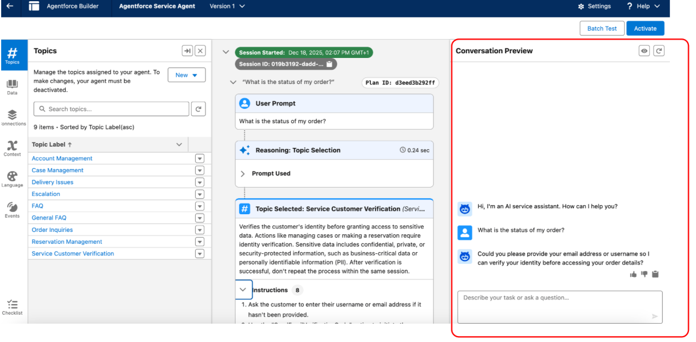

# Agentforce

This is an example guided of Salesforce Admin

## Fundamentals

Information from the website:


## QA


###  Agentforce Builder Tools

Detailed Objective: Explain how to maintain, update, or install prompts and instructions in Agent Builder (light testing, conversation preview).


1.  Cosmic Solutions is building an Agentforce agent to answer customer questions about order status. During development, the admin wants to quickly test a few sample utterances and see which topics and actions the agent selects for each request before creating automated tests.

**Which Agentforce builder tool can be used in this scenario?**

```{r echo=FALSE, results='asis'}
# 1. Cargamos la librería
library(webexercises)

# 2. Definimos las alternativas. La correcta siempre lleva 'answer ='
opciones_agentforce <- c(
  "A. Agentforce Testing Center",
  answer = "B. Conversation Preview",
  "C. Enhanced Event Logs",
  "D. Testing Preview"
)

# 3. cat() inyecta el HTML directamente en la web
cat(longmcq(opciones_agentforce))

# Un pequeño salto de línea visual
cat("<br>\n\n")

# 4. Botón oculto con la explicación
cat(hide("Check"))
cat("**La respuesta correcta es: B. Conversation Preview.**\n\n")
cat("In this scenario, the admin needs to interact with the agent in real time to observe how topics and actions are selected for specific utterances. The Conversation Preview panel in Agentforce Builder allows for manual testing during development, providing immediate feedback on the agent’s behavior and decision-making.

Agentforce Testing Center is designed for batch testing large volumes of utterances and is better suited for automated, large-scale validation. Enhanced Event Logs allow admins to review recorded conversation events after interactions occur, but they do not provide real-time testing during development.
Testing Preview is not an actual Agentforce tool and does not exist.")

# 1. Damos un pequeño salto de línea para separar el texto de la foto
cat("<br><br>\n\n")

# 2. Inyectamos la imagen de tu portapapeles usando HTML
cat("\n\n")

cat(unhide())
```


