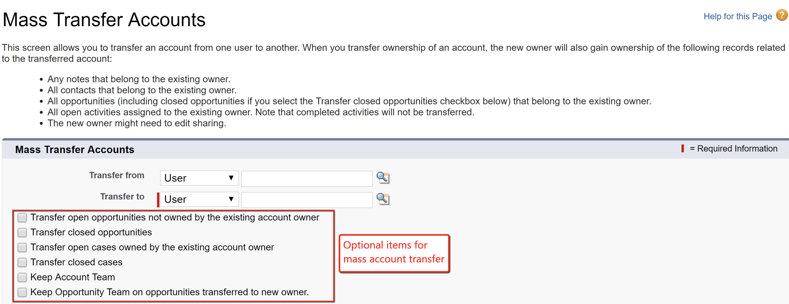
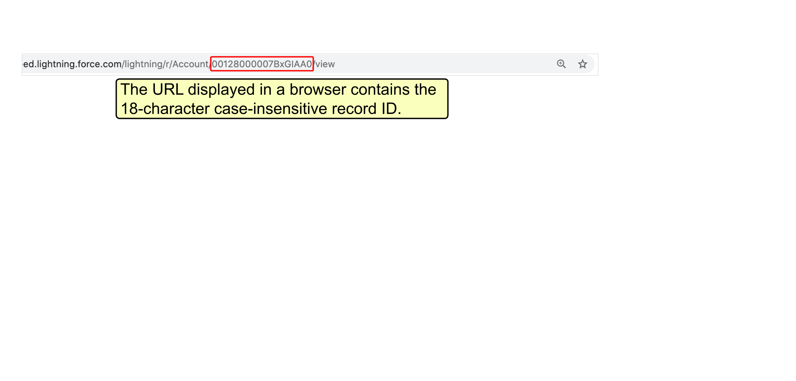
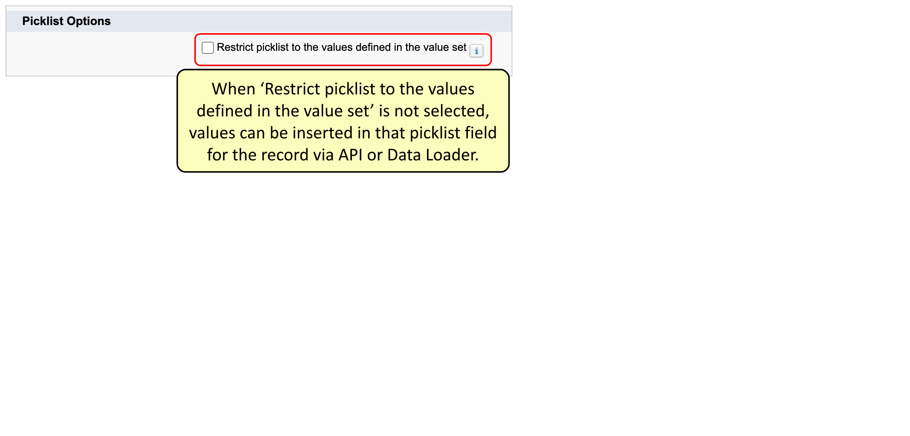
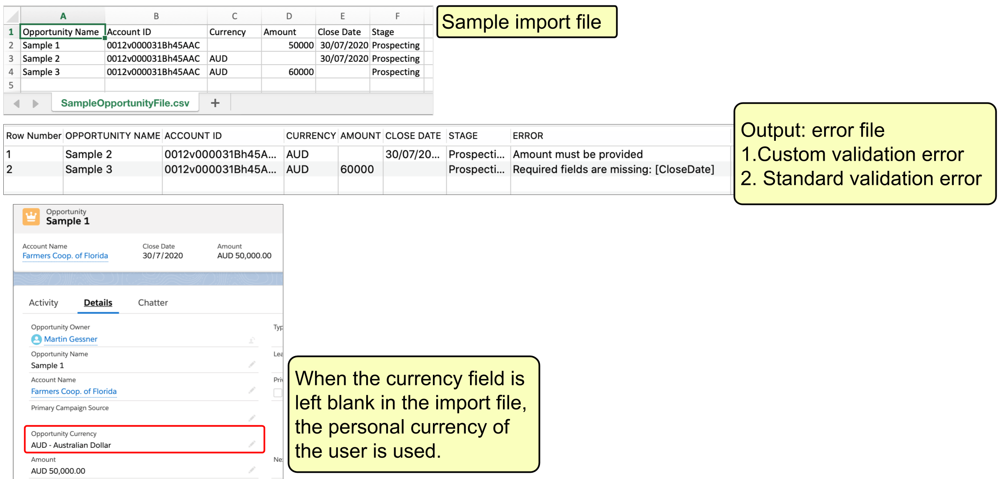
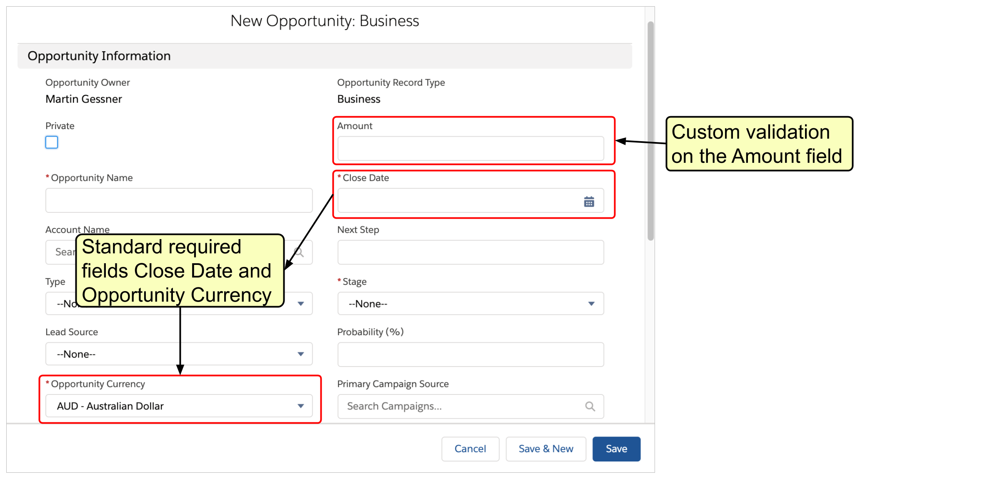
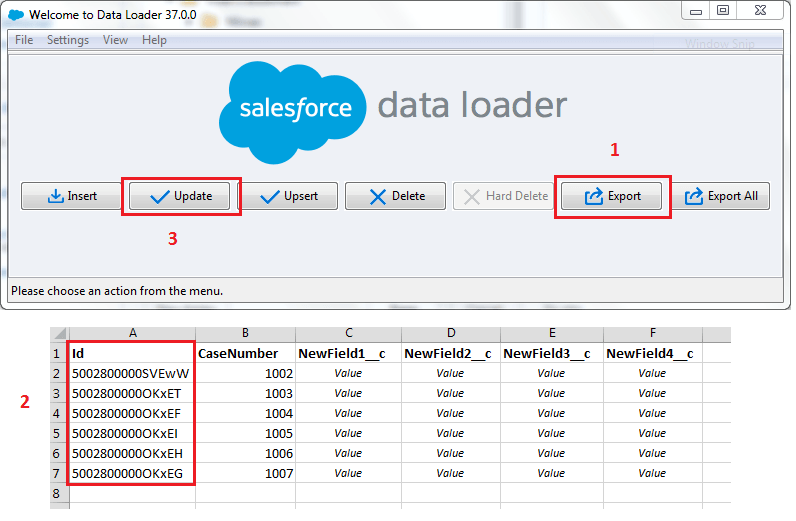

# Data & Analytics Managment 17%

## Questions

### *Describe the considerations when importing, updating, transferring, mass deleting, exporting and backing up data.* {.unnumbered}

1.  An account manager at Cosmic Circle Financial is on a leave of absence, and the administrator has been asked to transfer the account records owned by him to a sales manager. Which of the following are transferred with account records by default using the mass transfer feature in Salesforce? Choose 2 answers.

```{r opciones_dam_1, echo=FALSE, results='asis'}
# 2. Definimos las alternativas. La correcta siempre lleva 'answer ='
opciones_dam_1 <- c(
  answer ="A. Open activities assigned to the account manager",
  "B. Completed activities assigned to the account manager",
  answer ="C. Open opportunities that belong to the account manager",
   "D. Open Cases assigned to the account manager."
)

# 3. cat() inyecta el HTML directamente en la web
cat(longmcq(opciones_dam_1))

# Un pequeño salto de línea visual
cat("<br>\n\n")

# 4. Botón oculto con la explicación
cat(hide("Check"))
cat("**Correct Answer is: A and C.**\n\n")
cat("In Salesforce Classic and Lightning Experience, accounts can be mass transferred to other users. By default, the new user will own associated Contacts, open Opportunities, Contracts in Draft & In Approval Process status, Orders in Draft status, Notes, Attachments, and open Activities assigned to the existing owner.

The option to transfer associated open cases assigned to the existing owner can be optionally selected. There is no option to include associated completed activities in the mass transfer feature.")

cat(unhide())
```



2.  A salesforce Administrator has 7 million records that need to be loaded into Salesforce and wants to do it in one batch. How can the records be uploaded in one batch?

```{r opciones_dam_2, echo=FALSE, results='asis'}
# 2. Definimos las alternativas. La correcta siempre lleva 'answer ='
opciones_dam_2 <- c(
  answer = "A. Data Loader ",
  "B. It is not possible to load 7 million records",
  "C. Third-party data loading tool",
  "D. Data import Wizard"
)

# 3. cat() inyecta el HTML directamente en la web
cat(longmcq(opciones_dam_2))

# Un pequeño salto de línea visual
cat("<br>\n\n")

# 4. Botón oculto con la explicación
cat(hide("Check"))
cat("**Correct Answer is: A.**\n\n")
cat("Data Loader can now support large file loads, handling up to 5 million records with Bulk API and up to 150 million records with Bulk API 2.0. However, for records exceeding these limits or for additional features, third-party data loading tools available on the AppExchange might be required.")

cat(unhide())
```

3.  What is true regarding the use of an external ID field for matching in the Data Import Wizard? Choose 2 answers.

```{r opciones_dam_3, echo=FALSE, results='asis'}
# 2. Definimos las alternativas. La correcta siempre lleva 'answer ='
opciones_dam_3 <- c(
  "A. Matching by external ID is only available when importing solutions.",
  "B. Matching by external ID is only available for customer objects",
  answer = "C. Matching by external ID is available for any object that includes an External ID field and can be imported.",
  answer ="D. Existing records with external IDs that match the values in the import file are detected."
)

# 3. cat() inyecta el HTML directamente en la web
cat(longmcq(opciones_dam_3))

# Un pequeño salto de línea visual
cat("<br>\n\n")

# 4. Botón oculto con la explicación
cat(hide("Check"))
cat("**Correct Answer is: C and D.**\n\n")
cat("Matching by external ID is available for any object that has an External Id and can be imported via the Data Import Wizard. When the option to match by External ID is selected, the Data Import Wizard detects existing records in Salesforce with external IDs that match the values specified in the import file.")

cat(unhide())
```

4.  Where can the Salesforce record ID be obtained from? Choose 3 answers.

```{r opciones_dam_4, echo=FALSE, results='asis'}
# 2. Definimos las alternativas. La correcta siempre lleva 'answer ='
opciones_dam_4 <- c(
  "A. Record name",
  answer ="B. Reports",
  "C. Setup",
  answer ="D. The record URL in the browser",
  answer ="E. Data Loader export file"
)

# 3. cat() inyecta el HTML directamente en la web
cat(longmcq(opciones_dam_4))

# Un pequeño salto de línea visual
cat("<br>\n\n")

# 4. Botón oculto con la explicación
cat(hide("Check"))
cat("**Correct Answer is: B, D and E.**\n\n")
cat("The Salesforce record ID can be included in reports. It is part of the URL when accessing records, and it can also be included in a Data Loader export file. Record IDs cannot be obtained from either Setup or the record name")

cat(unhide())
```



5.  What will happen if a record in a Data Loader import file contains a pick list value that does not exist in Salesforce and the pick list is not restricted?

```{r opciones_dam_5, echo=FALSE, results='asis'}
# 2. Definimos las alternativas. La correcta siempre lleva 'answer ='
opciones_dam_5 <- c(
  "A. The record will be added, and the picklist value will be added to the list of existing values",
  answer ="B. The record will be added with the default value for the picklist field.",
  "C. The import will fail with an error message.",
  answer ="D. The record will be added, but the picklist value will not be added to the list of selectable."
  )

# 3. cat() inyecta el HTML directamente en la web
cat(longmcq(opciones_dam_5))

# Un pequeño salto de línea visual
cat("<br>\n\n")

# 4. Botón oculto con la explicación
cat(hide("Check"))
cat("**Correct Answer is: D **\n\n")
cat("TWhen a record is imported through API or Data Loader and it has a new picklist value unavailable in the non-restricted picklist, the record gets created with the new value in the field. However, this new value is not added permanently to the picklist value set of the field. It is available only on this record.

When the record is edited anytime later, the picklist value will stay the same until the record is saved with a different choice for the same picklist.

If the picklist is restricted, i.e., 'Restrict picklist to the values defined in the value set' is selected, then additional values cannot be added via the API or Data Loader, and the record is not saved.

The first screenshot shows the option 'Restrict picklist to the values defined in the value set' not selected. It allows values to be inserted in that picklist field for the record via the API or Data Loader.

In the second screenshot, only 'Primary' and 'Secondary' exist as picklist value options that can be selected. However, the third screenshot shows a saved contact record with a value of 'Tertiary' in the 'Level' field. That is not an existing picklist value, but the record is created, and the value is set.")

cat(unhide())
```



6.  An organization has multi-currency enabled. What can cause a record in an import file to fail?\
    Choose 2 answers.

```{r opciones_dam_6, echo=FALSE, results='asis'}
# 2. Definimos las alternativas. La correcta siempre lleva 'answer ='
opciones_dam_6 <- c(
  answer ="A. The record fails system validation rules",
  "B. Currency in the file is an inactive Salesforce currency",
  answer ="C. The record fails custom validation rules",
  "D. Currency field is left blank")

# 3. cat() inyecta el HTML directamente en la web
cat(longmcq(opciones_dam_6))

# Un pequeño salto de línea visual
cat("<br>\n\n")

# 4. Botón oculto con la explicación
cat(hide("Check"))
cat("**Correct Answer is: A and C.**\n\n")
cat("A record in the import file could fail because it fails system validation rules, like missing a required field, or fails custom validation rules. If multi-currency is enabled and the currency field is left blank or an inactive currency is used, the personal currency of the user will be used.")

cat(unhide())

```





7.  What record attribute is required to update a record using Data Loader?

```{r opciones_dam_7, echo=FALSE, results='asis'}

# 2. Definimos las alternativas. La correcta siempre lleva 'answer ='
opciones_dam_7 <- c(
  "A. Record Name",
  "B. Created By Id",
  "C. Record Type",
  answer ="D. Record ID")

# 3. cat() inyecta el HTML directamente en la web
cat(longmcq(opciones_dam_7))

# Un pequeño salto de línea visual
cat("<br>\n\n")

# 4. Botón oculto con la explicación
cat(hide("Check"))
cat("**Correct Answer is: D.**\n\n")
cat("A record in the import file could fail because it fails system validation rules, like missing a required field, or fails custom validation rules. If multi-currency is enabled and the currency field is left blank or an inactive currency is used, the personal currency of the user will be used.")

cat(unhide())
```



8.  The Salesforce Administrator discovered that a number of records were deleted by mistake 2 weeks ago

```{r opciones_dam_8, echo=FALSE, results='asis'}
# 2. Definimos las alternativas. La correcta siempre lleva 'answer ='
opciones_dam_8 <- c(
  "A. ",
  "B. ",
  "C. ",
  answer ="D."
)

# 3. cat() inyecta el HTML directamente en la web
cat(longmcq(opciones_dam_8))

# Un pequeño salto de línea visual
cat("<br>\n\n")

# 4. Botón oculto con la explicación
cat(hide("Check"))
cat("**Correct Answer is: D.**\n\n")
cat("asdfasdfasd")

cat(unhide())
```
