# Configuration and Setup 15%

## Fundamentals

On this chapter, We describe the principal concepts and configurations about Configuration and Setup.\
\
It's really common that in the organization may you are admin, We don't use the entire setup, because we choose what is relevant for the business necessity.

{width="372"}

### General Settings

One of the question in the exam , always is about :\
\
What can you configure in the Company Settings?\
\
So We need to keep in mind this image:

{width="349"}

And also in the section about company information, to know the difference between Data Space vs File Space.


### Multiple Currencies

When the organization enable Multiple currencies, there is a new layer of configuration that is open for your environment.


And we have two main configuration, the Standard and Custom fiscal year.


### User Interface

Eighteen configuration we also need to keep in mind when we talk about user interface.

{width="221"}

A really common question is about, if a user need to set up and organize the App Launcher, the place to do this is in the App menu -Setup.


#### User Interface

The "subsection" about User Interface, We can configure the Collapsible Sections and Also Enable Inline Editing on which is a typical question in the Admin Exam.


### Einstein Search

We also need the read at least the description about what the Einstein Search does when we are looking for some record in the organization, so also is good idea to keep in mind this image:

{width="796"}

### User

I create this topic just to have a summary about the key concepts about diferrents situation in the User configuration and the security level layer that the Admin can Add or remove.

This following image is to help to keep in mind the Key Concepts that the Salesforce Exam may will ask.


#### User - Key Principles

On this table we have the main summary:

|  |  |  |
|----|----|----|
| **Feature** | **Profile** | **Role** |
| **Main focus** | What you can **do** (Permissions). | Which records you can **see** (Visibility). |
| **Mandatory?** | Yes, it is 100% mandatory. | No, it is optional. |
| **Practical example** | Gives you access to the "Create Opportunity" button. | Allows you to see your team's Opportunities. |

#### Profile

Profiles determine how users access objects and data, and what they can do in an application. Tab settings are controlled from profiles and permission sets, and they indicate whether a tab is exposed or not in its associated app.

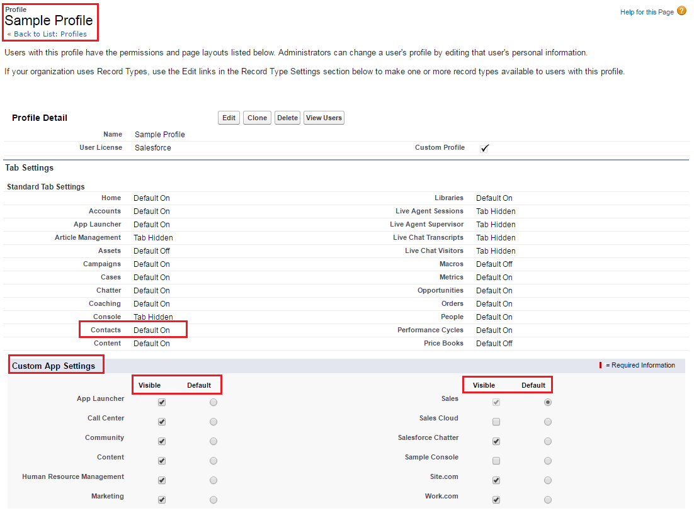\
\
What can be controlled in profiles?

PageLayout

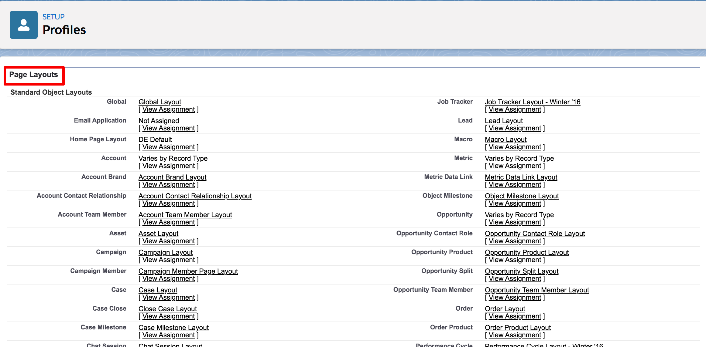

Field-Level Security

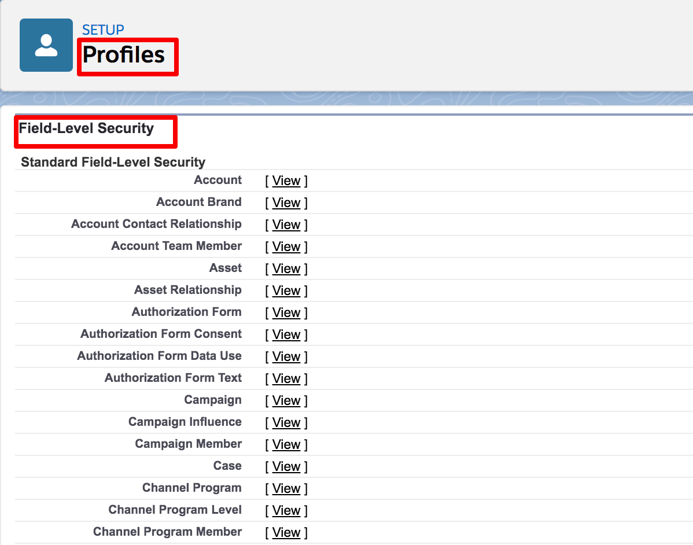

Standar Object Permissions

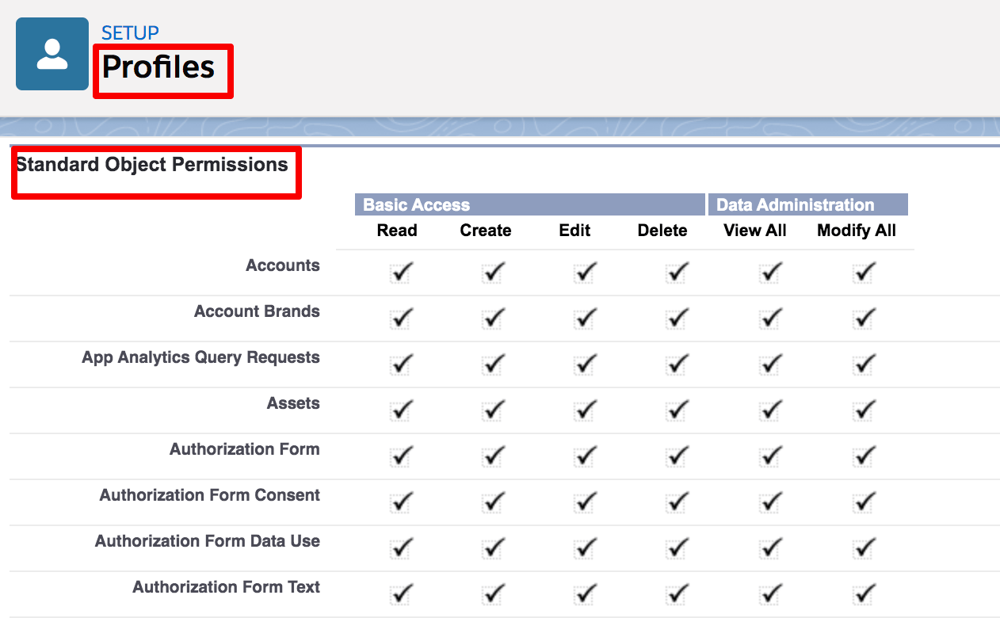

If you are in a dynamic organization with more than 5000 users across the globe. Which best practices should the Salesforce Administrator of the organization follow in order to manage changes to permissions for different groups of users more effectively by reducing the overhead of customization?

1.  The SF Admin should use permission sets to extend permissions for individuals or small groups of users as required.
2.  The SF Admin should not create a custom profile every time a user requires additional access or permission.

Charleston Small Business Products has recently expanded its business to include marketing and technology services. Consequently, the Salesforce Administrator must set up several new profiles to limit access to new objects created. Which object settings can be controlled from a Profile?

\
Profile Object Settings include:\
1) Tab settings\
2) Record types and page layout settings 3) Object permissions\
4) Field permissions\

##### Minimum Access - Salesforce

The company has a group of support users who require access to Salesforce. All these users need access to Chatter features and activities. A few of these users also require the ability to view and edit cases and records of a custom object called 'Product Issue'. None of the users should be able to view or edit the records of any other object. Which solution should be utilized to ensure that these users have the required permissions?

- Assign the 'Minimun Access - Salesforce' to all the users and assign a permission set to the user who requiere additional access.

The 'Minimum Access – Salesforce' profile is a least-privilege profile that includes 'Access Activities,' 'Chatter Internal User,' 'Lightning Console User', and 'View Help Link' permissions. To meet the requirement, this profile can be assigned to all the users who need to access Chatter features and activities. A permission set can be created and assigned to the subset of users who also need to view and edit cases and records of a custom object.

The 'Standard User' profile would allow creating and editing the records of most objects. The 'Standard Platform User' profile would give access to core platform functionality, such as accounts and contacts, which is not required in this case. Also, it does not grant access to cases, as the Salesforce license associated with this profile does not include access to the Case object. The 'Read Only' profile would grant the ability to view the records of other objects.

Note: Salesforce orgs created in Spring ’21 and later don’t have the 'Read-Only' standard profile any more. For orgs that were created before Spring '21, Salesforce will enforce the conversion of the 'Read Only' standard profile into a custom profile.

#### Role

The role of a sales manager of ABC company was recently changed due to a transfer. She is now able to access an account record that is not owned by her. The Salesforce Administrator of the company would like to determine whether the role hierarchy is the reason for the record access. Which of the following can be used to quickly determine this?

- SHARING HIERARCHY BUTTON.

The Sharing Hierarchy button on an account record can be used to view all the users who have access to the record and the reason for the access. From the Sharing Hierarchy list view, one can click on 'View' to view the reason for record access.

Sharing settings will not necessarily be able to address this because it will only show the OWD for the object. The Account Team related list will only show which users have been given access to the record by being added as an Account Team member. However, if access is given in another way, the Account Team related list will not be able to show this. Apex sharing reasons are used to indicate why sharing has been implemented when creating Apex managed sharing on custom objects.

Note: Sharing Hierarchy is currently only available for accounts, opportunities, cases, contacts, leads, and custom objects.

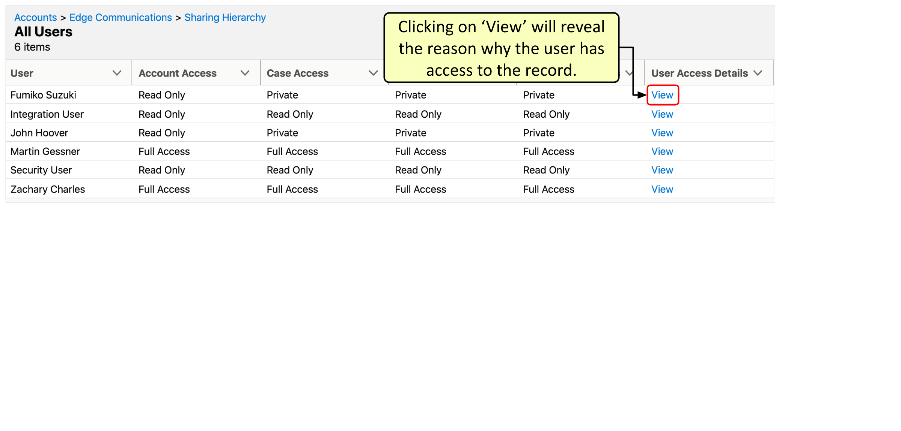

#### Permission Set

Bob and Patrick are sales users and share the same custom sales profile. The sales profile allows create and edit of contacts but not delete. The sales manager would like Patrick to be able to create and edit contact records, however, Bob should also be able to delete contacts. How can the Salesforce Administrator configure this most efficiently?

- Create a permission set and assign it to Bob.

  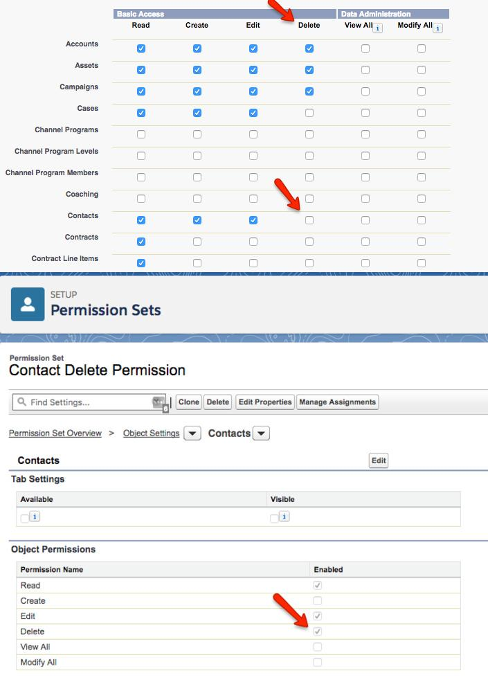

Although two profiles could be created with different permissions to the Contact object, it is more efficient to create a permission set to give Bob the extra permissions and use one profile for sales users. Permission sets can grant object and field level permissions and extend profile permissions and access.

#### Delegated Administration

A Salesforce Administrator wishes to delegate the responsibility of resetting passwords and creating new users to her assistant. The Salesforce Administrator does not wish to give her assistant full administrative rights. What is the most appropriate solution in this case?

- Assign the user to a delegated group that has selected user administration permissions.

What is the primary benefit of "View All Fields" permission in Salesforce?

- It grants users read-only access to all fields for a specific object.

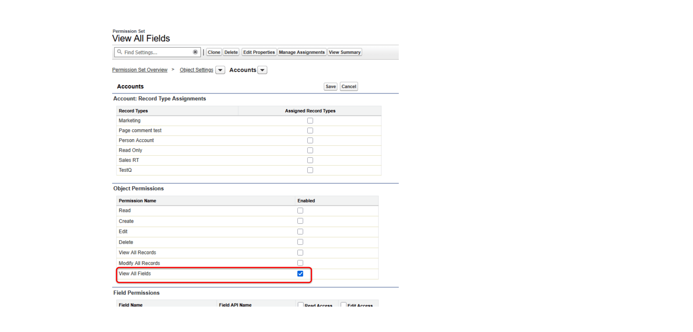

#### Create

If you need a create a New User, it's simple to go to the setup configuration and to keep in mind the minimal data that the system required.

Let's check another common situation:

#### Add Multiple Users

If you need to add multiple User's and the amount is not to big, for example if you need the create 10 users, We can use de Add Multiple users bottom.


Anothe common situation is, If you need to create 200 users but you don't want to notify the user od their login details.\
What is the most efficient way to achieve this?\
\
***Use the Data Loader.***

#### Login

Single Sign-On (SSO) configuration is a really common setup that the company's does, because you can add the core solution for login in the applications official company.


Just we need to keep in mind this key situation:

1.  Salesforce Password policies do not apply for SSO users.
2.  SSO users can not reset their passwords within Salesforce.

------------------------------------------------------------------------

What are reason if a user is not able to login?

1.  The user is loogin in from an IP address outside of the ***defined*** range for their profile.
2.  THe user is attempting to log in outside of the login hours defined for their profile.

#### Log Out

Another typical question is about what can you configure when the user Log Out the platform.

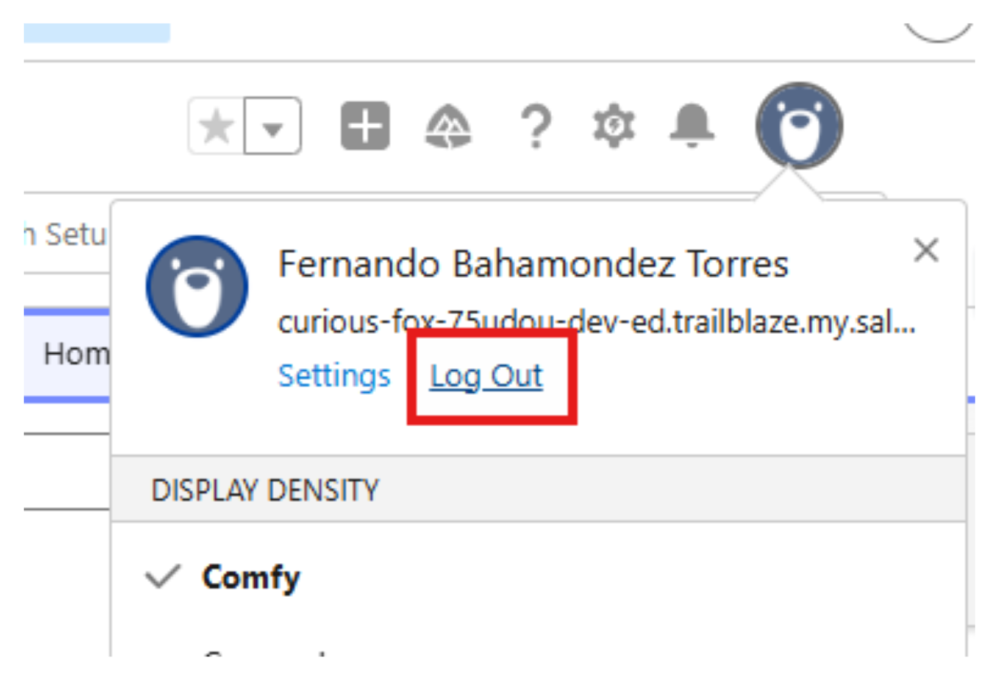

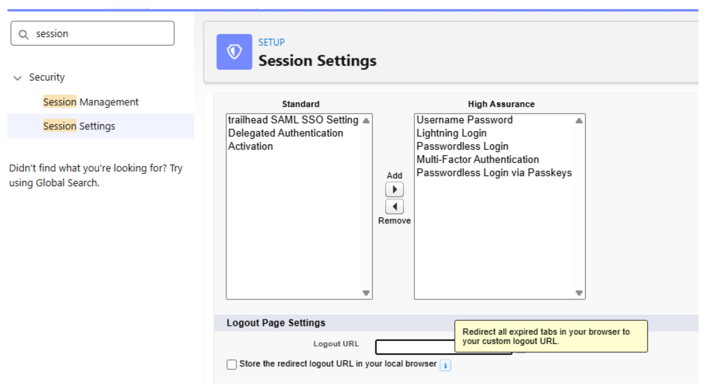

What options does a SF Admin have regarding setting the page displayed after a user logs out of Salesforce?

1.  Display the standard Salesforce login page.
2.  Display a Custom Log Out page.
3.  Display a custom Single Sing-On page.

#### Specific config record type

The Account object has two record types named 'Partner' and 'Customer' assigned to a certain profile. A user with the said profile prefers the 'Customer' record type to be selected and applied automatically when he clicks on the 'New' button on the account page when creating the account record. Which setting allows the default record type to be selected and applied automatically for the user when creating a new record for the object?

- Default record type settings in personal settings.

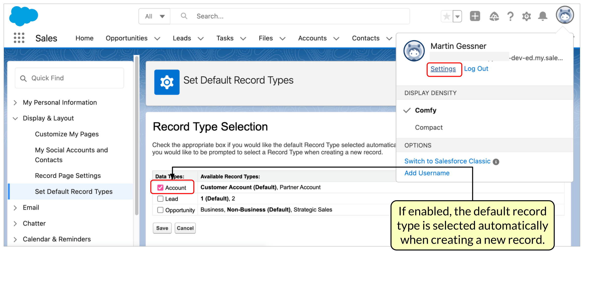

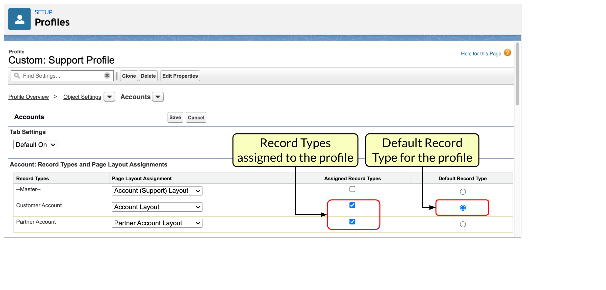

A default record type is set at the profile level. The Salesforce Administrator can specify a default record type for the profile that will affect all the users under that profile. To enable the default record type to be automatically selected and applied for the user when creating a new record for the object, the user should update the option in their personal settings.

It is not possible to specify a default record type using a permission set.

Password Policies

If you need that all of the Salesforce users in the organization to change their passwords after 60 days. The password should have a minimum password length of 12 characters, and the maximum invalid login attempts should be 3. What should the Salesforce Administrator consider when configuring this?

1.  Password Policies can be maintained at the organization level.

    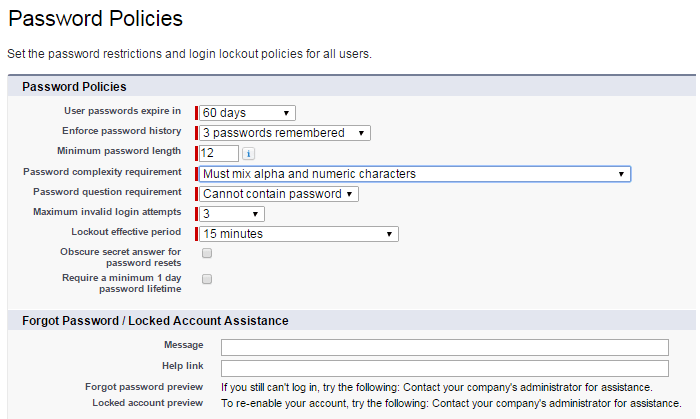

2.  Password Policies settings can be maintained for each profile.

    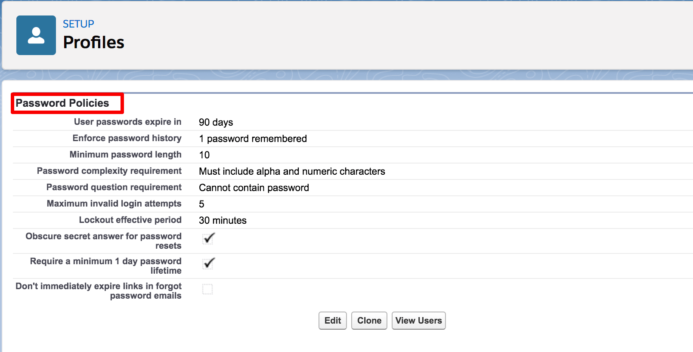

#### Scoping Rule

FED is a company in the United States that uses the Unlimited edition of Salesforce. Sales reps of the company regularly access and update opportunities in Salesforce. The reps in the eastern region of the country should only be able to view opportunities of accounts located in Florida in list views and reports but still have access to the filtered-out records. Which Salesforce feature should be used for this use case?

- Scoping Rule

A scoping rule can be used to control the records that users see in list views, reports, and SOQL, based on the selected criteria. Scoping rules are available for the following standard objects: Account, Case, Contact, Event, Lead, Opportunity, and Task, and for custom objects.

A restriction rule is applied to a user to filter the records that the user is granted access to via org-wide defaults, sharing rules, and other sharing mechanisms. It is available for custom objects, external objects, contracts, tasks, and events.

Restriction rules are used to prevent access to certain records, like sensitive data or information that isn’t important for their work, while scoping rules are flexible and can be enabled and disabled on a query-by-query basis. Also, they do not restrict the access that users have to records.

A sharing rule is used to grant access to records based on criteria or ownership.

#### User Management Settings

The system administrator of FED company needs to create a custom object with several custom fields to store information about the shipments created for the company's customers. A minimum access custom profile has been assigned to all the Salesforce users. Permission sets are used to grant any additional permissions required by the users. How can the administrator set field-level security on permission sets instead of profiles when creating the custom fields?

- Enable 'Field-Level Secutiry for Permission sets during Field craetion' on the 'User Management Settings' page in Setup.

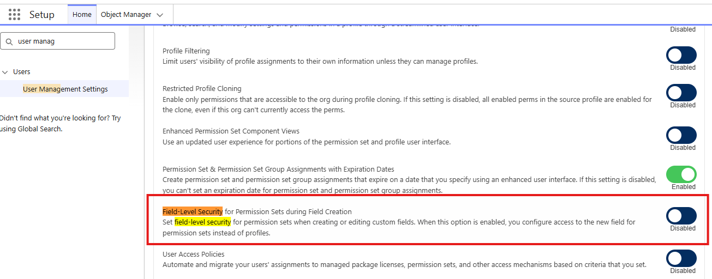

### Folder

What is true regarding using subfolders to organize reports and dashboards in Lightning Experience?

- Subfolders can be created in user-created folders.

- A hierarchy of subfolders can be created to represent a logicla structure.

The Sales manager asked the Salesforce Administrator how she can share dashboards and reports with particular users. What is true regarding the sharing of Reports and Dashboards?

- For a user to view a report or dashboard, the folder needs to be shared with the user.

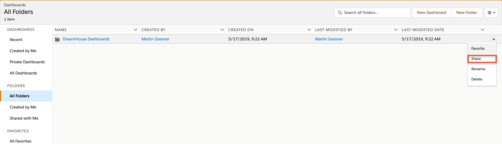

Which can be stored and accessed in folders?

- Reports

- Dashboards

- Email Templates

### Files

##### Library

A Sales Manager wants to add a PowerPoint file to a new Content Library but not make it visible to other sales users until a later time. What can be done to achieve this?

- Add the file to the library but not add any library members.

To access a file in a library, users need to be members of the library (either as individual users or part of a public group). If the sales users will need to have access to the file at a later date, the file can be added to the library and then the sales public group can be added as members with the appropriate access type at a later date.

When adding users as members to a library, the access type must be selected at the same time. There is no option to set a date when the file should become visible. Disabling the object permissions for the user's profile will remove their access to other files and libraries.

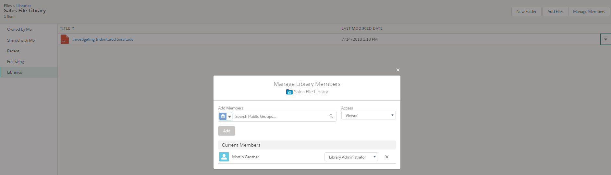

### Restricction Rule

ABC industry company uses a custom object, Project, to manage Sales and Service project records. The Project object has a master-detail relationship with Account, making it the child object. The Account object has an OWD setting of Public Read Only. Service projects, distinguished by a ticked 'Service/Support' checkbox, must be accessible to support agents. Sales projects contain sensitive data and should not be accessed by support agents. Which data security feature can best achieve this requirement?

- Restriction Rules

Restriction rules can be used to control and limit the access of a group of users to a subset of records based on record and user criteria. It is available for custom objects, external objects, and some standard objects such as contracts, tasks, and events. In this case, a restriction rule can be created on the Project custom object. Using the 'Service/Support' checkbox and the Service Rep role ID as criteria, the records accessible to the support agents can be filtered.

Sharing rules only allow record access to be extended across the role hierarchy, sharing records owned by one role with users in another role at the same level; they cannot restrict record access. Permission sets can be used to open up record access and not limit it. Public groups can be used for sharing records between members.

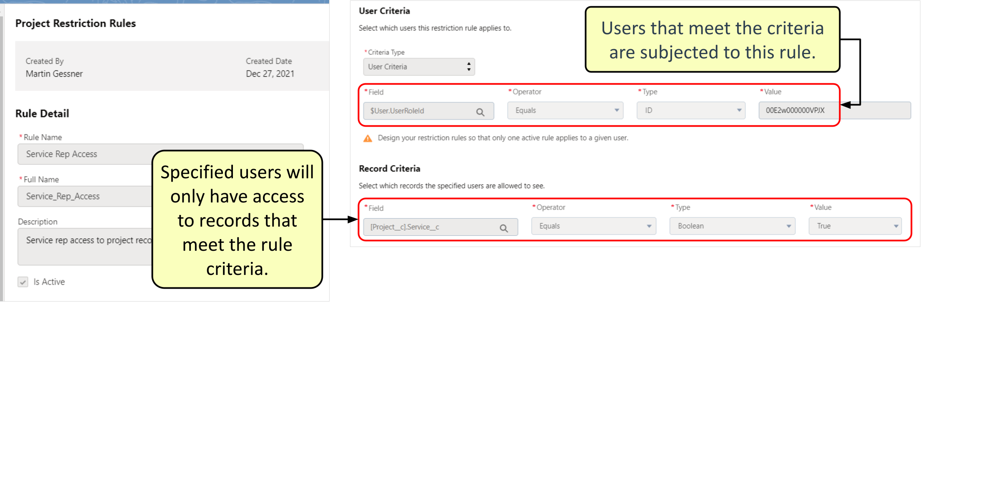

DEF, a multinational company, has sales representatives from various regions using a shared Unlimited edition org. The users are broadly classified as belonging to North, South, East, and West regions, identified by a custom 'Region' picklist on their User record.

Due to various sharing mechanisms, users from different regions can access unnecessary Event records with sensitive information, such as those working on the same Account record. Which of the following should the Salesforce Administrator use to restrict the visibility and access of the events based on their region?

- RESTRICTION RULES

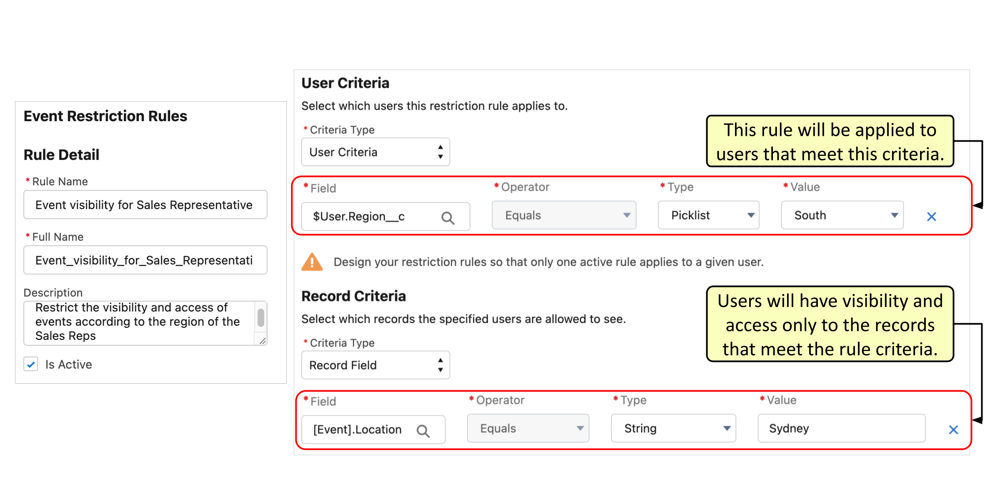

A restriction rule defined on the Event object helps sales representatives view and access only the Event records relevant to them. Since there is already a custom single picklist on the User object that determines the region of the sales representative, it can be used in the restriction rule's criteria to match with any field that represents the region related to the Event. While only two restriction rules can be active for an object at a time in Enterprise and Developer editions, up to five restriction rules can be active per object in Performance and Unlimited editions. Note that when using a (single-select) picklist for a user or record criteria, multiple picklist values can be selected or added to the condition.

A scoping rule only filters the default visibility of events and does not restrict access to these records. Assignment rules cannot be used for this scenario as there is no need to change the assignment of these records. Criteria-based sharing rules provide access to records and do not restrict the same.

### My Domain

The leadership of a large online apparel company wishes to enable the My Domain feature in Salesforce. What does the Administrator need to consider before enabling the My Domain feature?

Choose 2 answers.

```{r conf_setup_mydomain1, echo=FALSE, results='asis'}
# 2. Definimos las alternativas. La correcta siempre lleva 'answer ='
opciones_conf_setup_mydomain1 <- c(
  answer ="A. A My Domain request can be reverted deploying a new domain.",
  answer ="B. Visualforce page URLs will change.",
  "C. User will not be able to log in from https://login.salesforce.com",
  "D. My Domain cannot be used in a sandbox environment."
)

# 3. cat() inyecta el HTML directamente en la web
cat(longmcq(opciones_conf_setup_mydomain1))

# Un pequeño salto de línea visual
cat("<br>\n\n")

# 4. Botón oculto con la explicación
cat(hide("Check"))
cat("**Correct Answer is: D.**\n\n")
cat("")

cat(unhide())
```

### Field-Level Security

- The users with the Sales profile should no longer have access to several fields on a custoom object. The Salesforce Admin employs field-level secutiry for these fields. What should the Salesforce Administrator consider before changing the page layout and field-level secutiry settings? Choose 2 answers.

```{r conf_setup_field_level_security1, echo=FALSE, results='asis'}
# 2. Definimos las alternativas. La correcta siempre lleva 'answer ='
opciones_conf_setup_field_level_security1 <- c(
  answer ="A. Fields can be set as hidden in the page layout but users will still be able to access the fields in reports, search, and list views.",
  "B. If a field is set be read-onlye using field.level secutiry for a user's profile but the user has edit access to the object, then the user can update the field.",
  answer ="C. If a field is hidden using field-level secutiry, it soes not appear in page layouts, search results, related lists, list views, or reports.",
  "D. If a field is hidden field-level security, it does appear in page layouts, search results, related lists, and list views but it will appear in reports."
)

# 3. cat() inyecta el HTML directamente en la web
cat(longmcq(opciones_conf_setup_field_level_security1))

# Un pequeño salto de línea visual
cat("<br>\n\n")

# 4. Botón oculto con la explicación
cat(hide("Check"))
cat("**Correct Answer is: A and C.**\n\n")
cat("")

cat(unhide())
```

### Multi-Factor Authentication

- Cosmic Supermarket would like to allow its employees to log in to Salesforce using their Google credentials. A Salesforce admin of the company is required to configure single sing-on (SSO) using Google as the third-party authentication provider. However, the employees should be required to prove their identity using multi-factor authentication (MFA). Which of the following are valid considerations related to this use case? Choose 2 answers.

```{r conf_setup_mfa1, echo=FALSE, results='asis'}
# 2. Definimos las alternativas. La correcta siempre lleva 'answer ='
opciones_conf_setup_mfa1 <- c(
  answer = "A. MFA should be in the 'High Assurance' column on the 'Session Settings' page in Setup ",
  "B. A managed package must be installed to set up multi-factor when Google is used as the third-party authentication provider. ",
  answer = "C. MFA can be configured for users by setting the 'Session Secutiry Level Requiered at Login' in their profiles.",
  "D. By default, MFA is enforced for users who log in through an authentication provider that supports single sign-on (SSO)"
)

# 3. cat() inyecta el HTML directamente en la web
cat(longmcq(opciones_conf_setup_mfa1))

# Un pequeño salto de línea visual
cat("<br>\n\n")

# 4. Botón oculto con la explicación
cat(hide("Check"))
cat("**Correct Answer is: A and C.**\n\n")
cat("")

cat(unhide())
```

](images/clipboard-3710518353.png)

### Organization Wide-Default Setting

Only Cases and Leads have organization-wide default sharing options of 'Public Read/Write/Transfer'. Custom objects can have 'Private', 'Public Read Only', 'Public Read/Write', and 'Controlled by Parent'. Contacts and Orders also have the 'Controlled by Parent' option.

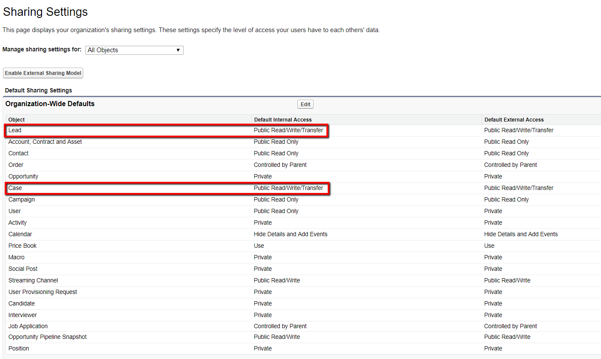

### Sharing Setting

The 'Controlled by Parent' sharing setting should be used for the Contact object since it would grant account owners edit access to all related contacts. Access to contacts can be specified with an OWD sharing setting.

There are different options such as : 'Controlled by Parent' -\> This means that the access to the contacts will be controlled by the access the user has to the parent, in this case, the Account.

'Public Read/Write' -\> Using this setting would grant read/write access to all contacts for all users.

'Private' -\> If the sharing setting is set to private, a criteria-based sharing rule would need to be used to give access based on the owner of the contact account.

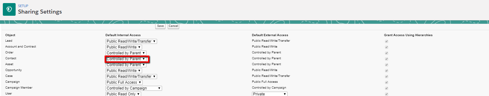

The Salesforce Administrator of ABC has set the organization-wide default sharing setting of the Account object to 'Private'. The company uses Sales Territories and has an active territory model with the following territories: Canada, Northeast, Southwest, and California. Account records owned by users who are assigned to the California territory need to be shared with all the users in the Northeast territory. They should have 'Read' access to the account records. What solution should be used to accomplish this?

- A sharing rule based on record ownership should be created to share te account records.

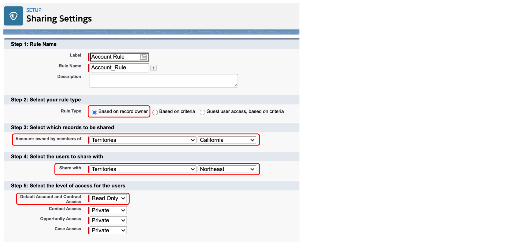

### Object Manager

Field-level security can be set for a profile to control which fields are read-only and/or editable. Fields can be read-only on a page layout.

Assigning the minimum access profile is unnecessary and would interfere with the other permissions and accesses that those users currently have via their profile. Although a permission set can be used to extend users' access without modifying their profile, it can only be assigned to individual users and not profiles.

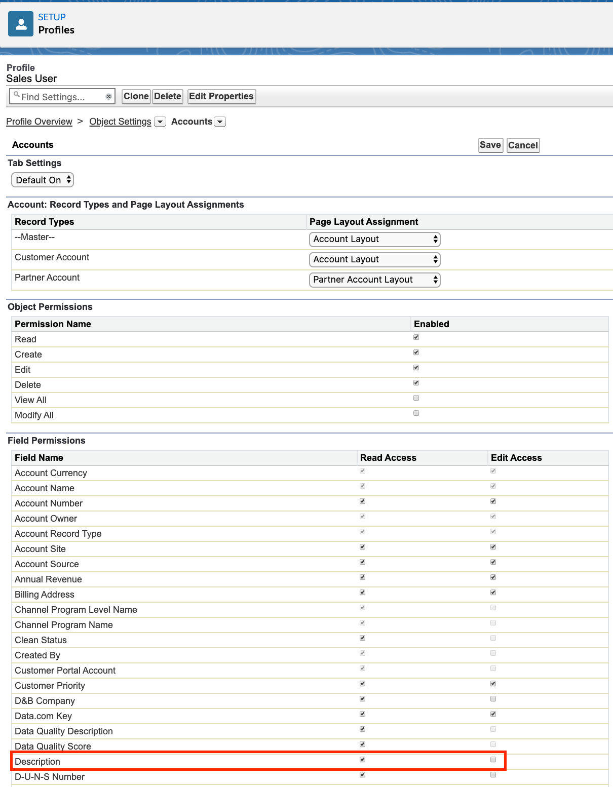](images/clipboard-1007689119.png)

#### Opportunity Team Member

ABC Technologies often needs several sales reps working on the same opportunities and requests the administrator to reflect this in the Salesforce org. What is true regarding Opportunity Teams?

- The owner of the opportunity or users above the owner in the role hierarchy can manage opportunity team members.

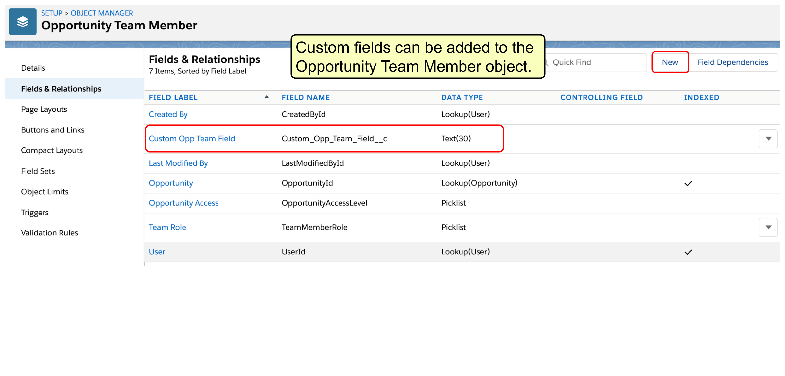

### Email Template

Worldwide Containers uses Lightning Experience. The company has a Sales & Marketing email template folder, which only contains the Sales subfolder and Marketing subfolder. Each of these subfolders stores email templates that were created by the Marketing Manager. If the Marketing department hires a new intern that needs to modify all the email templates in both subfolders, what's the most efficient action that the Salesforce Administrator can take to share these templates with the intern?

- Grant Edit access to the Sales & Marketing email template folder.

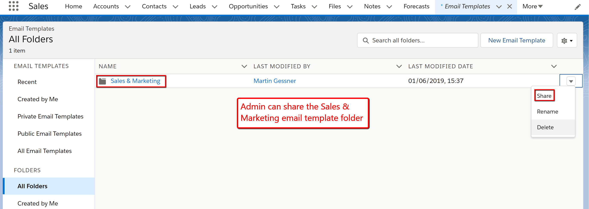

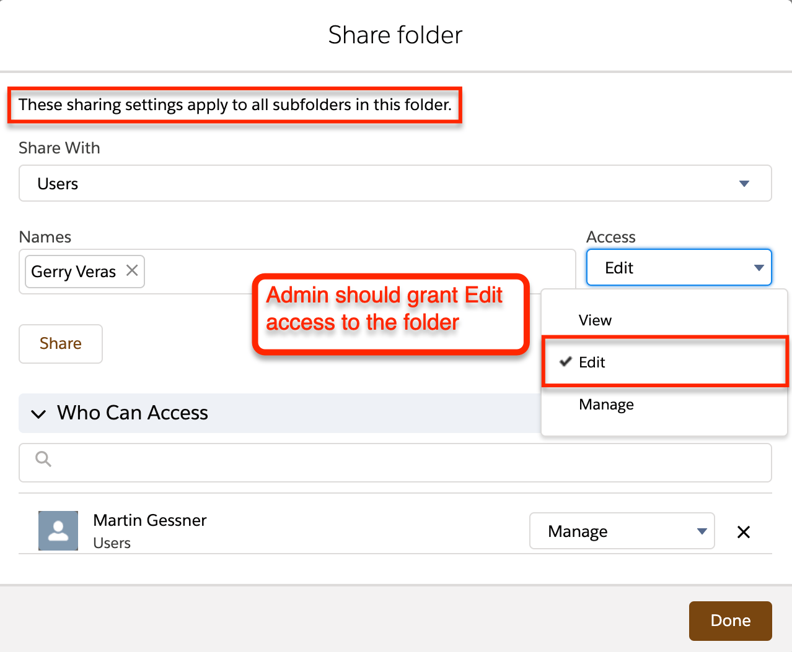
