# Configuration and Setup 15%

## Fundamentals

On this chapter, We describe the principal concepts and configurations about Configuration and Setup.\
\
It's really common that in the organization may you are admin, We don't use the entire setup, because we choose what is relevant for the business necessity.

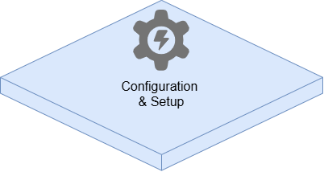{width="372"}

### General Settings

One of the question in the exam , always is about :\
\
What can you configure in the Company Settings?\
\
So We need to keep in mind this image:

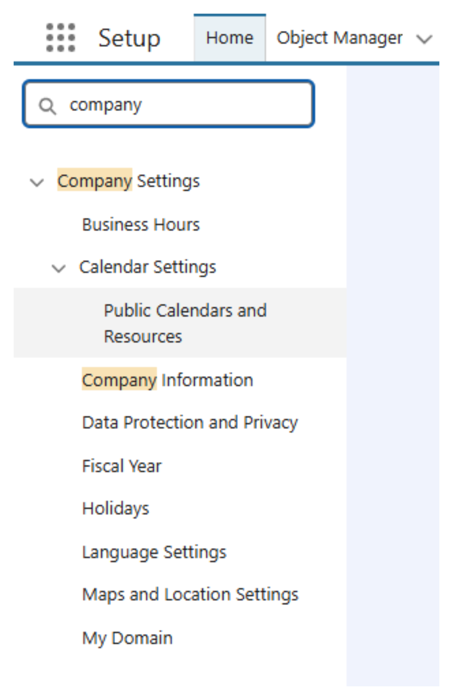{width="349"}

And also in the section about company information, to know the difference between Data Space vs File Space.

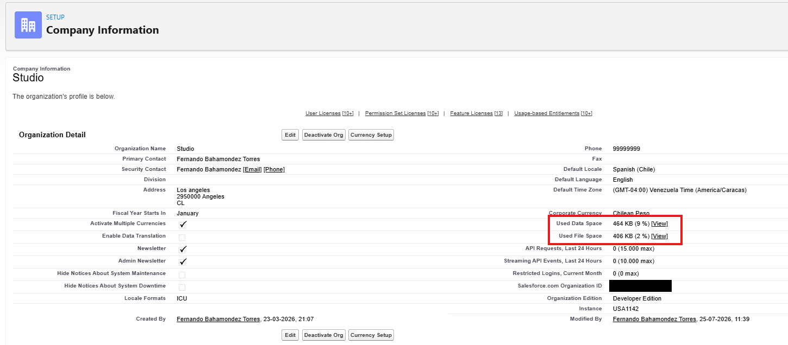

### Multiple Currencies

When the organization enable Multiple currencies, there is a new layer of configuration that is open for your environment.

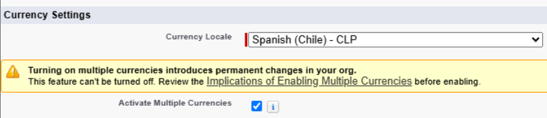

And we have two main configuration, the Standard and Custom fiscal year.

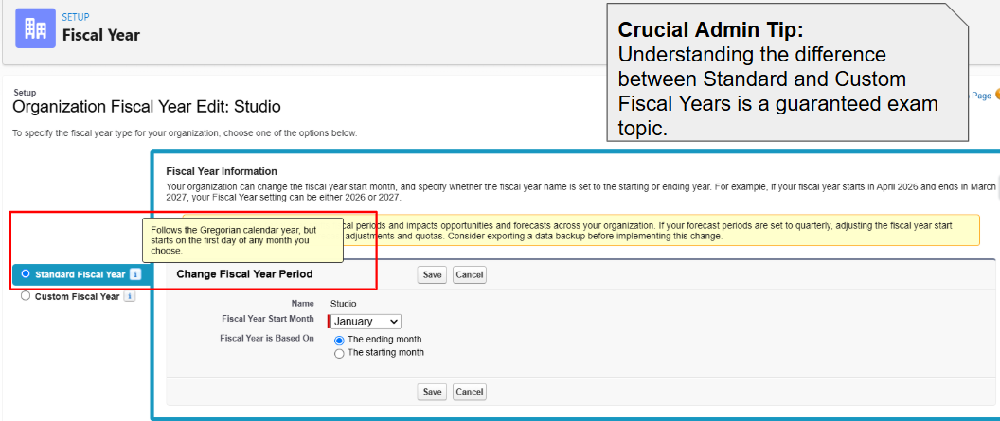

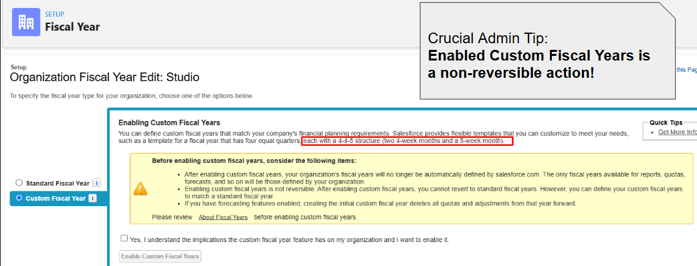

### User Interface

Eighteen configuration we also need to keep in mind when we talk about user interface.

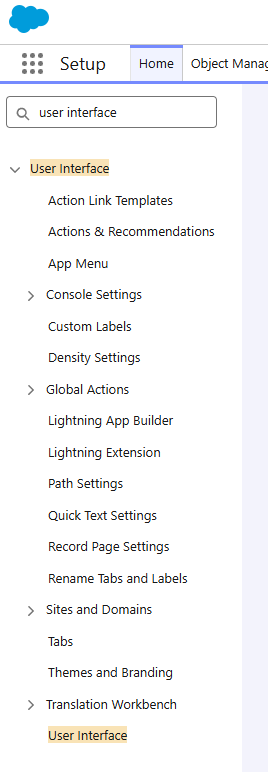{width="221"}

A really common question is about, if a user need to set up and organize the App Launcher, the place to do this is in the App menu -Setup.

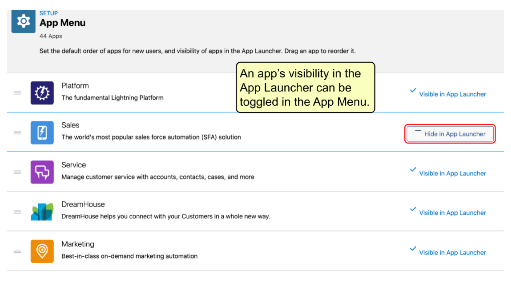

#### User Interface

The "subsection" about User Interface, We can configure the Collapsible Sections and Also Enable Inline Editing on which is a typical question in the Admin Exam.

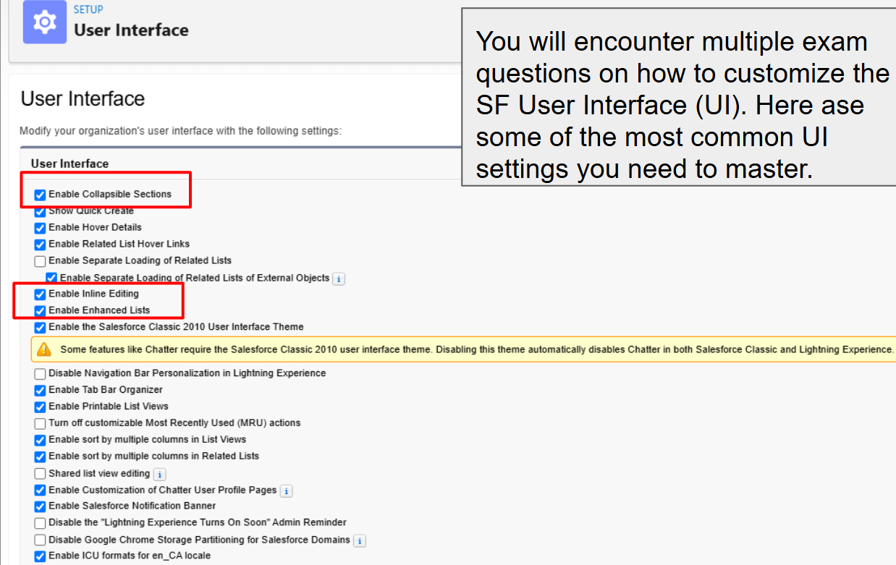

### Einstein Search

We also need the read at least the description about what the Einstein Search does when we are looking for some record in the organization, so also is good idea to keep in mind this image:

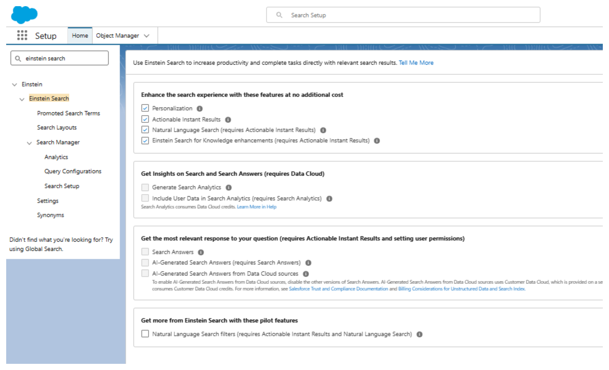{width="796"}

### User

I create this topic just to have a summary about the key concepts about diferrents situation in the User configuration and the security level layer that the Admin can Add or remove.

This following image is to help to keep in mind the Key Concepts that the Salesforce Exam may will ask.

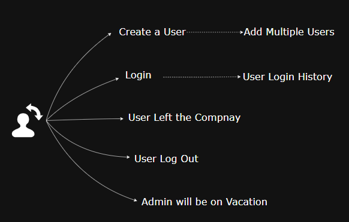

#### Create

If you need a create a New User, it's simple to go to the setup configuration and to keep in mind the minimal data that the system required.

Let's check another common situation:

#### Add Multiple Users

If you need to add multiple User's and the amount is not to big, for example if you need the create 10 users, We can use de Add Multiple users bottom.

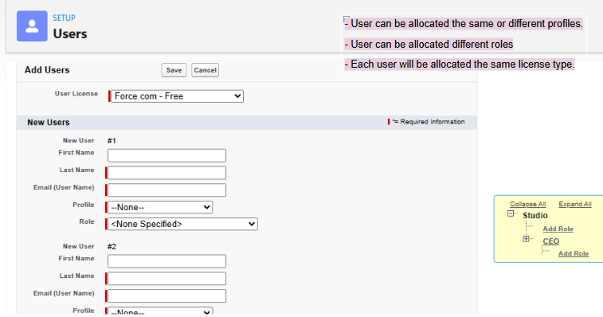

Anothe common situation is, If you need to create 200 users but you don't want to notify the user od their login details.\
What is the most efficient way to achieve this?\
\
***Use the Data Loader.***

#### Login

Single Sign-On (SSO) configuration is a really common setup that the company's does, because you can add the core solution for login in the applications official company.

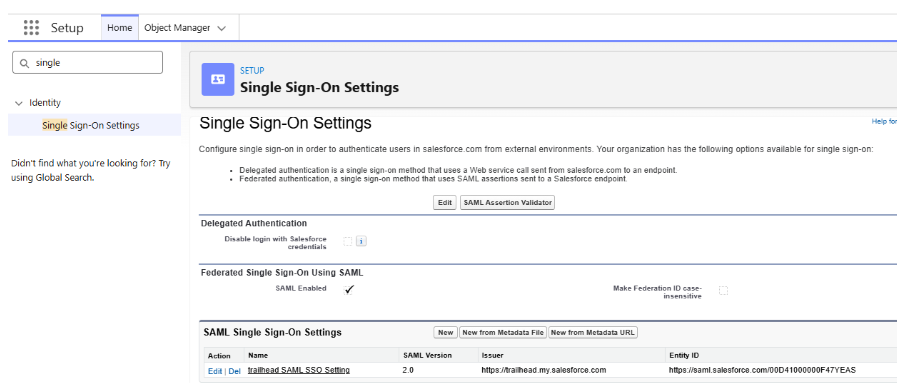

Just we need to keep in mind this key situation:

1.  Salesforce Password policies do not apply for SSO users.
2.  SSO users can not reset their passwords within Salesforce.

------------------------------------------------------------------------

What are reason if a user is not able to login?

1.  The user is loogin in from an IP address outside of the ***defined*** range for their profile.
2.  THe user is attempting to log in outside of the login hours defined for their profile.

### My Domain

The leadership of a large online apparel company wishes to enable the My Domain feature in Salesforce. What does the Administrator need to consider before enabling the My Domain feature?

Choose 2 answers.

```{r conf_setup_mydomain1, echo=FALSE, results='asis'}
# 2. Definimos las alternativas. La correcta siempre lleva 'answer ='
opciones_conf_setup_mydomain1 <- c(
  answer ="A. A My Domain request can be reverted deploying a new domain.",
  answer ="B. Visualforce page URLs will change.",
  "C. User will not be able to log in from https://login.salesforce.com",
  "D. My Domain cannot be used in a sandbox environment."
)

# 3. cat() inyecta el HTML directamente en la web
cat(longmcq(opciones_conf_setup_mydomain1))

# Un pequeño salto de línea visual
cat("<br>\n\n")

# 4. Botón oculto con la explicación
cat(hide("Check"))
cat("**Correct Answer is: D.**\n\n")
cat("")

cat(unhide())
```

### Field-Level Security

- The users with the Sales profile should no longer have access to several fields on a custoom object. The Salesforce Admin employs field-level secutiry for these fields. What should the Salesforce Administrator consider before changing the page layout and field-level secutiry settings? Choose 2 answers.

```{r conf_setup_field_level_security1, echo=FALSE, results='asis'}
# 2. Definimos las alternativas. La correcta siempre lleva 'answer ='
opciones_conf_setup_field_level_security1 <- c(
  answer ="A. Fields can be set as hidden in the page layout but users will still be able to access the fields in reports, search, and list views.",
  "B. If a field is set be read-onlye using field.level secutiry for a user's profile but the user has edit access to the object, then the user can update the field.",
  answer ="C. If a field is hidden using field-level secutiry, it soes not appear in page layouts, search results, related lists, list views, or reports.",
  "D. If a field is hidden field-level security, it does appear in page layouts, search results, related lists, and list views but it will appear in reports."
)

# 3. cat() inyecta el HTML directamente en la web
cat(longmcq(opciones_conf_setup_field_level_security1))

# Un pequeño salto de línea visual
cat("<br>\n\n")

# 4. Botón oculto con la explicación
cat(hide("Check"))
cat("**Correct Answer is: A and C.**\n\n")
cat("")

cat(unhide())
```

### Multi-Factor Authentication

- Cosmic Supermarket would like to allow its employees to log in to Salesforce using their Google credentials. A Salesforce admin of the company is required to configure single sing-on (SSO) using Google as the third-party authentication provider. However, the employees should be required to prove their identity using multi-factor authentication (MFA). Which of the following are valid considerations related to this use case? Choose 2 answers.

```{r conf_setup_mfa1, echo=FALSE, results='asis'}
# 2. Definimos las alternativas. La correcta siempre lleva 'answer ='
opciones_conf_setup_mfa1 <- c(
  answer = "A. MFA should be in the 'High Assurance' column on the 'Session Settings' page in Setup ",
  "B. A managed package must be installed to set up multi-factor when Google is used as the third-party authentication provider. ",
  answer = "C. MFA can be configured for users by setting the 'Session Secutiry Level Requiered at Login' in their profiles.",
  "D. By default, MFA is enforced for users who log in through an authentication provider that supports single sign-on (SSO)"
)

# 3. cat() inyecta el HTML directamente en la web
cat(longmcq(opciones_conf_setup_mfa1))

# Un pequeño salto de línea visual
cat("<br>\n\n")

# 4. Botón oculto con la explicación
cat(hide("Check"))
cat("**Correct Answer is: A and C.**\n\n")
cat("")

cat(unhide())
```

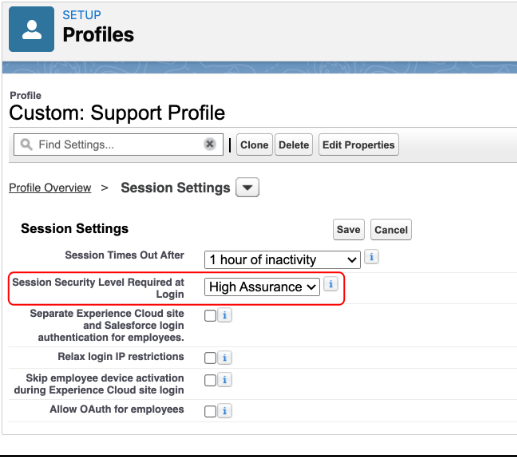](images/clipboard-3710518353.png)
