# Automation

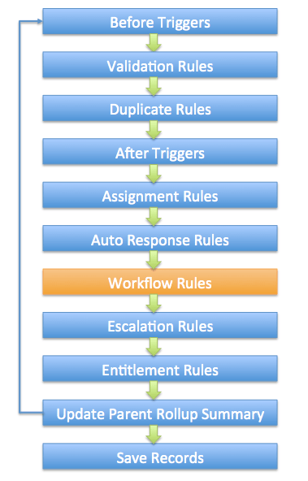

## Approval Processes

ABC Company uses an approval process in Salesforce to manage the leave applications of its employees. When a leave request is approved by a manager, the leave details should be submitted to an external system, which is an employee portal used internally in the company. Which of the following actions should be used to achieve this requirement?

- Outbound Message

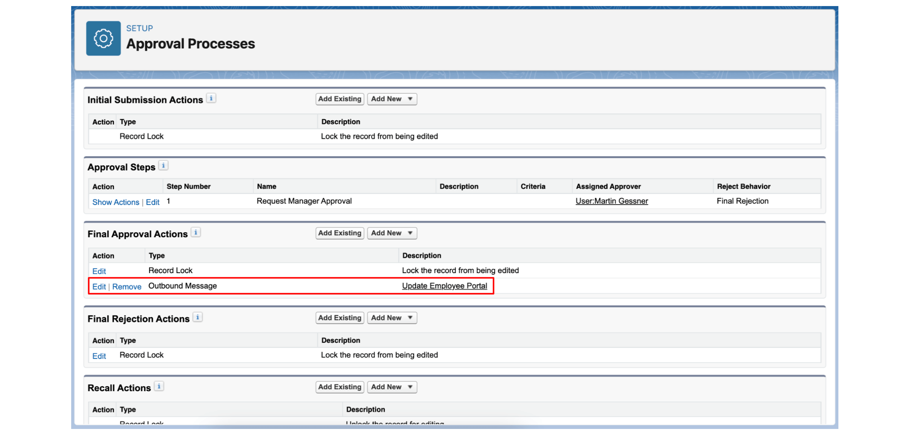

An approval process can be used to send an outbound message when an approval request is approved. For example, an Outbound Message action can be added to the Final Rejection Actions of the approval process. When the manager approves the request, the outbound message is automatically submitted to a specified endpoint URL that is associated with the external system.

An approval process is also capable of creating a task, sending an email alert, and performing a field update, but these actions cannot be used to send information to an external system.

## Workflow Rule

In a business requirement gathering session, the Vice President of Sales asks the Salesforce Administrator when workflow rules can be triggered. Which are correct operations used to evaluate criteria?

- When a record is UPDATED.

- When a record is CREATED.

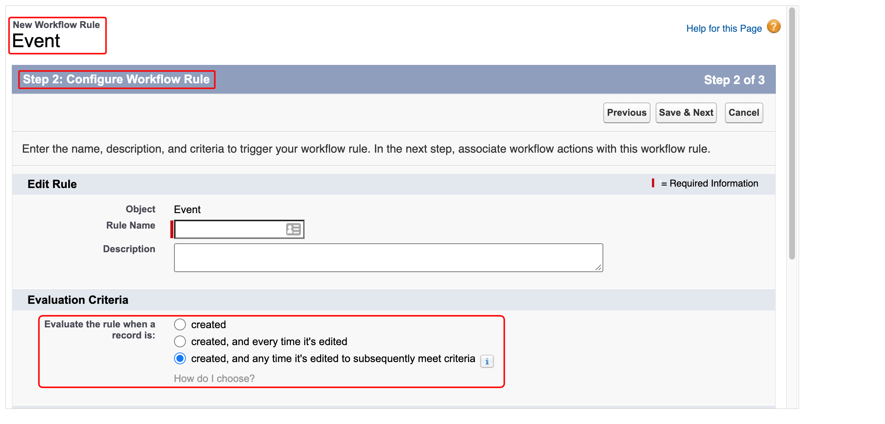

## Case Escalation Rule

ABC Computing uses Salesforce for managing customer support. There are more than 100 support cases open in its service cloud application. The Support Manager wants to ensure that if the support engineer does not start working on a case after 24 hours, an email should be generated for the support lead and the manager himself. What is the best way for the administrator to achieve this?

- Create an escalation rule to generate an email.

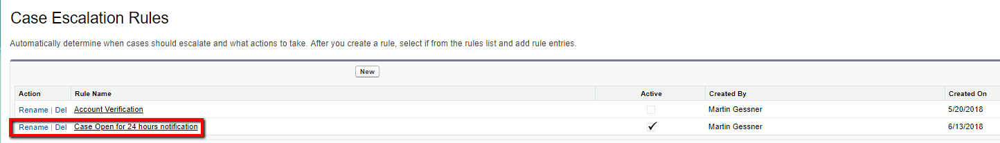

## Email Alert

What does the administrator need to be aware of when using Email Alerts?\

- Email alerts use email template that need to be set up previously.

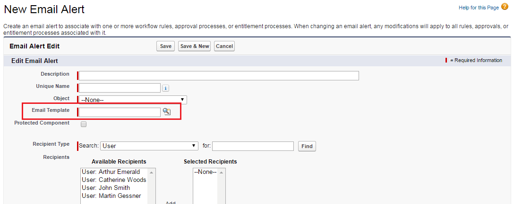

## Flow

## Flow Builder

The core building blocks of a flow are:

### Elements

Elements define the individual actions or logic within the flow.

### Connectors

Connectors establish the paths between elements.

Fault Connector.

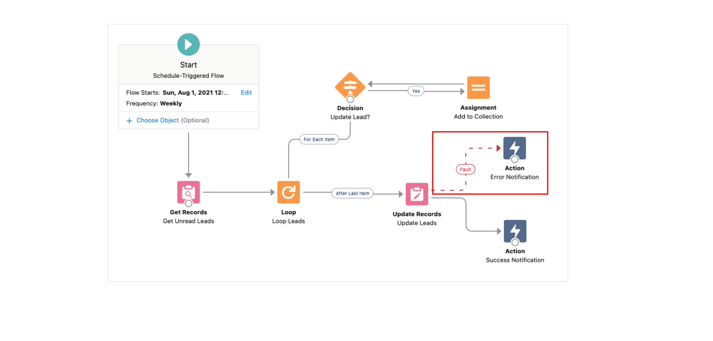

#### Get Record - Not In

A collection variable in a flow contains a list of names of supported shipping countries. A list of accounts needs to be generated where their Shipping Country does not exist in the supported shipping countries. How should this requirement be implemented in the flow?

- Use the 'Get Records' element and query the accounts using the 'Not in' operator.

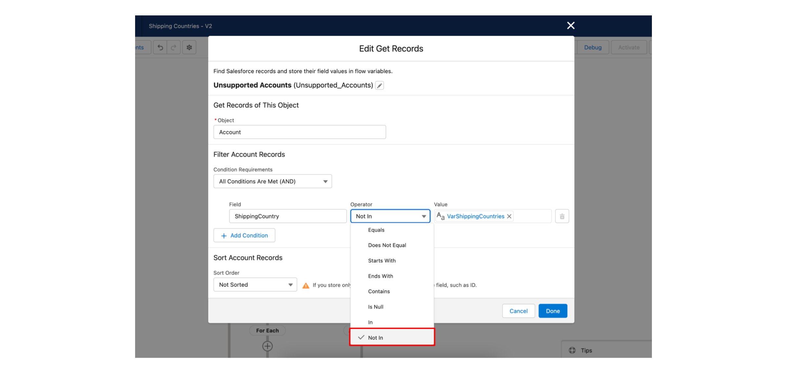

### Resources.

Resources store and reference values used throughout the flow.\
\
Stages are used in features such as Path or Approval Processes, but they are not part of the Flow Builder design structure.

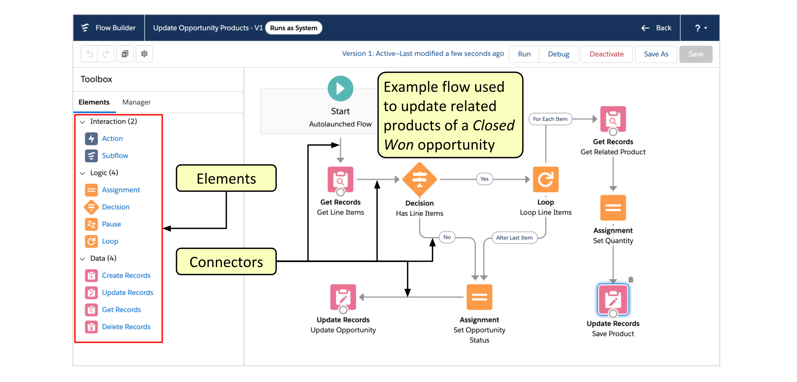

- When a sales deal with a high dollar value reaches 80% probability, a notification should be sent to the Sales Director and a task should be created. Which tool should a Salesforce Administrator use to meet this requirement?

  - Flow Builder.

### New Resource

- Record Variable\

  A 'Record Variable' can be used to create a single record when choosing the 'Use all values from a record' option in the 'Create Records' element for setting record fields. Another option for setting record fields is to use separate resources and literal values.

  A Constant or ID Variable is not necessary to create a new record. In fact, it should be ensured that the ID is blank in the record variable. After the flow creates the records, ID is set to match the record that was created. It is also not required to use a screen element to create records.

- RecordId.

Which statements are true abount the 'Variable' resource type available in the Flow Builder?

1.  It can hold values that can be changed at any point in the flow.
2.  It can hold multiple field values for multiple records if configured.

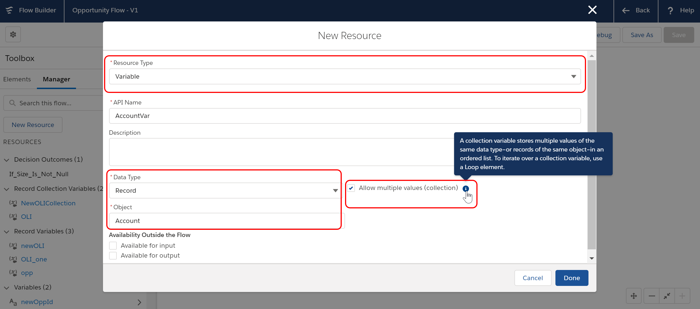

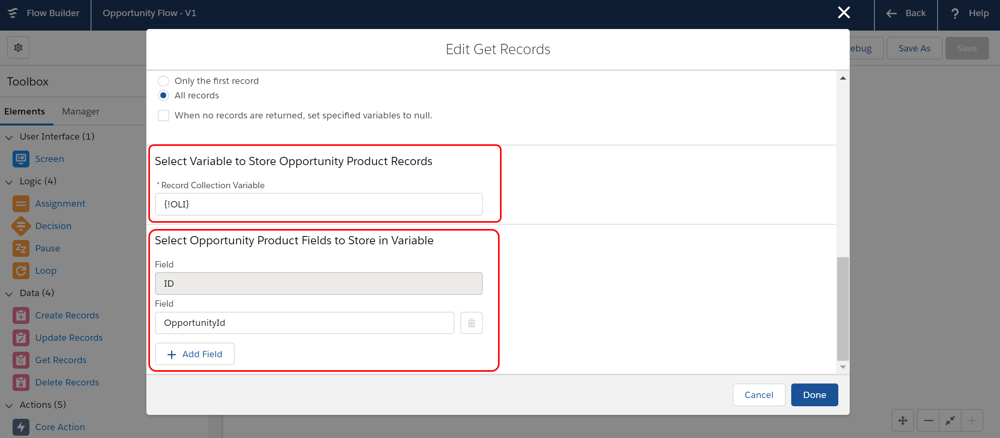

### Screen Components

### Screen Flow

### Entry Condition

When specifying entry conditions for a record-triggered flow, which of the following options can be used in the condition requirements?

- A formula

- A combination of field conditions

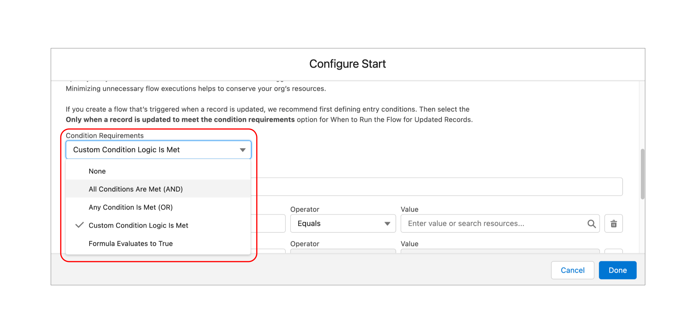

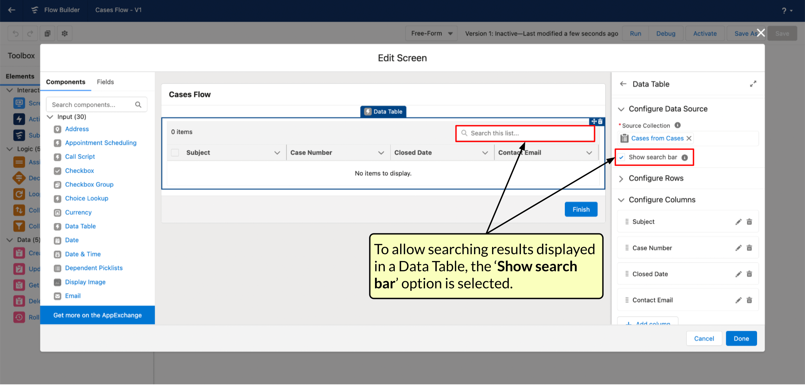

### Loop Element

When the Rating of an account is set to "Cold", a record-triggered flow should update a certain field in all its related contacts. Which elements demonstrates an efficient implementation of Logic Elements in Flow Builder to meet the requirement?

- Use the Assignment Element to set the value of a Contact field.

- Use the Loop Element to iterate through each Contact record.

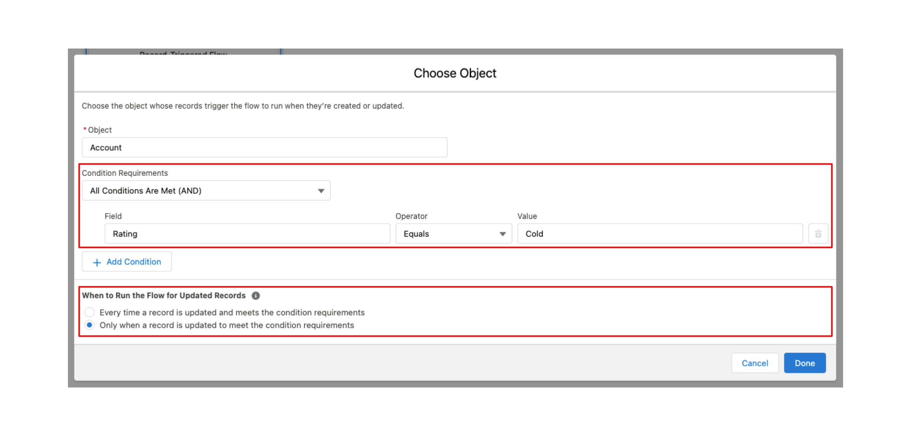

### Time Data Type

A Salesforce Admin wants to build a flow that sends an automated email reminder 30 minutes before a scheduled daily event, regardless of the date. The event time is stored in a custom Time field on the record. How can the System Admin make this requirement easier to implement using Flow Builder?

- Store the time in a resource using the Time data type to directly compare times.

The Time data type in Flow Builder resources enables working with exact times of day (such as 5:30 PM or 09:00 AM) in flow elements like Assignment, Decision, and Wait, using built-in time functions such as HOUR(), MINUTE(), and TIMEVALUE(). By using the Time data type directly, implementing clean, precise, and scalable time-sensitive automations is straightforward.

Using a Date field to extract and compare time requires additional formula manipulation and doesn't take advantage of the new Time data type, which simplifies this exact use case. Converting times to text strings and comparing them using string functions is error-prone and not reliable for accurate time logic, as well as unnecessary since the Time data type is supported. While Scheduled Flows can be used to run logic at fixed intervals, they are inefficient for time-specific use cases when compared to using Time fields and flow formulas. Relying on text-based filtering in scheduled flows is no longer necessary, as it is a workaround that is no longer required.

### Apex-Based Action Element

A Salesforce Administrator wants to convert a lead automatically based on certain criteria and send an email to the related contact one day after lead conversion. How can this be achieved?

- Use a scheduled path on a record-triggered flow to send the email one day after the lead conversion.

- Use a record-triggered flow using an Apex-based Action element to perform the lead conversion.

### A record-triggered flow

A company wants to automatically notify lead owners if a lead has not been converted 10 days after its creation. Which Flow-based automation solution is most appropriate to achieve this?

- Add a scheduled path to a record-triggered flow that sends an email alert 10 days after lead creation.

A record-triggered flow allows you to add a scheduled path that delays an action (like sending an email) for a set period. In this case, 10 days after the record is created. The flow can also include a condition to check if the lead is still unconverted before sending the alert.

Validation rules are used to enforce data entry criteria at the time a record is created or edited. They cannot send emails or initiate actions, they simply block the record from being saved if conditions are not met.

A screen flow is meant for user interaction, it requires someone to launch and complete the flow manually. Screen flows are not designed to run automatically or schedule actions without user input. This makes it unsuitable for time-based automation like this scenario.

While it's technically possible to use a flow to create a task after 10 days, the scenario specifically asks for an email notification. Assigning a task doesn't send an email unless further setup is done (e.g., task reminders or email alerts), which adds complexity. Sending an email directly via flow is more straightforward and aligned with the goal.

A sales rep should be sent an email if a high priority case is created for an account that they own. Which is the best option can be used to address the requirement?

- Create a record-triggered flow to send email alert to the account owner.

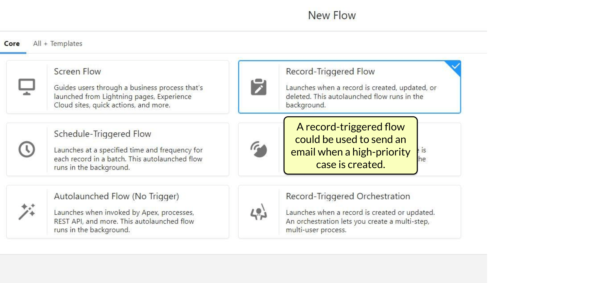

A Salesforce administrator is required to build a flow that will send an email alert to the Sales Director when an opportunity is created or updated with an amount that is greater than \$100,000. If the stage of the opportunity is still in 'Prospecting' after 10 days, an email reminder should be sent to the opportunity owner. Which options represents a valid configuration for meeting the requirement?

- Use a Run Immediately path in a record-triggered flow for the first email and a Scheduled path for the second email.

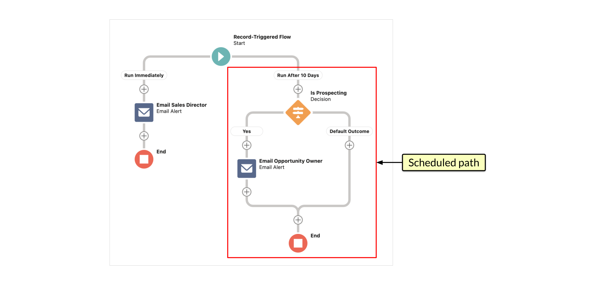

The customer service agents of ABC Solutions use a Chatter group to share recommendations related to support. A service manager is the owner of the group. The Salesforce Administrator of the company has been asked to automate the creation of a post on the manager's Chatter feed whenever the number of members in the Chatter group increases or decreases. Which automation tool would be best to use for the requirement?

- Record-triggered flow

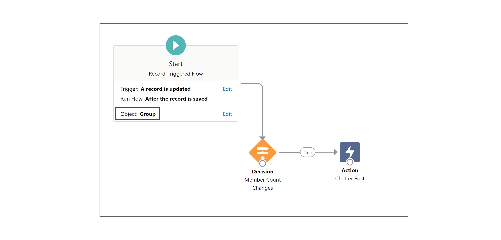

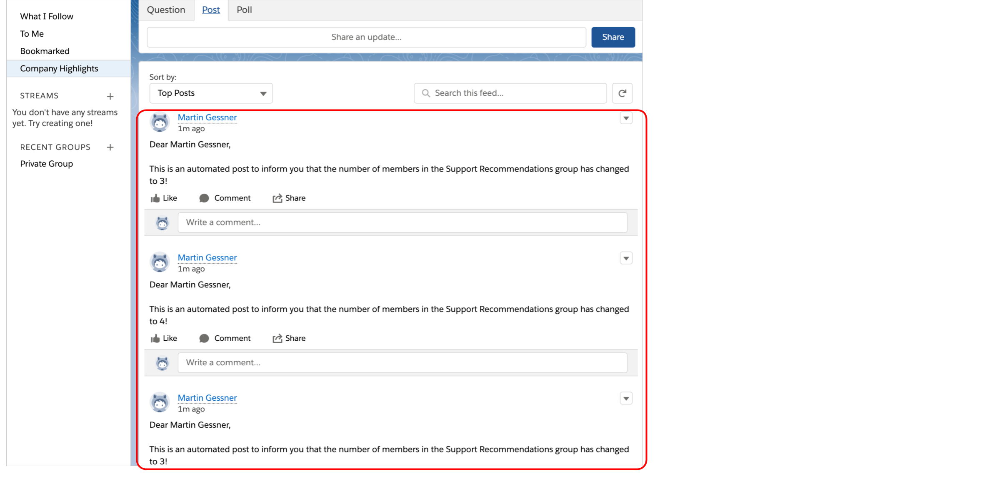

A Salesforce administrator is building a record-triggered flow that needs to automatically add line items to an opportunity. In addition, based on the value of a custom field on the opportunity record, the flow should update records of an external object stored on the Heroku platform. However, an error is encountered when the flow tries to create Salesforce records and update the external records in the same transaction. Which should be used to resolve the issue?

- Update the external object's records using an asynchronous path.

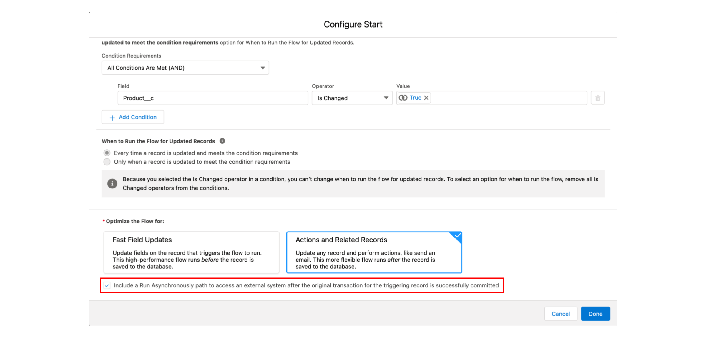

### Scheduled Path

### Outcomes

#### 'Only if the record that triggered the flow to run is updated to meet the condition requirements'

### Subflow

## How to Run the Flow?

- System Context Without Sharing-Access All Data.

A flow can be set to run in a system context without sharing. That means that the object-level permissions and field-level security of the running user will be ignored, as well as organization-wide default sharing settings, role hierarchies, sharing rules, manual sharing, teams, and territories.

Although an invocable Apex method can be used, it is not necessary as a declarative solution is available. The 'Grant Access Using Hierarchies' option, which is enabled by default for all objects, will provide access to records owned and shared by subordinates of the current user in the role hierarchy. But, it cannot open up access to records owned and shared by users above the current user in the role hierarchy. A configuration to run a Lightning page as a specific user is not available.

## Use a prebuilt flow named:

#### 'Create a Case' and customize it if required.

A prebuilt flow named 'Create a Case' can be utilized for this requirement. If necessary, it can be customized based on the requirements and saved as a new flow. It uses elements including Screen, Get Records, Create Records, Decision, and Assignment. An agent can use this flow to capture a customer's name, find an existing contact, create a new contact, obtain case details, and create a case.

Although a custom flow can be built, it is easier to use a prebuilt flow that already meets the requirements and customize it if required. There is no prebuilt flow named 'Auto Case Creator'. A custom flow that contains elements including Screen, Loop, and Update Records would not meet the requirements.

## Debug Option

- Run flow in rollback mode

## View Test

A Salesforce Administrator has created a record-triggered flow that will be used to set a 'Status' field of an account to 'Premium' if the record meets certain conditions. Which of the options below represents a valid step for creating automated flow tests in Flow Builder to verify the flow's expected behavior?

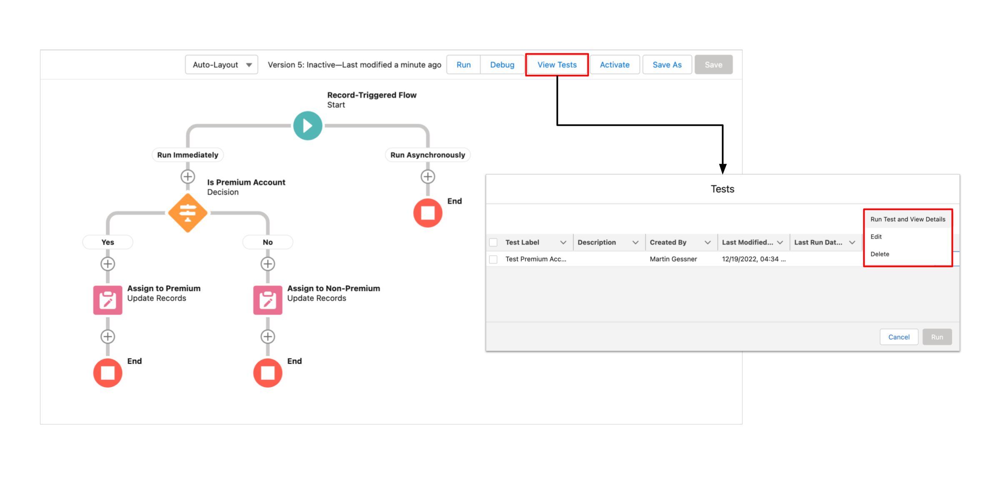
