# Object Manager and Lightning App Builder.

## 17 Question - Objective 1

### Lookup Filter

A Salesforce administrator in an org with thousands of account records needs to implement lookup filters on several fields on the Account object. Which are true regarding lookup filters in Lightning Experience?

- Lookup filters are still required in Lightning Experience even if they are specified as optional.

- Lookup filter can reference fields on records related to the target object.

The Support Director of ABC company has asked the Salesforce Administrator to add a filter to the 'Contact' field on case records. The field should only allow contacts to be selected if they are associated with the account in the 'Account Name' field. What is the best way to meet this requirement?

- Create a dependent lookup on the contact field that references the account field.

### Contact with multiple companies.

A sales manager often finds that a contact has a relationship with multiple companies and would like to keep track of these relationships.\
How can a Salesforce Administrator enable this?

- Add the Related Accounts related list to the Contact page layout,\
  add the Related Contacs related list on the account page layout,\
  and remove the existing Contacts related list on the Account page layout.

- Enable the 'Contacts to Multiple Accounts' feature.

In order to allow multiple accounts to be associated with a contact, the 'Contacts to Multiple Account' feature must be enabled. After the feature has been enabled, the Related Accounts related list must be added to the Contact page layout and the Related Contacts related list added to the account page layout. The existing Contacts related list on the Account object can be removed as the Related Contacts related list will include direct and indirect contacts.

### Account Settings

Josh Davis is the Warehouse Management Director at Express Logistics and Transport. He is also a partner at 123 Warehousing. Express Logistics and Transport is the account found on his contact record details page, but his contact record is also related to the 123 Warehousing account. How would this be represented in Salesforce if 'Contacts to Multiple Accounts' is enabled?

- Josh would be a direct contact at Express Logistics and Transport,\
  and an indirect contact at 123 Warehousing.

Allow user to relate a contact to multiple accounts

### Account

In an initial meeting with the purpose of setting up a new Salesforce org, the administrator, Sarah, is asked what Accounts can represent. What would she be correct in stating?

- Individual consumers

- Competitors

- Companies you do business with

### Master-Detail Relationship \| Lookup Relationship

A Salesforce Administrator is considering whether to use a lookup or master-detail relationship. Which of the following are valid capabilities of a lookup relationship but not a master-detail relationship?

- The lookup field does not need to be a required field on the page layout.

- The related record can have a different owner than the parent record.

When using master-detail relationships, the child record inherits the record owner of the parent record. On the other hand, in lookup relationships, the child record can have a different owner.

Lookup relationship fields do not need to be marked as required on the page layout. Roll-up summary fields can only be added to the parent object in a master-detail relationship. Lookup relationships do not support creating roll-up summary fields.

In a lookup relationship, if a parent record is deleted, the child records are only deleted when the option to 'Delete this record also' is selected, which is only available if a custom object contains the lookup relationship.

### Many-to-many

A Salesforce Administrator has defined a new custom object and has identified that it needs to have a many-to-many relationship with 5 different standard objects. What considerations should the Salesforce Administrator keep in mind when designing the solution?

- It depends on the remaining custom object quota left in the org.

The limitation of two master-detail relationships per object has no effect on the number of many-to-many relationships an object can have. In a many-to-many relationship, the master-detail relationships are created on the child junction object and not the parent object itself. This means that all that is needed to be done is to create more junction objects, with each having a maximum of two master-detail relationship fields. In this case, five new junction objects are needed and the object limits of the org must be taken into consideration.

Which of the following are required to model a many-to-many relationship between two custom objects?

- A Junction object

- Master-detail relationship.

Master-detail relationships are used to model many-to-many relationships between two objects. A junction object is a custom object with two master-detail relationships and is used to connect the two objects that are related to each other.

Both of these are necessary to build a many-to-many relationship between two custom objects. A junction object is a custom object used to connect the two objects that should have the many-to-many relationship. The junction object contains a Master-Detail field for each of the two objects. In each of these fields, one of the objects in the many-to-many relationship is the "Master" and the junction object is the "Detail."

A lookup relationship does not have to be populated and therefore cannot be used to *require* a connection to both objects on a junction object. A hierarchical relationship is only for the user object and allows for the creation of a reporting structure within the user object.

## 35 Question - Objective 2

What are the valid reasons for modifying an Account search layout?

1.  To control which account fields are displayed in the search results.
2.  To control the fields displayed in the recently viewed Accounts list.

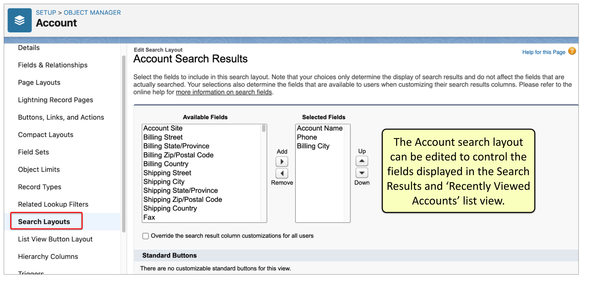

The Sales Director of ABC Company would like the picklist values of the 'Rating' field on the Lead object modified.\
What options are available to modify the standard field values?

1.  The standard values can ben deleted.
2.  Additional values can be added.
3.  The vallues can be reordered.

### Changing the field type of custom field

What are some considerations when changing the field type of custom field?\
1. Any list views based on the field may be deleted.

2.  Assignment and escalation rules may be affected.
3.  Depending on the new field type, data loss may occur.

### Create a cross-object formula field

On each opportunity record, a Salesforce administrator needs to display the name of the parent account related to an account that is associated with the opportunity. How can this be accomplished?

- Create a cross-object formula field to reference the parent account name.

### Page Layout Editor

Which of the following can be done within an object's page layout editor?

- Make fields read-only

- Make fields required

- Change columns and sort order of related lists.

ABC Corporation's Sales Director wants to ensure that before an opportunity record is closed, the opportunity 'Close Reason' field must be populated. How can this be accomplished?

- Create a validation rule that references the 'Stage' and 'Close Reason' fields.

- Create a dependent picklist field based on the opportunity's stage.

### Controlling field in a field dependency

Which of the following types of fields can be used as the controlling field in a field dependency?

- Standard Checkbox

- Custom Picklist

### Dependent field in a field dependency

- Custom Picklist

- Multi-Select Picklist

### Implementing Universal Required Field

A Salesforce Administrator is tasked with ensuring better data quality in the org and is considering implementing universally required fields. What is true regarding universally required fields?

- Required fields can be applied to text, number, and picklist fields.

- The field cannot be hidden

- The field is automatically added to all page layouts

### List View sharing settings

A user created a new list view and wants to share it with a colleague. Which of the following statements accurately describes the available list view sharing settings or 'Who sees this list view?' options for the user to select?\
- It depends on whether the user creating the list view has the necessary permission either through their profile or a permission set.

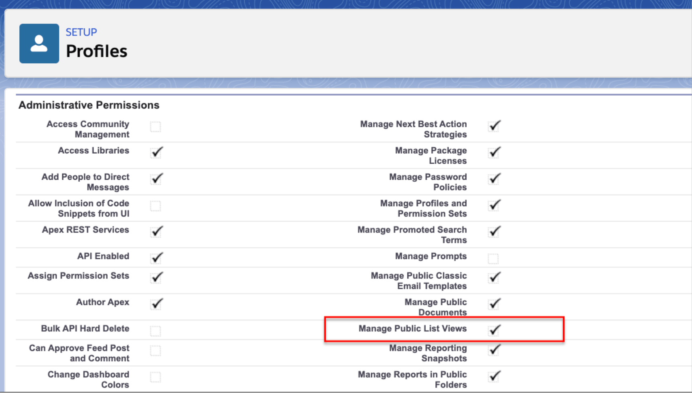

A Salesforce Administrator of Cosmic Solutions is training users in the company's Salesforce org about the use of list views. Which of the following are true statements regarding list views in Lightning Experience?

- Field level security is applied to the fields visible in the list view.

- Users can only see data that they can access.

### Delete custom field

The support team requested the Salesforce Administrator to create a second email field for capturing an additional customer email address. After 6 months the support team found that the field was not used and would like to delete it. What is true about deleting custom fields?

- If a custom field has been deleted, the field, its data, and the field history can be restored within a limited time.

- Custom fields cannot be deleted if there are any references to them.

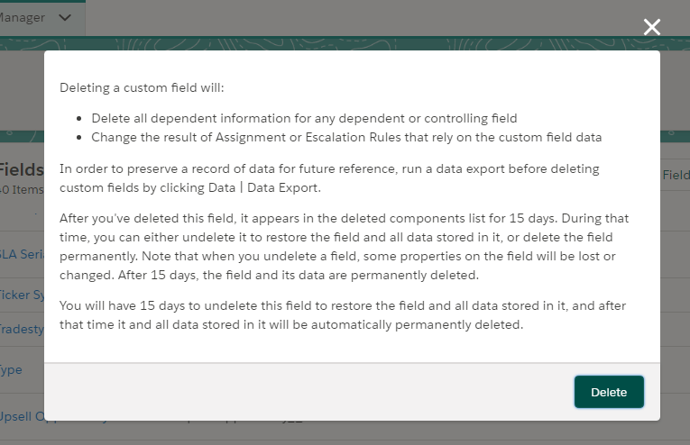

Emily, the Salesforce Administrator for Slidero Technologies, no longer needs several fields on the Job Application custom object when the application process changed. What is true regarding deleting fields?

- Deletion of custom fields can be accelerated using hard deletion to free up custom field allocation.

- After a field is deleted, it can be undeleted within 15 days before it is deleted permanently.

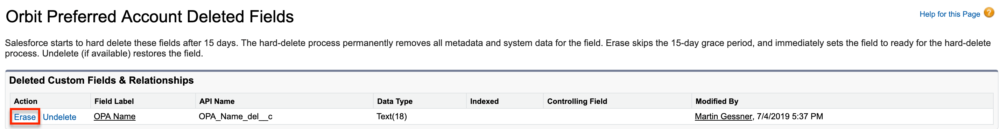

## 16 Question - Objective 3

Cosmic Solutions would like to make different information visible to employees in different divisions. How can record types be used for this requirement?

- Different page layouts can be displayed for different record types.

- Different Lightning record pages can be displayed for different record types.

- Different picklist values can be displayed for different record types.

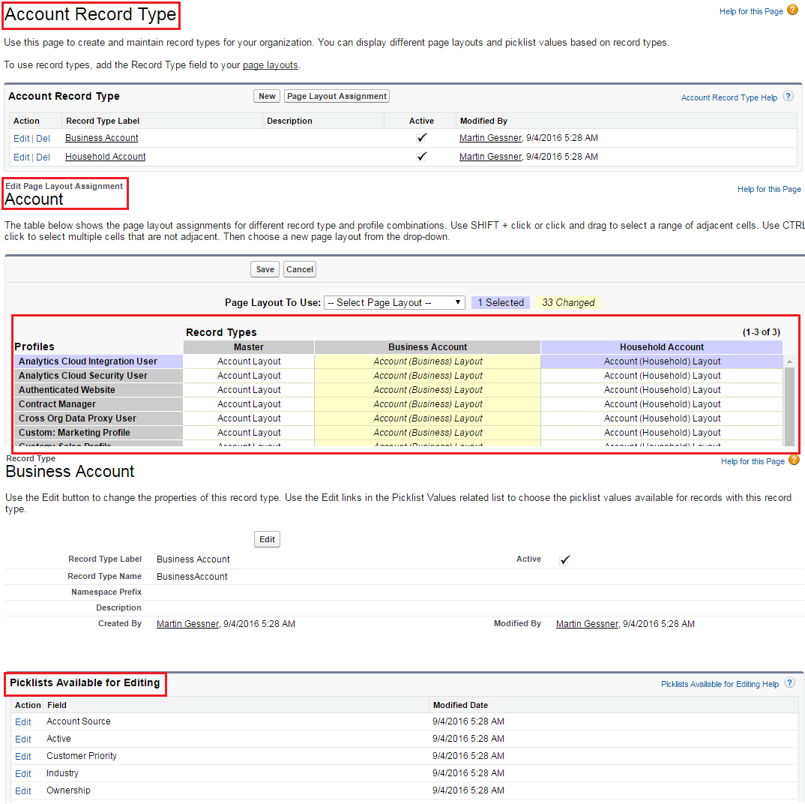

Record types can be used to display different page layouts and picklist values for different types of records. In Lightning Experience, Lightning record pages can be assigned to different record types in the Lightning App Builder, using the 'Assign to Apps, Record Types or Profiles' tab. Record types cannot be used to display different apps to users. It is also not possible to specify custom criteria in a record type to make different records visible to users.

### Business Process

Cosmic Road has multiple Case record types and is looking to implement a support process. How do record types relate to business processes?

- A business process can be associated with multiple record types.

  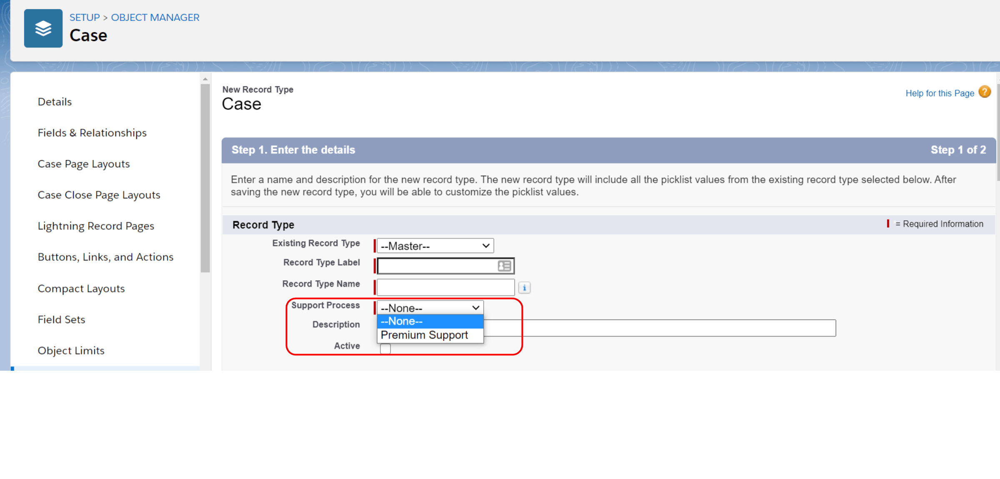Business processes can be used to manage different sales, lead, support, and solution processes. The opportunity stage, lead status, case status, and solution status picklist values are organized into lists called Sales Processes, Lead Processes, Support Processes, and Solution Processes. Each business process can be associated with one or more record types. When creating a record type, a business process is selected.

A Salesforce Administrator thought it would be a good idea to set up a business process for a new custom object called 'Purchase Order'. Which of the following are valid considerations regarding business processes provided by Salesforce in Salesforce Classic and Lightning Experience?

- Business processes are available only for standard objects such as Lead, Solution, Opportunity, and Case

The following business processes are available for Salesforce Classic and Lightning Experience:\
1) Sales Process (Opportunity)\
2) Lead Process (Lead)\
3) Solution Process (Solution)\
4) Support Process (Case)

However, it is important to note that the 'Path' functionality is available for Lightning Experience to set up a process for custom objects and certain standard objects.

### New Picklist Value

A new picklist value has been added to a custom field in a custom object, but it is not visible to a user viewing a particular record as expected. What could be the reason for this?

- There are record types defined for the object and the picklist value hast not been added to the record type of the record the user is viewing.

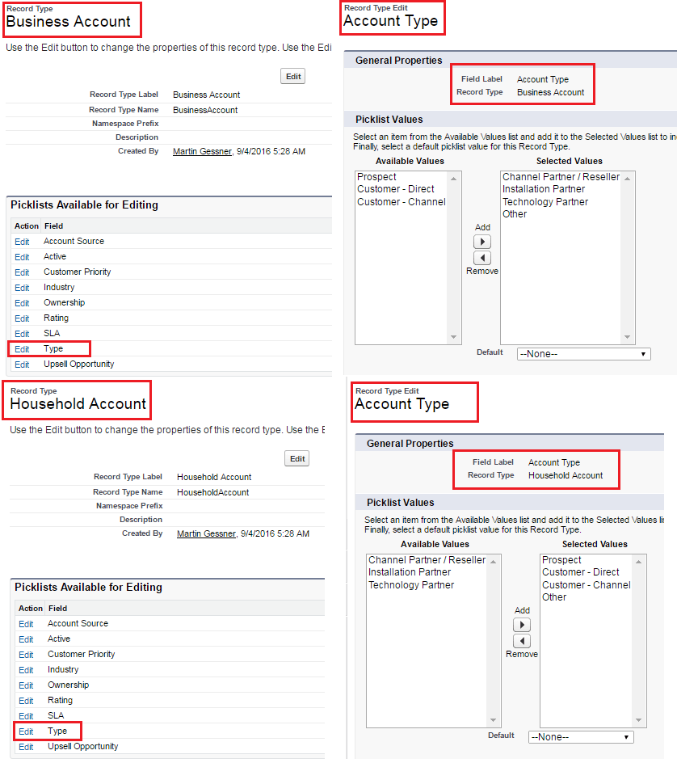

### PRIORVALUE

The Salesforce Administrator needs to prevent further changes to a record when the status field is updated to 'Archived'. How could this be accomplished?

- Create a validation rule using the 'PRIORVALUE' function to prevent further changes.

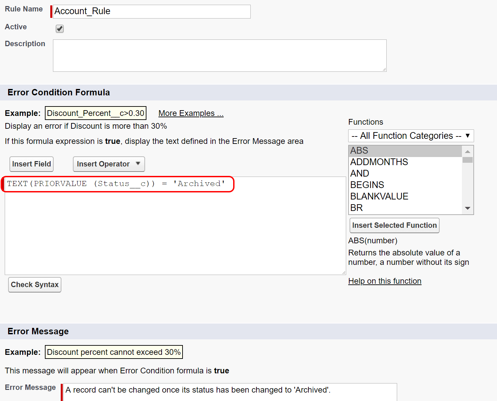

A validation rule that uses the PRIORVALUE function can be used to prevent further changes to a record when the value of the 'Status' field on the record is set to a specified value. If the record meets this condition, the save will fail if it violates the validation rule.

A validation rule with the ISCHANGED function would only check whether the value of the 'Status' field is changed, which is not suitable for this requirement because it wouldn’t block future edits once the status is already 'Archived'.

Using a sharing rule to change access levels based on the field value would not meet this requirement because sharing rules grant or extend access, they do not remove or restrict access. A custom Visualforce page could enforce this restriction, but since a declarative solution exists, it should be preferred over programmatic development.

### Record Type

What does a record type allow a Salesforce Administrator to define?

- Paths

- Picklist values

- Page layouts

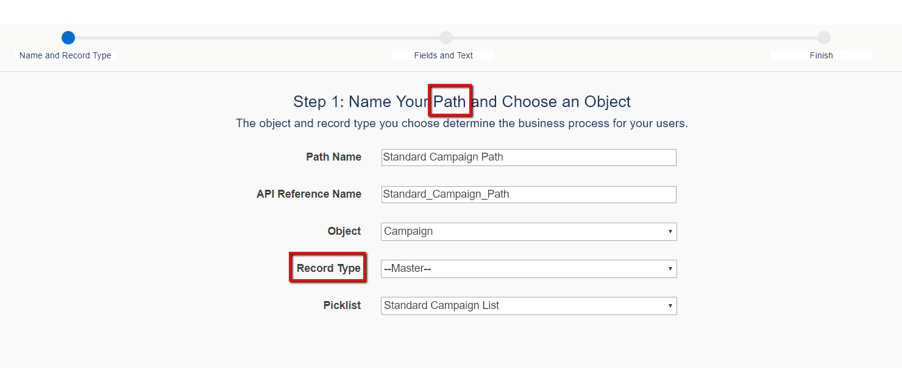

### Dynamic Form

RPI Pharmaceuticals uses a Requisition Form custom object to order supplies. Employees create Requisition Form records. The supply manager then needs to manage these records and maintain data in some fields that should not be visible to other employees. Assuming that the field-level security is not changed, which configuration or feature would be advised to hide sensitive data fields from other users?

- Dynamic Forms

***Visibility only needs to be restricted to certain fields on the page layout of the Requisition Form custom object. As field-level security is not changed, the most efficient way to have different sets of fields visible to 2 groups of users would be to use Dynamic Forms – configuring visibility of fields by incorporating them into conditionally displayed components on a page layout.***

*While it is possible to use 2 different page layouts, each assigned to the appropriate profile, Salesforce best practice is to use Dynamic Forms when this feature is available.*

*Record types are not necessary for this requirement since they are used for offering different business processes and picklist values to different user profiles–neither of which is required here.*

### New Line of Business

Your company has just opened a new line of business. This new line, Small and Medium Business (SMB), joins their Enterprise line. They plan to record different information of each type of account. Sales reps will either be assigned to work on SMB or Enterprise accounts. Which of the following steps should be taken?

- Create a new page layout for SMB Accounts and assign it to the profile of the appropriate sales reps.

- Create a new record type for SMB Accounts and assign it to the profile of the appropriate sales reps.

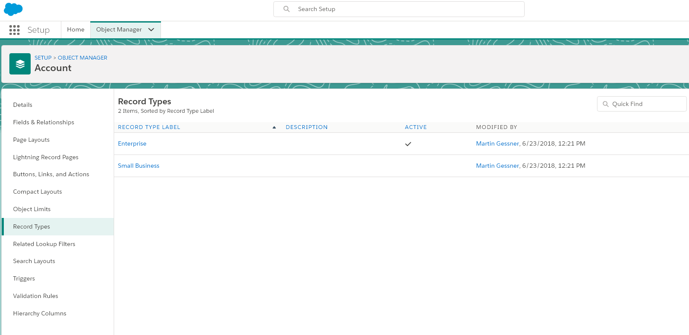

A new record type and page layout are required in order to keep the information separate. A picklist field/field level security does not limit a user from accessing a particular record type.

### Count Type Roll-UP summary

The administrator has created two custom objects, Job and Job Applications. \
The objects have a master-detail relationship. \
HR users would like to be able to see how many applications there have been when they look at the Job record. \
Other users should not have visibility to this. \
How can this requirement be met?

- Create a count type roll-up summary field on the Job object and use field-level security to make it visible to only users with the HR profile.

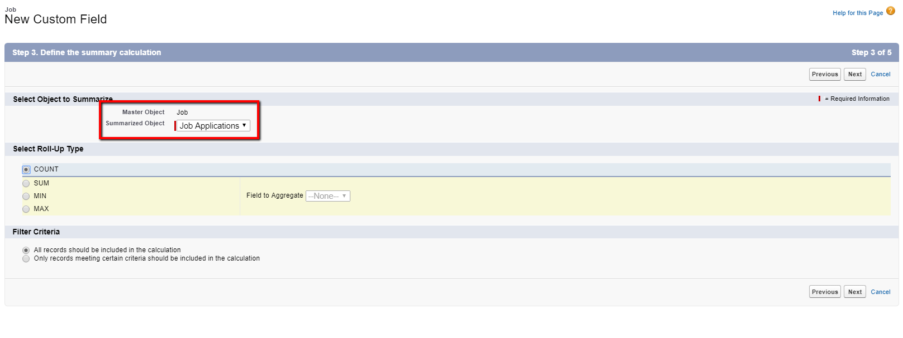

***Roll-up summary fields can be used with two custom objects having a master-detail relationship. A count type roll-up summary field is created to calculate the number of Job Application records linked to the Job record. Field-level security helps hide fields based on profiles.***

*Though there are ways to use a sum type roll-up summary field to show the count, it is not an ideal solution. The count type summary field is straightforward and already available. Also, using a separate page layout won’t work as the field would still be visible in reports.*

*Cross-object formula fields cannot calculate the count of job application records. Also, a trigger is unnecessary when the solution can be achieved declaratively.*

ABC Corporation wants to display different fields based on whether an account is a Customer or Partner.\
Which Salesforce configuration should the administrator recommend to achieve this?\

Different page layouts can be assigned to each record type to allow different fields to be displayed for different types of records.

### Campaign

The Marketing department would like to have a visual representation for tracking the lifecycle stages of campaign records with guidance similar to what Sales utilizes for Opportunities in Lightning Experience. How can the Salesforce Administrator help accomplish this?

- Create a new picklist and a new path, then modify the Campaign page in Lightning Experience.

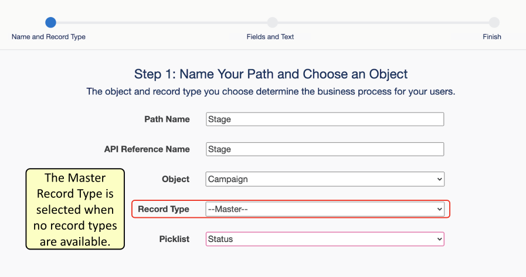

A Path can meet this business requirement. Paths can be created on many standard objects in Lightning Experience only. A Path can be based on any existing picklist field on the object. After the Path is created, it must be placed on the page like any other Lightning Component.
