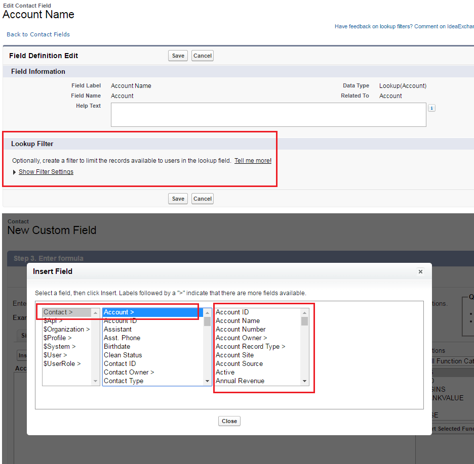
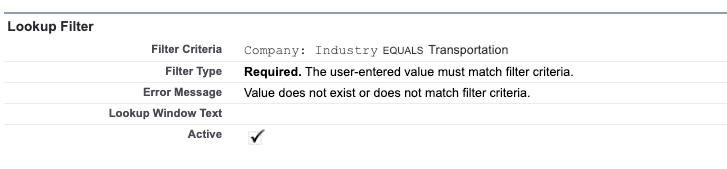
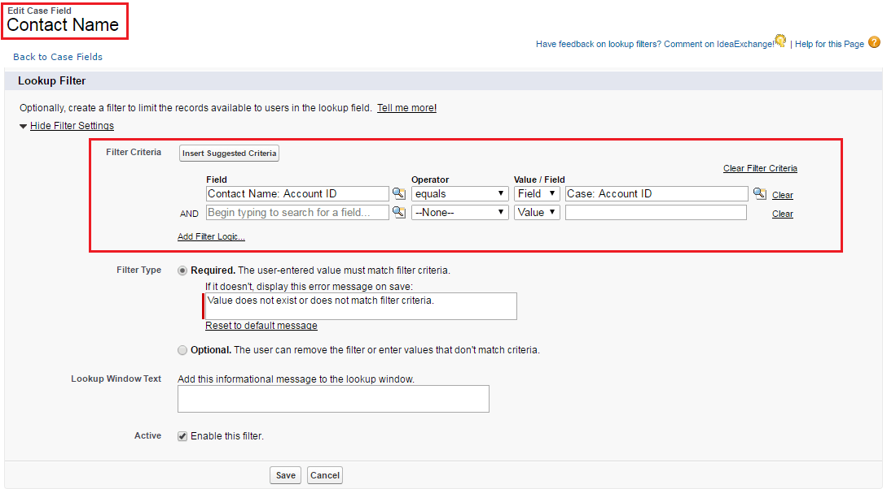
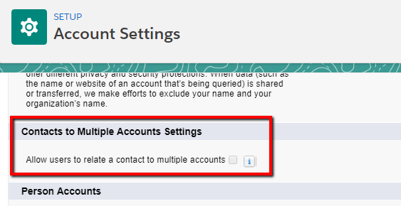
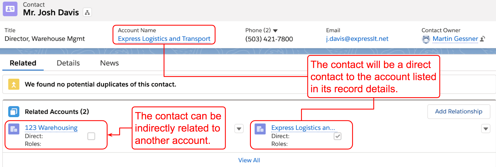
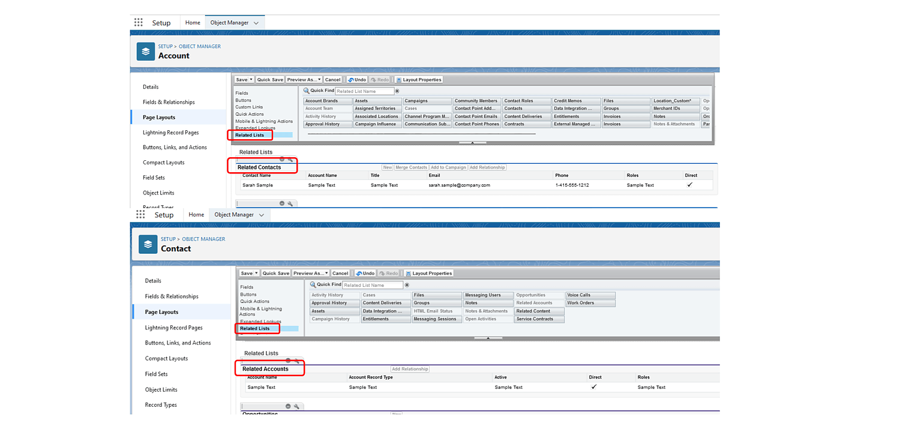
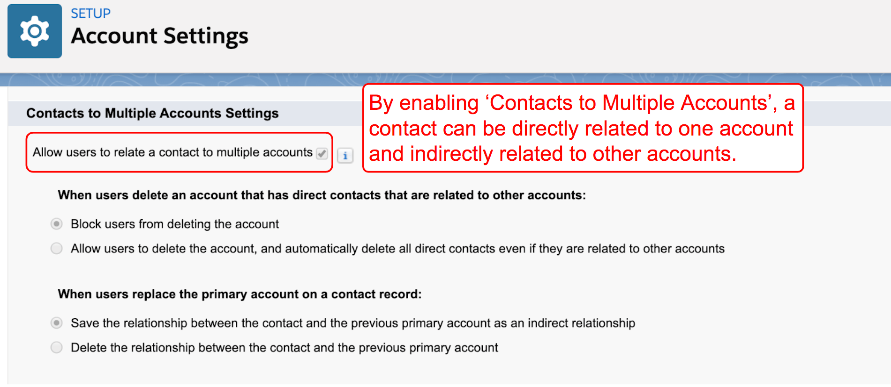
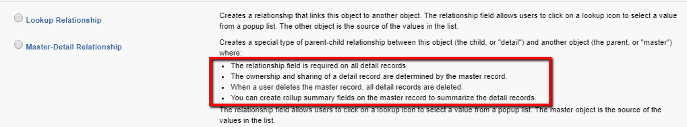
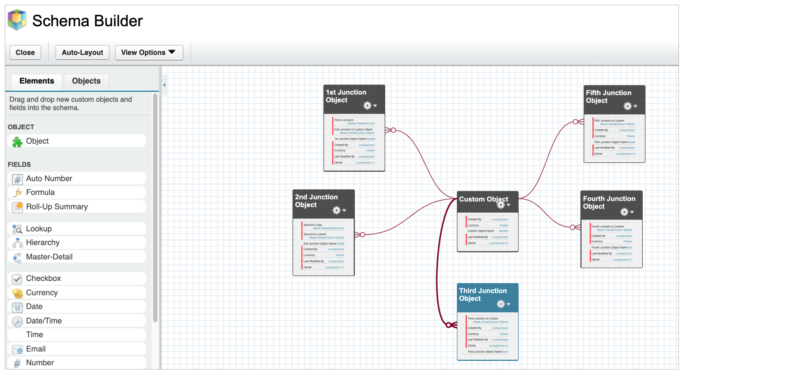
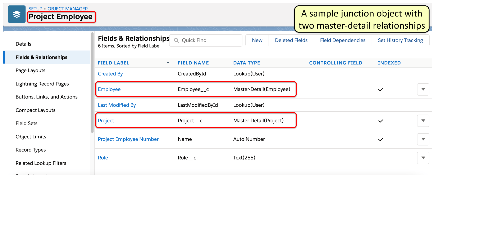

# Object Manager and Lightning App Builder.

17 Question - Objective 1

## Lookup Filter

A Salesforce administrator in an org with thousands of account records needs to implement lookup filters on several fields on the Account object. Which are true regarding lookup filters in Lightning Experience?

- Lookup filters are still required in Lightning Experience even if they are specified as optional.

- Lookup filter can reference fields on records related to the target object.

The Support Director of ABC company has asked the Salesforce Administrator to add a filter to the 'Contact' field on case records. The field should only allow contacts to be selected if they are associated with the account in the 'Account Name' field. What is the best way to meet this requirement?

- Create a dependent lookup on the contact field that references the account field.

## Contact with multiple companies.

A sales manager often finds that a contact has a relationship with multiple companies and would like to keep track of these relationships.\
How can a Salesforce Administrator enable this?

- Add the Related Accounts related list to the Contact page layout, \
  add the Related Contacs related list on the account page layout, \
  and remove the existing Contacts related list on the Account page layout.

- Enable the 'Contacts to Multiple Accounts' feature.

In order to allow multiple accounts to be associated with a contact, the 'Contacts to Multiple Account' feature must be enabled. After the feature has been enabled, the Related Accounts related list must be added to the Contact page layout and the Related Contacts related list added to the account page layout. The existing Contacts related list on the Account object can be removed as the Related Contacts related list will include direct and indirect contacts.

## Account Settings

Josh Davis is the Warehouse Management Director at Express Logistics and Transport. He is also a partner at 123 Warehousing. Express Logistics and Transport is the account found on his contact record details page, but his contact record is also related to the 123 Warehousing account. How would this be represented in Salesforce if 'Contacts to Multiple Accounts' is enabled?

- Josh would be a direct contact at Express Logistics and Transport, \
  and an indirect contact at 123 Warehousing.

Allow user to relate a contact to multiple accounts

## Account

In an initial meeting with the purpose of setting up a new Salesforce org, the administrator, Sarah, is asked what Accounts can represent. What would she be correct in stating?

- Individual consumers

- Competitors

- Companies you do business with

## Master-Detail Relationship \| Lookup Relationship

A Salesforce Administrator is considering whether to use a lookup or master-detail relationship. Which of the following are valid capabilities of a lookup relationship but not a master-detail relationship?

- The lookup field does not need to be a required field on the page layout.

- The related record can have a different owner than the parent record.

When using master-detail relationships, the child record inherits the record owner of the parent record. On the other hand, in lookup relationships, the child record can have a different owner.

Lookup relationship fields do not need to be marked as required on the page layout. Roll-up summary fields can only be added to the parent object in a master-detail relationship. Lookup relationships do not support creating roll-up summary fields.

In a lookup relationship, if a parent record is deleted, the child records are only deleted when the option to 'Delete this record also' is selected, which is only available if a custom object contains the lookup relationship.

## Many-to-many

A Salesforce Administrator has defined a new custom object and has identified that it needs to have a many-to-many relationship with 5 different standard objects. What considerations should the Salesforce Administrator keep in mind when designing the solution?

- It depends on the remaining custom object quota left in the org.

The limitation of two master-detail relationships per object has no effect on the number of many-to-many relationships an object can have. In a many-to-many relationship, the master-detail relationships are created on the child junction object and not the parent object itself. This means that all that is needed to be done is to create more junction objects, with each having a maximum of two master-detail relationship fields. In this case, five new junction objects are needed and the object limits of the org must be taken into consideration.

Which of the following are required to model a many-to-many relationship between two custom objects?

- A Junction object

- Master-detail relationship.

Master-detail relationships are used to model many-to-many relationships between two objects. A junction object is a custom object with two master-detail relationships and is used to connect the two objects that are related to each other.

Both of these are necessary to build a many-to-many relationship between two custom objects. A junction object is a custom object used to connect the two objects that should have the many-to-many relationship. The junction object contains a Master-Detail field for each of the two objects. In each of these fields, one of the objects in the many-to-many relationship is the "Master" and the junction object is the "Detail."

A lookup relationship does not have to be populated and therefore cannot be used to *require* a connection to both objects on a junction object. A hierarchical relationship is only for the user object and allows for the creation of a reporting structure within the user object.

