# Service and Support Applications

40 Questions:

## Queues

Which of the following can a Case Queue be used for?

- Manage your support workload.

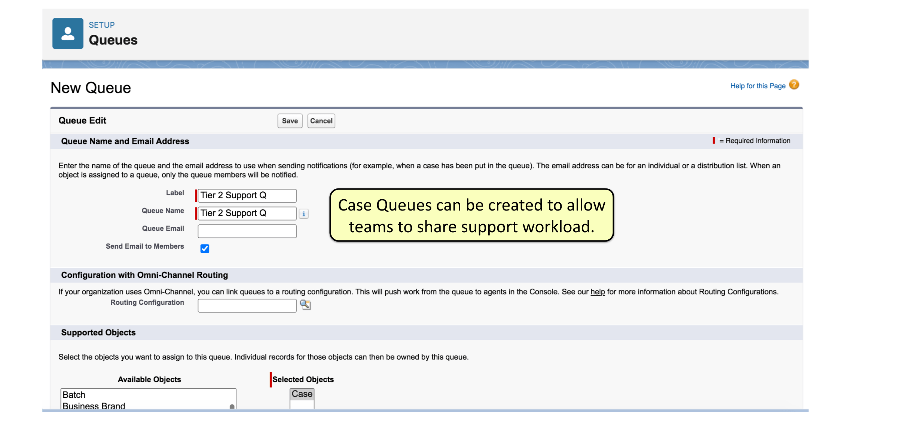

Which of these features are used to manage cases?

- Case Teams

- Email-to-Case

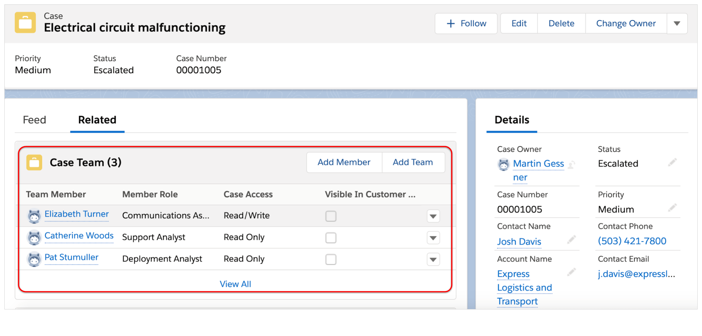

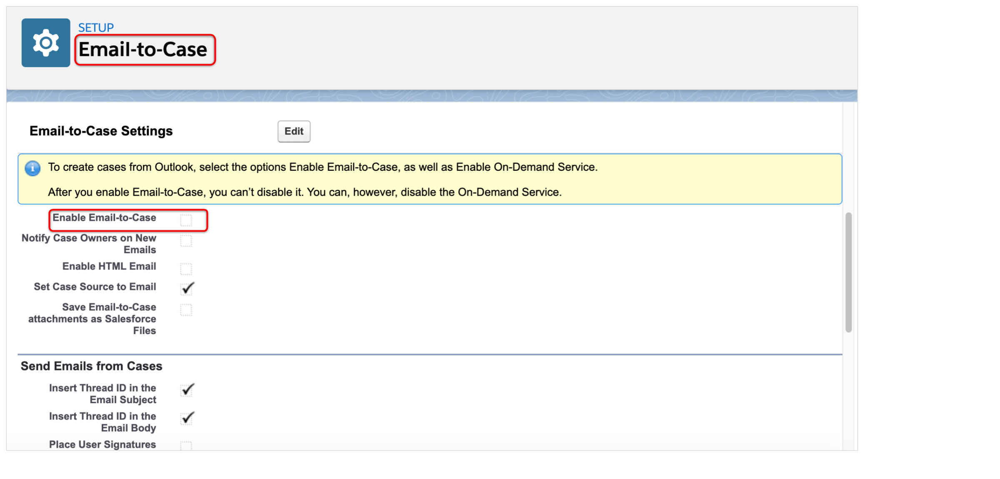

The Director of Support Operations at Cosmic Computers would like to create three different teams of support representatives who can work on low, medium and high priority cases separately. She would like to ensure that support representatives can view and work on cases assigned to their team. Which solution should be recommended for this requirement?

- Create different queues for low, medium and high priority cases.

*Queues can be created in Salesforce to allow groups of support agents to manage case workload more efficiently.*

*Cases can be assigned to a queue using a case assignment rule so that queue members can work on them. Members of a queue can take ownership of any case in the queue. Since a list view is automatically created for a queue, there is no need to create or customize a list view separately.*

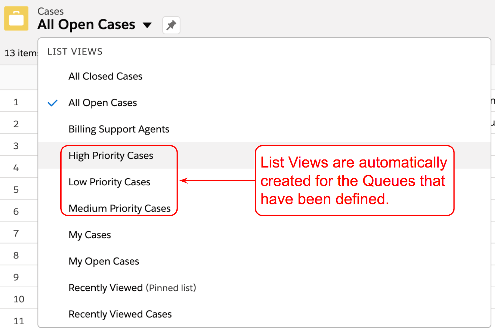

What is true regarding queues?

- A list view is automatically created when a queue is craeted for Cases, Leads, or custom objects.

- Custom object records can be assigned to a queue.

- Records can be placed in a queue manually or via an assignment rule.

*Standard objects such as Cases, Leads, Orders, Service Contracts, and Knowledge Article Versions, as well as custom objects, can be assigned to queues. List views are automatically created for Cases, Leads, and custom objects when a queue is created for those objects. Records can be placed in a queue manually by a user. For leads and cases, assignment rules can be created to automate this process based on records meeting defined criteria.*

*Only members of a queue can accept records from that queue and take ownership.*

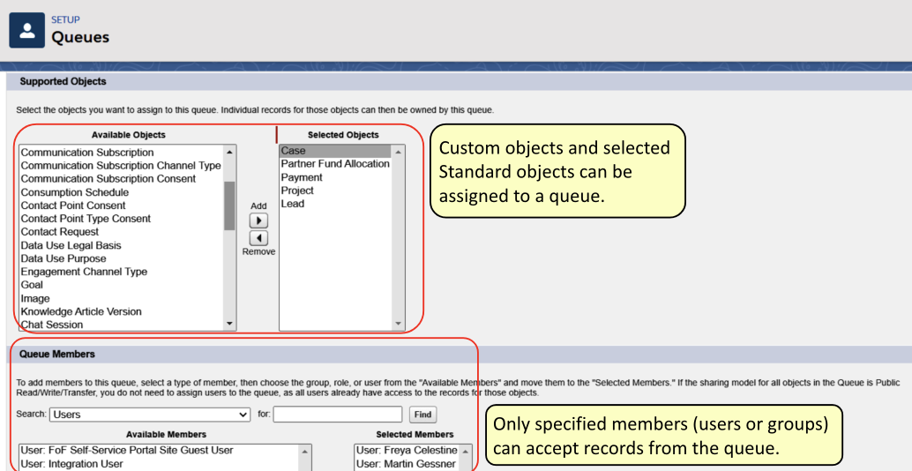{width="461"}

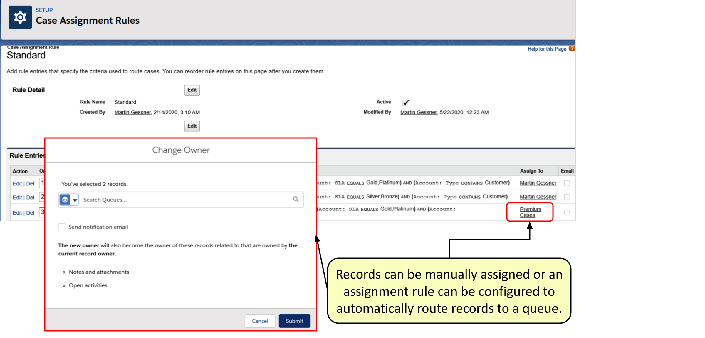{width="599"}

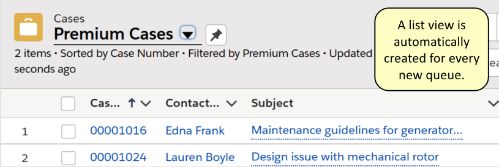{width="476"}

## Case Assignment Rules

Tim works for a Support Center that is looking to streamline their case management. Currently, all cases are routed to a single user who then manually assigns them to support reps. The support center handles all cases based on the Geography field selected on the case. Which of the following combination of configuration options could Tim suggest to help automate their Case Management?

- Creating a Case Assignment Rule

- Setting up queues based on Geography

The requirement here is to automate the assignment of the records instead of leaving it to the one user. Email notifications, while useful, would not help automate the case management process in this case, as the user would still have to route cases. An approval process may help automate the process, but not in tandem with any of the other options provided. The Case Assignment rule is a built-in automation within Salesforce to automate the assignment of case.

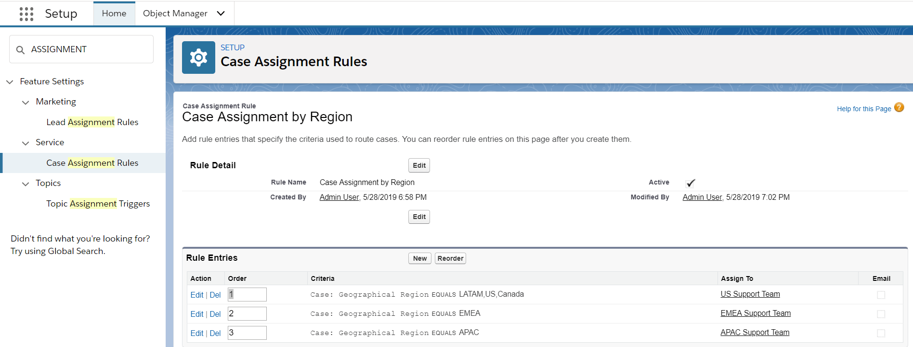

### Auto-Response Rule

What situations can trigger an auto-response rule?

- Web-to-Case submission

- Customer Portal Case submission

- Email-to-Case submission

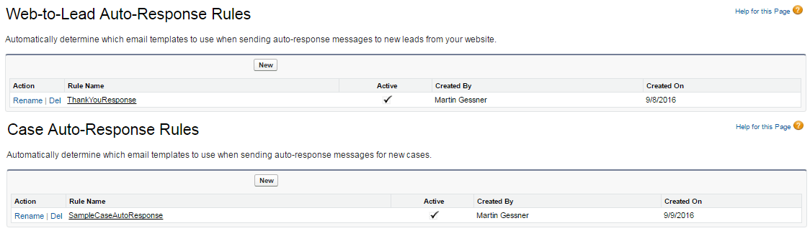

What is true regarding auto-response rules?\

- Auto-response rule apply to cases and leads.

- Different email templates can be used for different criteria.

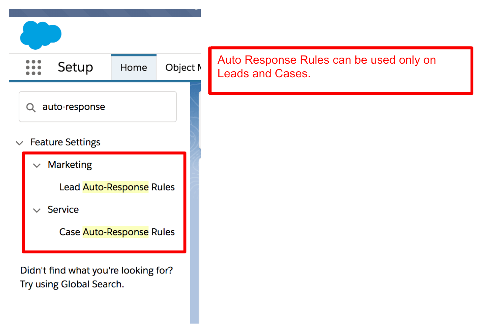

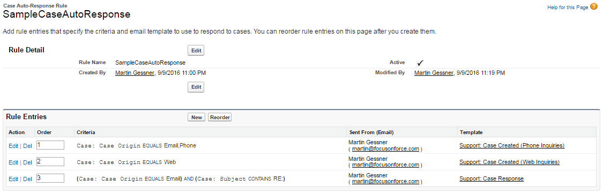

### Delete Cases

Ethan Hunt is a Salesforce Administrator. During a meeting with the support team, he received a request to delete a number of cases. What would he have communicated regarding the impact of deleting cases?

- All related events, tasks, case comments, and attachments are deleted.

When a case is deleted, all related events and tasks, case comments, and attachments are also deleted. Associated contacts, accounts, and solutions are not deleted.

### Record-triggered flow

Shelly is a Salesforce Administrator who works for the TPI support center that uses cases to manage support issues. TPI's support manager has noticed that after a case is created, support reps are looking up the tier of the related account and setting the case resolution date accordingly. For example, if the account tier is silver, the resolution date should be set to 14 days, whereas a gold tier account should have a resolution date set to 7 days. Which of the following could Shelly use to save time in this process?

- Record-triggered flow to update the resolution date based on account tier.

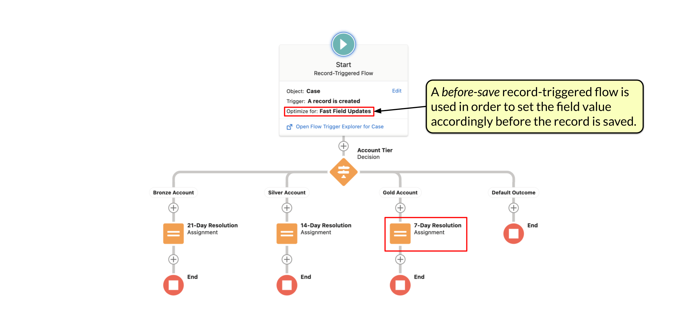

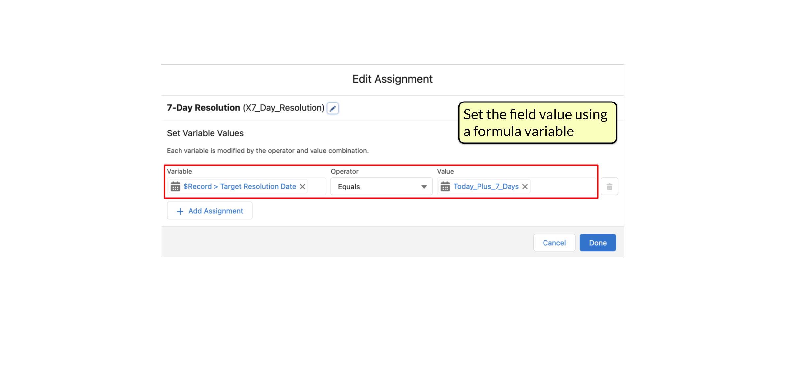

### Compact feed view

How can an administrator allow users to see more information with less scrolling in a feed-based page layout when working with Cases in the Service console?

- Enable compact feed view in the console.

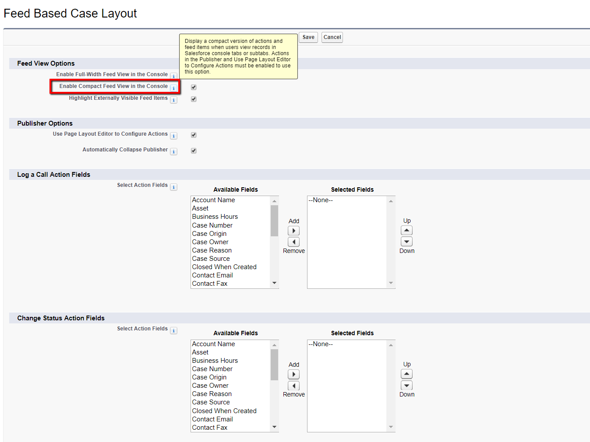

### Macros

How can support agents, who use the Case Feed, complete repetitive tasks quickly and consistently?\

- Use macros in the Case Feed.

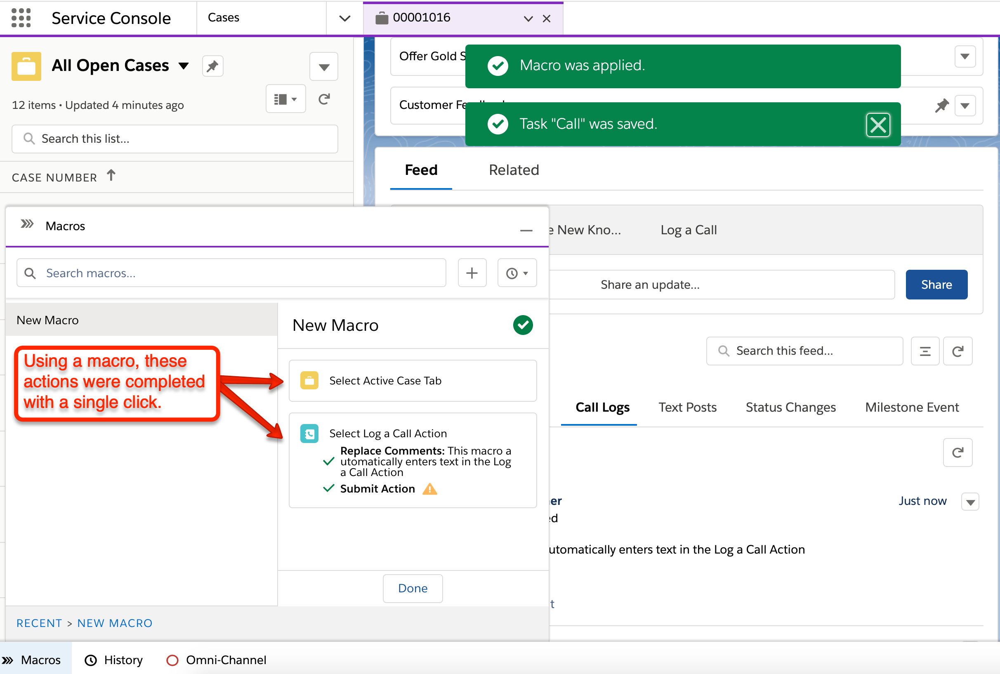

#### Bulk Macros

In order to improve efficiency and automate actions on cases, a Salesforce administrator is considering the use of bulk macros. Which of the following statements are true regarding the use of bulk macros?

- Bulk macros can update field values on multiple records.

- Bulk macros can send emails to contacts on selected records

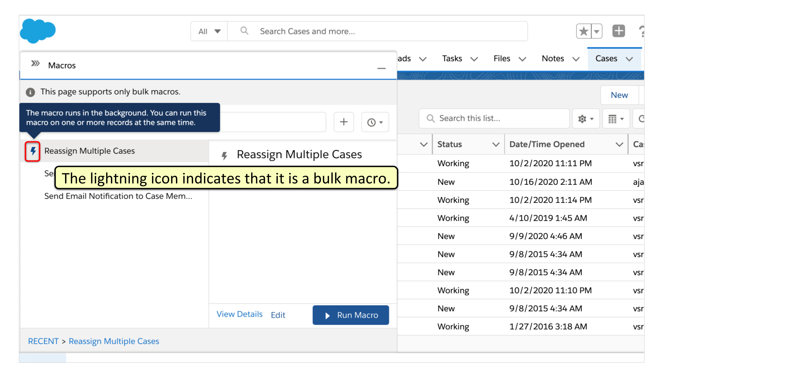

***Bulk macros can be only run on records of Account, Case, Contact, and Lead objects. A bulk macro can only be run on records in one object list view at a time. Bulk macros can send emails or update field values for multiple records.***

*To run Bulk Macros, it is necessary to enable Enhanced Lists setting in User Interface Settings within the org.*

Service agents working on cases often need to request more information from customers in order to properly resolve cases. In these instances, they need to update the case status to 'On Hold' and send an email to the customer. They find that they usually do this several times during the day and would like a way to do it more efficiently. Which is the quickest way to address this requirement?

- Use a prebuilt macro

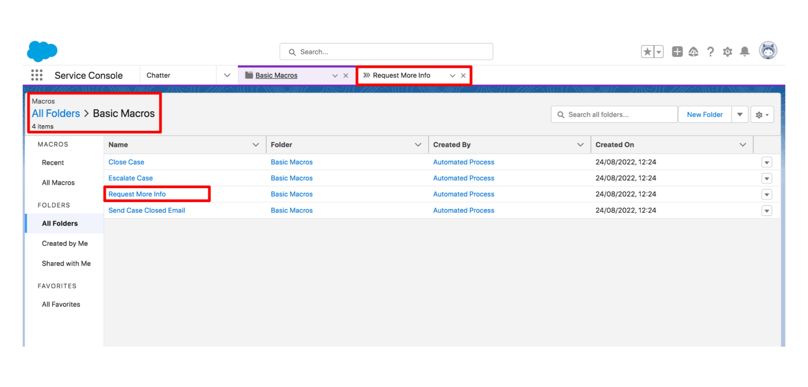

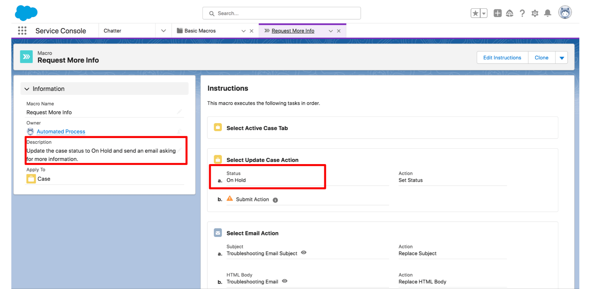

*Repetitive tasks can be made more efficient by using macros. Although a macro can be created, there is a prebuilt macro that will change the case status to 'On Hold' and send an email to the listed email in the case.*

*A "Hold" quick action does not exist. Although Lightning Sync is used to connect a Salesforce org to Microsoft or Google applications, it can neither be used to automatically send emails to customers nor update fields in the Case object.*

The support department of Cosmic Supermart Online receives several emails from customers asking about the company's return policy. The support director would like to allow support agents to automate the process of sending a reply to these customers using Quick Text. The agents use a Service Console app in Lightning Experience. What should be added to the Utility bar of the app to fulfill this requirement?

- Macros

*Macros can be used to automate repetitive tasks in a Service Console, such as sending an email to a customer. A macro allows inserting quick text, using email templates, adding email attachments, etc.*

*A flow would require interaction by the agents as only active screen flows can be utilized for the Flow utility item. Chatter Publisher cannot automate tasks. Omni-Channel is used to route work items to agents automatically and cannot be used for automating tasks performed in a console app.*

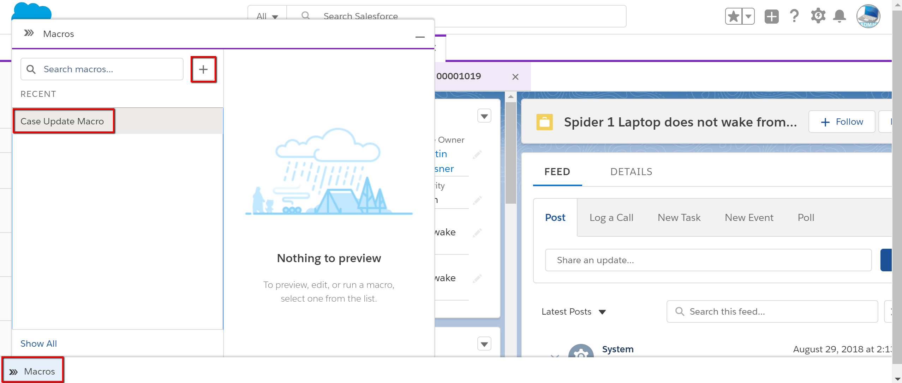

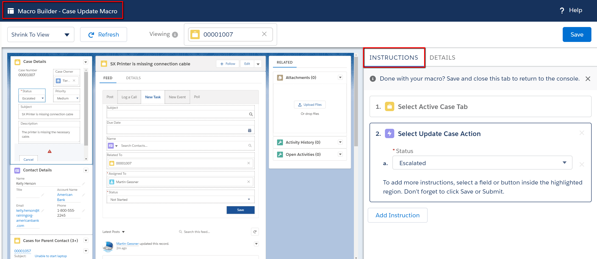

### Addition a Report Chart in Service Console in Classic

What is true regarding the addition of a report chart to the Service Console in Classic?

- The source report must contain a chart.

- The source report of the cart must be a Summary or Matrix report

- The report chart must be added to the page layout of the object from which to display the chart.

### Web-to-case

Customers receive case email notifications whenever case creation fails after they submit a Web-to-Case form. A customer is requesting for these to not contain sensitive data related to the cases entered. How can a Salesforce Administrator make sure that sensitive information is kept private?

- Enable the 'Hide Record Information' setting

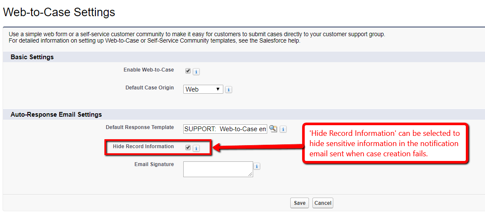

Cosmic Electronics is revamping its website to improve the customer support experience by adding a support page with a web form that can be used to submit cases. Which of the following are some of the best practices to be followed while configuring Web-to-Case to create an effective web support channel?

- Create queues

- Create custom case fields

- Create a case assignment rule

*Custom case fields can be created to add additional information to cases created from web forms filled by customers. Queues can be created with a case assignment rule to assign the cases created through Web-to-Case to specific groups of support agents within the company.*

*Macros can be used for automating case management but do not constitute an important design consideration for creating a web channel. Also, reCaptcha verification can be made required in Web-to-Case Settings in order to reject any case without the reCAPTCHA verification. This prevents spam cases from being created.*

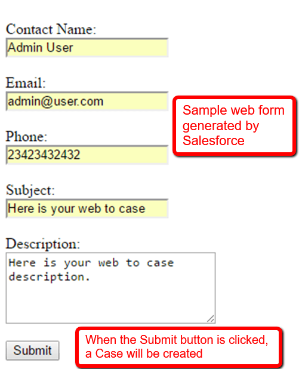{width="364"}

### Email - Within company guidelines

Cosmic Solutions wants to ensure that emails that are sent out to customers by support agents are within company guidelines. They would like their Support Managers to approve emails. How would they achieve this?

- Create an Approval Process

- Enable Draft Emails

- Create a Send Action

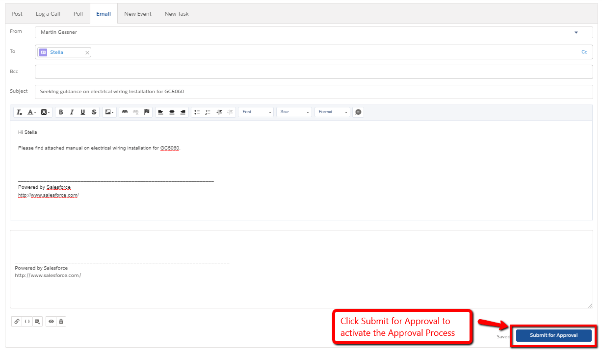

To allow an Approval Process for draft emails, 'Enable Draft Emails' must be checked in Support Settings, a Send Action must be created, and an Approval Process must be set up. This setup will notify a manager when an email draft needs to be approved and allow the manager to approve an email in the Case Feed. The email will be sent to the client if approved, and if not approved, the manager can add the explanation to the feed. No further permissions need to be enabled for managers.

### Case Feed Visible

A service manager requested that users be given the ability to make items from their case feed visible to customers. Aside from requesting for the feature from Salesforce, what permissions should the Salesforce Administrator grant the users to make this possible?

- Edit Posts on Records I Own.

- Edit My Own Posts

*Users can be given the ability to make their case feed items visible to external users. To enable this feature, it must first be requested from Salesforce. The Salesforce Administrator would also need to make sure that the compact case feed and community case feed are enabled in the organization. Users who need this feature should have the 'Edit My Own Posts' and 'Edit Posts on Records I Own' permissions enabled in their profiles.*

*The 'Modify All Data' permission is a powerful permission used by Salesforce Administrators that gives them the ability to modify all apps and data regardless of whether these are shared with them or not. The 'Can Approve Feed Post and Comment' allows authors and moderators to manage posts and comments that are pending review in a community.*

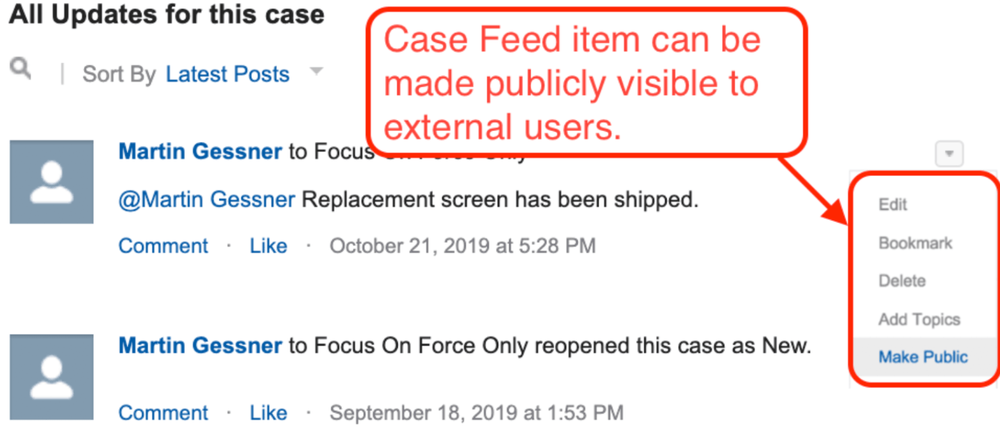

### Action and escalation rule

\
SystemSilo Inc. wants to make sure that cases which require installation are assigned to level 3 support reps.\
Additionally, they also requested that a notification be sent to the manager every time a platinum priority case is unresolved 3 hours after being opened.\
What can a Salesforce Administrator do to fulfill these requirements?

- Set up a case assignment rule that includes automatically assigning installation cases to a level 3 support rep.

- Add an action to an escalation rule that sends a notification to the manager about unresolved platinum prioirity cases 3 hours after case creation.

*Case assignment rules are used to define how specific cases are assigned to particular queues or users. Escalation rules are used to reassign cases or notify users when cases that meet specific criteria remain unresolved.*

*Updating a field is not possible using an escalation rule. Although it is technically possible to meet the requirement using Flow Builder, it is not necessary, as escalation rules and assignment rules are specifically designed for these types of automation requirements out of the box.*

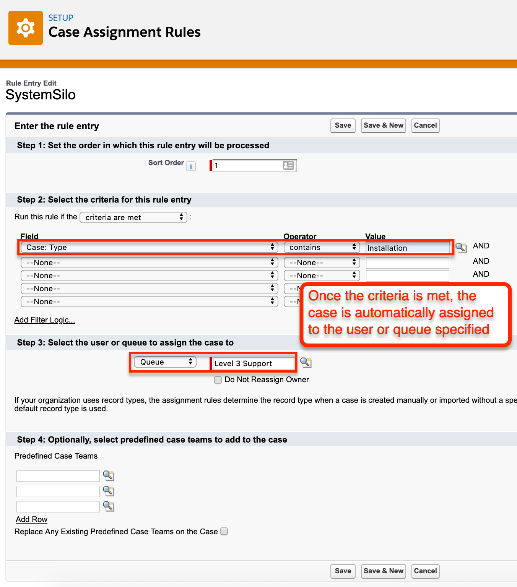

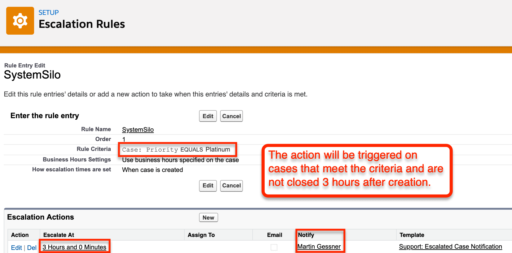

### Parent Case

Cosmic Solutions would like to understand the relationships between cases and be able to view these relationships. How would they create a relationship between the two cases?

- Add one of the cases as a parent of a related case using the Parent Case field.

*To create relationships between cases, the Parent Case lookup field can be populated. Once case relationships have been created, these can be viewed by clicking 'View Case Hierarchy' on a case. There is no Case Relationships related list, Related Case field, and no ability to select cases in a list view to relate them.*

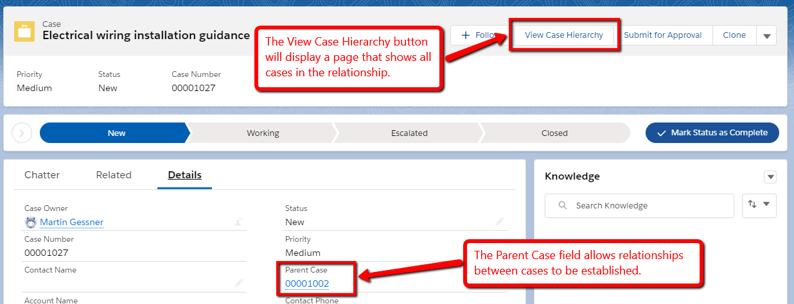

### Case \| Contact Roles

Cosmic Solutions often has multiple contacts involved in a case. Which of the following is the most efficient way to show them in a case record?

- Using Case Contact Roles

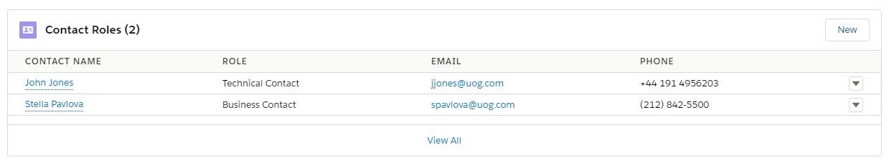

*Case Contact Roles can be used to record the roles that different people have while working on a case. The Contact Role related list can be added to the Case page layout, and the role can be defined.*

### Flow

Cosmic Solutions provides call center services for the business-to-consumer needs of various enterprises throughout the country. The management is considering the use of a flow for automating the case management process while a support agent is on a call with a customer. Which of the following are typical use cases of flow for case management in a contact center?

- Provide a series of prompts for troubleshooting customer issues.

- Create follow-up tasks.

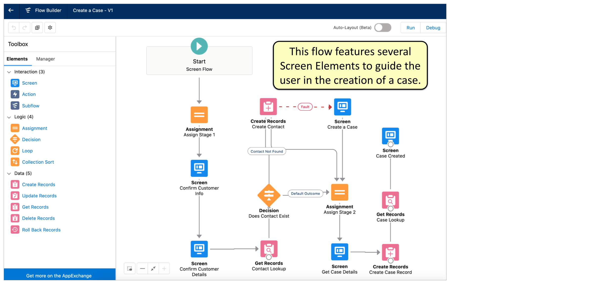

*Flows can be used for designing wizards for customer interaction, such as a series of prompts (using a screen flow component) that gives agents step-by-step guidance for troubleshooting issues. Follow-up tasks can be created using flows.*

*A flow is not required to implement case milestones and milestone actions because there is an out-of-the-box solution that meets this use case. Cases can be escalated by creating a case escalation rule.*

### Web-to-Case

When a case is created via web-to-case, an email should be sent to the customer acknowledging the case and notifying them of when they can expect to receive a response based on their service level. How can this be configured?

- Use auto-response rules with multiple rule entries.

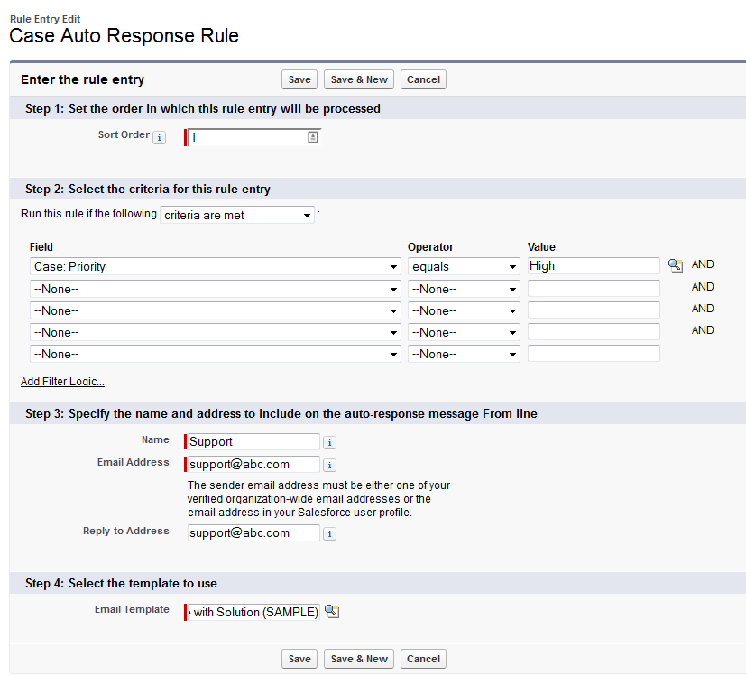

*Auto-response rules are designed to send automated acknowledgment emails when cases (or leads) are created. Multiple rule entries can be defined for different service levels or criteria, each using a corresponding email template.*

*A record-triggered flow could send an email, but it is not purpose-built for handling incoming case submissions and does not provide the same flexibility or efficiency as auto-response rules. Case assignment rules determine ownership rather than sending notifications, and an Apex trigger would be unnecessarily complex for a requirement that can be met declaratively.*

What is true regarding Web-to-Case?

- Cases created from Web-to-Case are linked to the relevant contact and account based on the customer email address.

- Case creation will fail if case validation rules fail when processing a Web-to-Case submission.

*Validation rules are run before creating records submitted via Web-to-Case, and only records that have valid values are created. Assignment rules can be used to assign cases submitted via Web-to-Case to a specific queue or users, based on specific criteria. When cases do not match any of the assignment rule criteria, they are assigned to the Default Case Owner. New Web cases use the default status in the Case Status picklist values. The default value for the Origin field can be selected when setting up Web-to-Case.*

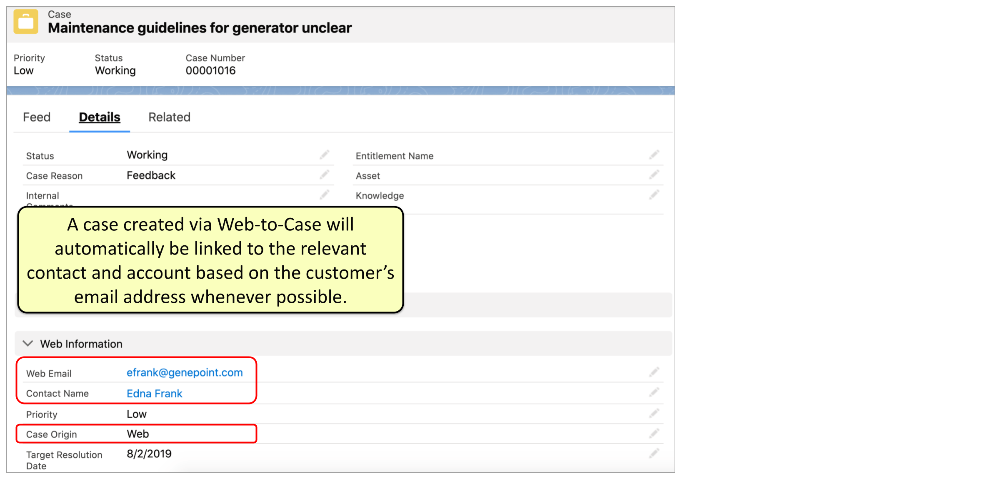

Which of the following are true about configuring Web-to-Case?

- A default response template may be selected

- HTML code must be generated and be added to multiple websites

- A default case owner must be selected

*Case assignment rules can be used to automatically assign web-generated cases to users or queues based on specific criteria in those cases. Cases that do not match any of the assignment rule criteria are assigned to the Default Case Owner specified in Support Settings.*

*The maximum number of cases that can be created is 5,000 daily and this daily-limit is set by Salesforce and cannot be changed. Any additional requests beyond this daily limit will be queued and processed on the following day. Both standard and custom case fields can be captured on the web form.*

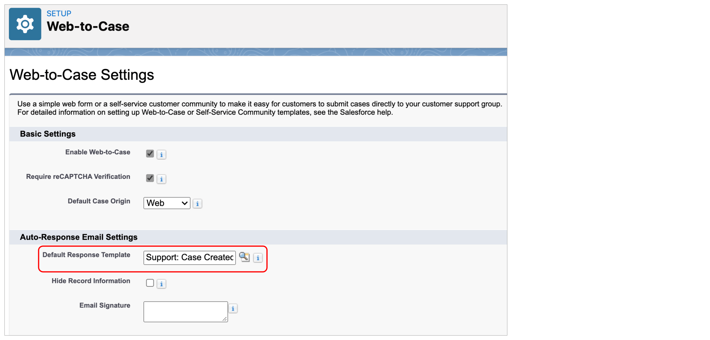

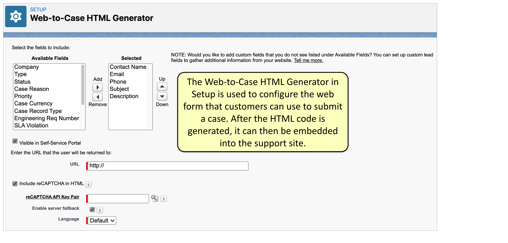

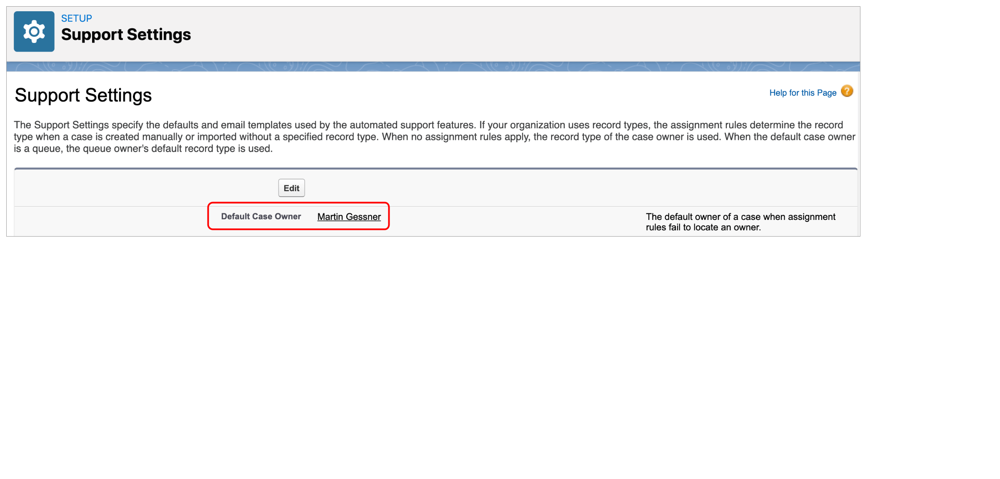

### Case Escalation Rule

A support manager at Cosmic Freight Tools would like to be informed when a support agent working under her fails to resolve a low priority case within 48 hours. She would also like to automatically assign the case to a different support agent who reports to her. Which Service Cloud solution can be utilized for this requirement?

- Create an escalation rule that assigns the case to another user and automatically sends an email notification to the manager.

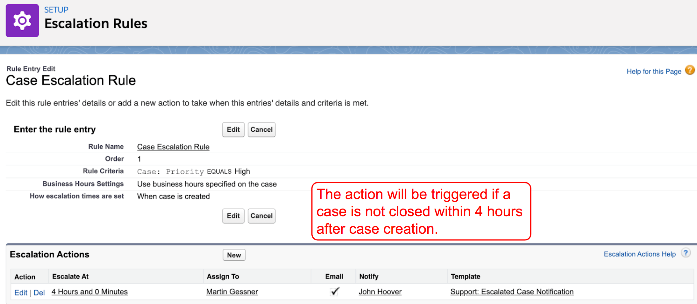

*An Escalation Rule is the standard, purpose-built Service Cloud solution for time-based actions on Cases, such as reassignment and notification. It is the best declarative option for this requirement.*

*Case Assignment Rules are used only for initial routing.*

*Auto-Response Rules are for customer notifications. While Record-Triggered Flows can handle time-based actions, using separate Flows or relying on them for core Case Escalation logic is less efficient and deviates from the Escalation Rule feature's best practices.*

Which feature can be used to alert the support manager via email if a gold customer and high-priority case has not been closed within the SLA response time after two hours from case creation?

- Case Escalation Rules

*Escalation rules can be used to define the criteria for automated flagging a case and notifying certain users and additional email addresses at the time specified for the rule. Another escalation action can also be configured such as case auto-reassignment.*

*Case Assignment Rules are used to define criteria for automating the assignment of cases to appropriate users or queues. Case object settings are composed of configurations related to customizing case fields, page layouts, and other object settings. Case queues are used to temporarily hold cases to help prioritize, distribute, and assign records to queue members.*

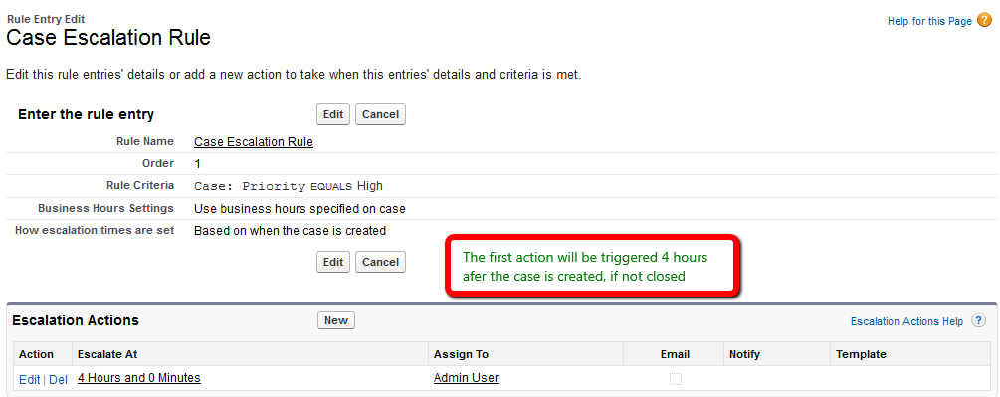

### Case Actions

Which of the following are true regarding automated case actions in Salesforce?

- When a case is automatically assigned using a case assignment rule, the automated case user is listed in the 'Case History' related list.

- When a case is created through Web-to-Case, the automated case user is listed in the 'Case History' related lists.

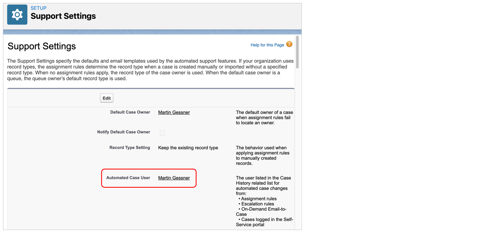

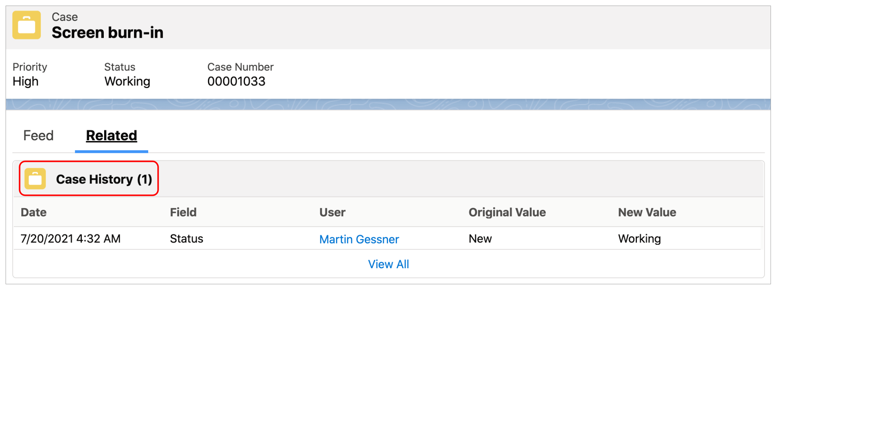

*The automated case user is listed in the 'Case History' related list for all automated case changes in Salesforce. For example, automated case changes can occur when a case is assigned using an assignment rule, when a case is escalated, or when a case is created through Web-to-Case or On-Demand Email-to-Case.*

## Omni-Channel

The management at Cosmic Fix would like to make the case routing process more efficient in Service Cloud because some agents receive more volume of cases than others. They want to make sure that cases are routed to agents with proper skills while considering the number of cases the agents can handle at a time. Which feature can resolve the case routing issue?

- Omni-Channel

*Omni-Channel can be used to route cases to support agents efficiently based on the size of work and the agent's capacity. For example, if the size of a case is five and an agent's capacity to handle work is ten, then it ensures that the agent has two cases to work on at any given time. A service channel, queue, and routing configuration can be set up to route cases to support agents.*

*Case assignment rules can be used to assign cases to support agents based on certain criteria, but they do not ensure that cases are routed based on the amount of work a support agent has or can handle at any given time. Queues are used for combined ownership of cases and allow groups of users to manage workload more efficiently, but they do not assign or route cases automatically. However, Omni-Channel does make use of queues to route work items. Service Console provides an interface that increases the efficiency of support agents while working on cases, but it does not help in routing cases.*

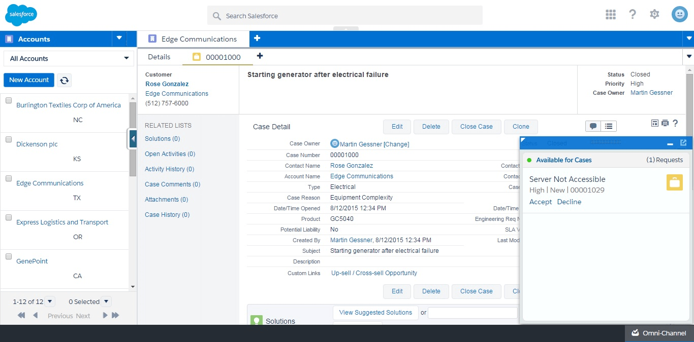

Cosmic Global wants to implement an automatic and dynamic chat routing that assigns chat requests to the correct agent based on the customers' language: English, Japanese, or French. Once the agent accepts the request, the related contact and case records must also open in new tabs. Which of the following can best address the requirements?

- Omni-channel flow

*An Omni-Channel flow includes Omni-Channel functionality within a Salesforce flow. It unifies routing setup for voice calls (beta), chats, messaging (beta), leads, and custom objects. It can be configured to launch when a customer starts a chat, voice, or messaging conversation. The flow can execute a 'Route Work' action to assign single or multiple work records to a queue, skills, or agent. In this scenario, a decision element could be used to check the customers' language and route the work accordingly. The 'Check Availability for Routing' action can be used to identify the number of agents online to make better routing decisions. In addition, a 'Screen Pop' action can be added to an Omni-Channel flow to automatically open records on the agent’s screen when work is routed to the agent.*

*Queues can represent language skills in queue-based routing. However, a separate mechanism must be used to prompt screen pops (e.g. flow or Apex). Data Loader cannot route chat requests. A programmatic approach using Apex classes and triggers can also satisfy the requirements, but a declarative solution is always preferred if available.*

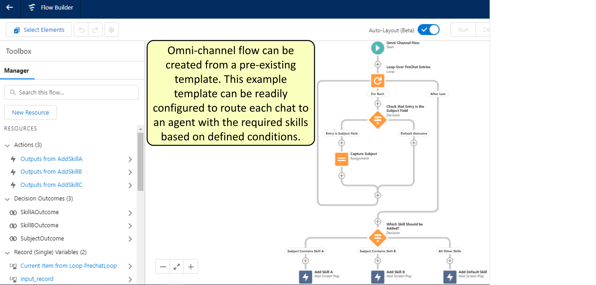

## Support Process

Cosmic Computer Support provides repair services for both computer hardware and software problems. They need to differentiate between the two with different record types and support processes depending on whether the problem is hardware or software-related. Which of the following statements is correct?

- At least one Support Process must exist before a Case record type can be created.

*Cases can be created without Case record types or Support Processes existing. Support Processes are associated with Case objects to define the specific steps and status values that a case goes through. When a new Case record type is being created, it needs to be associated with an existing Support Process. This ensures that cases of that record type follow the predefined steps and status values outlined in the associated Support Process. Therefore, you typically create Support Processes first and then associate them with Case record types.*

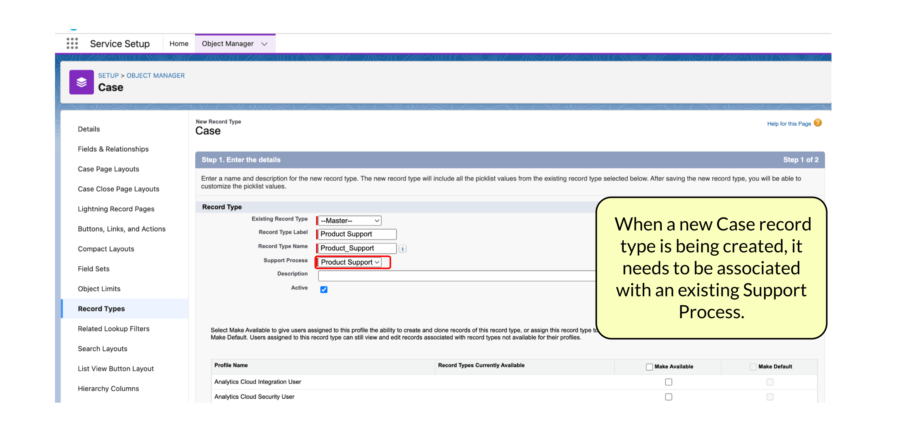

## Open CTI

Cosmic Furniture Solutions is considering the use of Salesforce for providing phone support to customers. The company currently has an on-premise telephony system which is already being used for telemarketing and other needs. What are some of the benefits of using Open CTI for integrating the telephony system with Salesforce?

- Telephone numbers on records become clickable links for outbound calls.

- Screen pops displays call information with the associated record during incoming calls.

- Calls can be made or received from the Salesforce user interface using a customizable softphone.

*Open CTI implementation provides several benefits such as:\
1. Click-to-dial functionality\
2. Customizable softphone\
3. Screen-pop.*

*Since Open CTI is cloud-based, a separate CTI adapter installation is not required. Also, it allows the use of softphones on any web browser that supports HTML5.*

*Aside from displaying call information with the associated record during incoming calls, Screen pop actions can be created in Salesforce to automatically open up to three related records based on the customer's data.*

## Email-to-Case

Cosmic Innovation has recently started using Service Cloud for case management and has set up Email-to-Case to automatically create cases from email messages sent by customers. A training developer hired by the company is creating a training manual for its support agents. It should include detailed instructions about using various Service Cloud features, including the email publisher in the case feed to answer customer questions. Which of the following capabilities should the training developer keep in mind while creating content about working with emails in Lightning Experience?

- A table can be added to the body, and its content can be styled using the email composer's actions menu.}

- An email and its merge fields can be previewed before the email is sent to the customer.

- When a user composes, replies, or forwards an email, its working draft is saved every few seconds.

*When using the email publisher in the case feed in Lightning Experience, a working draft is saved every few seconds when a user composes, replies, or forwards an email. They can leave it and return to it at any time. Email Drafts need to be enabled by Admins and there can be only one draft per case. Previewing an email and its merge fields before sending it is possible. A table can be added by clicking an icon in the email composer's action menu. The content of a table can be styled. It is also possible to insert images and edit the table's cell spacing, padding, and alignment.*

*Images can only be embedded by copy and pasting, providing an image URL, and browsing for or uploading Salesforce Files. A user can look up contact email addresses by clicking the lookup icon in the To, CC, or BCC field. However, they can only filter contacts by account contacts and internal users.*

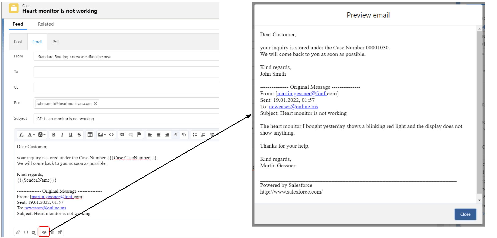

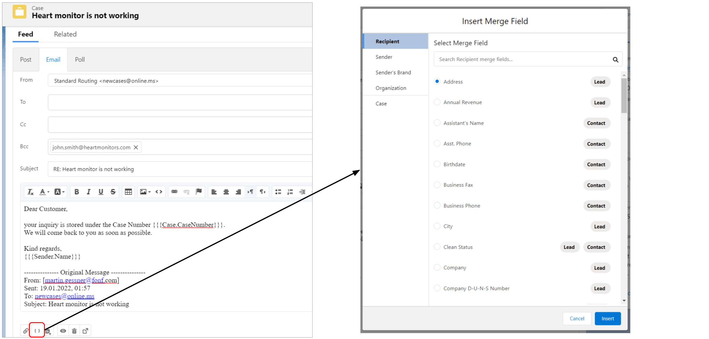

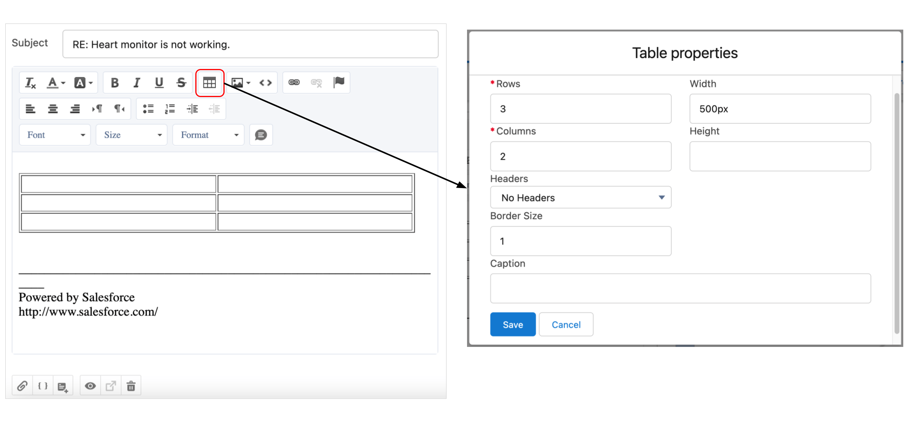
