# Productivity and Collaboration

Objective 1 - 47 questions

## Activity Settings

### Roll Up of Activities to a Contact's Primary Account

Which of the following is true about enabling the 'Roll Up of Activities to a Contact's Primary Account' feature in Activity Settings?

- Related tasks and events of the contact are displayed on the contact's primary account.

*When activities roll-up is enabled via the Activity Settings in an org, activities related to the contact will also be displayed in the primary account of the contact.*

*Activity details related to the contact will always be displayed in the activity feed of the contact, whether or not the activities roll-up feature is enabled. Tasks and events related to the contact cannot be automatically assigned to the account owner using this feature. Activity field values cannot be aggregated at the related account record using this option. When the roll-up activities setting is changed, only the new activities are affected. Existing activities are only affected if they are updated in a way that triggers a recalculation of the roll-up, e.g. when an activity is closed.*

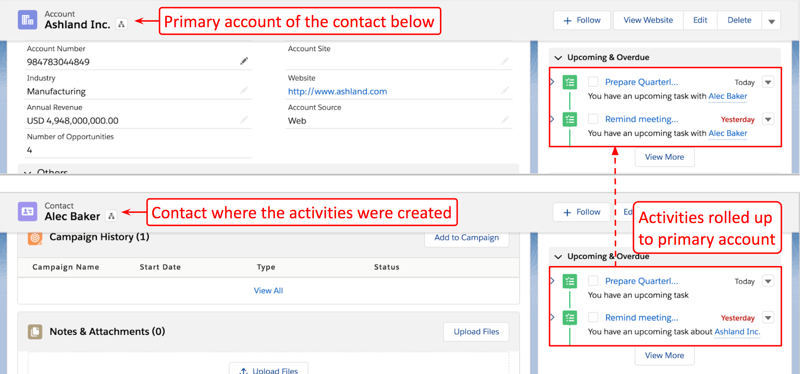](images/clipboard-845568327.png)

### Enable Group Task

The Sales Manager has informed the Salesforce Administrator that there is a need to be able to assign a task to a group of users. Which of the following statements are true regarding group tasks that the Salesforce Administrator should tell the Sales Manager?

- Each member of the group is assigned a copy of the task.

- Group task are enabled by default in Lightning Experience.

*When creating a task, up to 200 users can be assigned an independent copy of the same task. Groups tasks are enabled by default in Lightning Experience.*

*Personal groups are a convenient way to organize users into groups that are meaningful, but group tasks are not only created for personal groups. Tasks are created only for the active members in public groups.*

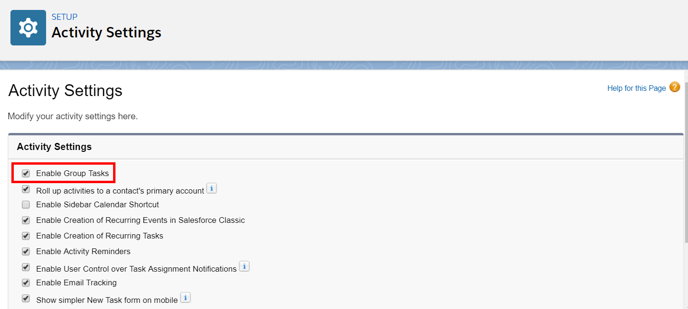

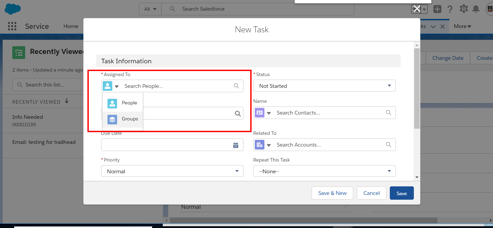

United Technologies is rolling out a large new initiative and management needs to know how many users can be added to a group task in Lightning Experience. How many users should the administrator state?

- 200

In Lightning Experience group tasks can be assigned to up to 200 users and each user will be assigned an independent copy of the task.

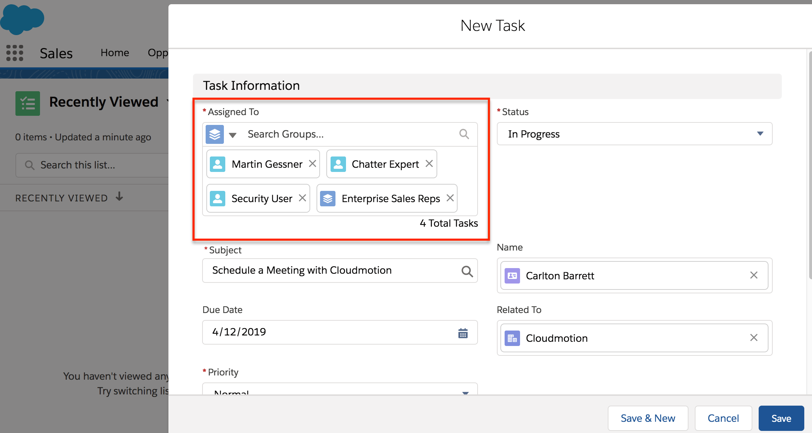

### Allow Users to Relate Multiple Contacts to Task and Events

The administrator is made aware of a requirement for sales reps to allow multiple contacts to be related to an activity. Shared Activities lets users relate events to how many contacts?

- 50

The sales reps will be able to relate up to 50 contacts to each event or task. This must first be enabled in Setup under Activity Settings.

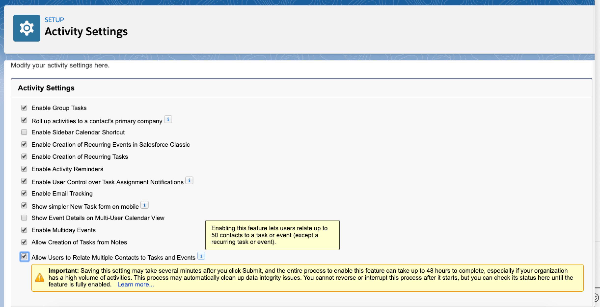

A user has asked how they can find a list of their activities as they cannot find an Activities tab in Lightning Experience. Which of the following options make it possible for the Salesforce Administrator to assist the user with this requirement?

- Advise the user to access the Tasks tab, Calendar tab, or Activity timeline.

- Ask a developer to create a new tab to display Activities.

- Look for an AppExchange app that adds an Activity tab.

*Salesforce standard functionality allows access to activities using the Activity Timeline, and the Calendar and Tasks tabs. It is also simple for a developer to create a page and a tab that lists all activities. There are also a number of AppExchange apps that add Activity tabs and views. A custom object tab cannot be created for Activities since Activities include Tasks, Events, and Calendars, which are not custom objects.*

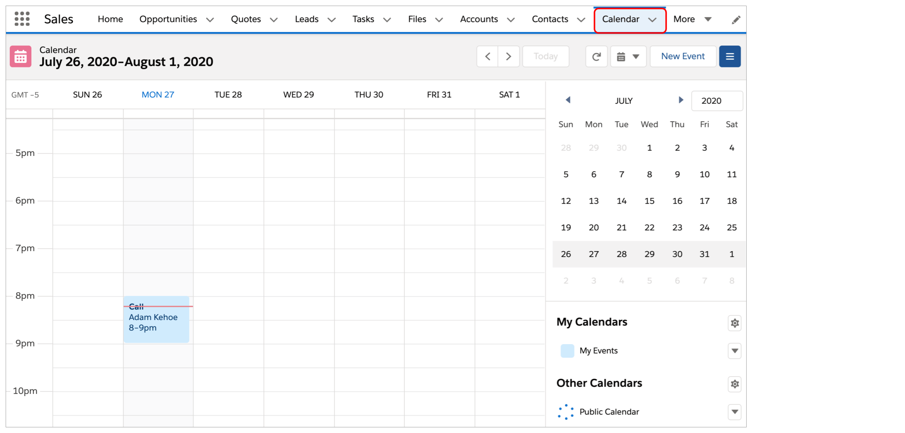

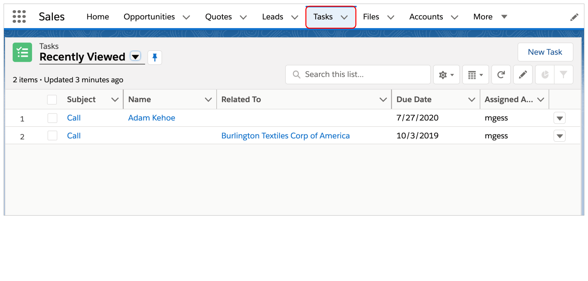

## Primary Contact

How many contacts on shared Activities can a user make as a primary contact?

- 1

Only one contact can be marked as the primary. A user must designate one contact as the primary contact on the activity. If the user deletes the primary contact, the next contact on the activity's related list becomes the new primary contact. Users can also manually edit the activity to select a primary contact.

## Chatter

A SystemSilo director wants his managers to be able to create Chatter groups for their respective teams. Preferably, he wants the groups' details to only be visible to the groups' members and himself. He wants to be able to manage all of these groups as well. He does not want any user outside of a group to be able to delete anything on the content feed. What would a Salesforce Administrator do to accommodate this request?

- Enable Unlisted Groups in Chatter Settings.

- Ensure that the director has the 'Manage Unlisted Groups' permission.

*Unlisted groups offer more privacy than private groups. A private group would not meet the requirements as details such as group name, description, and member list are still visible to nonmembers. The 'View All Data' or 'Modify All Data' permission is not enough to allow nonmembers to view or update unlisted groups. Only if one has the 'Manage Unlisted Groups' permission would a nonmember be able to access or modify unlisted groups and their files and feed content. In addition, only members of an unlisted group may be able to delete group feed content.*

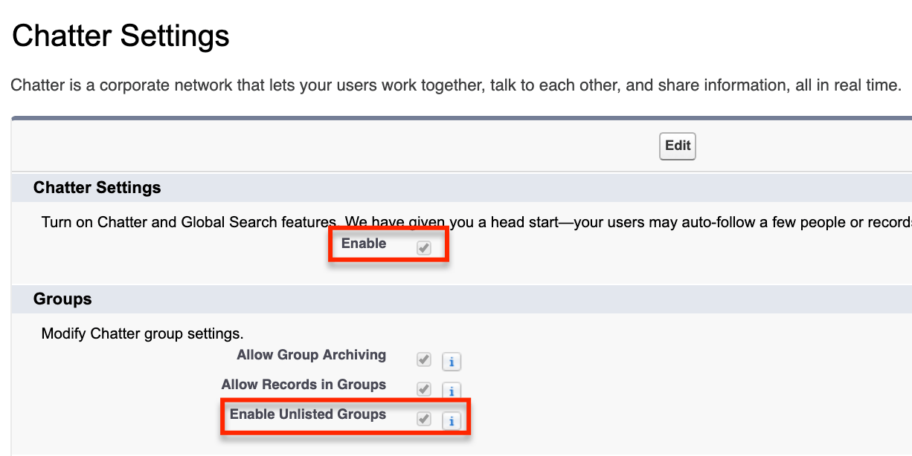

## Task

Where can tasks be created in Lightning Experience?

- 'Task' Tab

- Record Pages

- 'Global Actions' Menu

Tasks can be created by clicking the 'New Task' action in the 'Global Actions' menu. On record pages, they can be created from the 'Activity' tab. One can also navigate to the 'Tasks' tab to create a new task. The global search results page does not allow creating a new task. There is no 'Tasks' related list in Lightning Experience. Users use the Activity Timeline to track activities, i.e., tasks, events, and calendars.

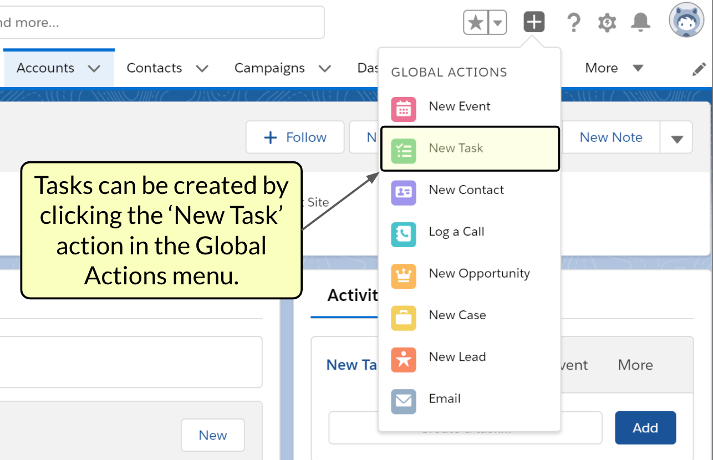

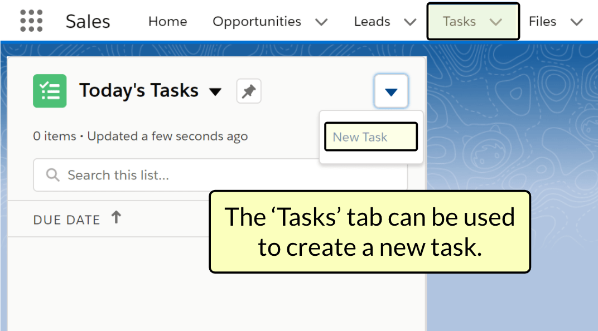](images/clipboard-896466974.png)

What is the default behavior when tasks are overdue in Salesforce?

- The overdue task is displayed with its date in red.

- A reminder is displayed the next time the user logs into Salesforce.

Salesforce displays a reminder for overdue tasks when a user logs in to Salesforce. An overdue task's date is displayed in red in the activity timeline, the task list view, the task detail view, the task Kanban view, and the task split view

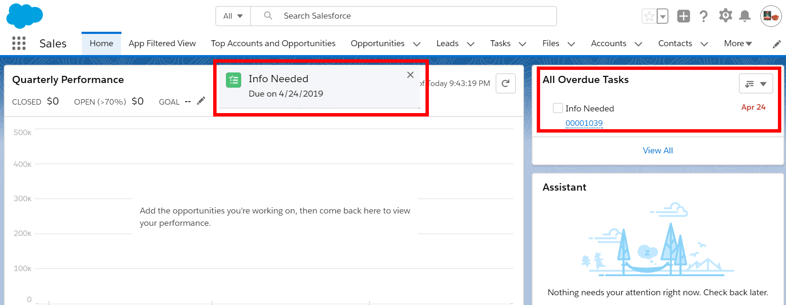

Which of the following are true regarding managing tasks in Lightning Experience?

- Task can be displayed in a table view.

- The status of a task can be changed by dragging and dropping in the Kanban view.

*In Lightning Experience, there are 3 views available: Table, Kanban, and Split. In the Kanban view, the status of the task can be updated by dragging and dropping it into another status column. In the split view, the complete list of tasks is displayed next to the detail on one task. Tasks can be deleted from the task list view.*

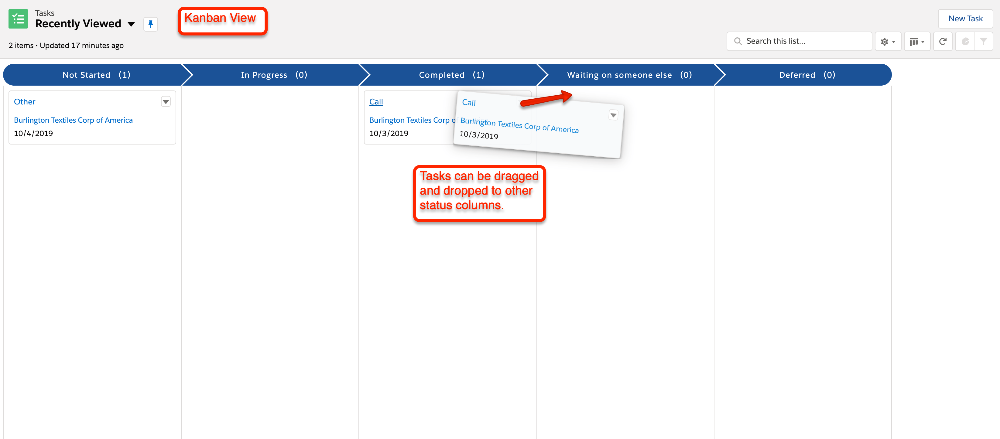

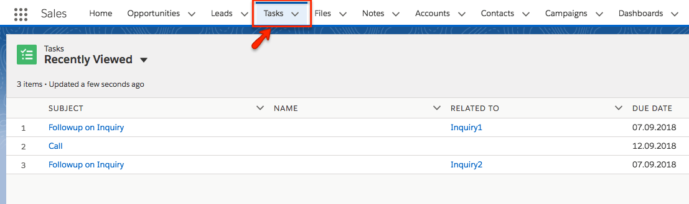

What is true regarding creating tasks in bulk in Lightning Experience?

- If a taks is assigned to multiple users, a copy of the task is created for each user.

- When a task is created it can be assigned to multiple users and groups.

*Tasks can be assigned to multiple users and groups. Each user will get their own copy of the task with their name in the Assigned To field.*

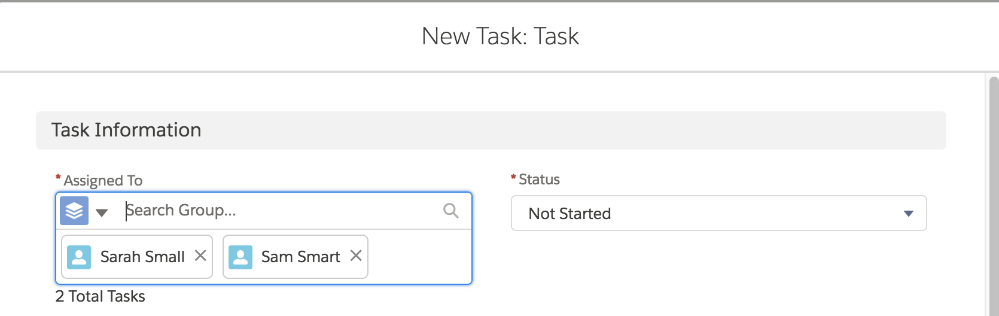

## Einstein Activity Capture

Cosmic Innovation has recently migrated to Lightning Experience, and the Salesforce Administrator has enabled 'Einstein Activity Capture'. A sales user of Cosmic Innovation has created a task related to a contact record in Salesforce. Where can this task be viewed in Lightning Experience?

- In the 'Activity Timeline' of the contact record.

- In the 'Activity Timeline' of the account record related to the contact.

- In the 'My Tasks' list of the user assigned to the task.

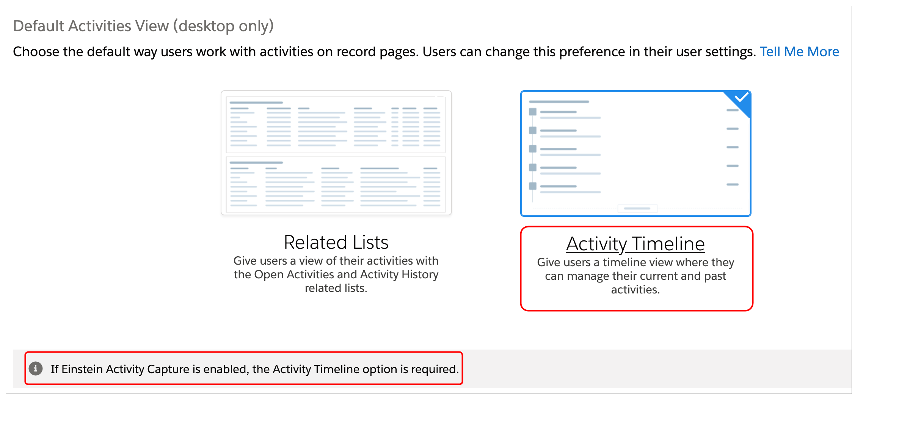

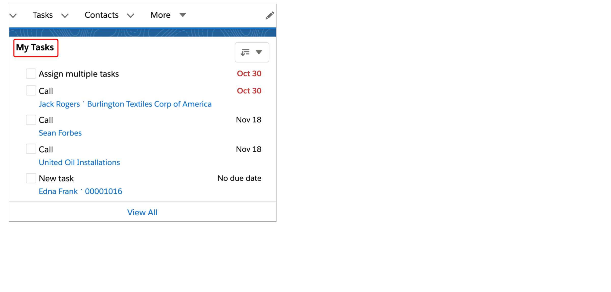](images/clipboard-2707423473.png)

Which of the following statements are true about the activity timeline in Lightning Experience?

- Emails that include commitments and objections can be automatically flagged when Einstein Activity Capture is enabled.

- Activities displayed can be filtered by date range and activity type.

- Upcoming and overdue activities can be sorted by date

*The 'Upcoming & Overdue' list in the activity timeline displays future events and upcoming tasks. Past months are used to display past meetings, sent emails, and completed tasks. A user can expand a past month (e.g., July 2021) to see which tasks were completed during that month.*

*'Upcoming & Overdue' activities can be sorted by date; activities with the oldest or newest dates can be displayed first. Overdue items are shown in red. Filters can be applied to date range and activity type.*

*When Einstein Activity Capture is enabled, email insights such as 'Commitment Made' and 'Objection Made' show that a user expressed an intention or aversion to take action. The activity timeline shows which emails include insights.*

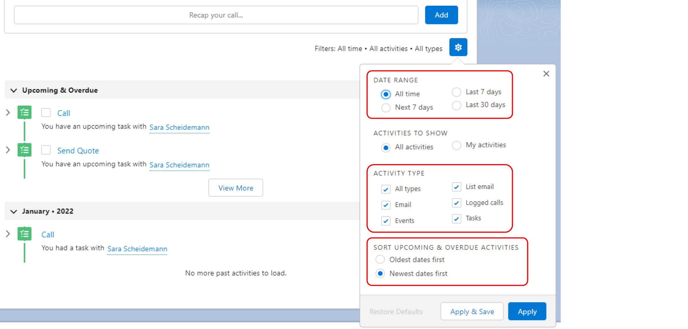

## Outlook Integration

Global Technologies wants to give its sales representatives the ability to relate emails, contacts, and events in Microsoft Outlook and Microsoft Exchange with Salesforce records. What can be configured by a Salesforce Administrator to meet this need?

- Outlook Integration

*Using Lightning Sync and Outlook Integration together is an ideal solution for customers who use Microsoft Exchange, Office 365, and Outlook. With Lightning Sync, users can sync contacts, events, or both between Microsoft Exchange and Salesforce. With Outlook Integration, users can link related emails to records in Salesforce and access Salesforce records from Outlook.*

*Beginning in Winter '21, new Salesforce customers do not have access to Lightning Sync.*

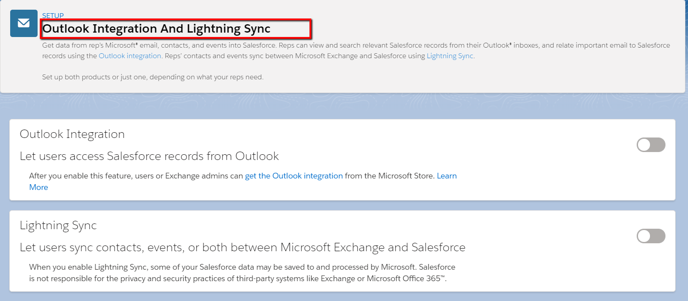

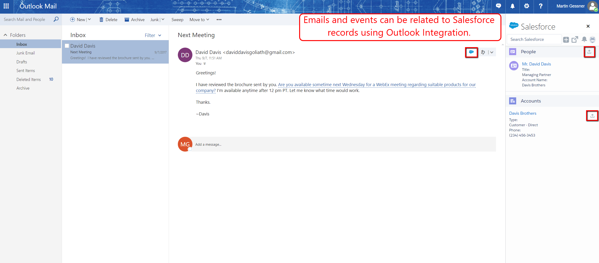

## New Custom Object

A Salesforce Administrator has created a 'Project' custom object and would also like to track Project Tasks. How can the Salesforce Administrator accomplish this?

- Check the 'Allow Activities' check box on the Project object.

The 'Allow Activities' checkbox is available in the custom object settings and will allow Activities to be associated with the custom object. If this option is selected when the object is created, an Activity section will appear in the default page layout.

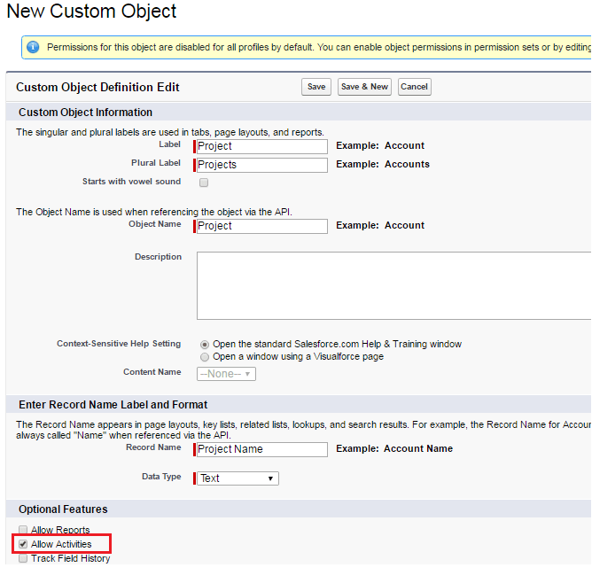

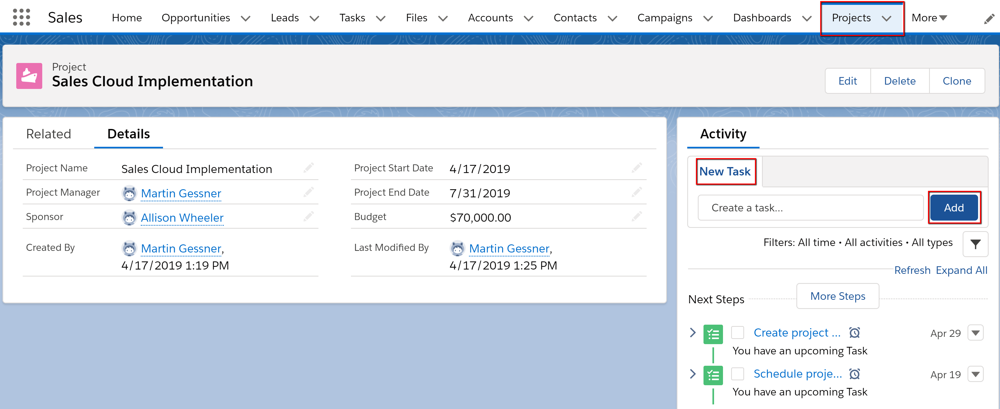

The users of Cosmic Marketing Solutions use Lightning Experience only. A Salesforce Administrator has created two custom objects, namely, Job Application and Applicant. There is a lookup relationship field on the Job Application object to the Applicant object. Users would like to be able to send an email to the applicant related to a particular job application easily. Which solutions can be utilized for this requirement?

- Create a custom 'Send Email' action and add it to the Job Application page layout.

- Enable activities on the Job Application object and use the 'Activity' tab to send the email.

In Lightning Experience, the 'Activity' tab can be used by users to send an email. A custom 'Send Email' action can also be created and added to the Job Application page layout to allow users to send emails. The email of the applicant on the job application could be used. There is no 'Email Notifications' or 'Email Tracking' functionality that can be utilized for this use case.

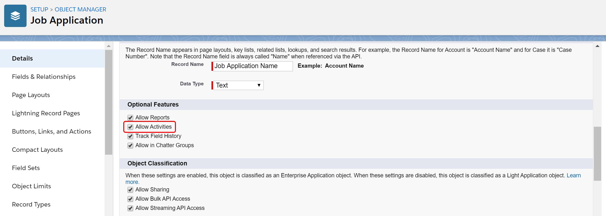

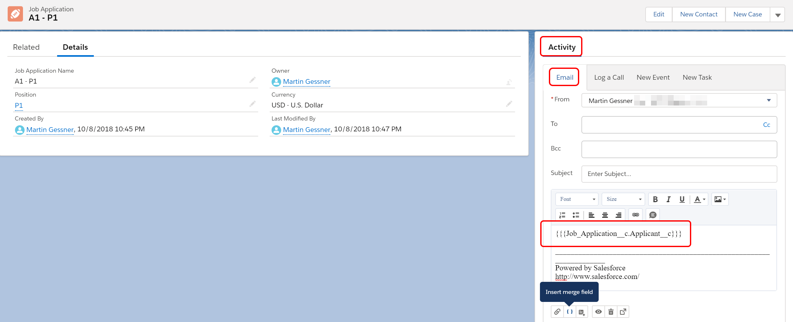

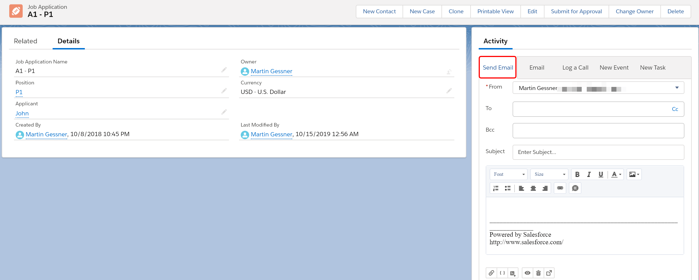

## Archived Activities

What is true regarding archived activities?

- Salesforce automatically archives activities if they meet certain criteria.

- Salesforce does not delete archived activities, but users can manually delete them.

*Salesforce automatically archives activities that meet certain criteria (e.g. closed tasks due more than 365 days ago). Once archived, they are included in data export files and users can view these.*

*Salesforce does not delete archived activities, but users can manually delete them. Currently, activity archiving is mandatory.*

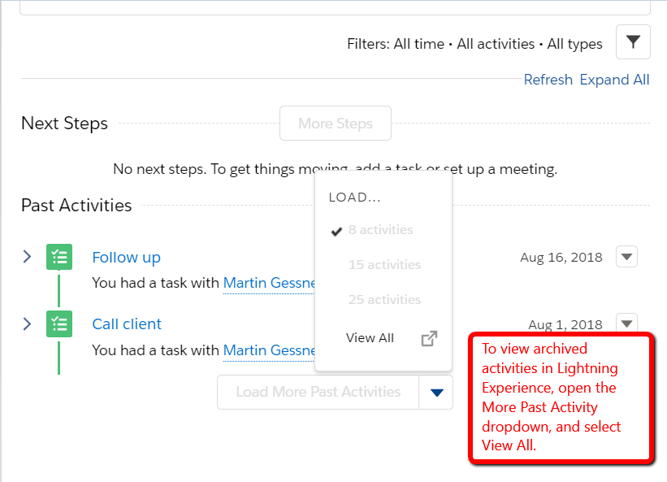

## Private Events

What is true regarding Private Events?

- The user that created the event and any user with the 'View All Data' permission can view the event.

*Private events are accessible to the user that created the event and any user that has the 'View All Data' or 'Modify All Data' permission. There are a few exceptions to role-hierarchy based sharing and these include events marked as private.*

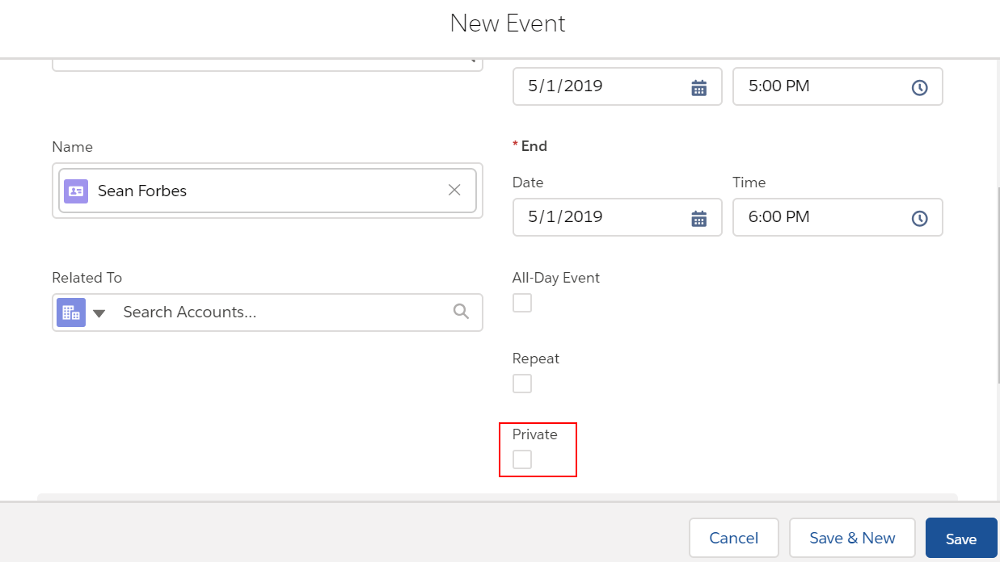

## Create Calendar from Object

What are two capabilities of the 'Create Calendar from Salesforce Object' feature?

- A Calendar can be created from a custom or standard object.

- Calendars can be customized by appying a list view.

A calendar can be created from a standard or custom object and can be customized by applying a list view. The fields that determine what data the calendar displays can be selected. Once created, the calendar can be edited and deleted.

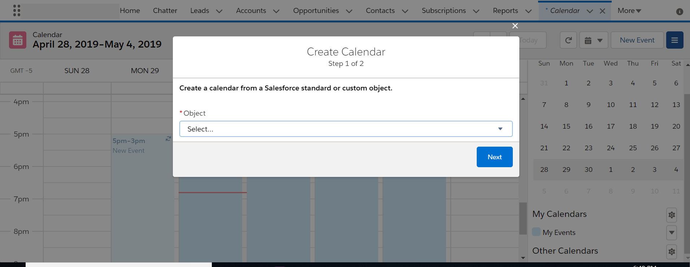

## Follow-Up Event

A sales rep of Cosmic Solutions created a task to call a contact related to the 'Edge Communications' account. He would like to follow up on the task by meeting with the contact at a particular location. Which of the following can be created in Lightning Experience to allow the sales rep to follow up and ensure that the account and contact are copied from the original task?

- Follow-Up Event

*A follow-up event can be created in Lightning Experience to follow up on an existing task. The key information is copied from the original task so sales reps don't have to enter data twice. Unlike a follow-up task, a location can be specified in a follow-up event. There is no follow-up activity or record.*

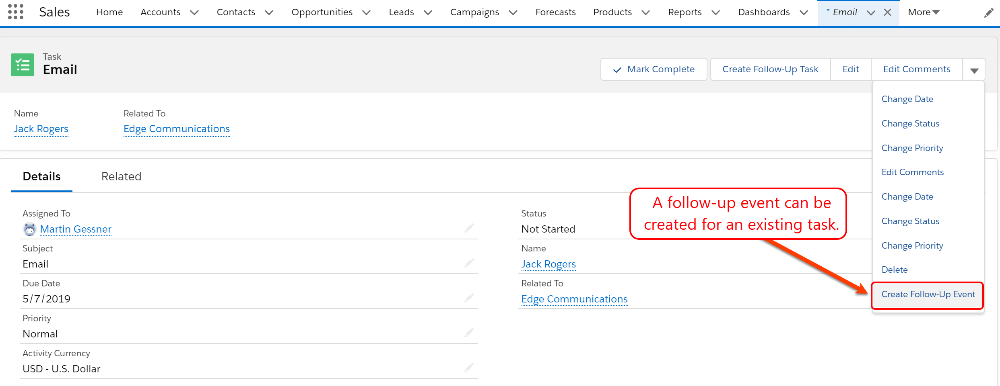

## Event

The sales users of Cosmic Enterprises use Lightning Experience to create and manage records as well as related activities. While creating an event, a sales manager of the company would like to schedule events for monthly meetings that repeat indefinitely. What can a Salesforce Administrator do to meet this requirement after reviewing options in Activity Settings?

- Add the 'Repeat' checkbox to the page layout for events.

***Sales reps can be allowed to schedule event series by adding the 'Repeat' checkbox to the Event page layout. The reps can then select 'Repeat' in order to schedule daily, weekly, monthly, or other repeating events. This feature is also called 'Event Series' in Lightning Experience, and it cannot be enabled in Activity Settings.***

*Enabling 'Recurring Events' can only be enabled in Activity Settings in Salesforce Classic, so it doesn't apply to this requirement. There is no 'Multi-Event' checkbox on the page layout for Events.*

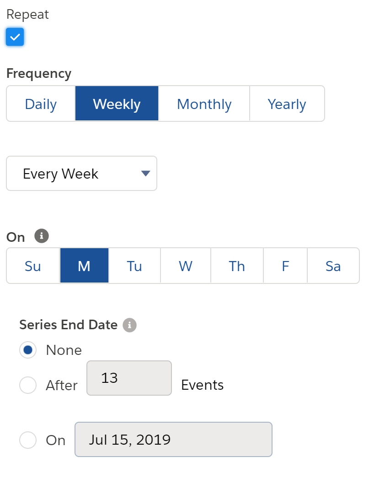{width="391"}

### Conference Room

The main office of Cosmic Solar has several conference rooms that are used for presentations and meetings. Sales users of the company use Salesforce to schedule events. While creating an event in Lightning Experience, what can a sales manager do to reserve a particular conference room for a meeting?

- Add the conference room resource as an attendee.

*Meeting resources, such as conference rooms and projectors, can be reserved for an event. A resource can be added as an attendee while creating an event. Resources can be created by navigating to 'Public Calendars and Resources' in Setup.*

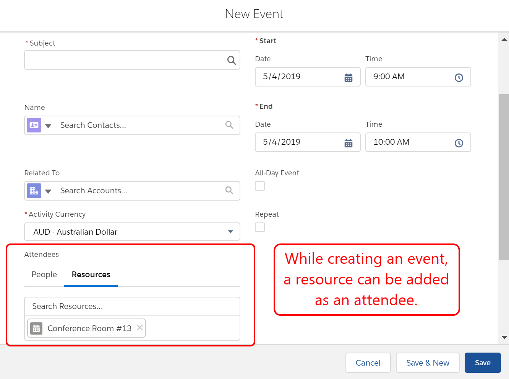

### Attendees

All the users of Cosmic Enterprises are using Lightning Experience. While creating an event, a sales representative of the company would like to add a contact and a person account as attendees to the event. What should a Salesforce Administrator do to meet this requirement?

- Add the 'Attendees' field to the Event page layout.

*The 'Attendees' field can be added to the Event page layout to allow users to add Salesforce users, contacts, person accounts, and leads to the events that they create in Lightning Experience. Setting up Lightning Sync is only required to send invitations to attendees and receive their responses. There is also no setting in 'Activity Settings' that can be enabled to allow users to add attendees.*

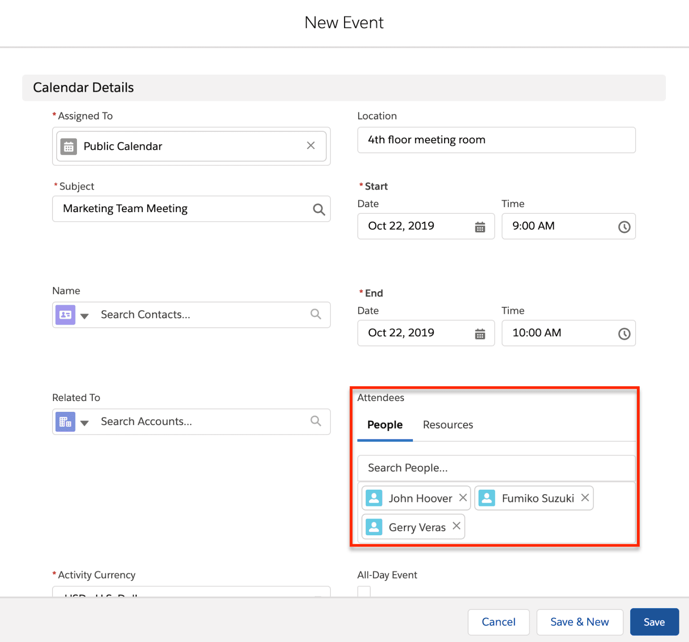

The Salesforce Administrator of Cosmic Clothing has added the 'Attendees' field to the Event page layout. A sales representative is creating an event in Lightning Experience. Which of the following can the sales rep add as 'Attendee' on the Event page layout?

- Contacts

- Leads

- Users

When creating an event in Lightning Experience, a sales representative can add Salesforce users, contacts, person accounts, and leads as attendees. Business accounts cannot be added as attendees. It is also not possible to add campaign members as attendees

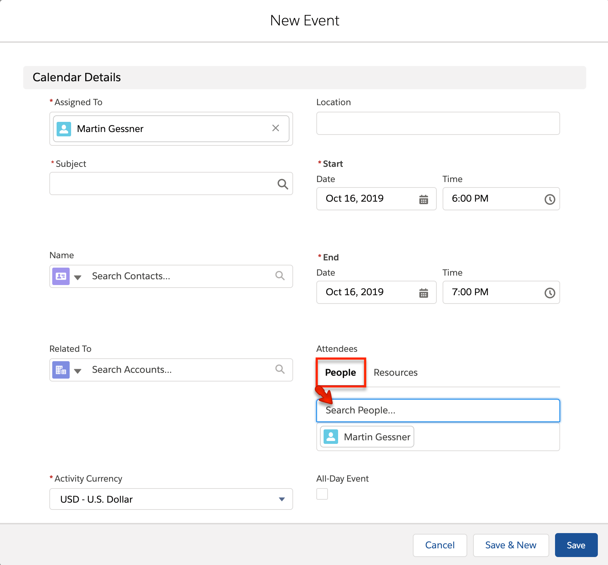

## Public Calendar

The sales reps of Cosmic Solutions use Lightning Experience. One of the sales managers has created a sales team that consists of five sales reps. These sales reps should be able to view, schedule, and update shared events without switching to Salesforce Classic. Which feature can be utilized for this use case?

- Public Calendar.

Public calendars can be used to manage group activities, such as scheduling a common event. Everyone who shares the public calendar can view, schedule, and update events without switching to Salesforce Classic.

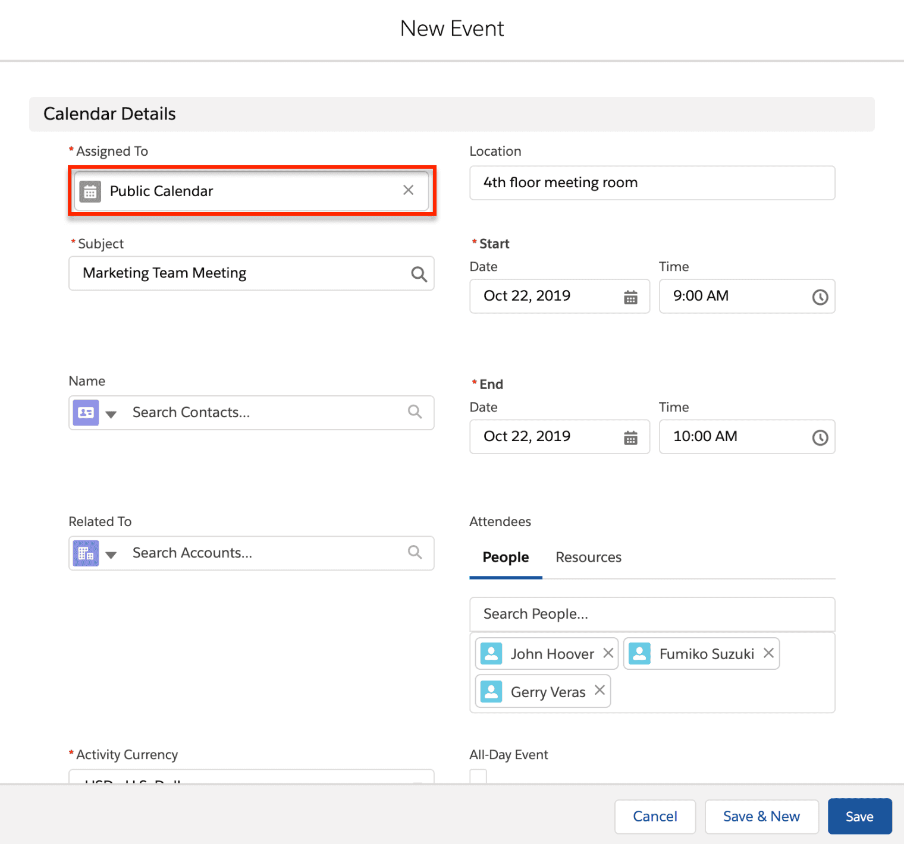](images/clipboard-248816304.png)
