# Productivity and Collaboration

Objective 1 - 47 questions

## Activity Settings

### Roll Up of Activities to a Contact's Primary Account

Which of the following is true about enabling the 'Roll Up of Activities to a Contact's Primary Account' feature in Activity Settings?

- Related tasks and events of the contact are displayed on the contact's primary account.

*When activities roll-up is enabled via the Activity Settings in an org, activities related to the contact will also be displayed in the primary account of the contact.*

*Activity details related to the contact will always be displayed in the activity feed of the contact, whether or not the activities roll-up feature is enabled. Tasks and events related to the contact cannot be automatically assigned to the account owner using this feature. Activity field values cannot be aggregated at the related account record using this option. When the roll-up activities setting is changed, only the new activities are affected. Existing activities are only affected if they are updated in a way that triggers a recalculation of the roll-up, e.g. when an activity is closed.*

](images/clipboard-845568327.png)

### Enable Group Task

The Sales Manager has informed the Salesforce Administrator that there is a need to be able to assign a task to a group of users. Which of the following statements are true regarding group tasks that the Salesforce Administrator should tell the Sales Manager?

- Each member of the group is assigned a copy of the task.

- Group task are enabled by default in Lightning Experience.

*When creating a task, up to 200 users can be assigned an independent copy of the same task. Groups tasks are enabled by default in Lightning Experience.*

*Personal groups are a convenient way to organize users into groups that are meaningful, but group tasks are not only created for personal groups. Tasks are created only for the active members in public groups.*

United Technologies is rolling out a large new initiative and management needs to know how many users can be added to a group task in Lightning Experience. How many users should the administrator state?

- 200

In Lightning Experience group tasks can be assigned to up to 200 users and each user will be assigned an independent copy of the task.

### Allow Users to Relate Multiple Contacts to Task and Events

The administrator is made aware of a requirement for sales reps to allow multiple contacts to be related to an activity. Shared Activities lets users relate events to how many contacts?

- 50

The sales reps will be able to relate up to 50 contacts to each event or task. This must first be enabled in Setup under Activity Settings.

A user has asked how they can find a list of their activities as they cannot find an Activities tab in Lightning Experience. Which of the following options make it possible for the Salesforce Administrator to assist the user with this requirement?

- Advise the user to access the Tasks tab, Calendar tab, or Activity timeline.

- Ask a developer to create a new tab to display Activities.

- Look for an AppExchange app that adds an Activity tab.

*Salesforce standard functionality allows access to activities using the Activity Timeline, and the Calendar and Tasks tabs. It is also simple for a developer to create a page and a tab that lists all activities. There are also a number of AppExchange apps that add Activity tabs and views. A custom object tab cannot be created for Activities since Activities include Tasks, Events, and Calendars, which are not custom objects.*

## Activity Management

A salesforce consultant working for Cosmic Solutions has configured Gmail Integration to improve the productivity of the sales reps who use Google Calendar to manage events. Information about the events they attend should be stored in Salesforce. Which of the following capabilities are available for manually logging events from Gmail to Salesforce?

- Attendees are captured on the SF event record when an eventis manually logged.

- Matching contact records are automatically selected if Salesforce is set up for shared activities.

- An event can be manually logged to one lead record.

\***When an event is logged manually from Gmail using Gmail Integration, any matching contact records are automatically selected if Salesforce is set up for shared activities.\
An administrator must ensure that 'Allow Users to Relate Multiple Contacts to Tasks and Events' is enabled on the 'Activity Settings' page in Salesforce Setup.\
It is possible to log an event to up to 50 contacts or one lead. \***

***However, the integration only shows the first 15 matching records in the order the attendees appear in the event.***

*All attendees from an invitation can be included on the Salesforce event record by making sure that the 'Attendees' field is available on the page layouts for the Event object in Salesforce.*

*It is not possible to log events to internal users. And one can log only nonrecurring, public events.*

The sales reps of Cosmic Innovation use Outlook to schedule non-recurring meetings with customers and internal users. An event representing a meeting often contains multiple customers from different organizations as attendees. Each customer has a contact record in Salesforce. The sales managers would like to view information about events attended by customers and internal users in Salesforce. Outlook Integration has been configured to allow sales reps to log Outlook events to Salesforce records. Which of the following are valid considerations for using Outlook Integration to manually log events to records in Salesforce?

- An event can be logged to up to 50 contacts, but only the first 15 matching contacts are displayed.

- Matching contact records are automatically selected if SF is set up for shared activities.

When a user manually logs an event using Outlook Integration, all the matching contact records shown are automatically selected if Salesforce is set up for shared activities. An administrator must enable 'Allow Users to Relate Multiple Contacts to Tasks and Events' in 'Activity Settings'. An event can be logged to up to 50 contacts or one lead. Only the first 15 matching contact records are displayed in the order the attendees appear in the event. All the attendees on the event, including internal users, are listed on the event record in Salesforce. It is not possible to log an event to an internal user. However, users with a matching email address on the event are included in the related records list.

<https://help.salesforce.com/s/articleView?id=sales.email_int_user_view_work_log_events.htm&type=5>

### Last Email Received Date \| Last Email Sent Date

Cosmic Solutions uses Einstein Activity Capture to sync emails, events, and contacts between sales users' connected Microsoft and Gmail accounts and Salesforce. For instance, emails that users send and receive are automatically captured and added to the activity timeline of related records, including accounts, contacts, and leads. The sales director would like to view a report that shows email activity metrics, such as the date when the most recent email was received and the date when the most recent email was sent. Which of the following are valid activity metric fields that can be added to a report for this requirement?

- Last Email Received Date

- Last Email Sent Date

***‘Last Email Sent Date’ and ‘Last Email Received Date’ are valid activity metric fields currently available through Einstein Activity Capture. However, as announced in the Salesforce release notes, Activity Metrics are scheduled for retirement beginning Summer '26. Organizations should begin transitioning to supported reporting solutions such as standard reports, SOQL queries, dashboards, and APIs.***

*Fields like ‘Latest Email Sent Date’ and ‘Latest Email Received Date’ are not valid and do not exist in the current reporting model.*

<https://help.salesforce.com/s/articleView?language=es&id=sf.aac_activity_metrics_fields.htm&type=5>

### 'To Do List'

The Salesforce Administrator of Cosmic Electronics is building a custom app for account management. The administrator would like to add the utility bar to give users quick access to common productivity tools. Which actions can a user perform using the 'To Do List' item which appears by default in the utility bar?

- Create labels

- Reorder Tasks

- Create Tasks

The 'To Do List' component is a default item in the utility bar that allows users to view, sort, label, and act on their tasks, including tasks from Sales Engagement cadences. They can also re-order by dragging and dropping them. Users can create new tasks and create new labels from this component. However, the component does not allow the creation of Salesforce meetings or logging of a call.

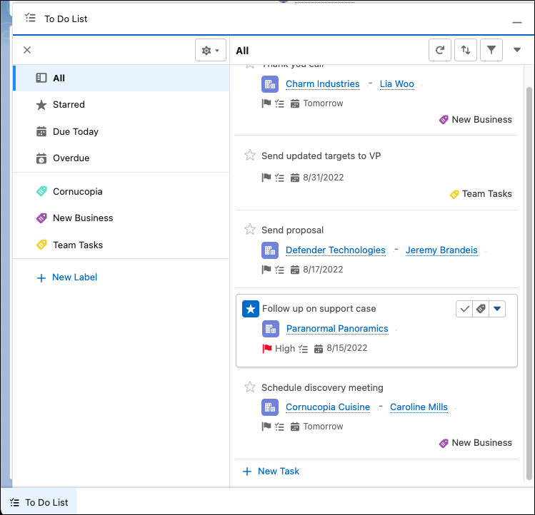

<https://help.salesforce.com/s/articleView?id=release-notes.rn_sales_productivity_to_do_list.htm&release=240&type=5>

## Primary Contact

How many contacts on shared Activities can a user make as a primary contact?

- 1

Only one contact can be marked as the primary. A user must designate one contact as the primary contact on the activity. If the user deletes the primary contact, the next contact on the activity's related list becomes the new primary contact. Users can also manually edit the activity to select a primary contact.

## Chatter

A SystemSilo director wants his managers to be able to create Chatter groups for their respective teams. Preferably, he wants the groups' details to only be visible to the groups' members and himself. He wants to be able to manage all of these groups as well. He does not want any user outside of a group to be able to delete anything on the content feed. What would a Salesforce Administrator do to accommodate this request?

- Enable Unlisted Groups in Chatter Settings.

- Ensure that the director has the 'Manage Unlisted Groups' permission.

*Unlisted groups offer more privacy than private groups. A private group would not meet the requirements as details such as group name, description, and member list are still visible to nonmembers. The 'View All Data' or 'Modify All Data' permission is not enough to allow nonmembers to view or update unlisted groups. Only if one has the 'Manage Unlisted Groups' permission would a nonmember be able to access or modify unlisted groups and their files and feed content. In addition, only members of an unlisted group may be able to delete group feed content.*

## Task

Where can tasks be created in Lightning Experience?

- 'Task' Tab

- Record Pages

- 'Global Actions' Menu

Tasks can be created by clicking the 'New Task' action in the 'Global Actions' menu. On record pages, they can be created from the 'Activity' tab. One can also navigate to the 'Tasks' tab to create a new task. The global search results page does not allow creating a new task. There is no 'Tasks' related list in Lightning Experience. Users use the Activity Timeline to track activities, i.e., tasks, events, and calendars.

](images/clipboard-896466974.png)

What is the default behavior when tasks are overdue in Salesforce?

- The overdue task is displayed with its date in red.

- A reminder is displayed the next time the user logs into Salesforce.

Salesforce displays a reminder for overdue tasks when a user logs in to Salesforce. An overdue task's date is displayed in red in the activity timeline, the task list view, the task detail view, the task Kanban view, and the task split view

Which of the following are true regarding managing tasks in Lightning Experience?

- Task can be displayed in a table view.

- The status of a task can be changed by dragging and dropping in the Kanban view.

*In Lightning Experience, there are 3 views available: Table, Kanban, and Split. In the Kanban view, the status of the task can be updated by dragging and dropping it into another status column. In the split view, the complete list of tasks is displayed next to the detail on one task. Tasks can be deleted from the task list view.*

What is true regarding creating tasks in bulk in Lightning Experience?

- If a taks is assigned to multiple users, a copy of the task is created for each user.

- When a task is created it can be assigned to multiple users and groups.

*Tasks can be assigned to multiple users and groups. Each user will get their own copy of the task with their name in the Assigned To field.*

## Einstein Activity Capture

Cosmic Innovation has recently migrated to Lightning Experience, and the Salesforce Administrator has enabled 'Einstein Activity Capture'. A sales user of Cosmic Innovation has created a task related to a contact record in Salesforce. Where can this task be viewed in Lightning Experience?

- In the 'Activity Timeline' of the contact record.

- In the 'Activity Timeline' of the account record related to the contact.

- In the 'My Tasks' list of the user assigned to the task.

](images/clipboard-2707423473.png)

Which of the following statements are true about the activity timeline in Lightning Experience?

- Emails that include commitments and objections can be automatically flagged when Einstein Activity Capture is enabled.

- Activities displayed can be filtered by date range and activity type.

- Upcoming and overdue activities can be sorted by date

*The 'Upcoming & Overdue' list in the activity timeline displays future events and upcoming tasks. Past months are used to display past meetings, sent emails, and completed tasks. A user can expand a past month (e.g., July 2021) to see which tasks were completed during that month.*

*'Upcoming & Overdue' activities can be sorted by date; activities with the oldest or newest dates can be displayed first. Overdue items are shown in red. Filters can be applied to date range and activity type.*

*When Einstein Activity Capture is enabled, email insights such as 'Commitment Made' and 'Objection Made' show that a user expressed an intention or aversion to take action. The activity timeline shows which emails include insights.*

Cosmic Technologies is a software development company that has B2B customers in several countries. Sales reps of the company primarily use Gmail to communicate with customers via email. They are already using Gmail integration to see related Salesforce data while viewing emails. However, they are currently adding inbound and outbound emails and events to related records like accounts and contacts manually in Salesforce. The sales managers would like to automate this process to improve their productivity and give them access to events via standard reports in Salesforce. Sales reps should be able to easily remove their Gmail account if they do not want it to sync with Salesforce anymore. Which feature of Sales Cloud Einstein can be used for this requirement?\

- Einstein Activity Capture

***Einstein Activity Capture automatically captures emails and events from a connected Gmail account and adds them to the activity timeline of related Salesforce records, such as accounts and contacts. The automatic associations done by Einstein Activity Capture can be manually overridden on the activity timeline or in the Outlook/Gmail integration. A setting called 'Only Show Events that are Salesforce Records' can be turned on by navigating to Einstein Activity Capture \| Settings in Setup to ensure that the events on the activity timeline are Salesforce records and available in standard reports.***

*Einstein Activity Capture users can also delete Gmail accounts they no longer want to be connected to Salesforce. They can navigate to the 'Email and Calendar Accounts' page in their personal settings to delete an account that they no longer want to be connected.*

\*Einstein Insights displays insights related to accounts and opportunities. There is no feature called Einstein Automated Emails or Einstein Email Sync.\* 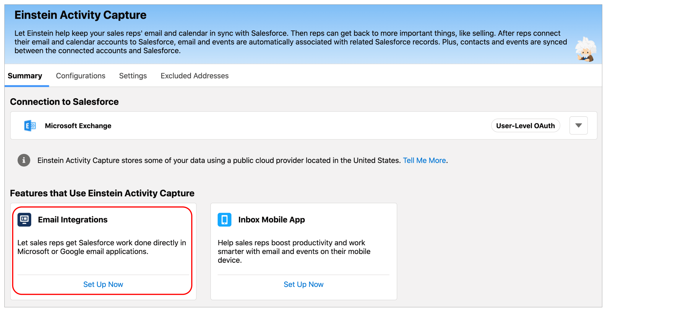

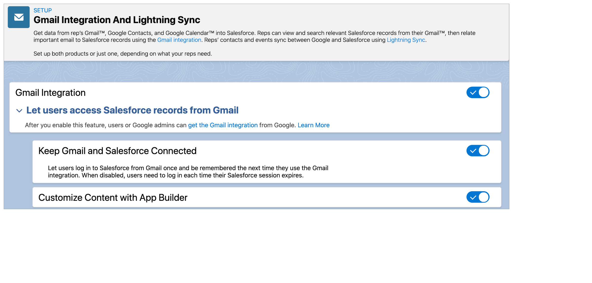

Cosmic Enterprises uses both Einstein Activity Capture and Outlook Integration. Emails that users send and receive are captured and added to the activity timeline of related records. Which of the following capabilities are available for Outlook integration users who are part of an Einstein Activity Capture configuration?

- Users can also change the associations between a captured email

### Prevent automated email replies and sensitive emails from being shared

Cosmic Electronics uses Einstein Activity Capture to keep its sales reps' emails and calendar events in sync with Salesforce. Automated email replies and emails containing sensitive information are frequently added to the activity timeline of records such as contacts and opportunities. Sales reps often share them inadvertently with other users, which is against the company's data security policy. The sales director is looking for a solution to prevent the inadvertent sharing of sensitive emails. How can the company's system administrator meet this requirement?\

- Ensure that the options to prevent automated email replies and sensitive emails from being shared are enabled in the Einstein Activity Capture settings.

In the Einstein Activity Capture settings, two options to prevent automated email replies and sensitive emails from being shared are on by default. They can be turned off, but to meet the requirement in the given scenario, the administrator must ensure that they are turned on. There are no similar options on the 'Email Settings' page in Setup. There is also no option to enable or disable 'Sensitive Email Sharing' in the activity timeline of records. It is not necessary to contact Salesforce support to meet this requirement.

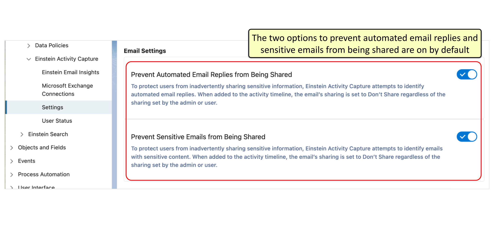

### Manage Associations Between Automatically Captured Emails and Related Records

Cosmic Express uses both Einstein Activity Capture and Gmail Integration. Gmail Integration users regularly access emails that are captured and added to the activity timeline of related records such as opportunities. Which of the following capabilities are available to them for managing email associations?

- Users can remove associations between a captured email and its related records.

- Users can add associations between a captured email and its related records.

***Gmail Integration users who are part of an Einstein Activity Capture configuration can add or remove the associations between a captured email and its related records in the activity timeline. Associations can also be modified directly from the Gmail integration.***

*Users cannot search for and add an association between two captured emails. It is only possible to search for and add an association to a more relevant record. There is no option to automatically manage email associations; Salesforce automatically relates emails to records.*

<https://help.salesforce.com/s/articleView?id=release-notes.rn_sales_eac_manage_associations_emails_records.htm&release=238&type=5>

## Outlook Integration

Global Technologies wants to give its sales representatives the ability to relate emails, contacts, and events in Microsoft Outlook and Microsoft Exchange with Salesforce records. What can be configured by a Salesforce Administrator to meet this need?

- Outlook Integration

*Using Lightning Sync and Outlook Integration together is an ideal solution for customers who use Microsoft Exchange, Office 365, and Outlook. With Lightning Sync, users can sync contacts, events, or both between Microsoft Exchange and Salesforce. With Outlook Integration, users can link related emails to records in Salesforce and access Salesforce records from Outlook.*

*Beginning in Winter '21, new Salesforce customers do not have access to Lightning Sync.*

Which of the following are limitations of synchronizing items between Salesforce and Outlook using Lightning Sync?

- Task cannot be synced

- Synced contacts cannot be deleted automatically in the other calendar application.

*Lightning Sync cannot be used with Outlook Integration to delete synced contacts automatically in both calendar applications. Private events can be synced, and synced events can be deleted in both Salesforce and Outlook automatically. Repeating events in Lightning Experience, called event series, can be synced by enabling the 'Sync event series' setting. Tasks cannot be synced using Lightning Sync. The Outlook Integration app can be used in order to work on Salesforce tasks from Outlook.*

*Note: Lightning Sync is not available for new Salesforce customers. It is recommended to use Einstein Activity Capture, a long-term solution for syncing contacts and events between Microsoft® or Google applications and Salesforce. This question is still here as the official Salesforce exam can still have questions related to Lightning Sync.*

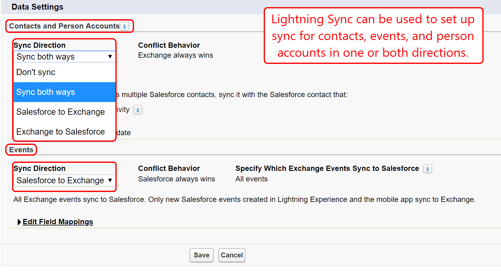

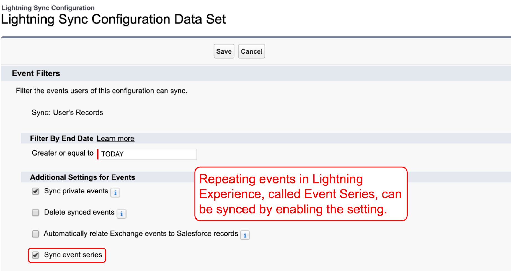

## New Custom Object

A Salesforce Administrator has created a 'Project' custom object and would also like to track Project Tasks. How can the Salesforce Administrator accomplish this?

- Check the 'Allow Activities' check box on the Project object.

The 'Allow Activities' checkbox is available in the custom object settings and will allow Activities to be associated with the custom object. If this option is selected when the object is created, an Activity section will appear in the default page layout.

The users of Cosmic Marketing Solutions use Lightning Experience only. A Salesforce Administrator has created two custom objects, namely, Job Application and Applicant. There is a lookup relationship field on the Job Application object to the Applicant object. Users would like to be able to send an email to the applicant related to a particular job application easily. Which solutions can be utilized for this requirement?

- Create a custom 'Send Email' action and add it to the Job Application page layout.

- Enable activities on the Job Application object and use the 'Activity' tab to send the email.

In Lightning Experience, the 'Activity' tab can be used by users to send an email. A custom 'Send Email' action can also be created and added to the Job Application page layout to allow users to send emails. The email of the applicant on the job application could be used. There is no 'Email Notifications' or 'Email Tracking' functionality that can be utilized for this use case.

## Archived Activities

What is true regarding archived activities?

- Salesforce automatically archives activities if they meet certain criteria.

- Salesforce does not delete archived activities, but users can manually delete them.

*Salesforce automatically archives activities that meet certain criteria (e.g. closed tasks due more than 365 days ago). Once archived, they are included in data export files and users can view these.*

*Salesforce does not delete archived activities, but users can manually delete them. Currently, activity archiving is mandatory.*

## Private Events

What is true regarding Private Events?

- The user that created the event and any user with the 'View All Data' permission can view the event.

*Private events are accessible to the user that created the event and any user that has the 'View All Data' or 'Modify All Data' permission. There are a few exceptions to role-hierarchy based sharing and these include events marked as private.*

## Create Calendar from Object

What are two capabilities of the 'Create Calendar from Salesforce Object' feature?

- A Calendar can be created from a custom or standard object.

- Calendars can be customized by appying a list view.

A calendar can be created from a standard or custom object and can be customized by applying a list view. The fields that determine what data the calendar displays can be selected. Once created, the calendar can be edited and deleted.

## Follow-Up Event

A sales rep of Cosmic Solutions created a task to call a contact related to the 'Edge Communications' account. He would like to follow up on the task by meeting with the contact at a particular location. Which of the following can be created in Lightning Experience to allow the sales rep to follow up and ensure that the account and contact are copied from the original task?

- Follow-Up Event

*A follow-up event can be created in Lightning Experience to follow up on an existing task. The key information is copied from the original task so sales reps don't have to enter data twice. Unlike a follow-up task, a location can be specified in a follow-up event. There is no follow-up activity or record.*

## Event

The sales users of Cosmic Enterprises use Lightning Experience to create and manage records as well as related activities. While creating an event, a sales manager of the company would like to schedule events for monthly meetings that repeat indefinitely. What can a Salesforce Administrator do to meet this requirement after reviewing options in Activity Settings?

- Add the 'Repeat' checkbox to the page layout for events.

***Sales reps can be allowed to schedule event series by adding the 'Repeat' checkbox to the Event page layout. The reps can then select 'Repeat' in order to schedule daily, weekly, monthly, or other repeating events. This feature is also called 'Event Series' in Lightning Experience, and it cannot be enabled in Activity Settings.***

*Enabling 'Recurring Events' can only be enabled in Activity Settings in Salesforce Classic, so it doesn't apply to this requirement. There is no 'Multi-Event' checkbox on the page layout for Events.*

{width="391"}

### Conference Room

The main office of Cosmic Solar has several conference rooms that are used for presentations and meetings. Sales users of the company use Salesforce to schedule events. While creating an event in Lightning Experience, what can a sales manager do to reserve a particular conference room for a meeting?

- Add the conference room resource as an attendee.

*Meeting resources, such as conference rooms and projectors, can be reserved for an event. A resource can be added as an attendee while creating an event. Resources can be created by navigating to 'Public Calendars and Resources' in Setup.*

### Attendees

All the users of Cosmic Enterprises are using Lightning Experience. While creating an event, a sales representative of the company would like to add a contact and a person account as attendees to the event. What should a Salesforce Administrator do to meet this requirement?

- Add the 'Attendees' field to the Event page layout.

*The 'Attendees' field can be added to the Event page layout to allow users to add Salesforce users, contacts, person accounts, and leads to the events that they create in Lightning Experience. Setting up Lightning Sync is only required to send invitations to attendees and receive their responses. There is also no setting in 'Activity Settings' that can be enabled to allow users to add attendees.*

The Salesforce Administrator of Cosmic Clothing has added the 'Attendees' field to the Event page layout. A sales representative is creating an event in Lightning Experience. Which of the following can the sales rep add as 'Attendee' on the Event page layout?

- Contacts

- Leads

- Users

When creating an event in Lightning Experience, a sales representative can add Salesforce users, contacts, person accounts, and leads as attendees. Business accounts cannot be added as attendees. It is also not possible to add campaign members as attendees

## Public Calendar

The sales reps of Cosmic Solutions use Lightning Experience. One of the sales managers has created a sales team that consists of five sales reps. These sales reps should be able to view, schedule, and update shared events without switching to Salesforce Classic. Which feature can be utilized for this use case?

- Public Calendar.

Public calendars can be used to manage group activities, such as scheduling a common event. Everyone who shares the public calendar can view, schedule, and update events without switching to Salesforce Classic.

](images/clipboard-248816304.png)

## Enhanced Email

Which of the following options allows users to add Outlook emails to Salesforce as an Email Message object and not as Tasks, using Salesforce Outlook Integration?

- Enhanced Email.

*Enhanced Email with Outlook Integration allows users to add emails from Outlook to Salesforce records as Email Message objects instead of tasks. Email to Salesforce allows automatically logging emails from third party email applications as activities on contact and lead records in Salesforce. Lightning Email Templates can be used with Outlook Integration to ensure consistent messaging to customers in order to save time.*

*Note: Lightning Sync is not supported anymore for new Salesforce customers. Einstein Activity Capture is the recommended replacement.*

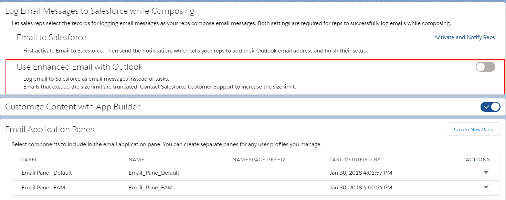

## Lightning Sync

Which of the following can be synced between Salesforce and Microsoft Exchange using Lightning Sync?

- Contacts

- Events

Lightning Sync can be used to sync contacts and events between Salesforce and Microsoft Exchange. Emails cannot be synced via Lightning Sync but can be attached to multiple contacts or records that allow activities such as Cases.

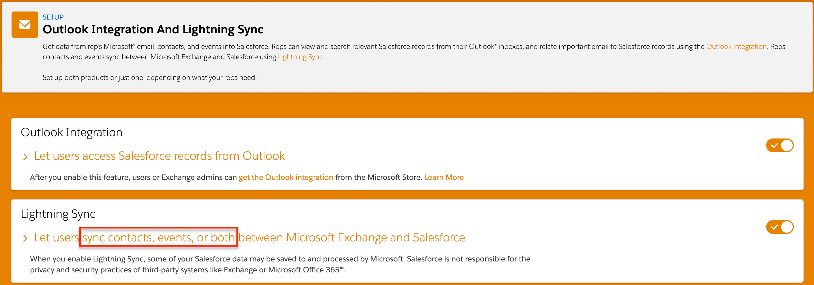

The Sales Director of Cosmic Solutions would like to increase the productivity of sales representatives by synchronizing items between Salesforce and Outlook. Which data can be synchronized using Lightning Sync with Salesforce Outlook Integration?

- Events

- Contacts

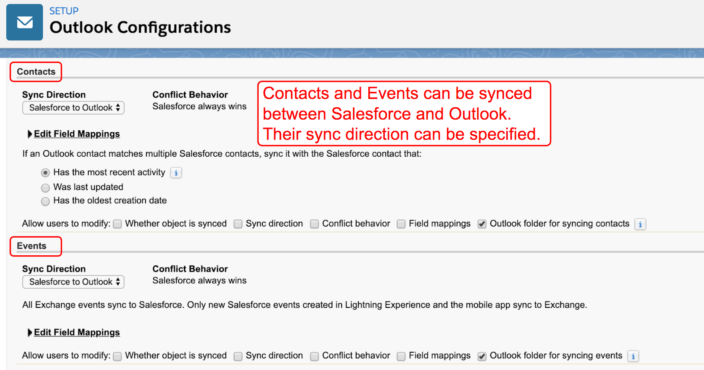

A company has field sales reps that are always on the road and use their mobile phones with the Salesforce mobile app to manage their work. Reps also use Outlook email and calendar. The sales manager would like for the reps to synchronize repeating events between Outlook and Salesforce. The company uses Lightning Experience. What does the Salesforce Administrator need to do to support this request?

- Enable 'Sync event series' in the Lightning Sync configuration.

Salesforce supports the ability to synchronize repeating events between Outlook calendars and Salesforce, including the Salesforce mobile app. However, the company needs to use Lightning Experience and Lightning Sync. Repeating events created in Salesforce Classic cannot be synchronized with Outlook calendars. Also, reps cannot turn on the repeating events sync feature in the Salesforce mobile app on their own. The Salesforce Administrator has to enable it in the Lightning Sync configuration.

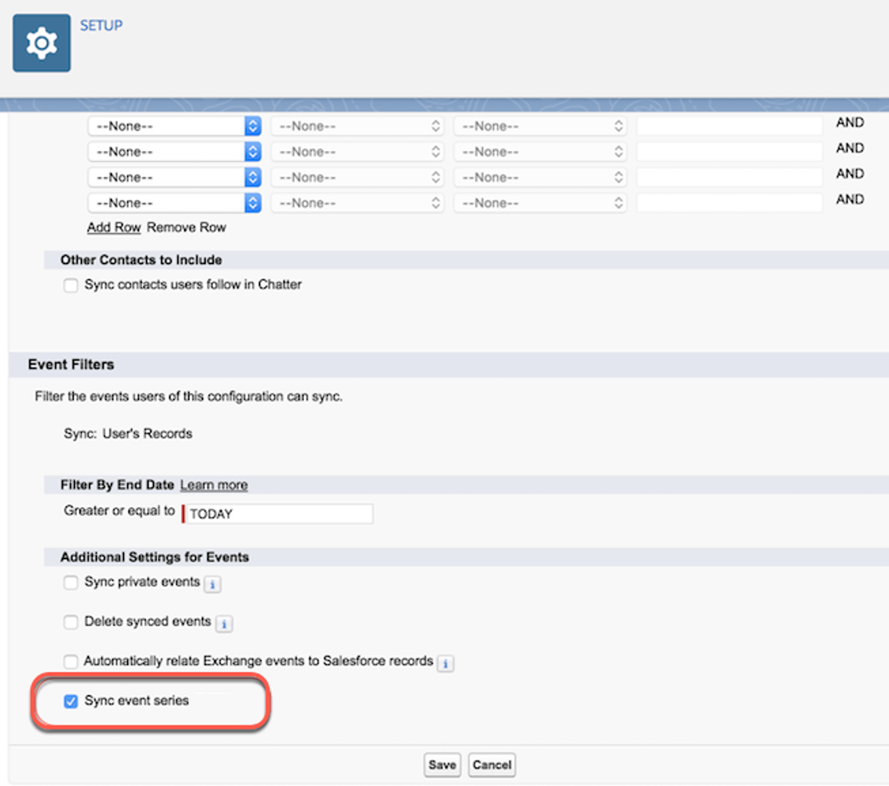

## Email to Salesforce

As part of the request for Salesforce Outlook Integration, the Sales Director of the company wants sales reps to be able to create and see related Salesforce records and automatically associate emails to them from within Outlook. In addition, the emails should be logged as email objects and not as tasks within Salesforce. Aside from enabling Salesforce Outlook Integration, what other features must be enabled or set by the administrator to fulfill these requirements?

- Enable Email to Salesforce

- Enable Enhanced Email

*Email to Salesforce is a feature which automatically relates emails to Salesforce records like contacts, leads, and opportunities. Enabling Enhanced Email would allow the reps to easily associate emails to relevant Salesforce records while still composing them. Emails would be associated as tasks in Salesforce if Enhanced Email is not enabled. Salesforce does not have an Advanced Outlook Sync feature.*

*On the other hand, email application panes are used to define the layout of components in the integration side panel. A default email pane is readily available for use and customized ones are only required for more specific usage such as when some components should not be visible for selected user profiles.*

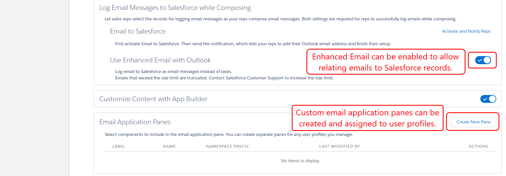

## Email Folder

A user is not able to find an email template when sending an email. What could be the reason for this?

- The user does not have access to the Email Template folder.

- The email template is not marked 'Available for Use'.

Email Templates must be set to 'Available for Use' to allow users to select them. Email templates can be made accessible to all users or only certain groups or roles by setting access to the Email Template folders.

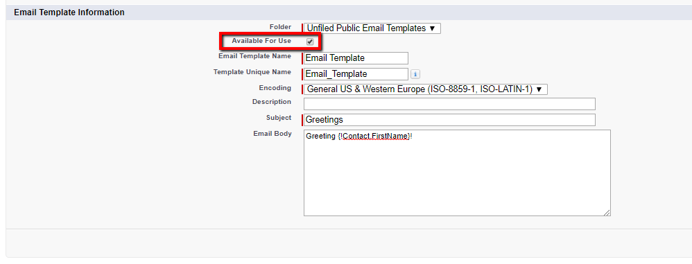

## Flow Builder

In Cosmic Glass Works, when a quote is accepted by the customer, a draft agreement and a follow-up task need to be created. What is the best way to cater to this requirement?

- Use Flow Builder to define an agreement record and task creation process.

***A record-triggered flow can be configured to automatically create a draft agreement and follow-up task when a quote is updated to an accepted status. This approach provides a declarative, efficient, and maintainable solution without requiring code.***

*An approval process automates record approvals and related notifications but cannot initiate record creation based solely on the status change of the quote in this scenario. The Quote object does not have settings for automatically generating related records, and while an Apex trigger could achieve this programmatically, a flow is the preferred declarative solution for this type of automation.*

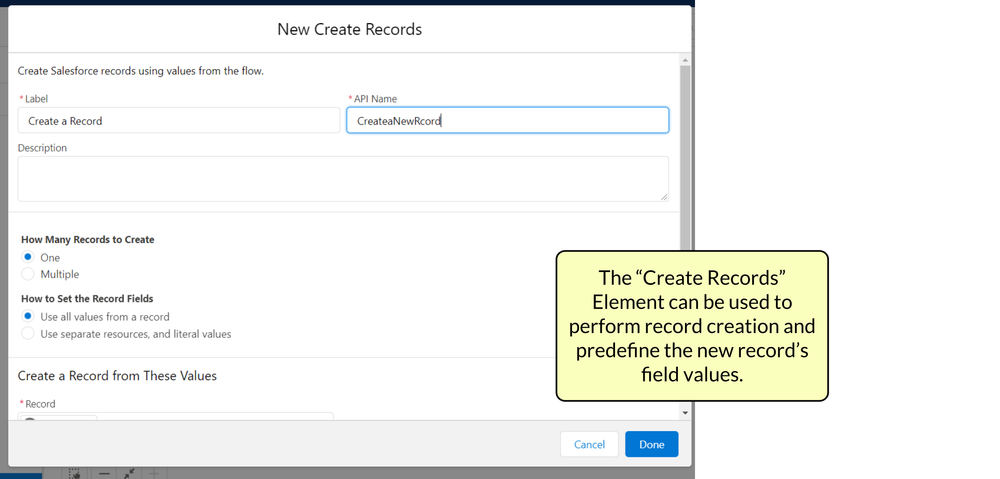

## Capabilities of Salesforce Mobile App

Which features in the Salesforce mobile app user interface can be customized to fit a company's branding?

- Brand Color

- Loading page logo

- Loading page color

***The brand color defines the base color to use for the header, buttons, search bar and other user interface elements in the Salesforce mobile app. The logo and background color of the loading page when a user logs in can also be customized.***

*Font styles and background images cannot be customized.*

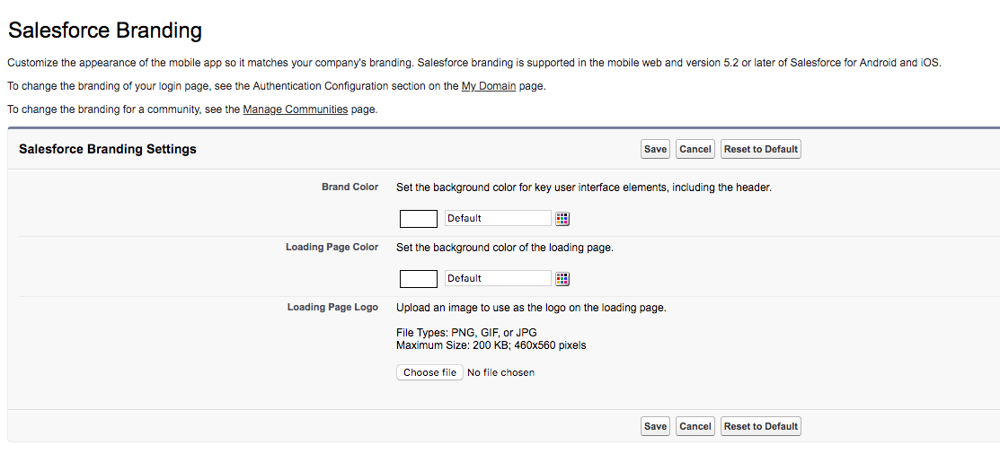

Which device and browser combination supports the full Lightning Experience desktop site by default?

- Safari on iPadOS

Safari on iPadOS is the only exception that allows for the full Lightning Experience desktop experience on a mobile device. The other options will redirect users to the Salesforce Classic UI.

<https://help.salesforce.com/s/articleView?language=en_US&id=000380219&type=1>

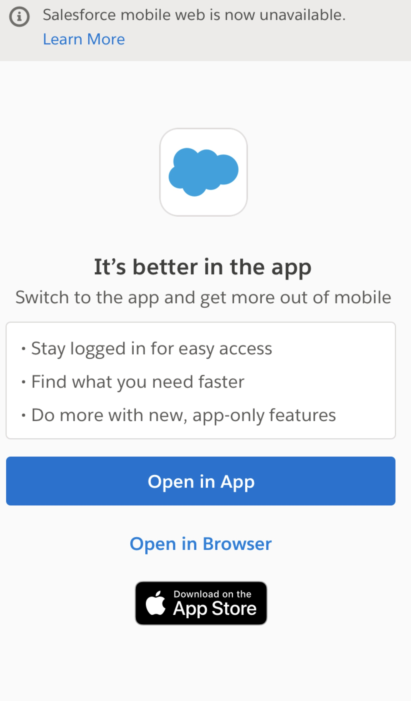{width="297"}

Which requirement must be met for a user to see a specific item within a Launchpad component?

- The user must have the permission to view the tab associated with that item

***Launchpads respect standard security. Therefore, users only see items in the Launchpad for which they have the appropriate tab visibility based on user permission settings.***

*The "Modify All Data" permission is a high-level administrative permission and is not required for standard users to view navigation links. Read access permission is required for viewing custom mobile app branding (such as logo), but it does not control the visibility of Launchpad navigation items. There is no "Public" checkbox for individual items within the Launchpad.*

<https://help.salesforce.com/s/articleView?language=en_US&id=xcloud.salesforce_app_launchpad.htm&type=5>

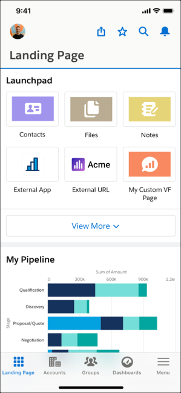

When a user accesses Salesforce through a mobile phone browser on an Android device, which interface is displayed by default?

- Salesforce Classic

***Lightning Experience is not supported on mobile web browsers for phones. Salesforce detects the mobile user agent and redirects the user to Salesforce Classic.***

*The Salesforce Mobile App interface cannot be displayed in a mobile phone browser. Lightning Web Runtime is used in Experience Cloud sites.*

<https://help.salesforce.com/s/articleView?language=en_US&id=000380219&type=1>
