# Productivity and Collaboration

# Objective 1 - 47 questions

## Activity Settings

### Roll Up of Activities to a Contact's Primary Account

Which of the following is true about enabling the 'Roll Up of Activities to a Contact's Primary Account' feature in Activity Settings?

- Related tasks and events of the contact are displayed on the contact's primary account.

*When activities roll-up is enabled via the Activity Settings in an org, activities related to the contact will also be displayed in the primary account of the contact.*

*Activity details related to the contact will always be displayed in the activity feed of the contact, whether or not the activities roll-up feature is enabled. Tasks and events related to the contact cannot be automatically assigned to the account owner using this feature. Activity field values cannot be aggregated at the related account record using this option. When the roll-up activities setting is changed, only the new activities are affected. Existing activities are only affected if they are updated in a way that triggers a recalculation of the roll-up, e.g. when an activity is closed.*

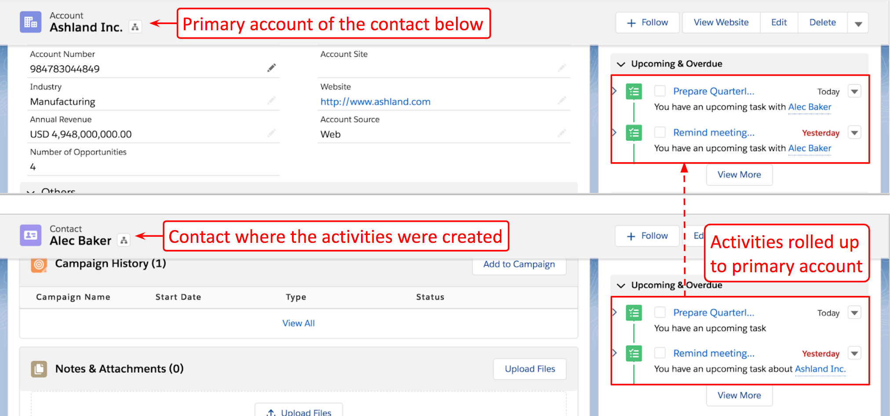](images/clipboard-845568327.png)

### Enable Group Task

The Sales Manager has informed the Salesforce Administrator that there is a need to be able to assign a task to a group of users. Which of the following statements are true regarding group tasks that the Salesforce Administrator should tell the Sales Manager?

- Each member of the group is assigned a copy of the task.

- Group task are enabled by default in Lightning Experience.

*When creating a task, up to 200 users can be assigned an independent copy of the same task. Groups tasks are enabled by default in Lightning Experience.*

*Personal groups are a convenient way to organize users into groups that are meaningful, but group tasks are not only created for personal groups. Tasks are created only for the active members in public groups.*

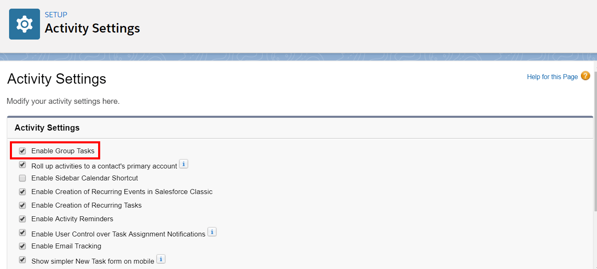

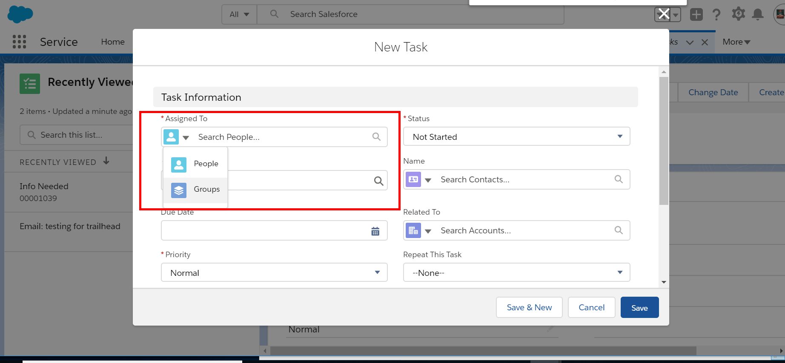

United Technologies is rolling out a large new initiative and management needs to know how many users can be added to a group task in Lightning Experience. How many users should the administrator state?

- 200

In Lightning Experience group tasks can be assigned to up to 200 users and each user will be assigned an independent copy of the task.

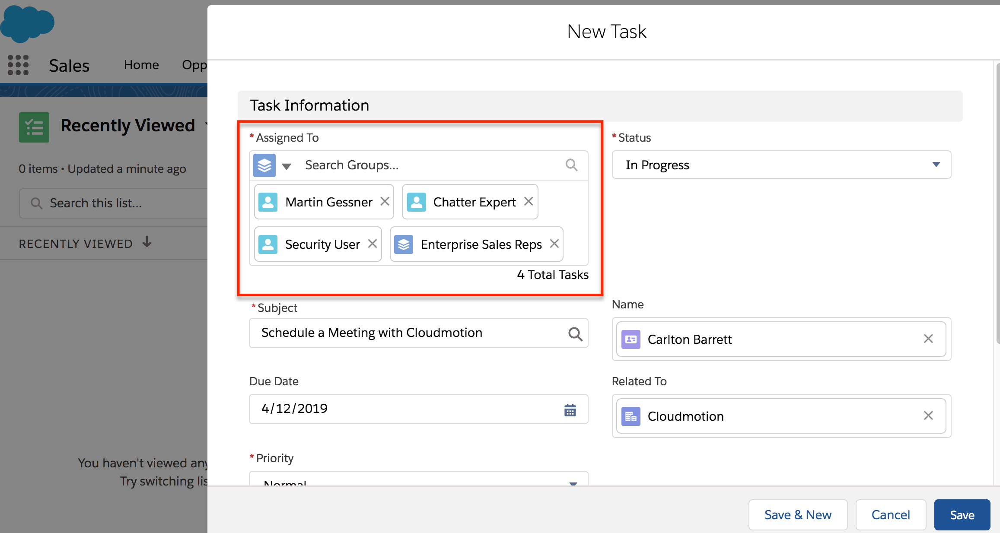

### Allow Users to Relate Multiple Contacts to Task and Events

The administrator is made aware of a requirement for sales reps to allow multiple contacts to be related to an activity. Shared Activities lets users relate events to how many contacts?

- 50

The sales reps will be able to relate up to 50 contacts to each event or task. This must first be enabled in Setup under Activity Settings.

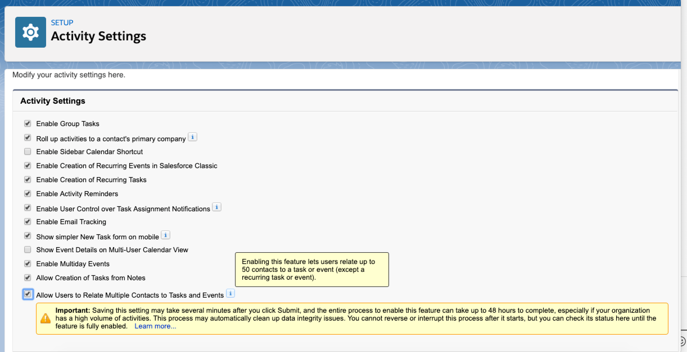

A user has asked how they can find a list of their activities as they cannot find an Activities tab in Lightning Experience. Which of the following options make it possible for the Salesforce Administrator to assist the user with this requirement?

- Advise the user to access the Tasks tab, Calendar tab, or Activity timeline.

- Ask a developer to create a new tab to display Activities.

- Look for an AppExchange app that adds an Activity tab.

*Salesforce standard functionality allows access to activities using the Activity Timeline, and the Calendar and Tasks tabs. It is also simple for a developer to create a page and a tab that lists all activities. There are also a number of AppExchange apps that add Activity tabs and views. A custom object tab cannot be created for Activities since Activities include Tasks, Events, and Calendars, which are not custom objects.*

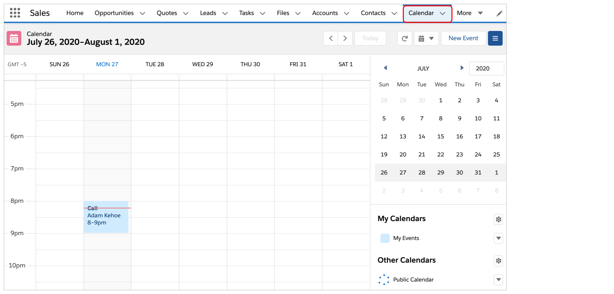

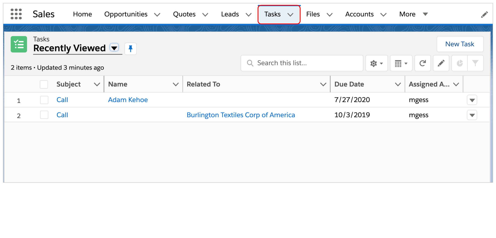

## Activity Management

A salesforce consultant working for Cosmic Solutions has configured Gmail Integration to improve the productivity of the sales reps who use Google Calendar to manage events. Information about the events they attend should be stored in Salesforce. Which of the following capabilities are available for manually logging events from Gmail to Salesforce?

- Attendees are captured on the SF event record when an eventis manually logged.

- Matching contact records are automatically selected if Salesforce is set up for shared activities.

- An event can be manually logged to one lead record.

\***When an event is logged manually from Gmail using Gmail Integration, any matching contact records are automatically selected if Salesforce is set up for shared activities.\
An administrator must ensure that 'Allow Users to Relate Multiple Contacts to Tasks and Events' is enabled on the 'Activity Settings' page in Salesforce Setup.\
It is possible to log an event to up to 50 contacts or one lead. \***

***However, the integration only shows the first 15 matching records in the order the attendees appear in the event.***

*All attendees from an invitation can be included on the Salesforce event record by making sure that the 'Attendees' field is available on the page layouts for the Event object in Salesforce.*

*It is not possible to log events to internal users. And one can log only nonrecurring, public events.*

The sales reps of Cosmic Innovation use Outlook to schedule non-recurring meetings with customers and internal users. An event representing a meeting often contains multiple customers from different organizations as attendees. Each customer has a contact record in Salesforce. The sales managers would like to view information about events attended by customers and internal users in Salesforce. Outlook Integration has been configured to allow sales reps to log Outlook events to Salesforce records. Which of the following are valid considerations for using Outlook Integration to manually log events to records in Salesforce?

- An event can be logged to up to 50 contacts, but only the first 15 matching contacts are displayed.

- Matching contact records are automatically selected if SF is set up for shared activities.

When a user manually logs an event using Outlook Integration, all the matching contact records shown are automatically selected if Salesforce is set up for shared activities. An administrator must enable 'Allow Users to Relate Multiple Contacts to Tasks and Events' in 'Activity Settings'. An event can be logged to up to 50 contacts or one lead. Only the first 15 matching contact records are displayed in the order the attendees appear in the event. All the attendees on the event, including internal users, are listed on the event record in Salesforce. It is not possible to log an event to an internal user. However, users with a matching email address on the event are included in the related records list.

<https://help.salesforce.com/s/articleView?id=sales.email_int_user_view_work_log_events.htm&type=5>

### Last Email Received Date \| Last Email Sent Date

Cosmic Solutions uses Einstein Activity Capture to sync emails, events, and contacts between sales users' connected Microsoft and Gmail accounts and Salesforce. For instance, emails that users send and receive are automatically captured and added to the activity timeline of related records, including accounts, contacts, and leads. The sales director would like to view a report that shows email activity metrics, such as the date when the most recent email was received and the date when the most recent email was sent. Which of the following are valid activity metric fields that can be added to a report for this requirement?

- Last Email Received Date

- Last Email Sent Date

***‘Last Email Sent Date’ and ‘Last Email Received Date’ are valid activity metric fields currently available through Einstein Activity Capture. However, as announced in the Salesforce release notes, Activity Metrics are scheduled for retirement beginning Summer '26. Organizations should begin transitioning to supported reporting solutions such as standard reports, SOQL queries, dashboards, and APIs.***

*Fields like ‘Latest Email Sent Date’ and ‘Latest Email Received Date’ are not valid and do not exist in the current reporting model.*

<https://help.salesforce.com/s/articleView?language=es&id=sf.aac_activity_metrics_fields.htm&type=5>

### 'To Do List'

The Salesforce Administrator of Cosmic Electronics is building a custom app for account management. The administrator would like to add the utility bar to give users quick access to common productivity tools. Which actions can a user perform using the 'To Do List' item which appears by default in the utility bar?

- Create labels

- Reorder Tasks

- Create Tasks

The 'To Do List' component is a default item in the utility bar that allows users to view, sort, label, and act on their tasks, including tasks from Sales Engagement cadences. They can also re-order by dragging and dropping them. Users can create new tasks and create new labels from this component. However, the component does not allow the creation of Salesforce meetings or logging of a call.

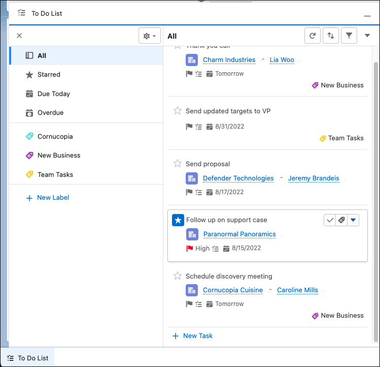

<https://help.salesforce.com/s/articleView?id=release-notes.rn_sales_productivity_to_do_list.htm&release=240&type=5>

## Primary Contact

How many contacts on shared Activities can a user make as a primary contact?

- 1

Only one contact can be marked as the primary. A user must designate one contact as the primary contact on the activity. If the user deletes the primary contact, the next contact on the activity's related list becomes the new primary contact. Users can also manually edit the activity to select a primary contact.

## Chatter

A SystemSilo director wants his managers to be able to create Chatter groups for their respective teams. Preferably, he wants the groups' details to only be visible to the groups' members and himself. He wants to be able to manage all of these groups as well. He does not want any user outside of a group to be able to delete anything on the content feed. What would a Salesforce Administrator do to accommodate this request?

- Enable Unlisted Groups in Chatter Settings.

- Ensure that the director has the 'Manage Unlisted Groups' permission.

*Unlisted groups offer more privacy than private groups. A private group would not meet the requirements as details such as group name, description, and member list are still visible to nonmembers. The 'View All Data' or 'Modify All Data' permission is not enough to allow nonmembers to view or update unlisted groups. Only if one has the 'Manage Unlisted Groups' permission would a nonmember be able to access or modify unlisted groups and their files and feed content. In addition, only members of an unlisted group may be able to delete group feed content.*

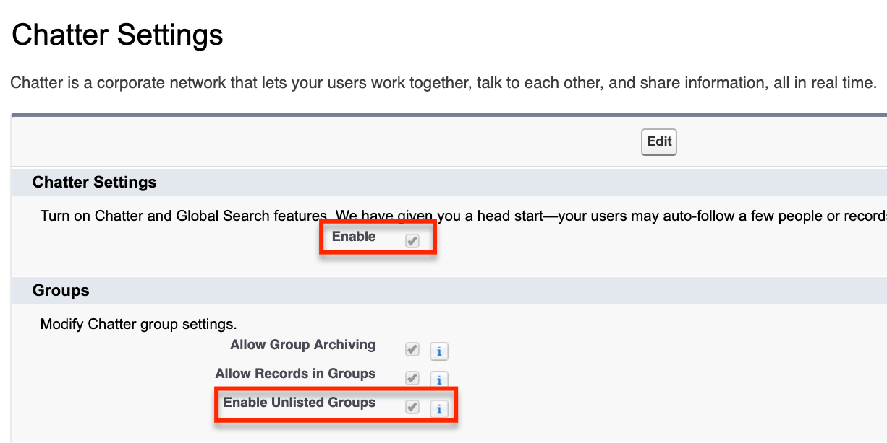

## Task

Where can tasks be created in Lightning Experience?

- 'Task' Tab

- Record Pages

- 'Global Actions' Menu

Tasks can be created by clicking the 'New Task' action in the 'Global Actions' menu. On record pages, they can be created from the 'Activity' tab. One can also navigate to the 'Tasks' tab to create a new task. The global search results page does not allow creating a new task. There is no 'Tasks' related list in Lightning Experience. Users use the Activity Timeline to track activities, i.e., tasks, events, and calendars.

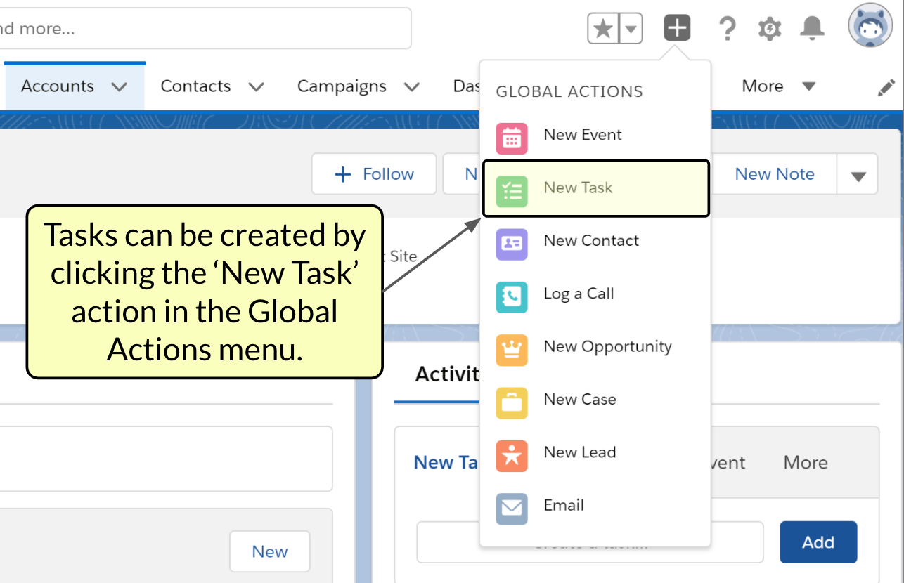

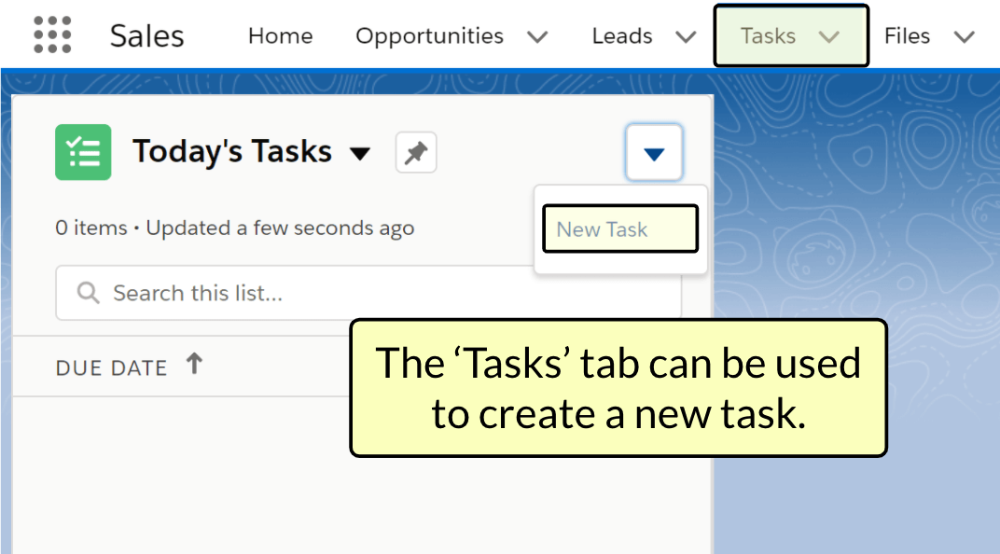](images/clipboard-896466974.png)

What is the default behavior when tasks are overdue in Salesforce?

- The overdue task is displayed with its date in red.

- A reminder is displayed the next time the user logs into Salesforce.

Salesforce displays a reminder for overdue tasks when a user logs in to Salesforce. An overdue task's date is displayed in red in the activity timeline, the task list view, the task detail view, the task Kanban view, and the task split view

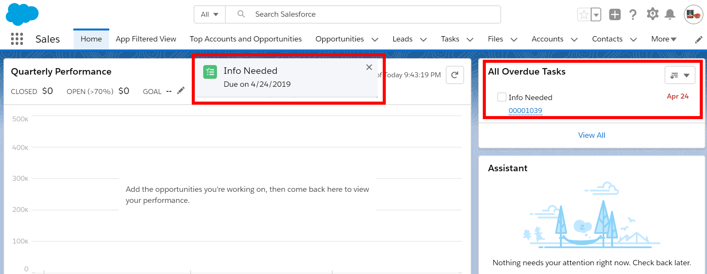

Which of the following are true regarding managing tasks in Lightning Experience?

- Task can be displayed in a table view.

- The status of a task can be changed by dragging and dropping in the Kanban view.

*In Lightning Experience, there are 3 views available: Table, Kanban, and Split. In the Kanban view, the status of the task can be updated by dragging and dropping it into another status column. In the split view, the complete list of tasks is displayed next to the detail on one task. Tasks can be deleted from the task list view.*

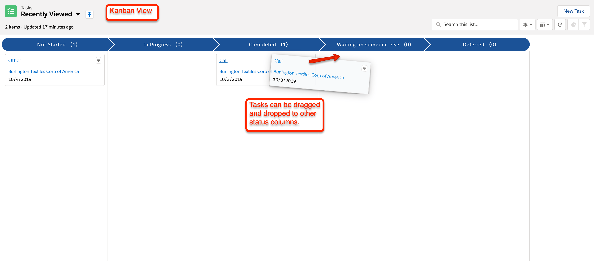

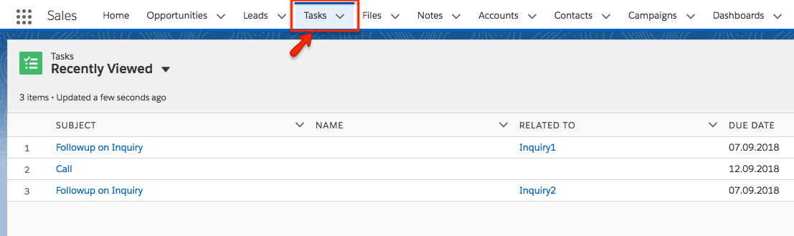

What is true regarding creating tasks in bulk in Lightning Experience?

- If a taks is assigned to multiple users, a copy of the task is created for each user.

- When a task is created it can be assigned to multiple users and groups.

*Tasks can be assigned to multiple users and groups. Each user will get their own copy of the task with their name in the Assigned To field.*

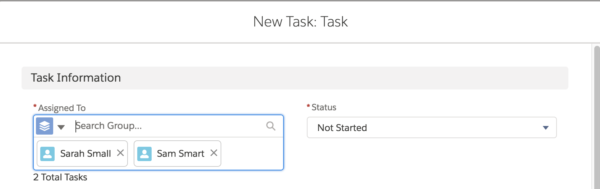

## Einstein Activity Capture

Cosmic Innovation has recently migrated to Lightning Experience, and the Salesforce Administrator has enabled 'Einstein Activity Capture'. A sales user of Cosmic Innovation has created a task related to a contact record in Salesforce. Where can this task be viewed in Lightning Experience?

- In the 'Activity Timeline' of the contact record.

- In the 'Activity Timeline' of the account record related to the contact.

- In the 'My Tasks' list of the user assigned to the task.

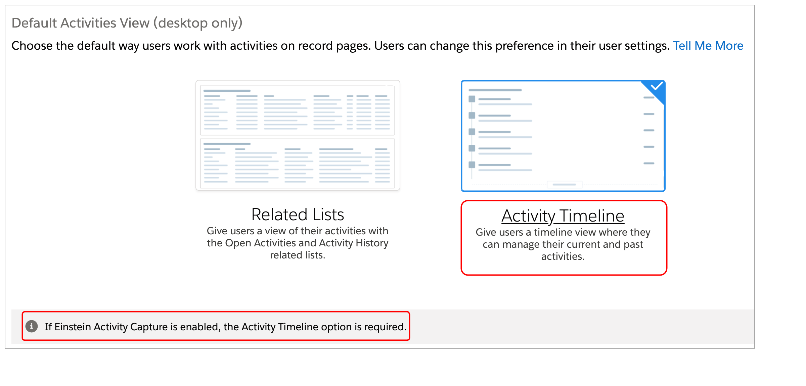

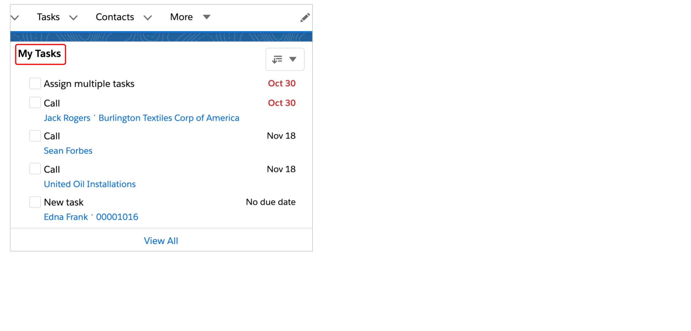](images/clipboard-2707423473.png)

Which of the following statements are true about the activity timeline in Lightning Experience?

- Emails that include commitments and objections can be automatically flagged when Einstein Activity Capture is enabled.

- Activities displayed can be filtered by date range and activity type.

- Upcoming and overdue activities can be sorted by date

*The 'Upcoming & Overdue' list in the activity timeline displays future events and upcoming tasks. Past months are used to display past meetings, sent emails, and completed tasks. A user can expand a past month (e.g., July 2021) to see which tasks were completed during that month.*

*'Upcoming & Overdue' activities can be sorted by date; activities with the oldest or newest dates can be displayed first. Overdue items are shown in red. Filters can be applied to date range and activity type.*

*When Einstein Activity Capture is enabled, email insights such as 'Commitment Made' and 'Objection Made' show that a user expressed an intention or aversion to take action. The activity timeline shows which emails include insights.*

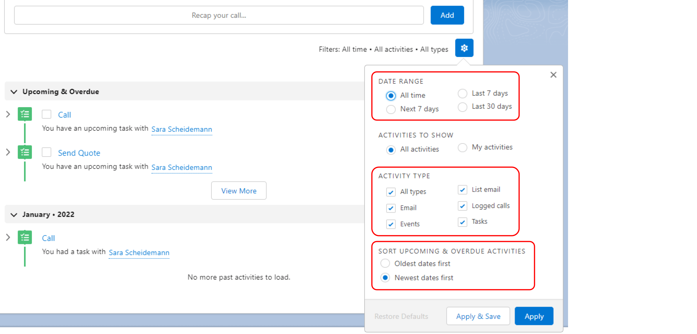

Cosmic Technologies is a software development company that has B2B customers in several countries. Sales reps of the company primarily use Gmail to communicate with customers via email. They are already using Gmail integration to see related Salesforce data while viewing emails. However, they are currently adding inbound and outbound emails and events to related records like accounts and contacts manually in Salesforce. The sales managers would like to automate this process to improve their productivity and give them access to events via standard reports in Salesforce. Sales reps should be able to easily remove their Gmail account if they do not want it to sync with Salesforce anymore. Which feature of Sales Cloud Einstein can be used for this requirement?\

- Einstein Activity Capture

***Einstein Activity Capture automatically captures emails and events from a connected Gmail account and adds them to the activity timeline of related Salesforce records, such as accounts and contacts. The automatic associations done by Einstein Activity Capture can be manually overridden on the activity timeline or in the Outlook/Gmail integration. A setting called 'Only Show Events that are Salesforce Records' can be turned on by navigating to Einstein Activity Capture \| Settings in Setup to ensure that the events on the activity timeline are Salesforce records and available in standard reports.***

*Einstein Activity Capture users can also delete Gmail accounts they no longer want to be connected to Salesforce. They can navigate to the 'Email and Calendar Accounts' page in their personal settings to delete an account that they no longer want to be connected.*

\*Einstein Insights displays insights related to accounts and opportunities. There is no feature called Einstein Automated Emails or Einstein Email Sync.\* 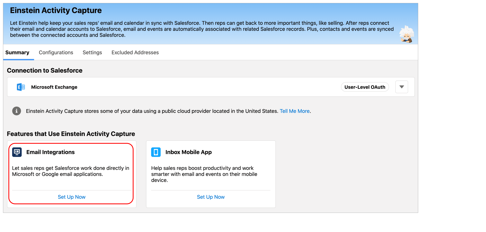

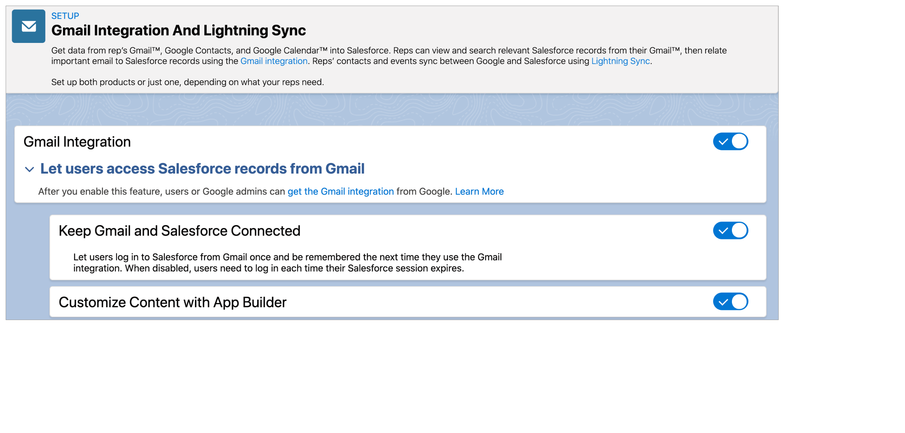

Cosmic Enterprises uses both Einstein Activity Capture and Outlook Integration. Emails that users send and receive are captured and added to the activity timeline of related records. Which of the following capabilities are available for Outlook integration users who are part of an Einstein Activity Capture configuration?

- Users can also change the associations between a captured email

### Prevent automated email replies and sensitive emails from being shared

Cosmic Electronics uses Einstein Activity Capture to keep its sales reps' emails and calendar events in sync with Salesforce. Automated email replies and emails containing sensitive information are frequently added to the activity timeline of records such as contacts and opportunities. Sales reps often share them inadvertently with other users, which is against the company's data security policy. The sales director is looking for a solution to prevent the inadvertent sharing of sensitive emails. How can the company's system administrator meet this requirement?\

- Ensure that the options to prevent automated email replies and sensitive emails from being shared are enabled in the Einstein Activity Capture settings.

In the Einstein Activity Capture settings, two options to prevent automated email replies and sensitive emails from being shared are on by default. They can be turned off, but to meet the requirement in the given scenario, the administrator must ensure that they are turned on. There are no similar options on the 'Email Settings' page in Setup. There is also no option to enable or disable 'Sensitive Email Sharing' in the activity timeline of records. It is not necessary to contact Salesforce support to meet this requirement.

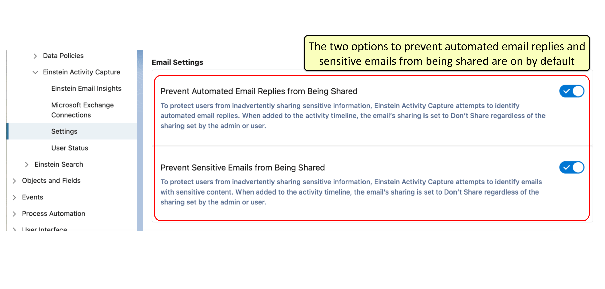

### Manage Associations Between Automatically Captured Emails and Related Records

Cosmic Express uses both Einstein Activity Capture and Gmail Integration. Gmail Integration users regularly access emails that are captured and added to the activity timeline of related records such as opportunities. Which of the following capabilities are available to them for managing email associations?

- Users can remove associations between a captured email and its related records.

- Users can add associations between a captured email and its related records.

***Gmail Integration users who are part of an Einstein Activity Capture configuration can add or remove the associations between a captured email and its related records in the activity timeline. Associations can also be modified directly from the Gmail integration.***

*Users cannot search for and add an association between two captured emails. It is only possible to search for and add an association to a more relevant record. There is no option to automatically manage email associations; Salesforce automatically relates emails to records.*

<https://help.salesforce.com/s/articleView?id=release-notes.rn_sales_eac_manage_associations_emails_records.htm&release=238&type=5>

## Outlook Integration

Global Technologies wants to give its sales representatives the ability to relate emails, contacts, and events in Microsoft Outlook and Microsoft Exchange with Salesforce records. What can be configured by a Salesforce Administrator to meet this need?

- Outlook Integration

*Using Lightning Sync and Outlook Integration together is an ideal solution for customers who use Microsoft Exchange, Office 365, and Outlook. With Lightning Sync, users can sync contacts, events, or both between Microsoft Exchange and Salesforce. With Outlook Integration, users can link related emails to records in Salesforce and access Salesforce records from Outlook.*

*Beginning in Winter '21, new Salesforce customers do not have access to Lightning Sync.*

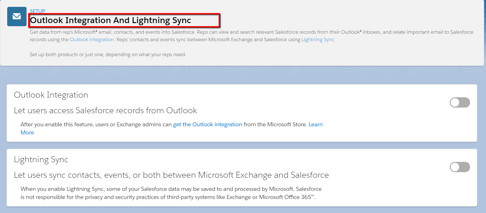

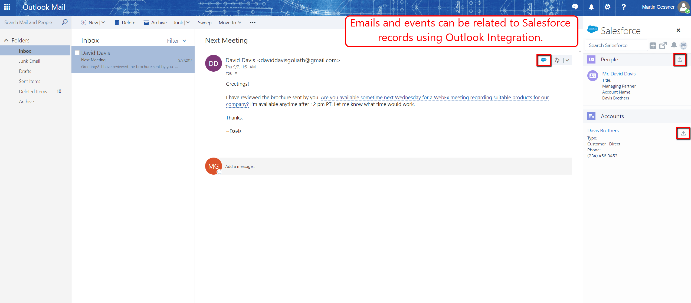

Which of the following are limitations of synchronizing items between Salesforce and Outlook using Lightning Sync?

- Task cannot be synced

- Synced contacts cannot be deleted automatically in the other calendar application.

*Lightning Sync cannot be used with Outlook Integration to delete synced contacts automatically in both calendar applications. Private events can be synced, and synced events can be deleted in both Salesforce and Outlook automatically. Repeating events in Lightning Experience, called event series, can be synced by enabling the 'Sync event series' setting. Tasks cannot be synced using Lightning Sync. The Outlook Integration app can be used in order to work on Salesforce tasks from Outlook.*

*Note: Lightning Sync is not available for new Salesforce customers. It is recommended to use Einstein Activity Capture, a long-term solution for syncing contacts and events between Microsoft® or Google applications and Salesforce. This question is still here as the official Salesforce exam can still have questions related to Lightning Sync.*

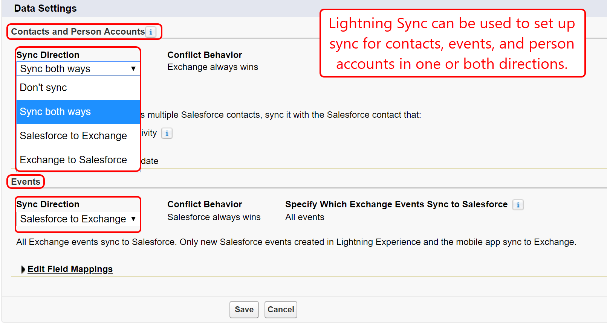

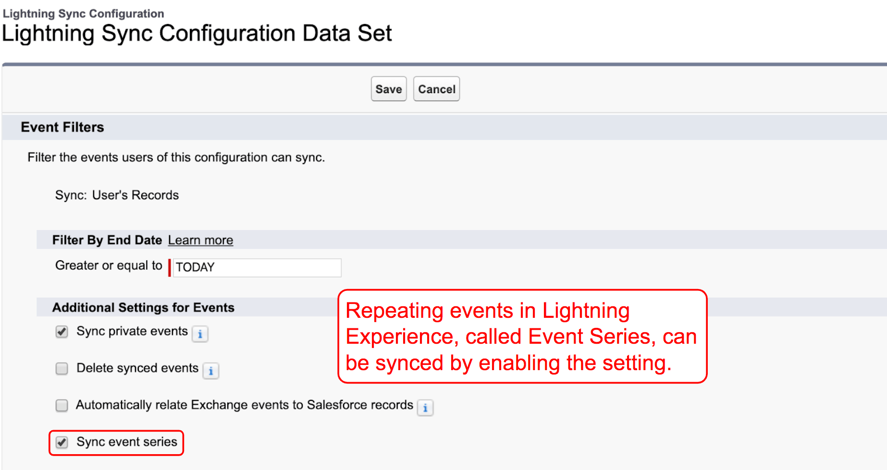

## New Custom Object

A Salesforce Administrator has created a 'Project' custom object and would also like to track Project Tasks. How can the Salesforce Administrator accomplish this?

- Check the 'Allow Activities' check box on the Project object.

The 'Allow Activities' checkbox is available in the custom object settings and will allow Activities to be associated with the custom object. If this option is selected when the object is created, an Activity section will appear in the default page layout.

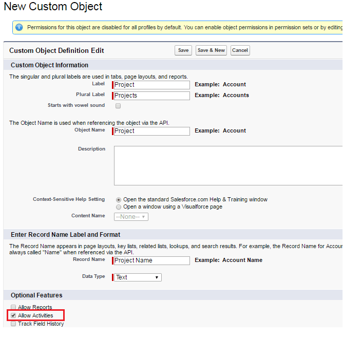

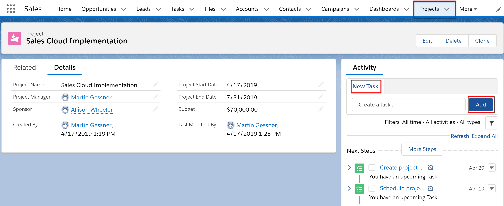

The users of Cosmic Marketing Solutions use Lightning Experience only. A Salesforce Administrator has created two custom objects, namely, Job Application and Applicant. There is a lookup relationship field on the Job Application object to the Applicant object. Users would like to be able to send an email to the applicant related to a particular job application easily. Which solutions can be utilized for this requirement?

- Create a custom 'Send Email' action and add it to the Job Application page layout.

- Enable activities on the Job Application object and use the 'Activity' tab to send the email.

In Lightning Experience, the 'Activity' tab can be used by users to send an email. A custom 'Send Email' action can also be created and added to the Job Application page layout to allow users to send emails. The email of the applicant on the job application could be used. There is no 'Email Notifications' or 'Email Tracking' functionality that can be utilized for this use case.

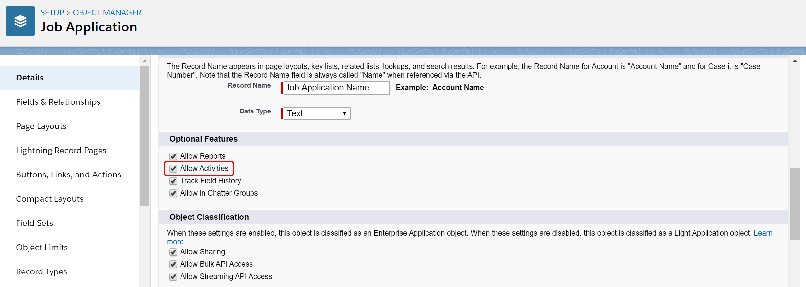

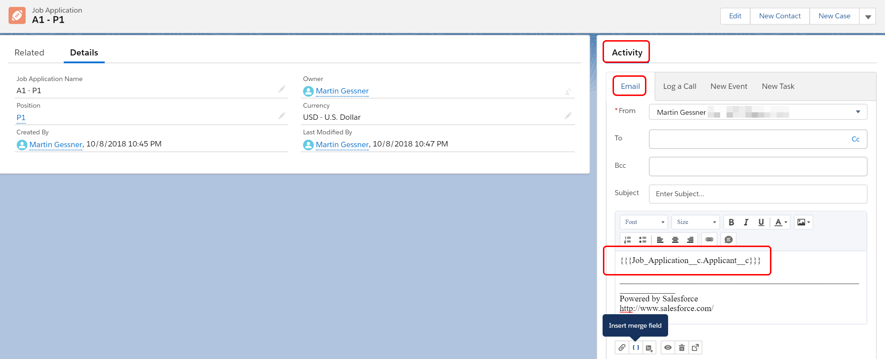

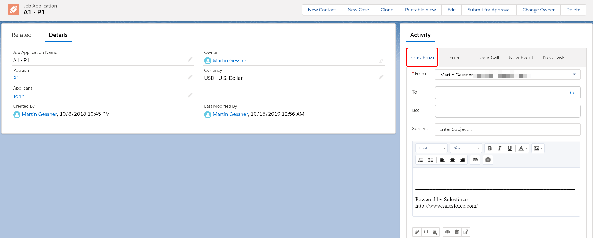

## Archived Activities

What is true regarding archived activities?

- Salesforce automatically archives activities if they meet certain criteria.

- Salesforce does not delete archived activities, but users can manually delete them.

*Salesforce automatically archives activities that meet certain criteria (e.g. closed tasks due more than 365 days ago). Once archived, they are included in data export files and users can view these.*

*Salesforce does not delete archived activities, but users can manually delete them. Currently, activity archiving is mandatory.*

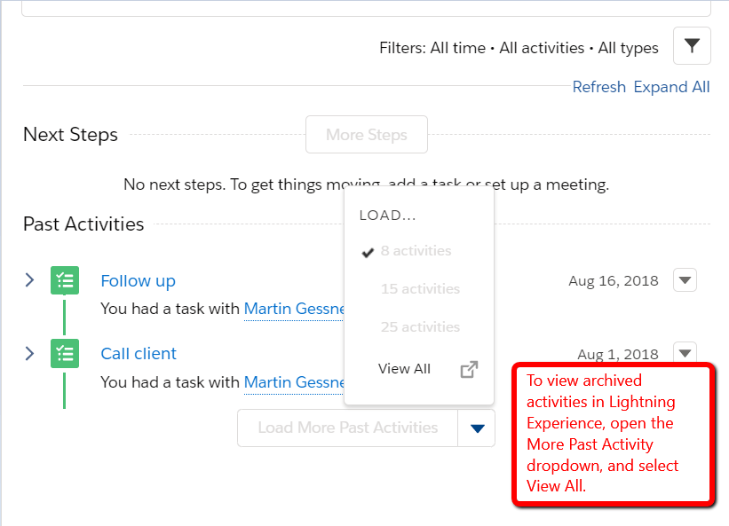

## Private Events

What is true regarding Private Events?

- The user that created the event and any user with the 'View All Data' permission can view the event.

*Private events are accessible to the user that created the event and any user that has the 'View All Data' or 'Modify All Data' permission. There are a few exceptions to role-hierarchy based sharing and these include events marked as private.*

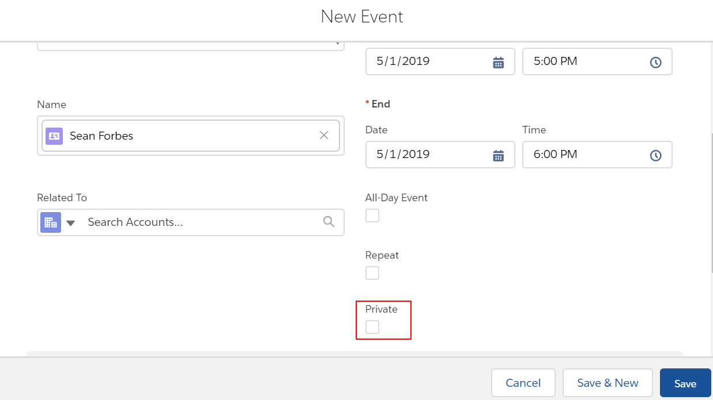

## Create Calendar from Object

What are two capabilities of the 'Create Calendar from Salesforce Object' feature?

- A Calendar can be created from a custom or standard object.

- Calendars can be customized by appying a list view.

A calendar can be created from a standard or custom object and can be customized by applying a list view. The fields that determine what data the calendar displays can be selected. Once created, the calendar can be edited and deleted.

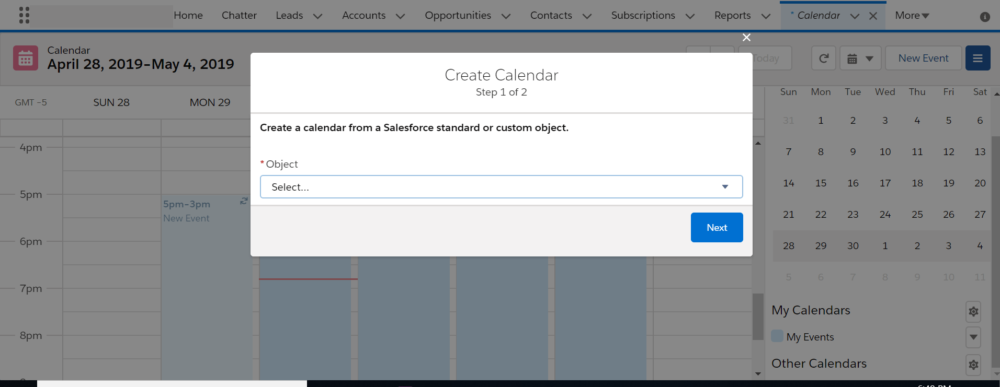

## Follow-Up Event

A sales rep of Cosmic Solutions created a task to call a contact related to the 'Edge Communications' account. He would like to follow up on the task by meeting with the contact at a particular location. Which of the following can be created in Lightning Experience to allow the sales rep to follow up and ensure that the account and contact are copied from the original task?

- Follow-Up Event

*A follow-up event can be created in Lightning Experience to follow up on an existing task. The key information is copied from the original task so sales reps don't have to enter data twice. Unlike a follow-up task, a location can be specified in a follow-up event. There is no follow-up activity or record.*

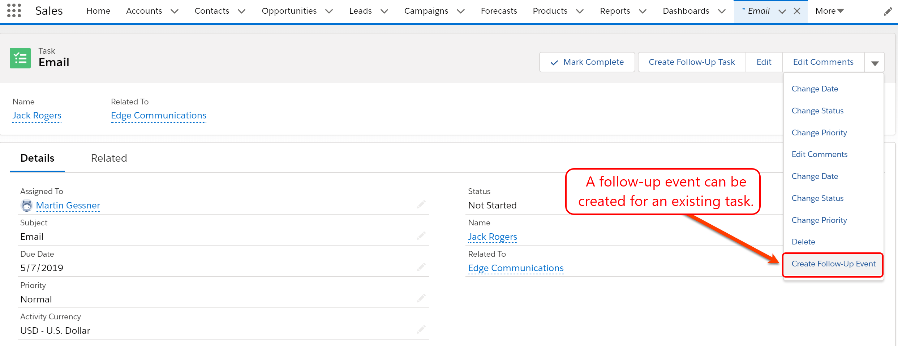

## Event

The sales users of Cosmic Enterprises use Lightning Experience to create and manage records as well as related activities. While creating an event, a sales manager of the company would like to schedule events for monthly meetings that repeat indefinitely. What can a Salesforce Administrator do to meet this requirement after reviewing options in Activity Settings?

- Add the 'Repeat' checkbox to the page layout for events.

***Sales reps can be allowed to schedule event series by adding the 'Repeat' checkbox to the Event page layout. The reps can then select 'Repeat' in order to schedule daily, weekly, monthly, or other repeating events. This feature is also called 'Event Series' in Lightning Experience, and it cannot be enabled in Activity Settings.***

*Enabling 'Recurring Events' can only be enabled in Activity Settings in Salesforce Classic, so it doesn't apply to this requirement. There is no 'Multi-Event' checkbox on the page layout for Events.*

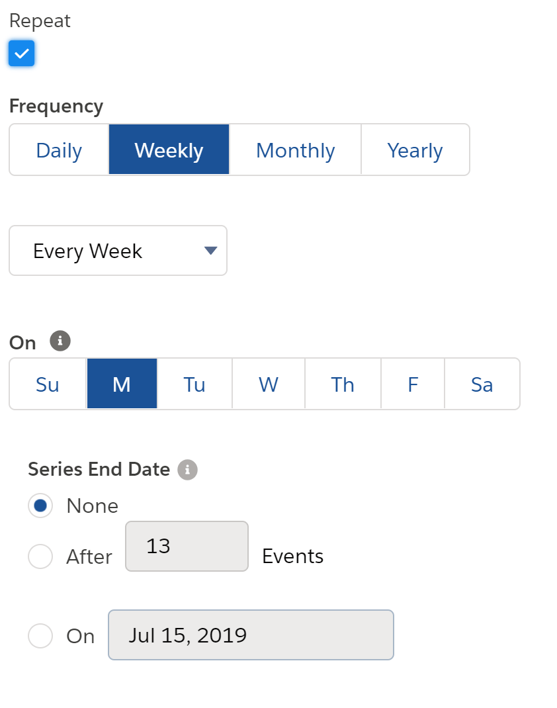{width="391"}

### Conference Room

The main office of Cosmic Solar has several conference rooms that are used for presentations and meetings. Sales users of the company use Salesforce to schedule events. While creating an event in Lightning Experience, what can a sales manager do to reserve a particular conference room for a meeting?

- Add the conference room resource as an attendee.

*Meeting resources, such as conference rooms and projectors, can be reserved for an event. A resource can be added as an attendee while creating an event. Resources can be created by navigating to 'Public Calendars and Resources' in Setup.*

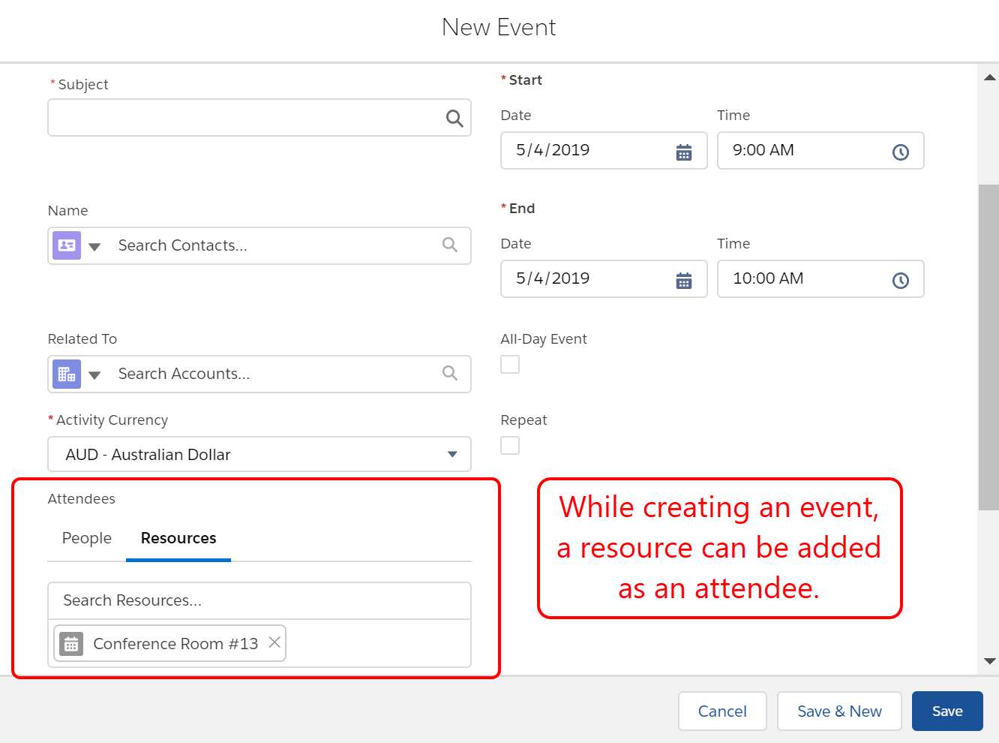

### Attendees

All the users of Cosmic Enterprises are using Lightning Experience. While creating an event, a sales representative of the company would like to add a contact and a person account as attendees to the event. What should a Salesforce Administrator do to meet this requirement?

- Add the 'Attendees' field to the Event page layout.

*The 'Attendees' field can be added to the Event page layout to allow users to add Salesforce users, contacts, person accounts, and leads to the events that they create in Lightning Experience. Setting up Lightning Sync is only required to send invitations to attendees and receive their responses. There is also no setting in 'Activity Settings' that can be enabled to allow users to add attendees.*

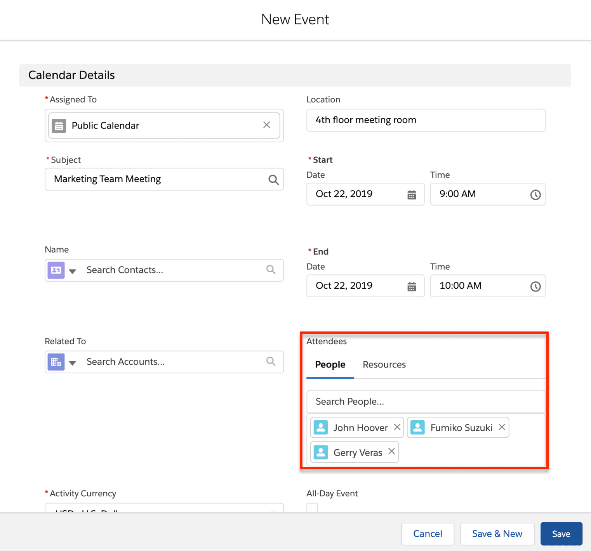

The Salesforce Administrator of Cosmic Clothing has added the 'Attendees' field to the Event page layout. A sales representative is creating an event in Lightning Experience. Which of the following can the sales rep add as 'Attendee' on the Event page layout?

- Contacts

- Leads

- Users

When creating an event in Lightning Experience, a sales representative can add Salesforce users, contacts, person accounts, and leads as attendees. Business accounts cannot be added as attendees. It is also not possible to add campaign members as attendees

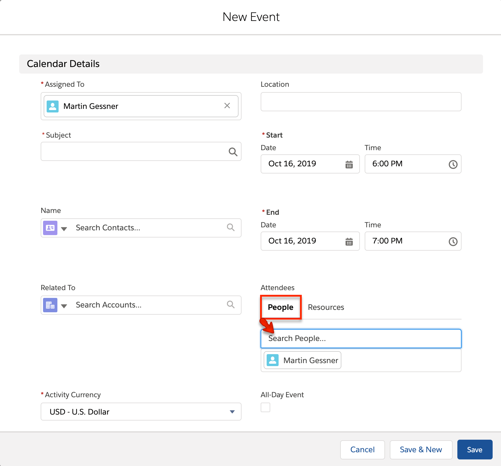

## Public Calendar

The sales reps of Cosmic Solutions use Lightning Experience. One of the sales managers has created a sales team that consists of five sales reps. These sales reps should be able to view, schedule, and update shared events without switching to Salesforce Classic. Which feature can be utilized for this use case?

- Public Calendar.

Public calendars can be used to manage group activities, such as scheduling a common event. Everyone who shares the public calendar can view, schedule, and update events without switching to Salesforce Classic.

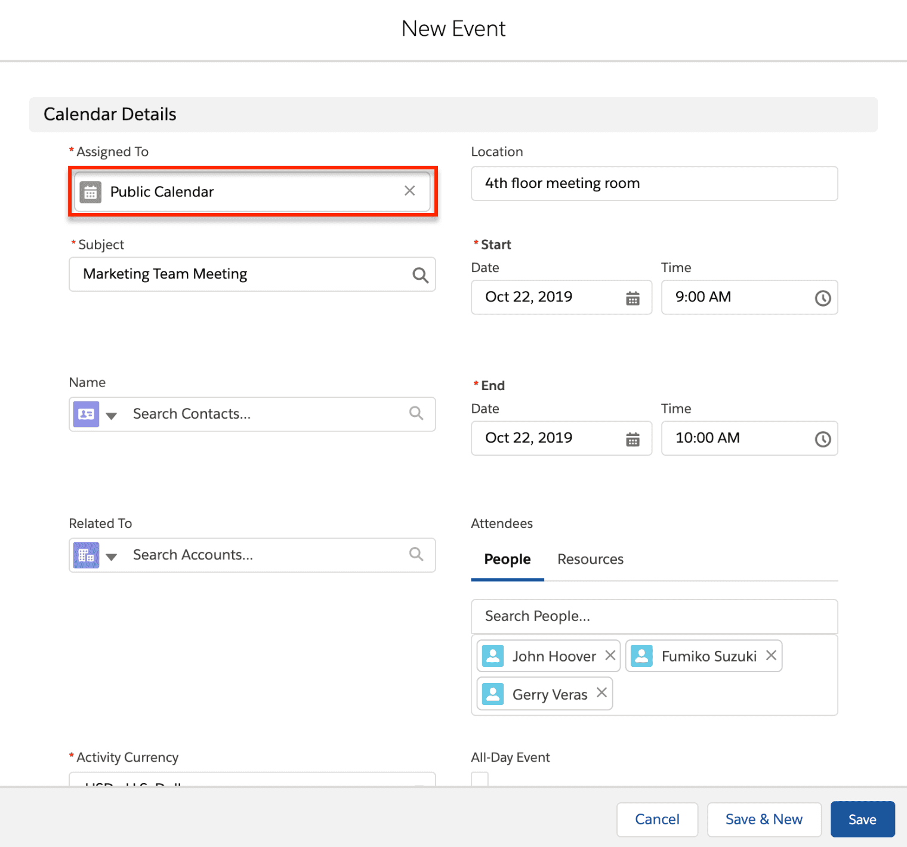](images/clipboard-248816304.png)

## Enhanced Email

Which of the following options allows users to add Outlook emails to Salesforce as an Email Message object and not as Tasks, using Salesforce Outlook Integration?

- Enhanced Email.

*Enhanced Email with Outlook Integration allows users to add emails from Outlook to Salesforce records as Email Message objects instead of tasks. Email to Salesforce allows automatically logging emails from third party email applications as activities on contact and lead records in Salesforce. Lightning Email Templates can be used with Outlook Integration to ensure consistent messaging to customers in order to save time.*

*Note: Lightning Sync is not supported anymore for new Salesforce customers. Einstein Activity Capture is the recommended replacement.*

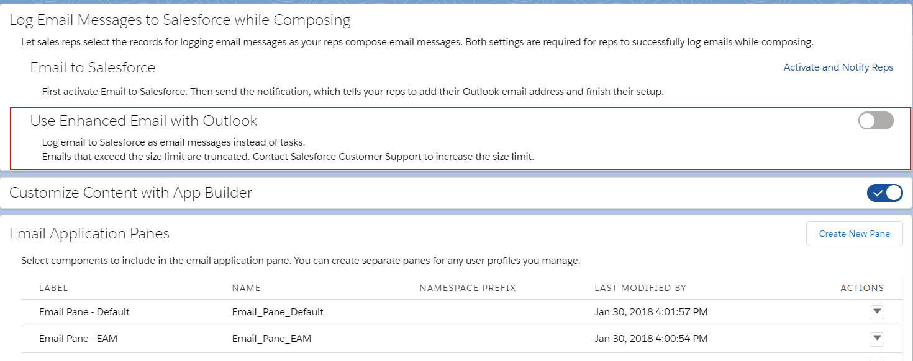

## Lightning Sync

Which of the following can be synced between Salesforce and Microsoft Exchange using Lightning Sync?

- Contacts

- Events

Lightning Sync can be used to sync contacts and events between Salesforce and Microsoft Exchange. Emails cannot be synced via Lightning Sync but can be attached to multiple contacts or records that allow activities such as Cases.

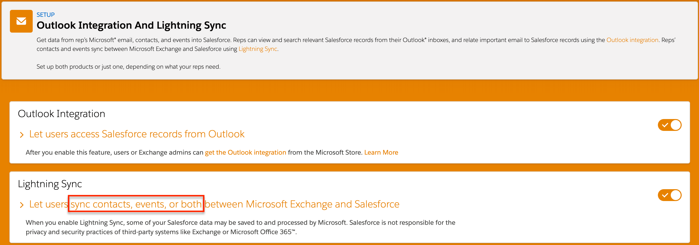

The Sales Director of Cosmic Solutions would like to increase the productivity of sales representatives by synchronizing items between Salesforce and Outlook. Which data can be synchronized using Lightning Sync with Salesforce Outlook Integration?

- Events

- Contacts

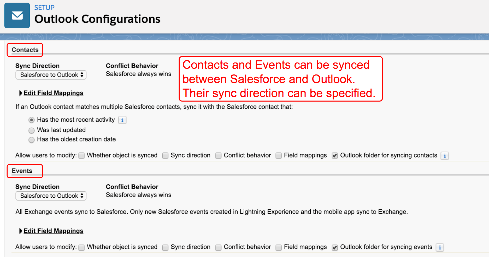

A company has field sales reps that are always on the road and use their mobile phones with the Salesforce mobile app to manage their work. Reps also use Outlook email and calendar. The sales manager would like for the reps to synchronize repeating events between Outlook and Salesforce. The company uses Lightning Experience. What does the Salesforce Administrator need to do to support this request?

- Enable 'Sync event series' in the Lightning Sync configuration.

Salesforce supports the ability to synchronize repeating events between Outlook calendars and Salesforce, including the Salesforce mobile app. However, the company needs to use Lightning Experience and Lightning Sync. Repeating events created in Salesforce Classic cannot be synchronized with Outlook calendars. Also, reps cannot turn on the repeating events sync feature in the Salesforce mobile app on their own. The Salesforce Administrator has to enable it in the Lightning Sync configuration.

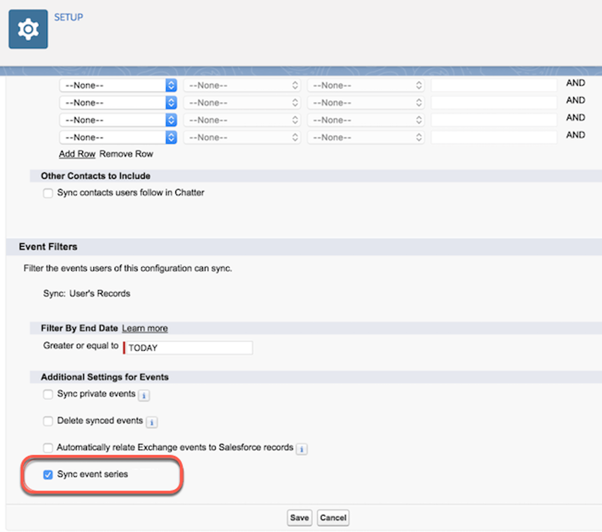

## Email to Salesforce

As part of the request for Salesforce Outlook Integration, the Sales Director of the company wants sales reps to be able to create and see related Salesforce records and automatically associate emails to them from within Outlook. In addition, the emails should be logged as email objects and not as tasks within Salesforce. Aside from enabling Salesforce Outlook Integration, what other features must be enabled or set by the administrator to fulfill these requirements?

- Enable Email to Salesforce

- Enable Enhanced Email

*Email to Salesforce is a feature which automatically relates emails to Salesforce records like contacts, leads, and opportunities. Enabling Enhanced Email would allow the reps to easily associate emails to relevant Salesforce records while still composing them. Emails would be associated as tasks in Salesforce if Enhanced Email is not enabled. Salesforce does not have an Advanced Outlook Sync feature.*

*On the other hand, email application panes are used to define the layout of components in the integration side panel. A default email pane is readily available for use and customized ones are only required for more specific usage such as when some components should not be visible for selected user profiles.*

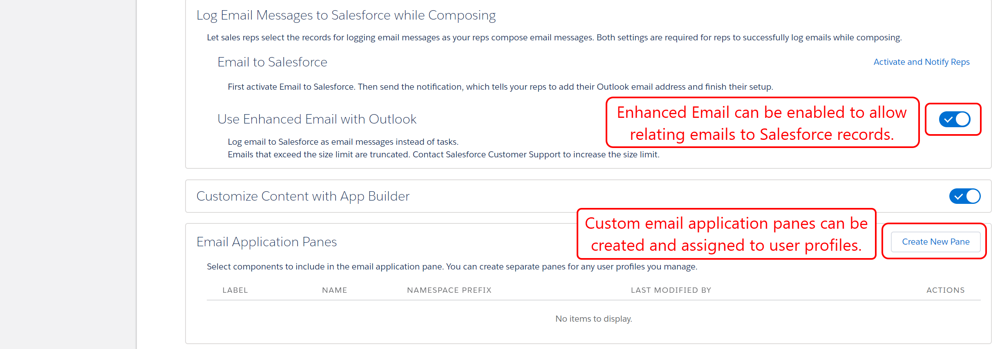

## Email Folder

A user is not able to find an email template when sending an email. What could be the reason for this?

- The user does not have access to the Email Template folder.

- The email template is not marked 'Available for Use'.

Email Templates must be set to 'Available for Use' to allow users to select them. Email templates can be made accessible to all users or only certain groups or roles by setting access to the Email Template folders.

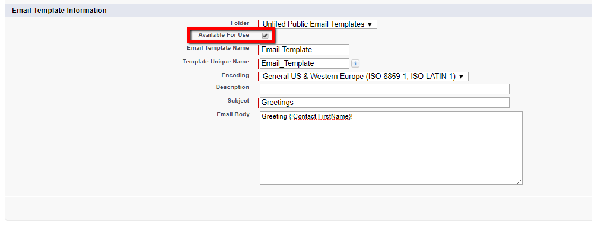

## Flow Builder

In Cosmic Glass Works, when a quote is accepted by the customer, a draft agreement and a follow-up task need to be created. What is the best way to cater to this requirement?

- Use Flow Builder to define an agreement record and task creation process.

***A record-triggered flow can be configured to automatically create a draft agreement and follow-up task when a quote is updated to an accepted status. This approach provides a declarative, efficient, and maintainable solution without requiring code.***

*An approval process automates record approvals and related notifications but cannot initiate record creation based solely on the status change of the quote in this scenario. The Quote object does not have settings for automatically generating related records, and while an Apex trigger could achieve this programmatically, a flow is the preferred declarative solution for this type of automation.*

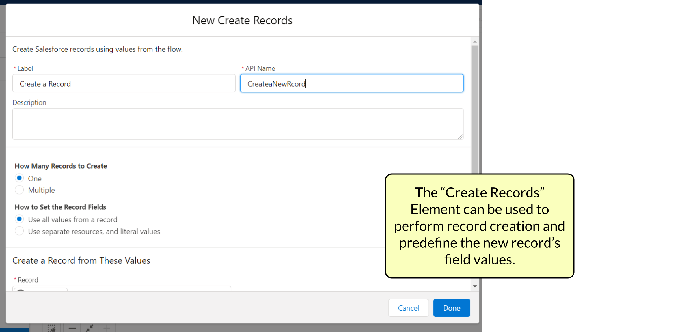

## Capabilities of Salesforce Mobile App

Which features in the Salesforce mobile app user interface can be customized to fit a company's branding?

- Brand Color

- Loading page logo

- Loading page color

***The brand color defines the base color to use for the header, buttons, search bar and other user interface elements in the Salesforce mobile app. The logo and background color of the loading page when a user logs in can also be customized.***

*Font styles and background images cannot be customized.*

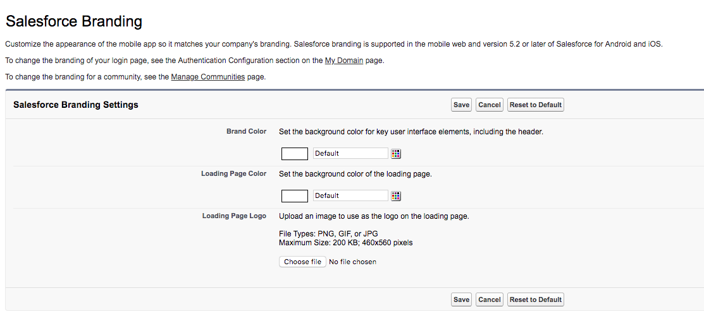

Which device and browser combination supports the full Lightning Experience desktop site by default?

- Safari on iPadOS

Safari on iPadOS is the only exception that allows for the full Lightning Experience desktop experience on a mobile device. The other options will redirect users to the Salesforce Classic UI.

<https://help.salesforce.com/s/articleView?language=en_US&id=000380219&type=1>

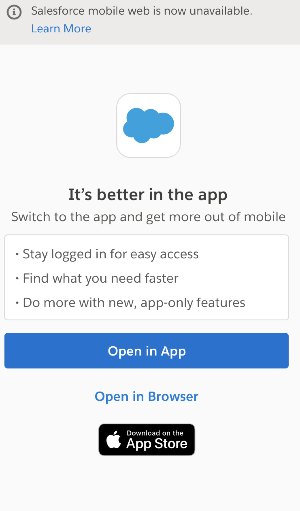{width="297"}

Which requirement must be met for a user to see a specific item within a Launchpad component?

- The user must have the permission to view the tab associated with that item

***Launchpads respect standard security. Therefore, users only see items in the Launchpad for which they have the appropriate tab visibility based on user permission settings.***

*The "Modify All Data" permission is a high-level administrative permission and is not required for standard users to view navigation links. Read access permission is required for viewing custom mobile app branding (such as logo), but it does not control the visibility of Launchpad navigation items. There is no "Public" checkbox for individual items within the Launchpad.*

<https://help.salesforce.com/s/articleView?language=en_US&id=xcloud.salesforce_app_launchpad.htm&type=5>

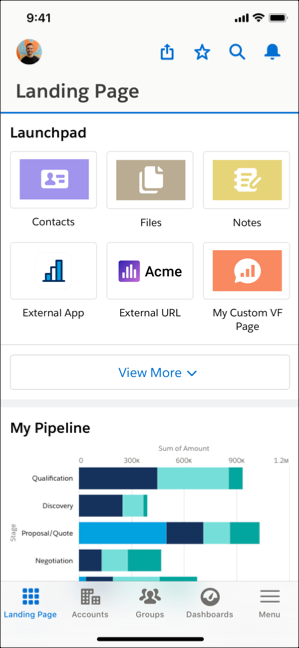

When a user accesses Salesforce through a mobile phone browser on an Android device, which interface is displayed by default?

- Salesforce Classic

***Lightning Experience is not supported on mobile web browsers for phones. Salesforce detects the mobile user agent and redirects the user to Salesforce Classic.***

*The Salesforce Mobile App interface cannot be displayed in a mobile phone browser. Lightning Web Runtime is used in Experience Cloud sites.*

<https://help.salesforce.com/s/articleView?language=en_US&id=000380219&type=1>

# Objective 2

55 Questions.

## Chatter \| Describe the features

The Salesforce Administrator has been asked to summarize the important features of Chatter. Which features describe Chatter correctly?

- The Chatter User Profile allows a user to share important information about themselves.

- Chatter Feed Tracking provides real-time notification of changes to a particular record.

- A user can choose to follow individual records using Chatter.

***A Chatter user can add and share details about themselves on their Chatter profile page, including adding a profile picture and a profile banner. Changes to tracked record fields are detected by feed tracking and are posted as updates in the 'What I Follow' feed.***

*Chatter follows the record sharing model defined in the org, which means that users cannot see data to which they do not have access. There are several Chatter features that are available on the desktop that aren't available in the Salesforce mobile app.*

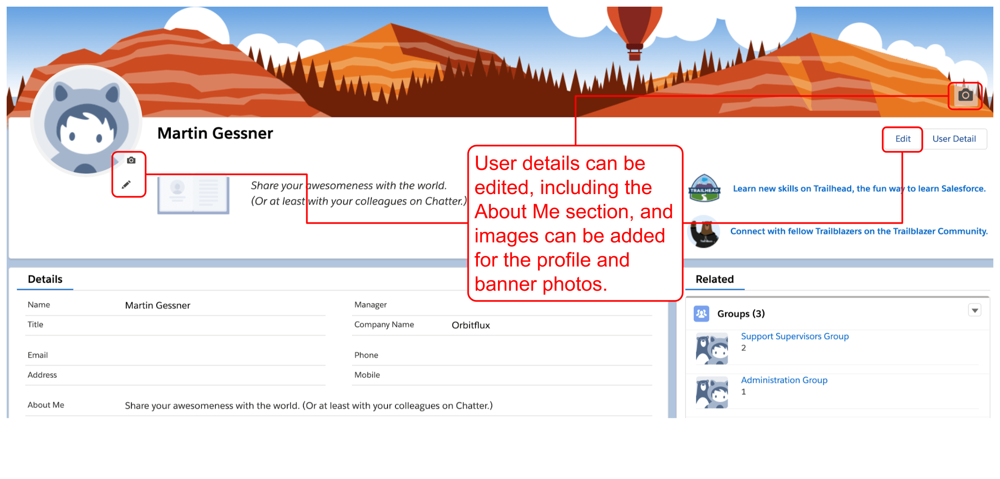

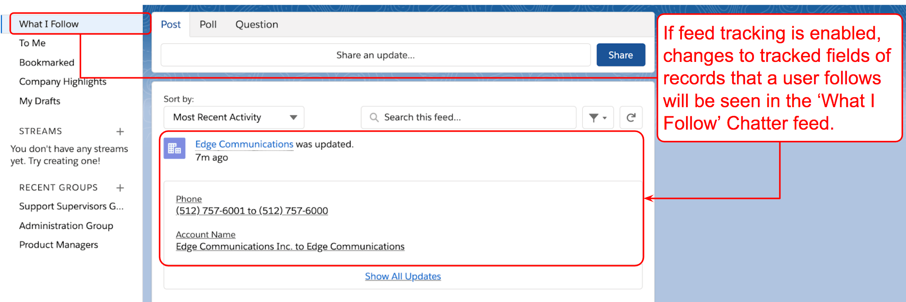

One of the Sales Managers would like to discuss a sales proposal with a few selected Account Managers. They want to make sure that the discussions related to it are available in one place and remain secure. Which options should the Salesforce Administrator consider?

- Create an unlisted Chatter Group

- Create a private Chatter Group

Any user can join a public Chatter group and the details will not remain secure. In order to ensure that the group remains secure and that no other user is able to view the discussions, a private or unlisted Chatter group can be created. Unlisted Chatter groups are more secure and offer more privacy compared to private groups, as users cannot ask to join or see the groups in list views, feeds, or search results.

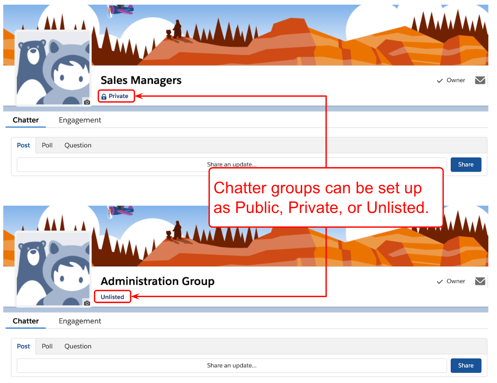

Which of the following are features of Chatter?

- Create and join groups

- Ability to share a file with other people

- Follow records to be able to see changes to the records

***Some features of Chatter include following records to view the changes made to them, sharing files with other people, and creating and joining groups.***

*The "mute" feature can be used to stop receiving notifications about certain posts. If someone is \@mentioned on a muted post, it gets unmuted automatically. Email digests can be received on a daily or weekly basis.*

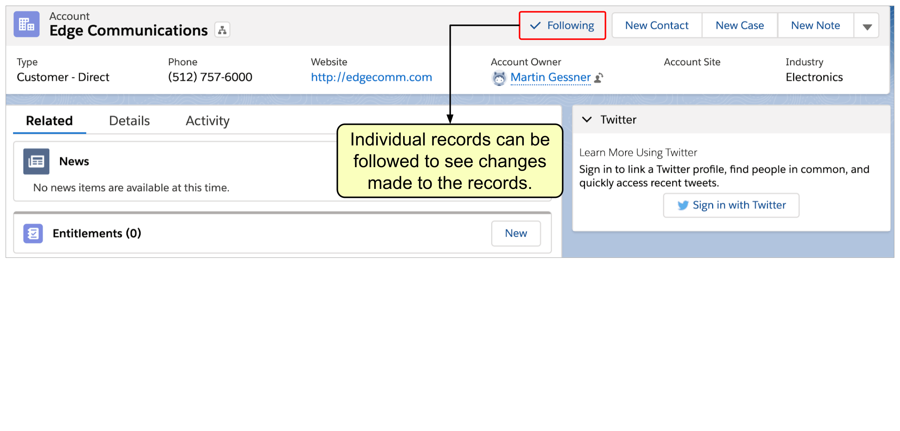

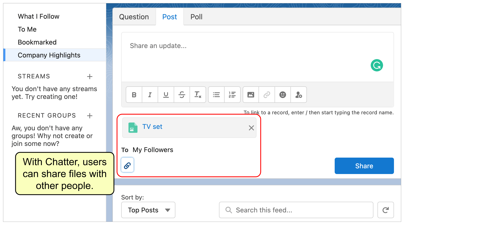

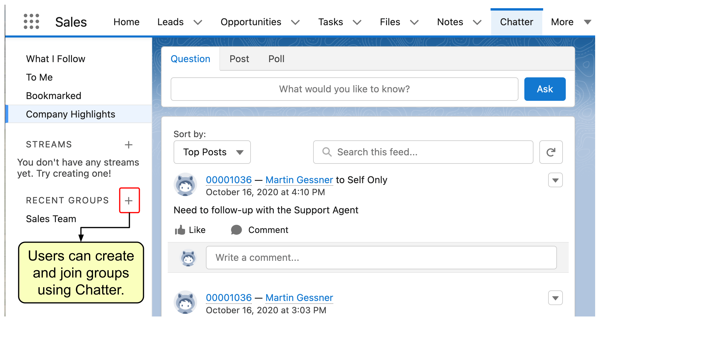

Which of the following are features included in Chatter?

- Topics can be selected an added to a post.

- Post can be shared to the user's Chatter profile, or groups that the user is a member of.

- A poll can be used within a Chatter post.

***A poll can be shared as a Chatter post. Posts can refer to selected records but do not automatically include record data. Topics can be created/selected and added to a post using a hashtag before the Topic name.***

*Merge fields cannot be used in the post. Posts can be shared with a group or the user's profile but not on social media channels.*

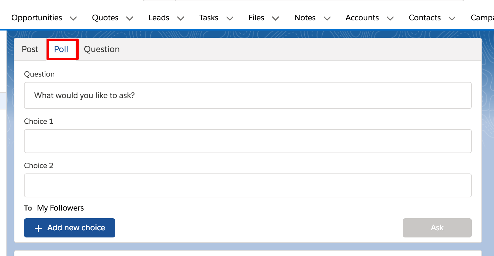

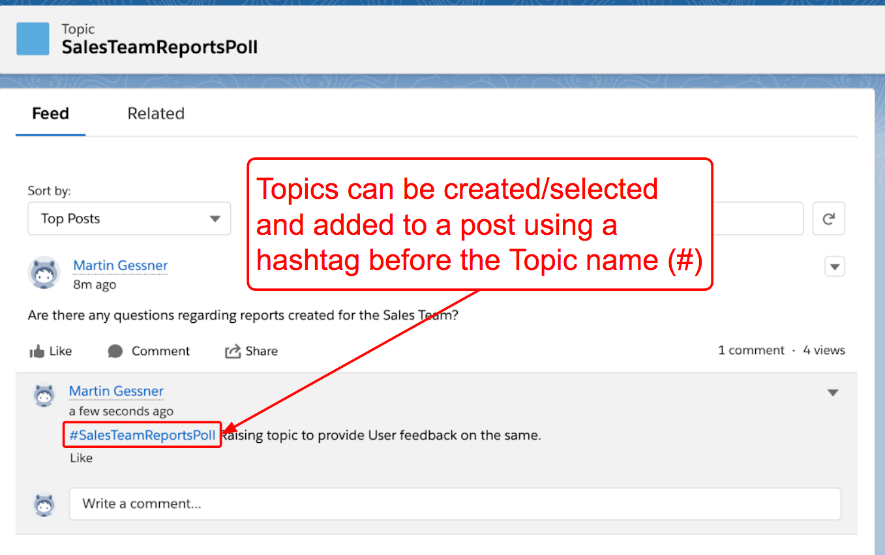

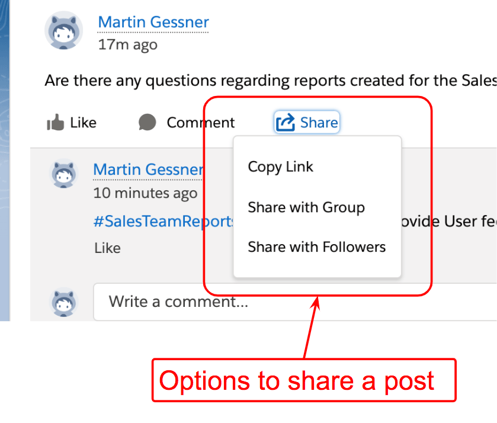

#### Enable Profile Based Roll out for Chatter

A government agency would like to use Chatter but plans to test it on one team initially. How can this be accomplished?

- Enable Profile Based Rollout for Chatter\
  and disable Chatter access for any custom profiles\
  that should not have access to Chatter.

The rollout of Chatter can be restricted by profile. To use Profile Based Rollout for Chatter, it must be enabled. Once it has been enabled, the 'Enable Chatter' permission would need to be deselected for the profiles that should not have access to Chatter. However, Standard Profile access to Chatter cannot be disabled. By default, new orgs will have Chatter enabled org-wide for all profiles. Salesforce must be contacted to enable a profile-based Chatter rollout to control access to Chatter at the profile or permission set level.

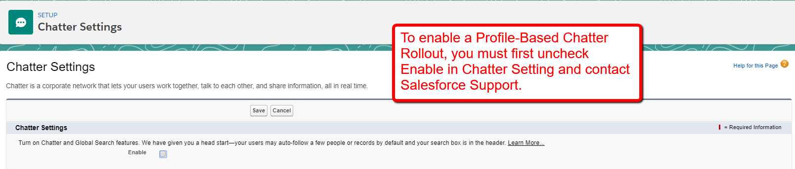

#### Allow Records in Groups

A user wants to collaborate and discuss a record as a team with a group of other users. How can a Salesforce Administrator enable this most efficiently?

- Create a group for the set of users and allow the ability to add records to Chatter groups by enabling the 'Allow Records in Groups' setting

By enabling the 'Allow Records in Groups' setting, users can add records to Chatter groups to collaborate on and discuss as a team in the group.

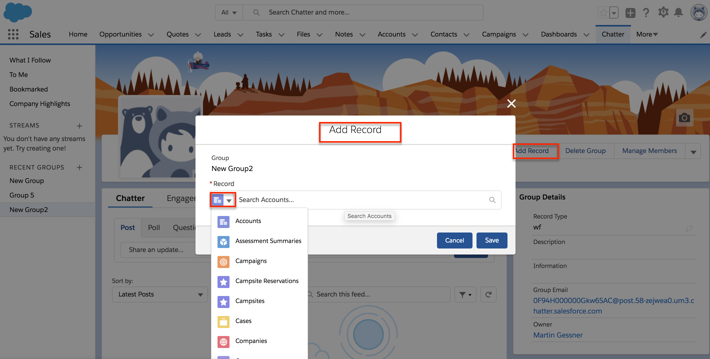

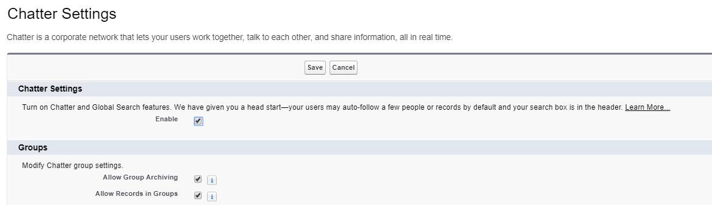

#### New Task

Julie has created a new post on the Chatter feed. After she has shared the post, what actions can she perform on the post?

- Create New Task related to the post.

- Edit the post and change the text

***The only quick action that can be performed on a Feed Item/Post is 'Create New Task'. However, a Salesforce Administrator must add the 'Create New Task' quick action to the 'Feed Item Layout' to make it visible to users. An existing post can be edited or deleted.***

*In Lightning Experience, Global Actions such as 'Log a Call' and 'New Opportunity' can be accessed in the Global Actions Menu by clicking the '+' icon in the Salesforce header.*

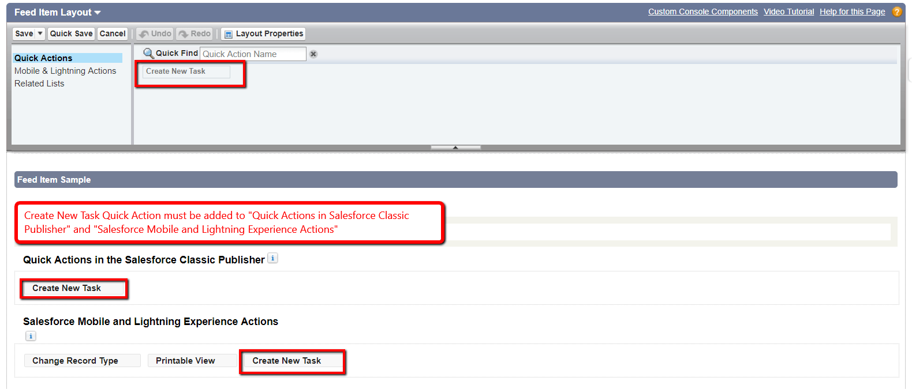

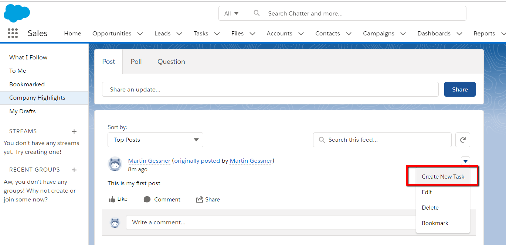

#### Editing feed posts and comments

What is true regarding editing feed posts and comments?

- The ability for users to edit their own feed posts is enabled by default.

- Salesforce Administrator can edit any post.

The 'Allow users to edit posts and comments option' in Chatter Settings is enabled by default. The permissions 'Edit My Own Posts' and 'Edit Posts on Records I Own' control the ability to edit posts and can be enabled or disabled according to the requirements of each organization. Record owners cannot always edit posts on records they own; it depends on the permission setting on both standard and custom profiles, disabled by default.

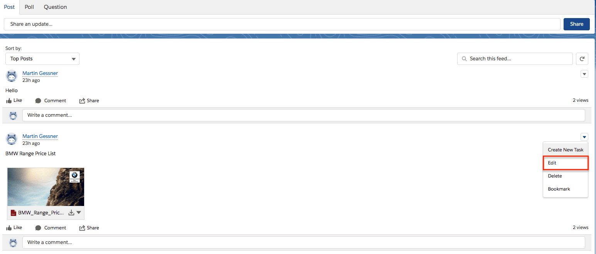

#### Pinned Post

Critical information in group chatter feeds is often not seen by users. How can the visibility of critical information in a Chatter group feed be improved?

- Pin the post with the critical information to the top of the feed.

Pinning a post in a feed will display it at the top of the feed. User permissions can be used to control which users are able to use this feature.

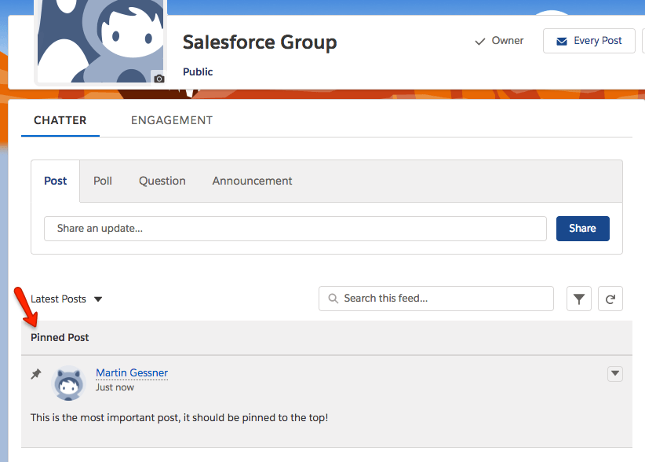

### Private Chatter group

A sales manager is working on a proposal for a new business Opportunity and wants to share files and collaborate with his team. Only the team should have access to the information shared inside the group. What should the manager do?

- Create a private Chatter group and add the team members.

Information in a private Chatter group is only available to group members; the owner or manager of the group can add group members. Users cannot make requests to join an unlisted Chatter group. Files and information on the opportunity record feed are available to anybody that has access to the opportunity record.

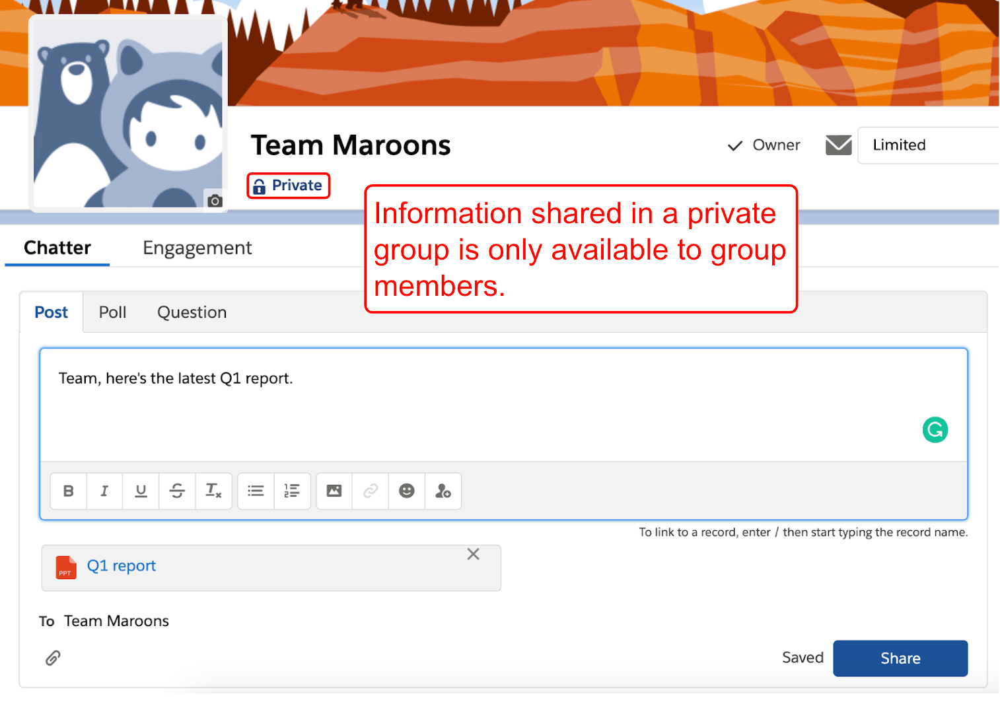

### Allow Customer Invitations

Which of the following is correct for setting up a Chatter group in which customers can participate?

- 'Allow Customers' Chatter group setting must be checked

***Allow Customers' is a Chatter group setting that must be checked before customers can participate in the group.***

*An internal user must be the owner or manager of the group to invite new members (whether internal users or customers). The Standard type group membership role does not allow this action. Membership role type can be 'Standard' or 'Admin'; the Admin role allows Chatter group management.*

*Unlisted Chatter groups may also include customers.*

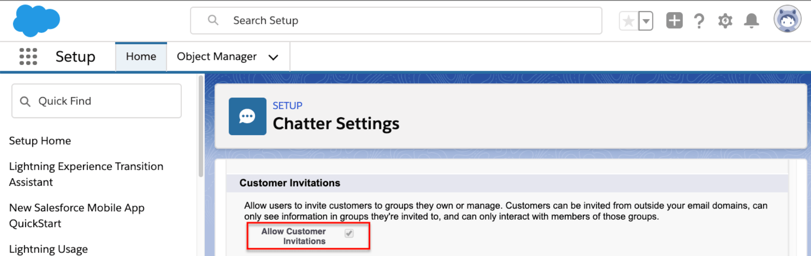

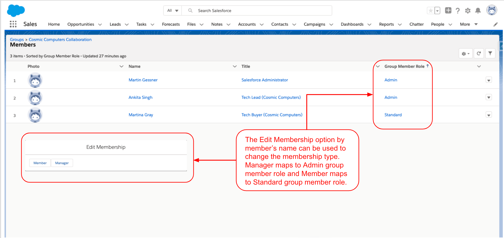

### Mute Post

A user would no longer like to receive updates about a certain post in their feed. What feature should be used?

- Mute Post

The 'Mute Post' feature will remove the post from the feed on the Home and Chatter tab, and also stop notifications for updates to the post.

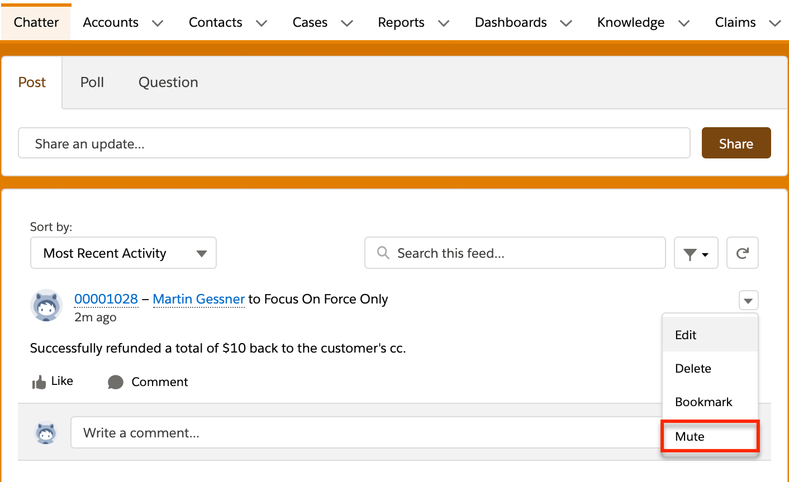

- A muted post will be unmuted for a user who is '@mentioned' in the post.

***Posts can be unmuted if the user is mentioned on the muted post.***

*Muting a post removes it from the Chatter and Home page feeds but not from a group, profile, or record feed. Muted posts can be viewed using the 'Muted' filter on the side panel in Salesforce Classic. Posts can be muted using the dropdown menu or by replying to post emails with the word 'mute'.*

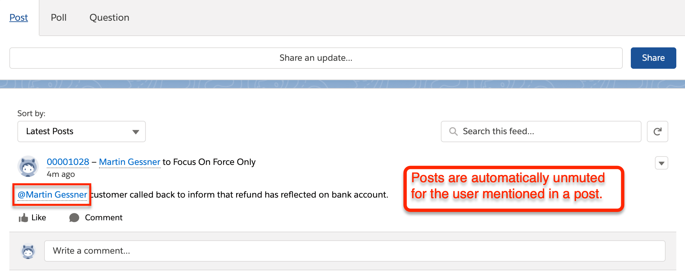

A sales rep travels frequently to client sites. To stay in touch with co-workers, she uses the Salesforce mobile app and Chatter posts. She likes Chatter as a communication tool, but sometimes there are too many posts on her feed and she would like to get rid of the notifications associated with some of the posts. What action can be taken in the Salesforce mobile app to achieve this?

- Use the 'Mute Post' feature

Salesforce does not have a 'Hide Post' feature. A Chatter post can only be deleted by the user who created it or by someone who has special permission to do so – i.e., a Chatter moderator or a user who has one of the following profile permissions: 'Manage Chatter Messages', 'Modify All Data', or 'Can Approve Feed Post and Comment'. The Salesforce Administrator can control Chatter access on a profile or permission set basis, but this step should not be taken because it will completely turn off all Chatter features. Chatter supports the ability to mute posts in the main application and in the Salesforce mobile app. When a post is muted, notifications are no longer sent for it (unless someone \@ mentions the user in the post, which unmutes it and notifications will start again).

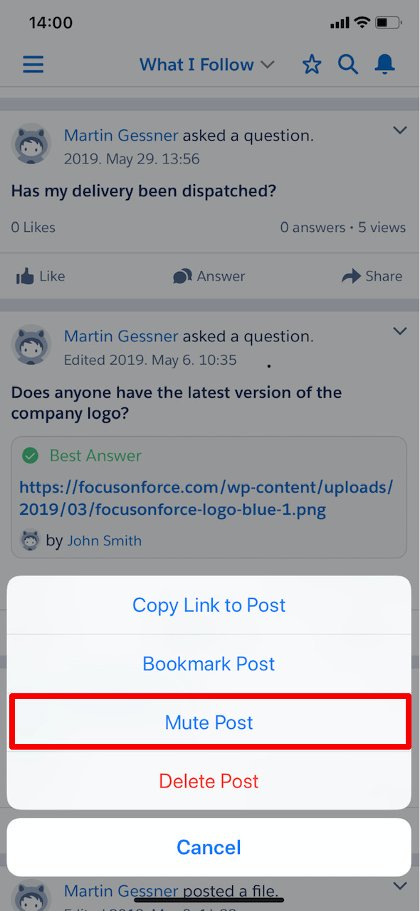{width="457"}

### Rich Text

What is true regarding the ability to format Chatter posts with rich text?

- Formatting posts with rich text is a Chatter setting that can be enabled or disabled.

- Rich text includes bold, italic, underline, bullet, and numbered lists

- Rich text allows the insertion of a hyperlink or an image to a post.

Allow users to compose rich text posts' is a Chatter setting that allows rich text to be added to text posts, questions, and posts with link or file attachments. It is not supported on Polls. Rich text allows Chatter posts to be formatted in bold, italics, underline, bulleted, and numbered lists. Typeface selection, and text effects like shadows and highlights are not available with rich text. Rich text also allows the insertion of hyperlinks and graphics to the post.

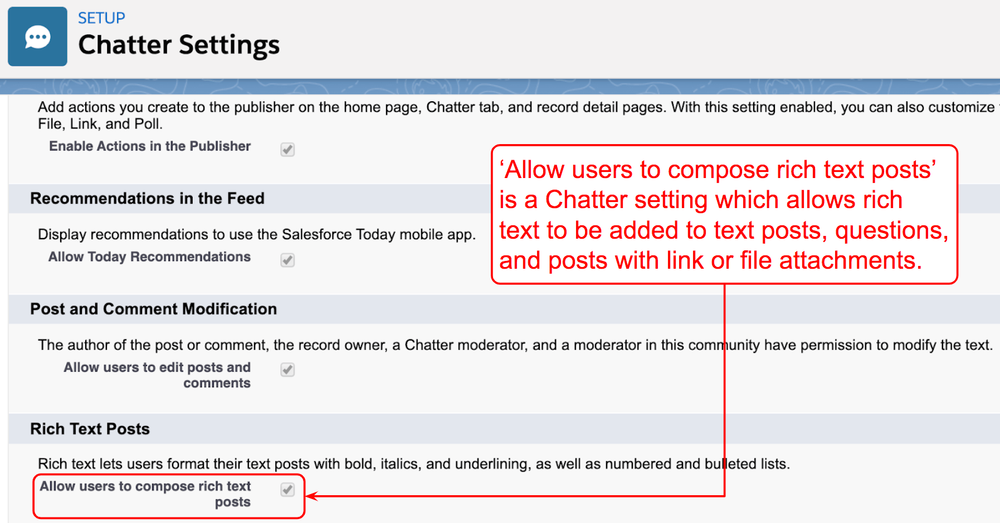

### '\@mentions'

Global Solutions has all of its Eastern Sales reps in one Chatter group. A sales rep \@mentions the group to ask a question regarding an opportunity record. What is true regarding the use of \@mention for a group on a record feed?

- The group name that is @mentioned becomes a link to the group page.

- A group-record relationship record is created.

- The record displays in the group records related list in the group.

***Using \@mention for a group on a record's feed creates a group-record relationship record, and the record displays in the Group Records related list in the group. The group name \@mentioned becomes a link to the group page.***

*Only users with sharing access to the record can view the record. Users, public groups, and private groups that the user making the post is a member of can be \@mentioned.*

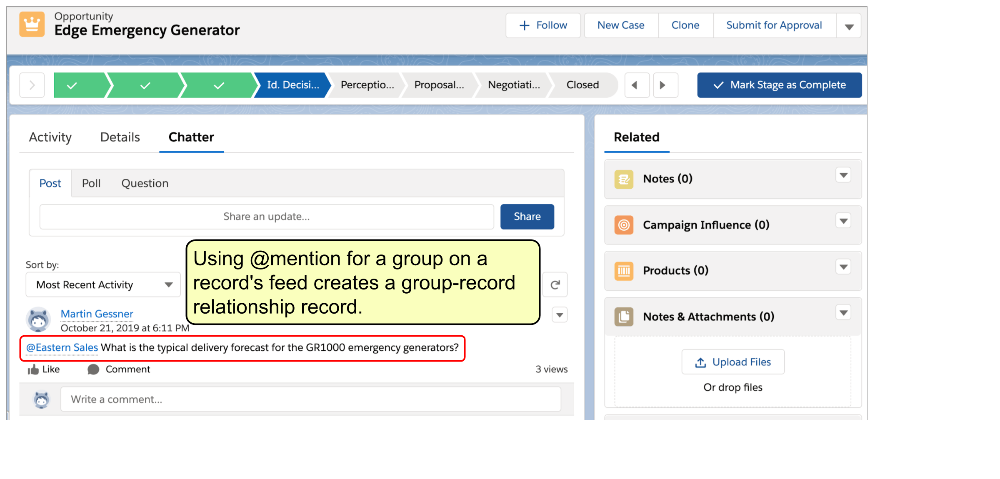

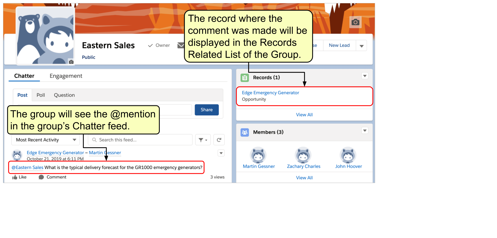

#### Notification Delivery Settings

A sales manager wants to make sure that he is notified in both desktop and mobile channels whenever he is \@mentioned in a Chatter group that he is a member of. He has downloaded the recent Salesforce mobile app on his iPhone. How can this requirement be fulfilled in Notification Builder?

- Enable delivery to the mobile channel in the\
  'Individual mentions on a post' Notification Type.

- Enable delivery to Salesforce Chatter and SF for iOS\
  in the 'Individual mentions on a post' Notification Type.

- Enable delivery to the desktop channel in\
  the 'Individual mentions on a post' Notification Type.

In order to get notified about the posts that a user needs to get notified of, the delivery to the specific channels and applications need to be enabled for the correct notification type. Editing the 'Posts to a group' notification type controls post notifications about all posts in a group where the user is a member. If the Salesforce application is selected but the channel is not, it will pause the delivery of notifications to the application until the delivery to the channel is enabled.

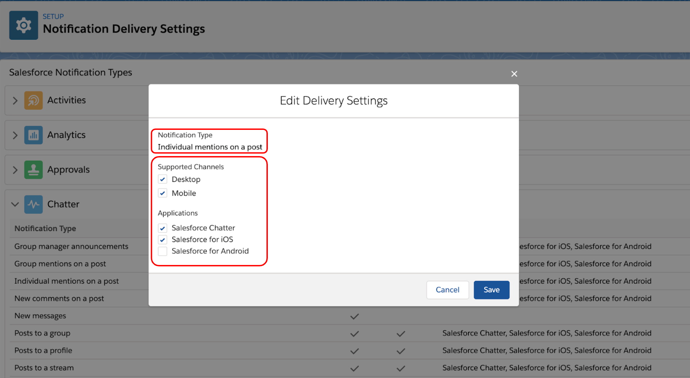

### Group

The marketing team of Northern Trail Outfitters created a Chatter Group to post campaign ideas and get feedback from select employees. What Chatter group configuration would be most appropriate to allow only the group owners and managers to post to the group?

- Broad Only must be enabled

***The 'Broadcast Only' setting can be enabled in any Chatter group such as a private, public, or unlisted group. When enabled, only group owners and managers are allowed to post in the group. Group members, on the other hand, can only comment on the posts. This allows having more focused and relevant discussions in the group.***

*The group setting for Access Type defines who can join the group but does not control who can submit posts. A 'Post Sharing' setting for Chatter groups does not exist.*

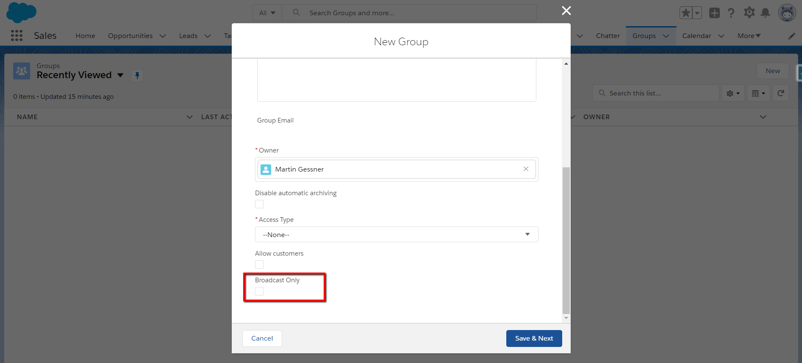

### Chatter Questions

A Salesforce Administrator is providing end-user training on the many features of Chatter. What is true regarding Chatter Questions that the Salesforce Administrator should include in the training?

- An answer can be marked as the best answer for a Question.

- Chatter Questions is available in the Chatter feed, in groups, and in records.

Chatter Questions' is available in the Chatter feed, groups, and records. The person who asked the question or the moderator can select the best answer for a question. Similar questions and knowledge articles appear when a customer asks a question using the 'Question' action in the Chatter publisher.

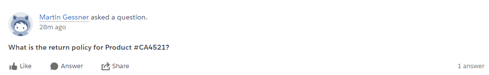

How can the Salesforce Administrator improve community engagement when giving users the ability to ask and answer questions in Chatter?

- Increase the visibility of the Question action in the publisher layout.

Chatter Questions allows users to ask questions in their Chatter feed, groups, and records. The 'Question' action is automatically added to the global publisher layout. To increase the visibility of the action, it can be moved to the left.

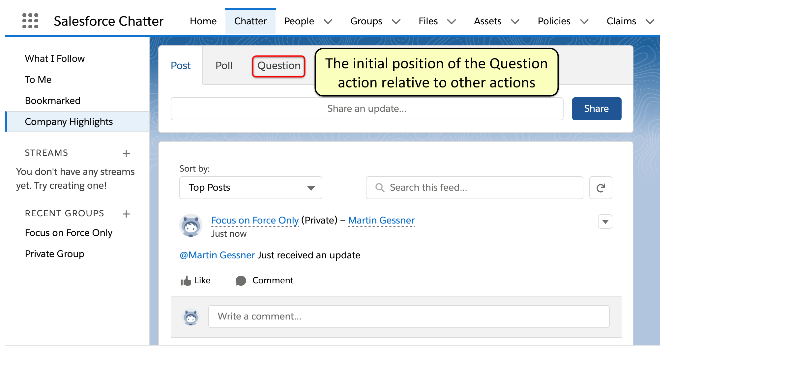

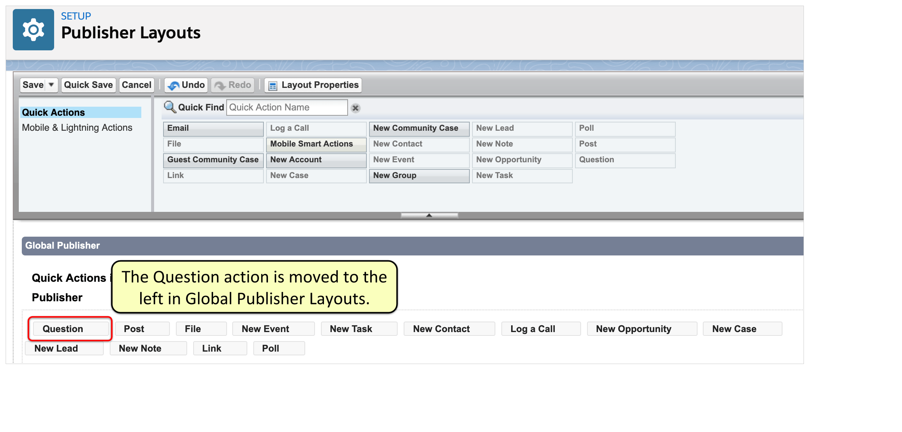

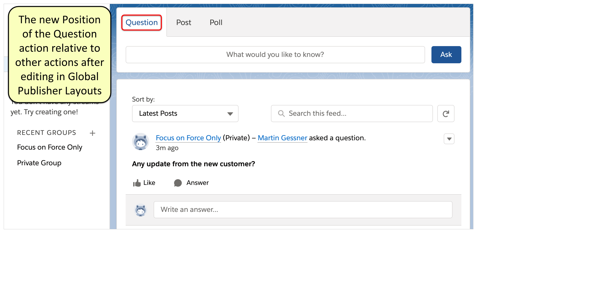

#### Question \| Best Answer

After a question has been asked in Chatter Questions, the best answer can be selected. What is true regarding the best answer?

- Only one answer can be selected as the best answer

- A copy of the best answer appears at the top of the list of answers with a check mark.

Only one answer can be selected as the best answer by the person that asked the question or the moderator. The best answer status can be removed. Once selected, the best answer will appear at the top of the list.

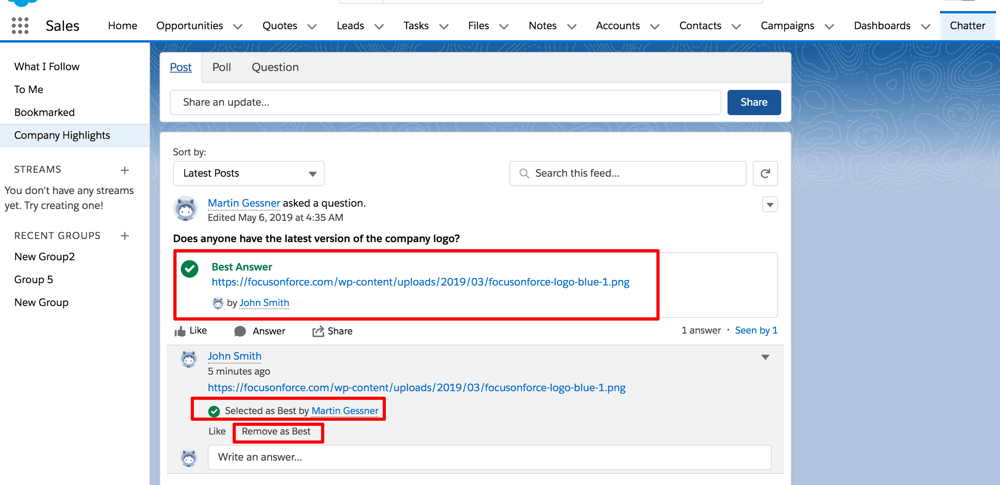

#### Question-to-Case

What should moderators do when a question in Chatter is not resolved?

- Escalate the question directly to a case in the feed using Question-to-Case.

Moderators can escalate an unresolved question in Chatter to a case directly using Question-to-Case. This feature needs to be enabled in Setup – Support Settings. Sending an email to an administrator or leaving the question to another user are not efficient ways to solve this problem. There is not an option to forward a Chatter question.

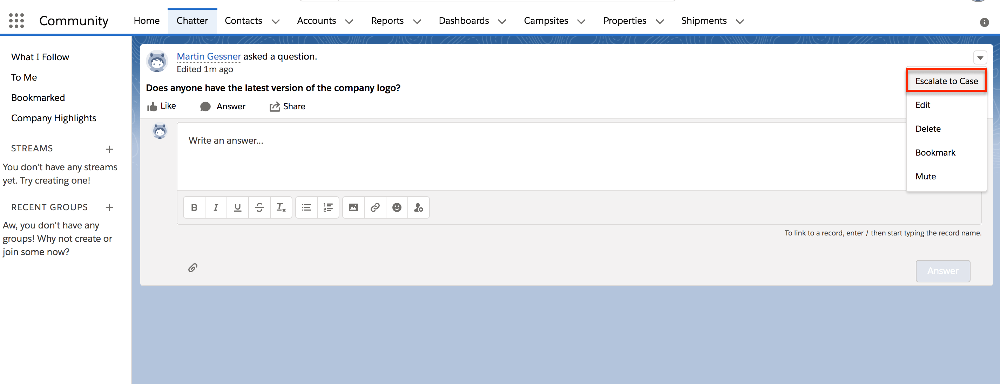

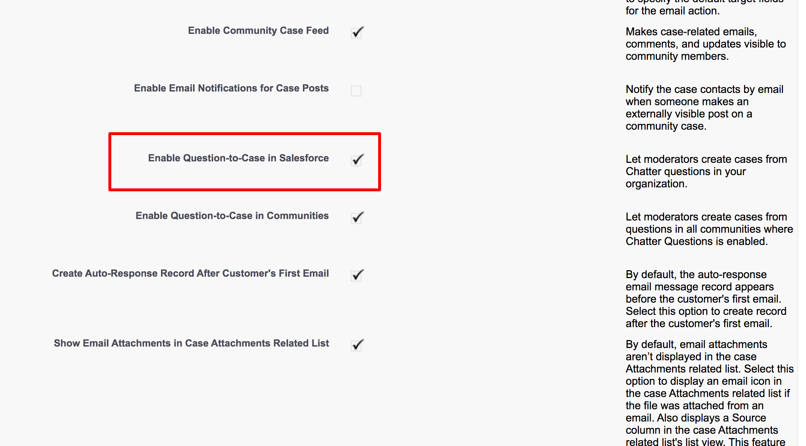

### Email Digest

A user would like to receive email digests of the different Chatter activities in her personal feed. What are the available frequencies that can be chosen when opting for email digests of Chatter activity?

- Daily

- Weekly

***Email digests would include the updates that are in one's Chatter feed. In a personal digest, the updates that can be seen are from the Chatter groups that the user is a member of and the people, records, and files that the user follows. The frequency for these email digests can either be daily or weekly.***

*For daily digests, up to the last 50 updates from the previous day are sent. For weekly digests, up to the last 50 updates from the previous week are sent.*

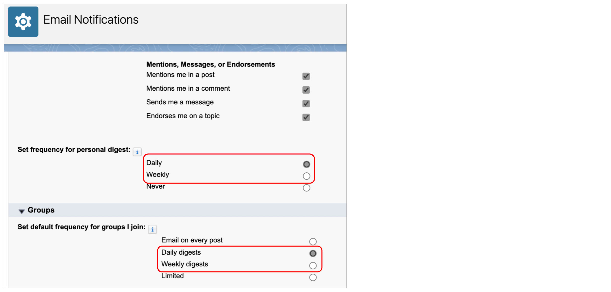

### Chatter External licenses

A company that makes hiking apparel would like to collaborate with partners and find a way to be able to discuss various topics in groups. The collaboration is limited to discussions at this stage. What cost-effective solution would be recommended for this requirement?

- Use Chatter External licenses for the external users.

Chatter free licenses provide access to Chatter for 'internal employees' only. Chatter external can be used to invite users to customer Chatter groups from an email domain 'outside of the organization'. Although a partner community could be set up, the requirement here is for collaboration via discussions only. Chatter external would be a more cost-effective option.

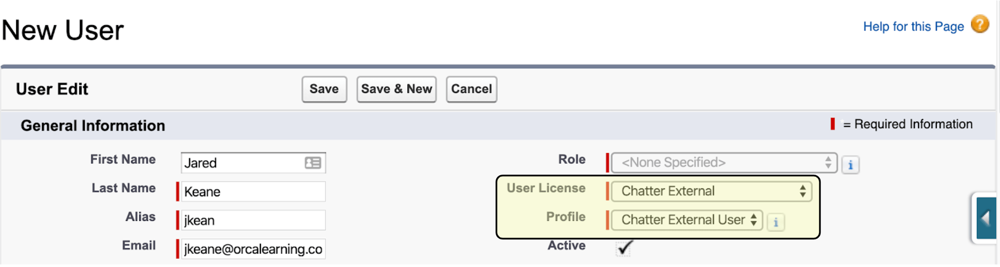

### Chatter Free users

What do Chatter Free users have access to?

- Files shared to the groups they belong to

- Member profiles for any groups they belong to.

A Chatter Free license allows internal users to join and collaborate in groups, post comments, and share files. Users cannot access any Salesforce objects or data.

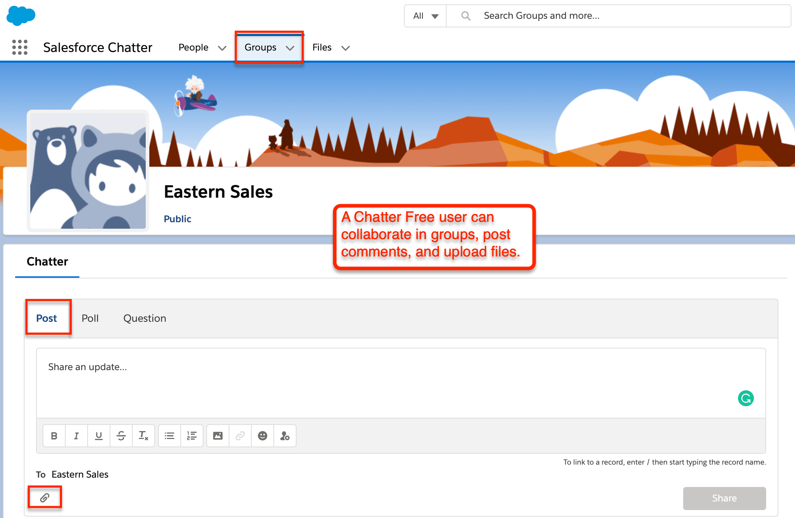

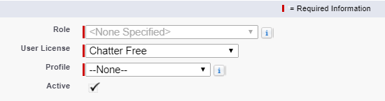

What Chatter License type can be used to provide internal users access to Chatter features only?

- Chatter Free

***Chatter Free licenses provide access to Chatter and its associated components including people, profiles, groups, and files. They have no access to Salesforce objects or data. Chatter External is used to invite customers outside of the organization email domain into Chatter groups.***

*Chatter Only, also known as Chatter Plus provides access to some Salesforce objects in addition to Chatter features. It is no longer available to new customers, only existing Chatter Plus customers can purchase additional Chatter Plus licenses.*

### Chatter Settings

What is true regarding adding records to Chatter groups?

- Records cannot be added to groups that allow customers.

Groups that allow customers do not support adding records. Only certain standard objects support adding records to groups. The setting 'Allow in Chatter Groups' on custom objects determines if the records can be added to groups. Only users with permission to access the records have visibility to the record. Any number of records can be added to a group.

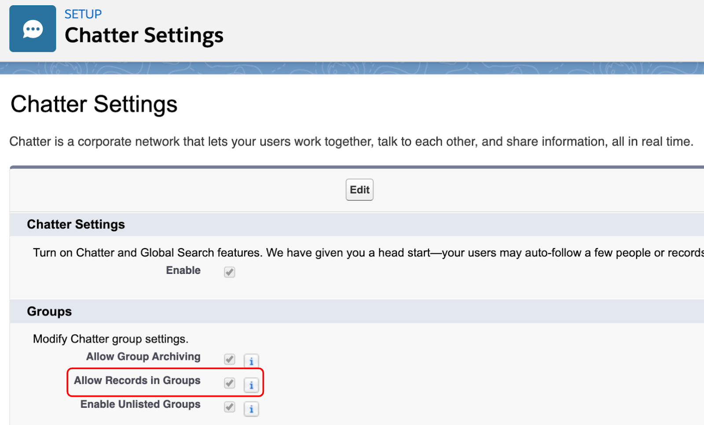

## Report \| Object Feed

The Sales Manager has requested a report of the feeds on certain objects. What is required to keep track of the feed activities on a record?

- Build the report based on a custom report type.

***The Salesforce Administrator can enable the Sales Manager to monitor record feed engagement on standard or custom objects by creating a custom report type with the object’s feed as the secondary object.***

*A 'Feeds list view' or a standard feed report type does not exist. An App Exchange solution is not required.*

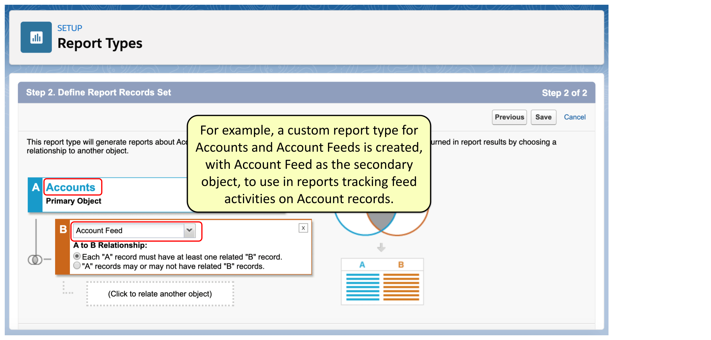

## Sharing File

Which of the following statements are true about sharing files in Lightning Experience?

- A file can be shared privately with specific people

- File permission can be changed by file owners and collaborators

- Sharing a file can be accessed through the File home page.

***In Lightning Experience, a file can be shared privately to allow specific people in the company to view it. Files home can be accessed to navigate to the detail page of a file and share it. File permissions for people and groups can be changed from 'Viewer' to 'Collaborator' and conversely by file owners and collaborators.***

*File permissions for people and groups can be set to 'Viewer', 'Collaborator', or 'Set by Record'. File permissions for files shared with the company can be changed to 'Viewer', 'Collaborator', or 'No Access'. A file is shared with the company when it is posted to a profile, record, public group, or a feed that all users can see.*

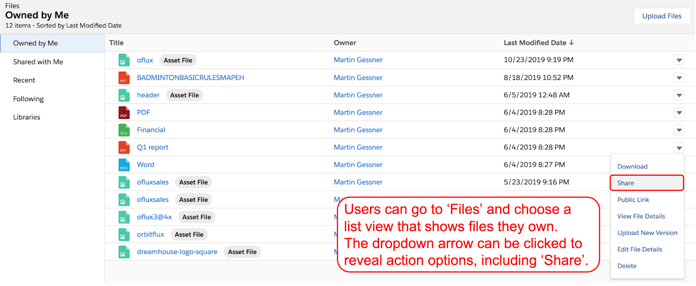

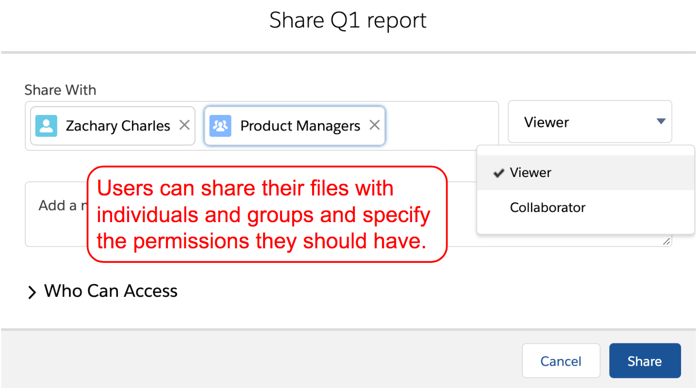

What is the reason the Documents object must be enabled in an organization before customizing the Salesforce mobile app branding?

- Images are stored in a "Salesforce Branding Resources" folder in Documents.

***Uploaded images are stored in a folder named "Salesforce Branding Resources" within Documents. The requirement for the Documents object is strictly for asset storage. In addition, end users must have at least Read permissions on the Documents object, for the custom branding to be visible to them.***

*Salesforce utilizes the older Documents object for this specific administrative feature rather than the newer Salesforce Files/Libraries framework. The branding page is a Setup interface. The Documents object is used for active image rendering in the app, not as a backup or export repository for configurations.*

## Salesforce Mobile App

### Launchpad

What is the maximum number of items an administrator can add to a single Launchpad component?

- 20

A Launchpad component supports up to 20 items, though only the first six are visible until the user expands the component.

<https://help.salesforce.com/s/articleView?id=xcloud.salesforce_app_launchpad.htm&type=5>

------------------------------------------------------------------------

The Sales team is excited to be able to access their data using the Salesforce Mobile App on their phone. The Salesforce Administrator explained that they will be able to access most of their data and functionality, but there are a few limitations. What is true regarding the data and functionality available using the Salesforce mobile app?

- Records can be submitted for approval.

- Account, Contact, and Opportunity records can be created, viewed, and edited.

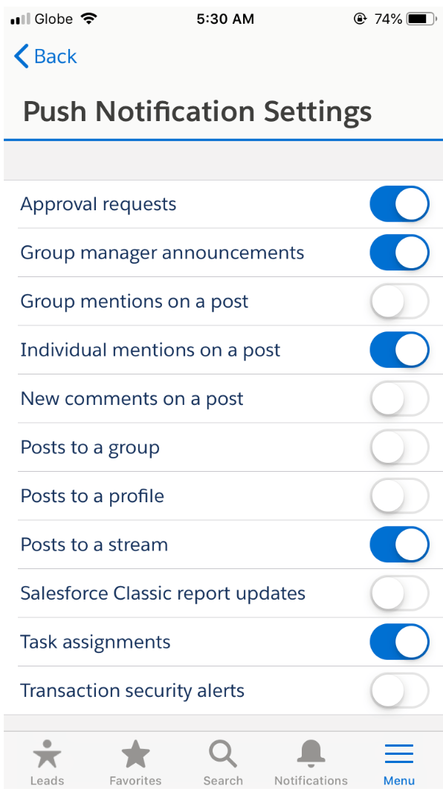{width="449"}

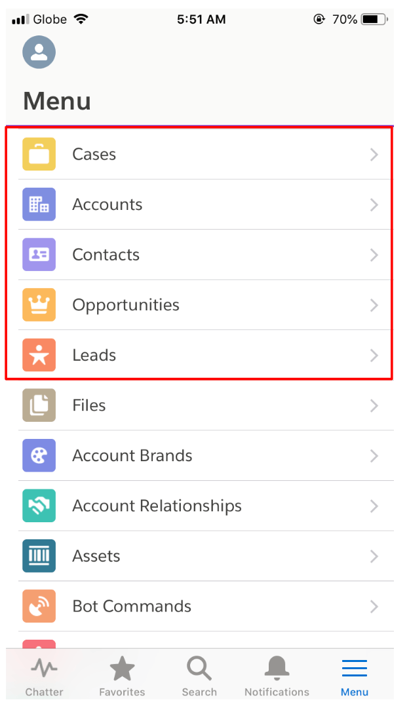{width="520"}

How would a Salesforce Administrator add a custom button to the Salesforce Mobile App Action bar?

- Customize 'Salesforce Mobile and Lightning Experience Actions' on the object page layout.

***Once a custom button has been created, it can be added to the Salesforce Mobile App's Action bar by customizing the 'Salesforce Mobile and Lightning Experience Actions' section on the object page layout.***

*Quick Actions do not relate to customizing the Salesforce Mobile App Action bar. Custom buttons do not automatically display but can be manually created and added through customization.*

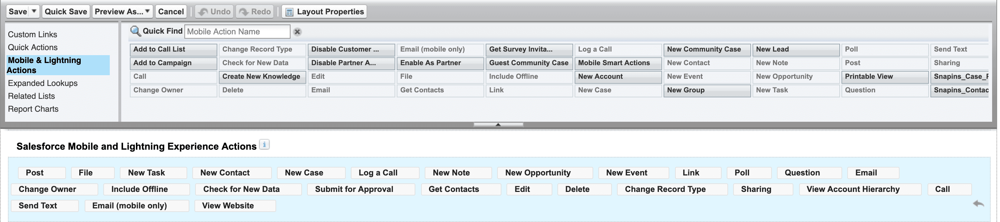

What does a Salesforce Administrator need to do to enable sales reps to change the price book on an Opportunity using the Salesforce mobile app?

- Include the 'Edit' quick action in the 'Salesforce Mobile & Lightning Experience Actions' on the Opportunity page layout.

- Add the Price Book field to the Opportunity page layout.

Because the Price Book field is now available on Opportunities, a user can create a quick action that allows users to add this information. Adding the Price book field to the Opportunity page layout ensures that the sales reps can see the field and adding the 'Edit' standard quick action allows them to edit that field in the Salesforce mobile app.

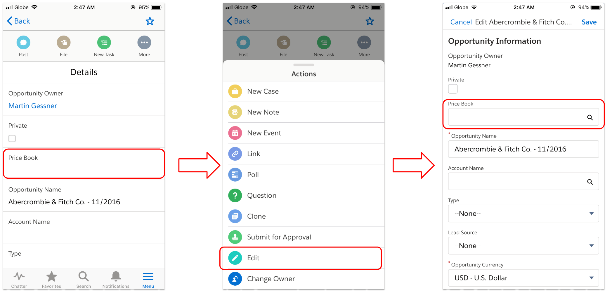

Which of the following is true when a user converts a lead using the Salesforce mobile app?

- Duplicated records can be created

***Based on the duplicate alert a user receives when converting a lead, the user can decide to either save the records that could create duplicates or select other records to avoid duplicates altogether.***

*Lead conversion is available in Essentials, Group, Professional, Enterprise, Performance, Unlimited, and Developer Editions. A new contact can be associated with a newly created account and not just with an existing account. During lead conversion, the values of the mapped lead fields will not overwrite the existing values in the mapped contact fields.*

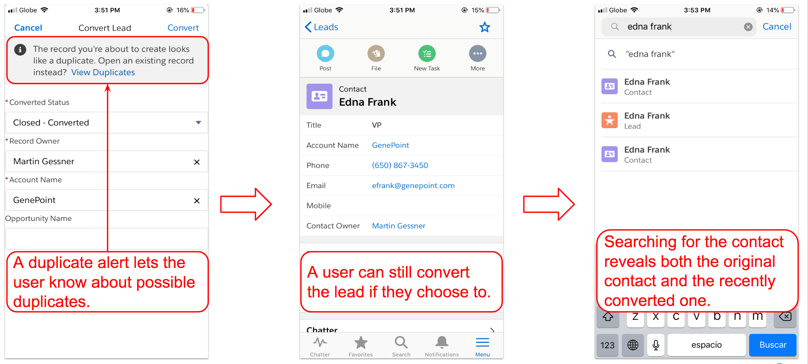

#### Push Notifications

To ensure that users of the Salesforce mobile app stay informed about critical events and notifications, the Salesforce Administrator is contemplating the activation of push notifications. Once enabled, which of the following statements about this feature is accurate?

- Push notifications can be sent when a task is assigned to a user

- Push notifications can be sent for Chatter group mentions

- Push notifications can be sent for approval request

***In the mobile app settings, users can customize the specific notifications they would like to receive. Notifications are available for a number of events including approval requests, task assignments, Chatter mentions, Chatter group mentions, and when report thresholds are met.***

*Push notifications must be enabled for the org by the Salesforce Administrator. The full content push notifications configuration is enabled by default for the Salesforce mobile app, but users can choose to display minimal content instead.*

{width="520"}](images/clipboard-2569815895.png)

#### Users in Assigned Territories

Cosmic Ceramics has enabled Sales Territories and created an Eastern U.S. territory. It has also assigned a large account and ten sales reps to that territory. A sales manager, who is using a smartphone, wants to identify the sales reps who will have access to the account because they have been assigned to the Eastern U.S. territory. How should the sales manager find the information?

- The sales manager should check the Users in Assigned Territories related list on the account.

***The 'Users in Assigned Territories' related list was created to find which users have been assigned to a particular territory. Manual searching for territory users and asking the Salesforce Administrator for assistance in finding them are both inefficient ways of getting the information. There is no standard Territories object.***

*Note: In Summer '24, Enterprise Territory Management has been renamed to Sales Territories. Users can manage territories as they previously did with Enterprise Territory Management under the name Sales Territories. The new name more accurately reflects the essential disciplines of designing and managing territories within teams' broader sales performance management efforts. Additionally, Sales Territories is not limited to enterprise businesses.*

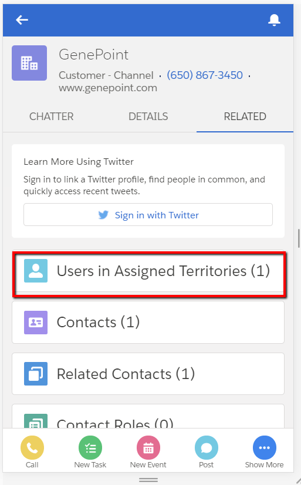

### Report Highlights

Future Electronics has 15 sales metrics that are measured in its contact center. The sales manager receives a report that contains the center's performance for each metric. However, she wants to be able to immediately see the high-level overview of three specific metrics when she views the report in the Salesforce mobile app. What feature can help achieve this requirement?

- Report Highlights

***Report Highlights can be used to display up to eight key report metrics in the header of the report run page.***

*Conditional formatting is used to highlight if data within the report is within or outside of a particular threshold. Salesforce does not have features called 'Featured Data' or 'Data Priorities'.*

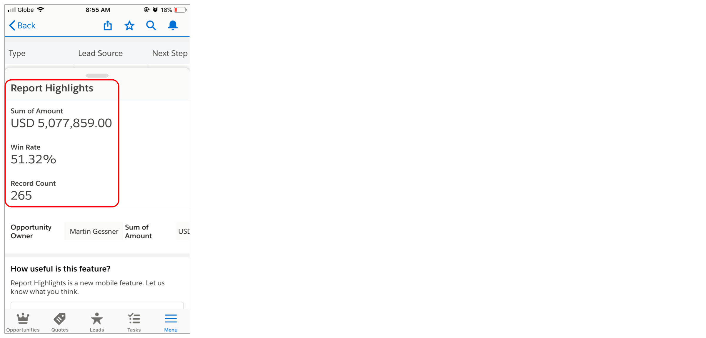

## Salesforce mobile app \| On Table

Which of the following features are available on the Salesforce mobile app with 'Lightning on tablet' enabled?

- Better performance

- Design time previews in the Lightning App Builder

- Rotation between portrait and landscape modes

***Lightning on tablet, the full-width tablet app experience, provides better support and performance while using Salesforce mobile app on iPad and Android tablets. It supports rotation between portrait and landscape modes, as well as design time previews while working on the Lightning App Builder, record pages, navigation, and Lightning apps.***

*Although Lightning apps built for mobile phones work in the new tablet experience, standard Salesforce apps and the Salesforce Console are not supported for the Salesforce mobile app.*

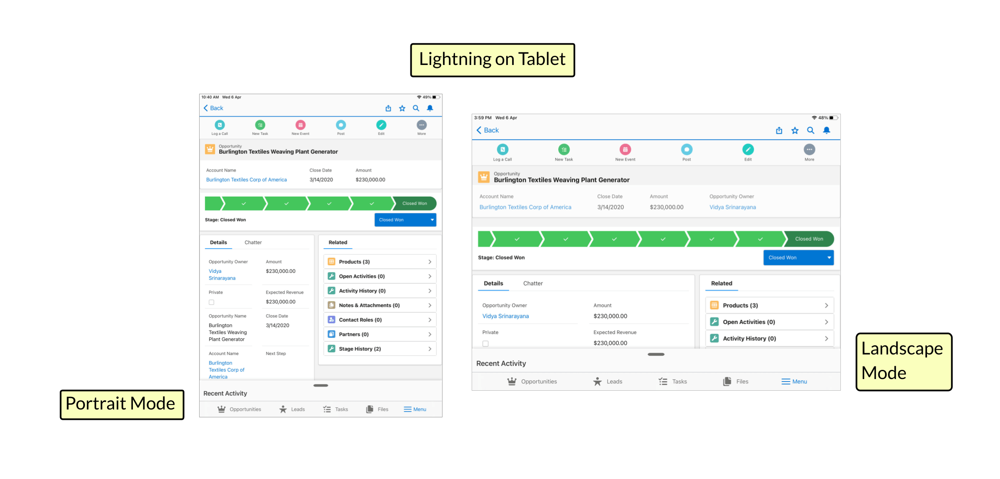

## AppExchange

Acme Corporation would like to manage email campaigns, send mass emails, and track responses back in Salesforce. They do not need the complete functionality of Marketing Cloud at this stage. They envision that they need to send about 300,000 emails for a campaign in a month. What should the Salesforce Administrator suggest?

- Use a third-party app from the AppExchange

A number of AppExchange applications offer functionality to send mass emails and track responses back in Salesforce, including apps created by email campaign providers. Standard campaign functionality is intended to track campaigns and influence. You have the capability to send mass email and list email, with a maximum limit of 5,000 external email addresses per day for each licensed Salesforce organization.

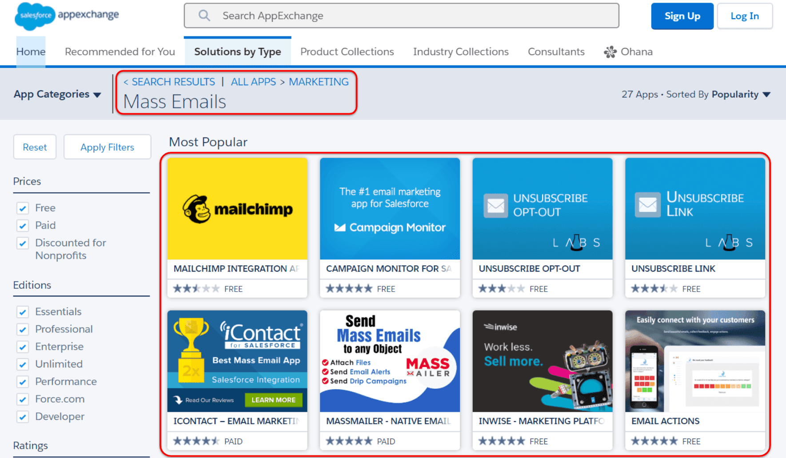

ABC Technologies has recently completed a large marketing campaign across the globe. The Marketing Director wants to gather customer feedback related to the campaign. He wants to use Salesforce for sending survey forms and collating the survey results directly within Salesforce. How can a Salesforce Administrator meet this requirement?

- Use the Salesforce native survey functionality

- Look for an AppExchange survey application that metts the requirements.

***Salesforce surveys allow collecting feedback and data from users or customers. It does not require additional licenses. However, after a certain number of responses are received, an add-on response pack must be purchased to receive additional responses. Surveys can be distributed to multiple participants (leads, contacts, campaign members) at a time.***

*There are a variety of survey applications available on AppExchange that could meet the requirements and avoid custom development and integration.*

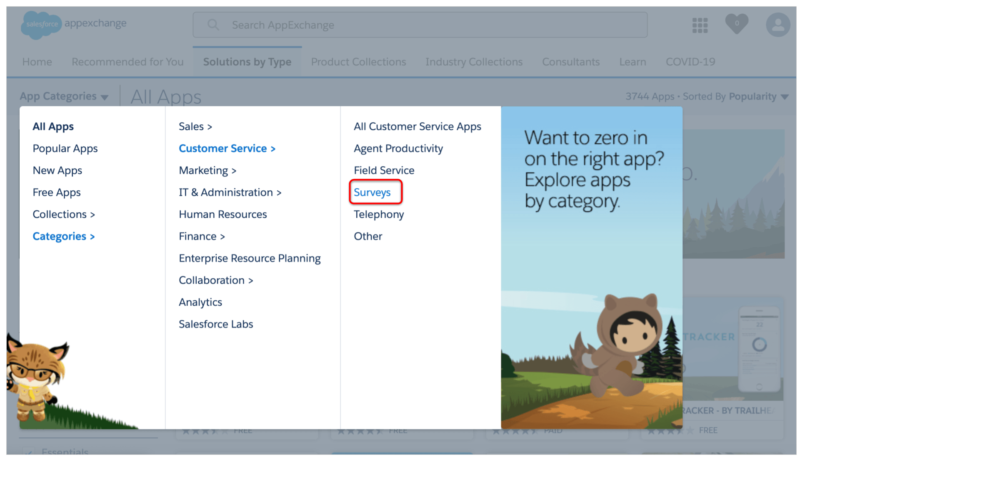

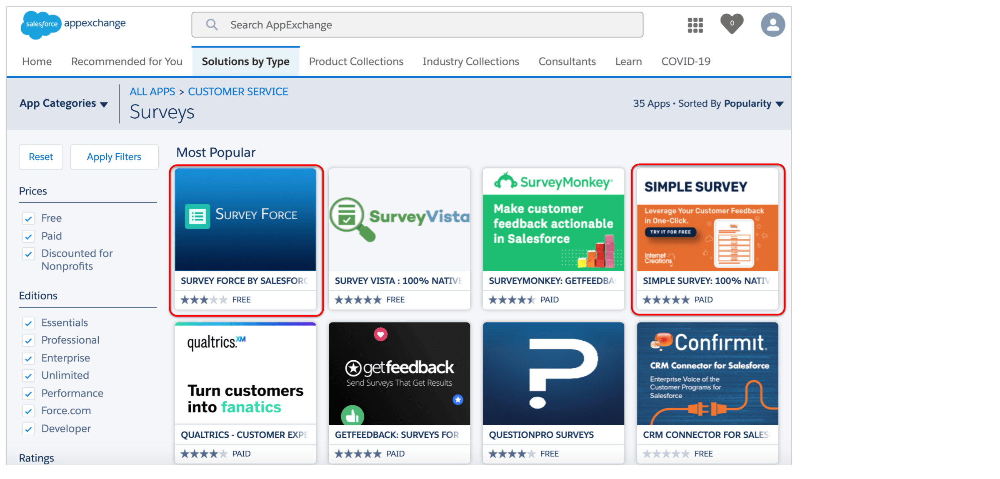

A connection from Salesforce to an existing cloud application is required. What should an administrator first do when evaluating the level of effort?

- Search for a connector or app for the application on the AppExchange

The first step for this type of requirement is to search for a connector for the cloud application on the AppExchange.

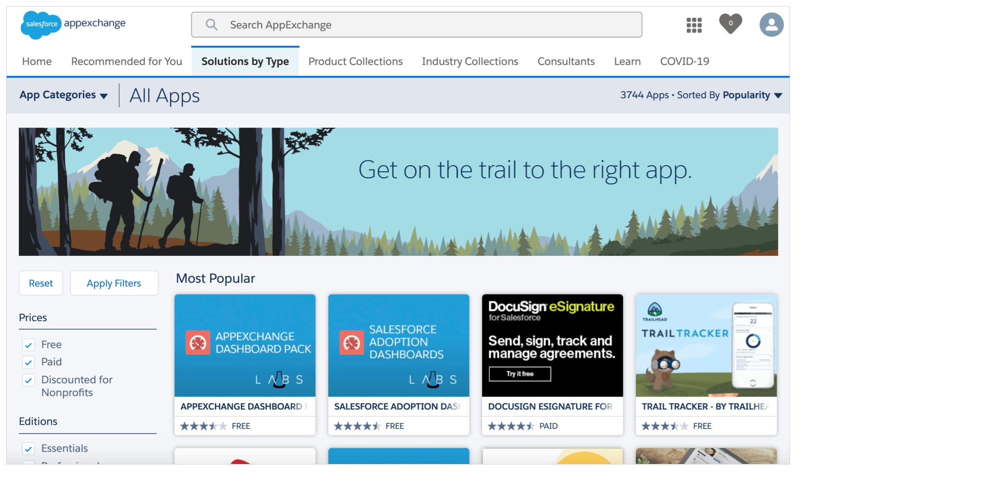

### Credit card Payment

Cosmic Learning Solutions uses a Lightning Flow to gather information from customers regarding their interest in products. The administrator of the company is required to add a functionality to the flow that allows accepting credit card payments from the customers. What can the administrator do to meet this requirement?

- Download and install a Flow Solution from the AppExchange and use it in the flow.

***Flows can be extended with third-party systems and apps using Flow Solutions on AppExchange. A Flow Solution can be utilized for use cases such as accepting credit card payments, conducting credit checks, and weather forecasts.***

*Creating a Visualforce page would require programmatic development. It is more practical for an administrator to utilize a declarative approach for a requirement. A Lightning page cannot be embedded within a flow. A Bolt Solution is a template that can be based on flows, but the requirement is to use the existing flow for accepting credit card payments. The bolt solution is a pack of pre-built solutions, which cannot be extended to include the existing flow however, the flow solutions can be extended to include the third-party apps.*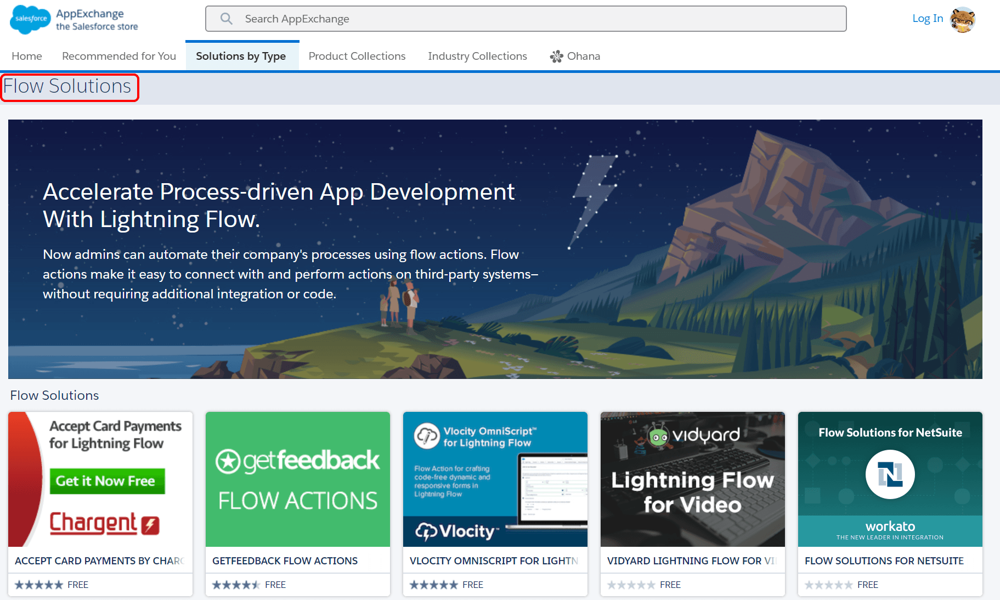

## AppExchange ISV partner 

A Salesforce administrator has created a unique solution and wishes to list it as a paid application on the AppExchange. Which step is required to transition from a prospective developer to an official AppExchange ISV partner?

- Join the Salesforce Partner Community and sign the Partner Program Agreement.

***Official recognition as an AppExchange ISV partner is primarily established through legal and community onboarding. A developer must join the Salesforce Partner Community, which serves as the central hub for all partners, and execute the Salesforce Partner Program Agreement (SPPA). This process grants access to essential tools like the Partner Business Org (PBO), and the ability to submit applications for business and security reviews.***

*Trailhead badges and specific technical certifications, while beneficial for professional development, are not mandatory legal requirements for becoming an ISV partner. Furthermore, Salesforce does not require the upfront purchase of a specific number of licenses. Instead, partners are typically provided with a trial Partner Business Org that includes a limited number of free licenses upon signing the agreement.*

A Salesforce administrator is preparing a production-ready managed package for publication. Which combination of user permissions is necessary for a user to successfully upload a package to the AppExchange?

- Create AppExchange Packages and Upload AppExchange Packages permissions.

***Salesforce requires two specific administrative permissions to handle the lifecycle of a package intended for the marketplace. The "Create AppExchange Packages" permission allows a user to bundle metadata into a package, while the "Upload AppExchange Packages" permission is specifically required to send that package to the AppExchange for distribution. Without both of these specific functional permissions, a user will be unable to complete the publishing process.***

*The "Download AppExchange Packages" permission is intended for users who need to install apps, not those who are publishing them. While "Customize Application" and "View/Modify All Records" provide broad administrative power, they do not inherently grant the specific rights needed to create or upload packages for public distribution. Similarly, "Manage Billing" and "Author Apex" are specialized permissions for financial administration and coding, respectively, and do not directly relate to the packaging and uploading workflow.*

### AgentExchange

A Salesforce administrator is browsing AgentExchange to find modular AI solutions that can be integrated into an existing Agentforce configuration. Which primary types of components are available for discovery and deployment on this marketplace?

- Prompts, Actions, Topics, and Agent Templates.

***AgentExchange is specifically designed as a marketplace for "agentic" building blocks that extend the capabilities of Agentforce. The four core component types available are Prompts (instructional scripts), Actions (tasks the agent can perform), Topics (groupings of related actions and instructions), and Agent Templates (pre-configured, end-to-end agent structures). These modular elements allow organizations to rapidly deploy components tailored to specific industry needs or business roles without extensive custom development.***

*Custom Objects and Page Layouts are fundamental data architecture elements, but are not specialized components of the AgentExchange marketplace. Lightning Web Components (Aura, etc.) are for building user interfaces, rather than providing the reasoning or action logic required for autonomous AI agents. Reports and dashboards are data visualization tools rather than active agentic components.*

<https://appexchange.salesforce.com/learn/agentexchange-explained>

<https://agentexchange.salesforce.com/>

An organization wants to explore pre-built AI solutions developed by trusted partners to improve their service efficiency. Through which primary locations can a user officially access the AgentExchange marketplace?

- The AppExchange navigation menu and the Agent Builder interface

***AgentExchange is accessible through two primary channels designed to fit different user workflows. First, it is integrated into the main navigation of the AppExchange, where a dedicated "Explore" category for Agentforce provides a marketplace view of all available components. Second, for administrators already working within the platform, it can be accessed directly from the Agent Builder by navigating to the "This Topic’s Actions" section, allowing for seamless discovery and installation while configuring an agent.***

*While "Setup" is used to enable Agentforce, it does not serve as the marketplace for third-party components. There is no (standard) "Agent Marketplace" application in the App Launcher, as the marketplace is hosted within the AppExchange ecosystem. Furthermore, the Help & Training portal provides documentation and support but does not serve as a distribution platform for installing production-ready AI components.*

<https://appexchange.salesforce.com/learn/agentexchange-explained>

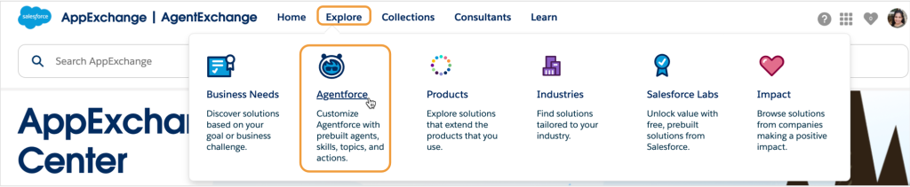

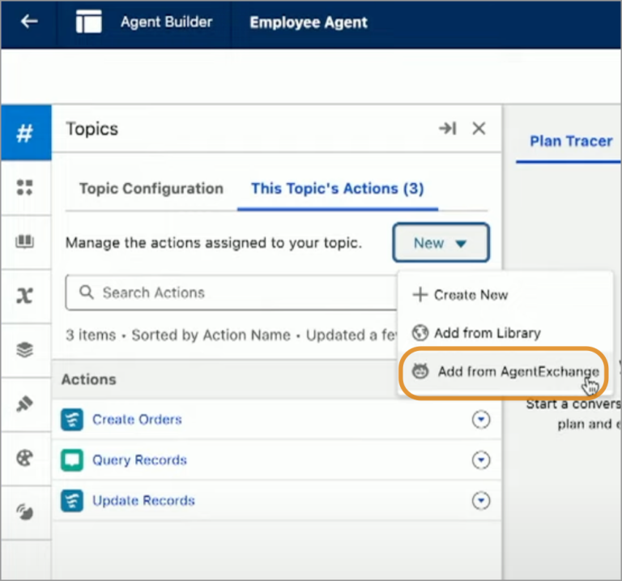
