# Sales and Marketing Applications

Objective 1 \| 40 Questions

Which objects are Sales objects?

- Leads, Campaigns, Opportunities, and Orders

Leads, Campaigns, Opportunities, and Orders are sales objects.\
Case, Entitlements, Service Contracts and Knowledge are support objects.

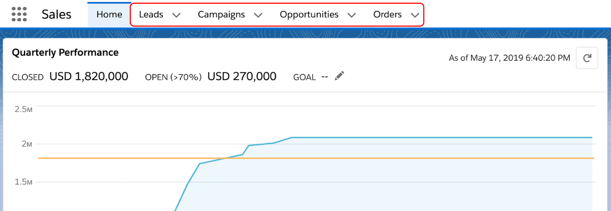

Which of the following are true regarding Web-to-Lead?

- Data entered in the web form is validated before a record is created in the Salesforce org.

- Standard and custom fields that need to be captured online can be selected.

- The default lead creator for web-generated leads can be specified.

***Salesforce runs validation rules before the data entered into the web form is created as a record in the Salesforce org. Assignment rules can be used to assign leads to different users. If assignment rules are not used or do not locate an owner, the lead will be assigned to the default lead creator.***

*The maximum number of leads that can be captured per day is 500. Using reCAPTCHA can reduce the number of spam entries that otherwise would have gone through.*

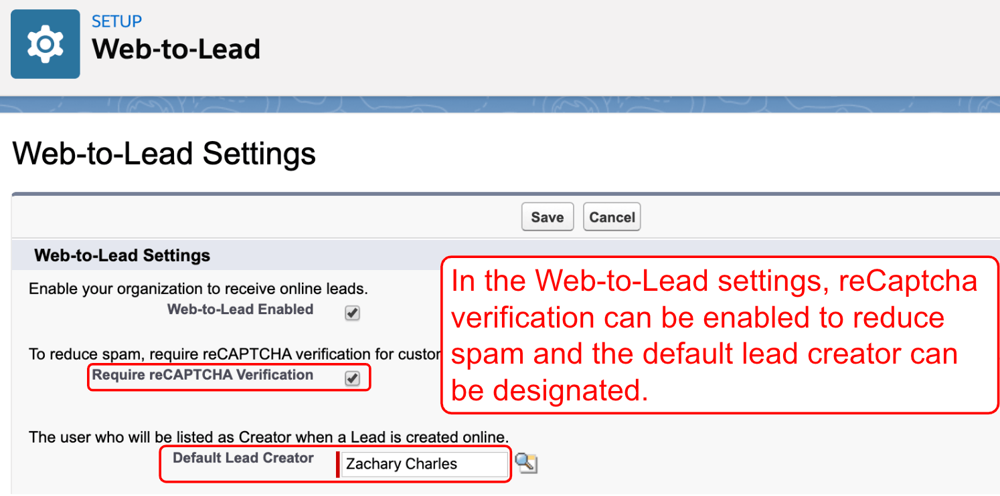

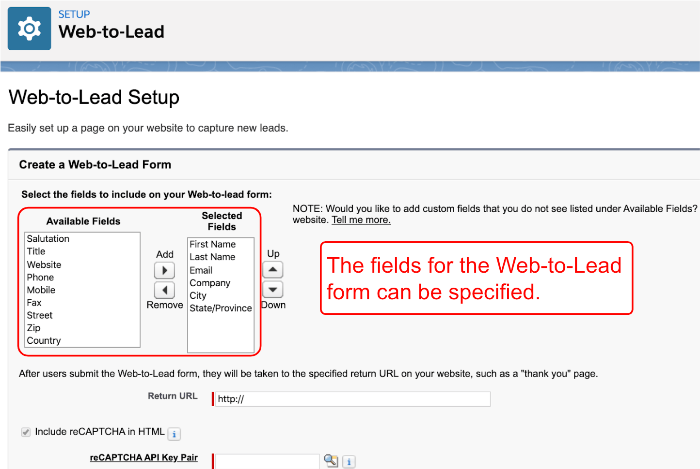

## Product

Cosmic Enterprises will be adding a new product that will be delivered once ordered but billed in quarterly installments for one year. How can this be reflected in Salesforce?

- Create a default revenue schedule for the product.

As the product is delivered at one time but the revenue will be received in installments, a revenue schedule that defines the revenue amounts and number of installments should be created.

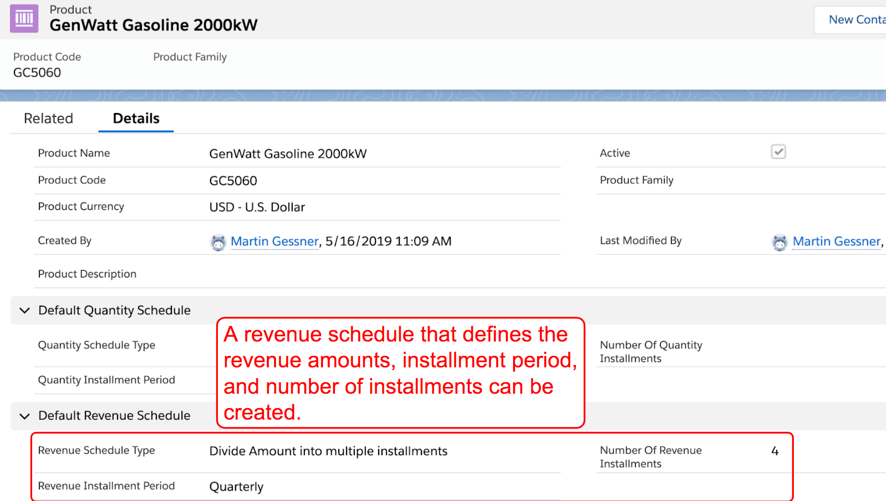

## Price Books

How many standard price books can an organization have?

- 1

An organization can have only 1 standard price book. However, it can have multiple custom price books.

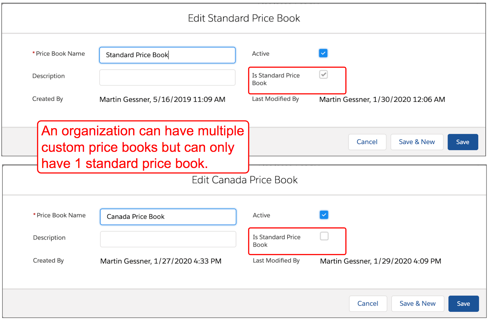

## Sales Process

Jim is an administrator for Carly Automotive, a distributor of automotive spare parts. They have just launched a new line of truck parts. The sales process for these parts will be different from the process used for existing products. Managers also need to be able to view information related to the new opportunities on reports. What should Jim do to configure the opportunity object for this new product line?

- Create a new sales process and record type for truck parts.

Since the set of opportunity statuses for the truck parts line is new or different to the set used in existing sales processes, a new sales process should be defined. This does not affect the existing sales process and allows the statuses that apply to each sales process to be viewed on the appropriate record type.

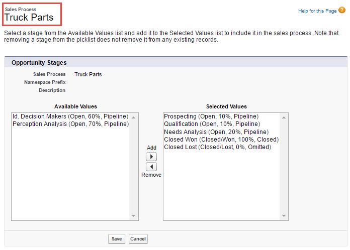

## Opportunity \| Teams and Splits

Sarah is the manager of a team of sales reps who collaborate on Opportunities. They are each awarded an appropriate share of the total sale on each Opportunity. Which of the following features should her company implement?

- Opportunity Splits

- Opportunity Teams

Opportunity Teams (Team Selling) allow defining a team that works together on opportunities. Opportunity Splits allow opportunity revenue to be split by percentage for each team member. Team members must be in the Opportunity Team in order to add them to Opportunity Splits.

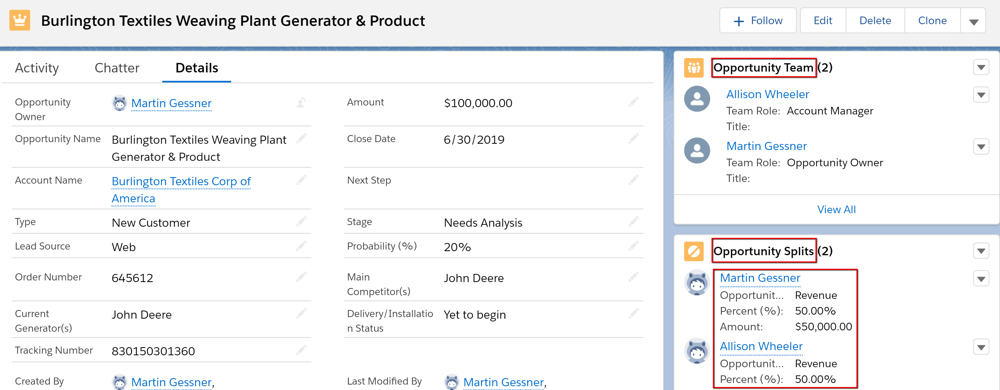

------------------------------------------------------------------------

An organization wants to sell its products at different prices to different types of customers. How can this be set up?

- Create a price book for each customer type

***Separate price books can be set up for different customer types. The price book can be selected when the Opportunity Products are added.***

*A flow would not be the best solution as it would apply the update to all products.*

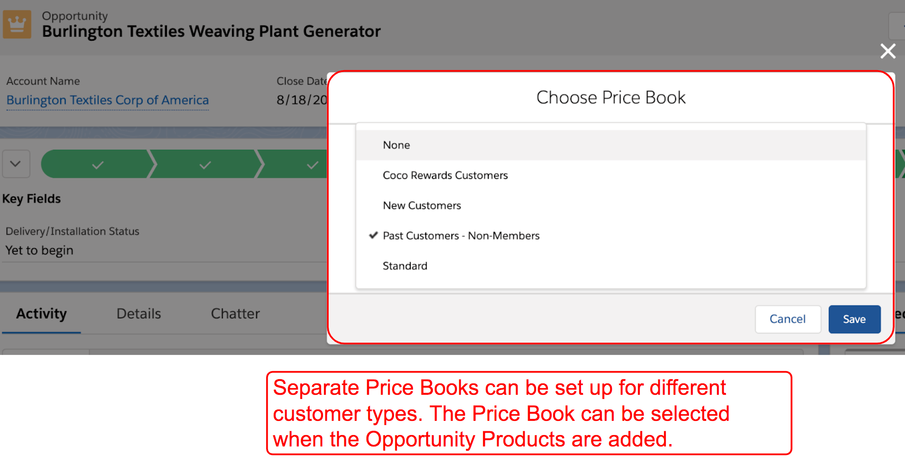

## Reports

The Director of Sales wants a report that shows the Opportunity pipeline for the current and succeeding fiscal quarters. This report should be grouped by Sales Rep and Opportunity Stage. Which report format would be best to use to create this custom report?

- Matrix Report

***A matrix report can be created and the 'Stage' and 'Opportunity Owner' fields used in column and row grouping respectively. 'Fiscal Period' can be used in either row or column grouping to show information by each fiscal quarter. A Matrix Report is ideal when you need to group data by rows and columns.***

*A Summary Report only groups data in a single dimension (e.g., by Sales Rep or Opportunity Stage) but not both simultaneously. A Tabular Report only displays data in a simple list without any grouping and a Joined Report combines data from multiple report types but is unnecessary for this requirement.*

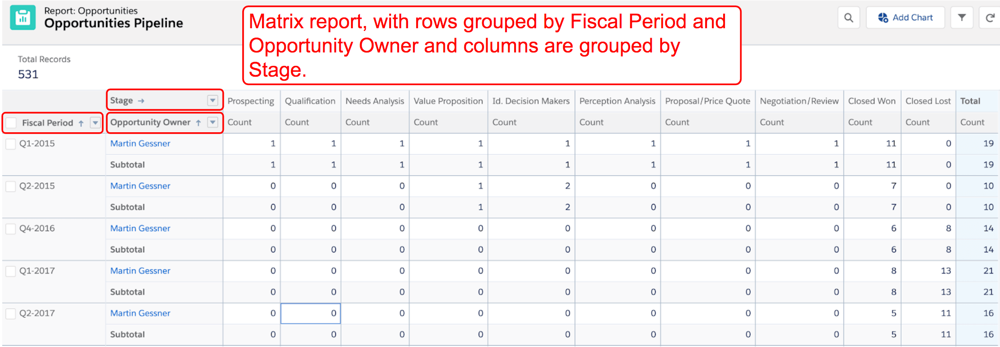

## Lead Conversion

Which of the following are true regarding the Lead Conversion process?

- An Account is created if one with the same name is not found and selected.

- A Contact is created if one with the same name is not found and selected.

- If Person Accounts are enabled and the Company field does not have a value, a person account will be created.

***An Account or Contact is created from lead conversion if there are no other records with the same name.***

*Creating an Opportunity on Lead conversion is optional. Custom Lead fields can only be inserted into custom fields on the Account, Contact or Opportunity.*

*If Person Accounts are enabled and a value is not entered into the Company field, the lead is converted to a person account.*

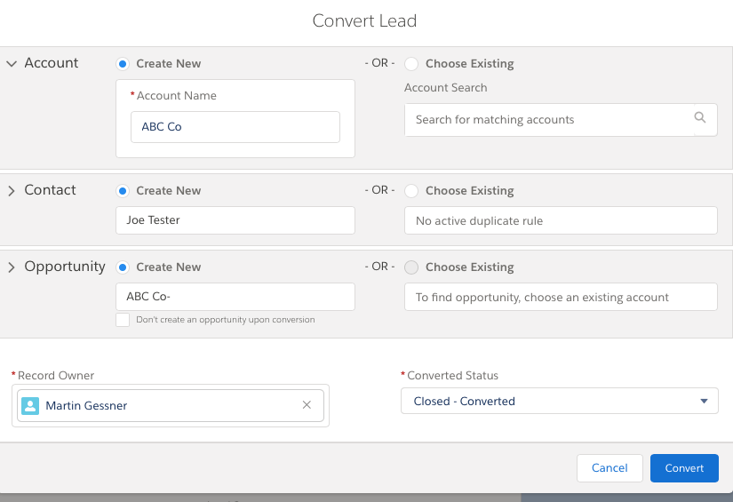

## Order

Next Treks is using the Orders functionality in Salesforce to track products purchased. One customer has requested to return products previously purchased as they are defective. How can this be tracked in Salesforce?

- Create a reduction order and add one order product with the original quantity.

***Reduction orders allow tracking of product returns and relating the return to the original order. They can be enabled in 'Order Settings' in Setup.***

*Reduction orders are created on the detail page of the order. After creating a reduction order, it is necessary to indicate which products should be reduced as well as the corresponding quantities.*

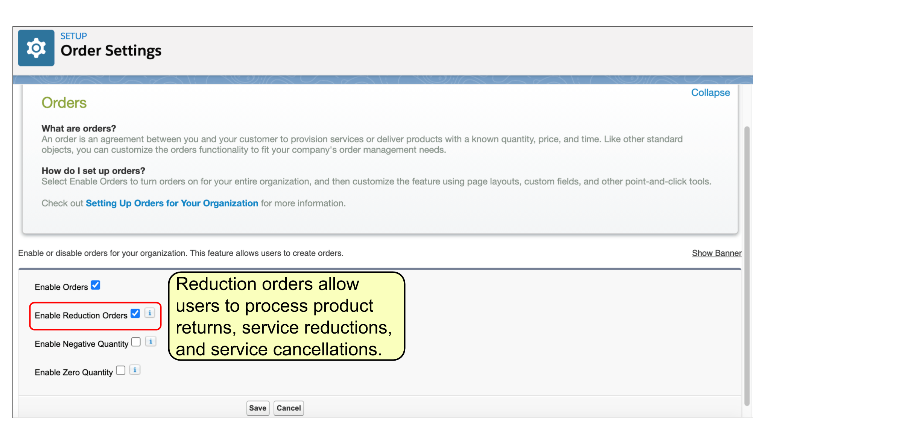

## Assistant

The sales reps of Cosmic Solutions would like to view certain important updates about their leads and opportunities in Salesforce as soon as they log in and over the course of the day. These updates should include overdue opportunities, leads assigned to them on the current day, and opportunities with no activity in 30 days. Which standard Lightning component can the company's administrator add to the Home Page assigned to the sales reps for this requirement?

- Assistant

***The 'Assistant' can be added to the Home page in Lightning Experience to show important updates about leads and opportunities over the course of the day. It shows the following updates:***

*1) Leads assigned to the current user today\
2) Opportunities with overdue tasks\
3) Opportunities with no activity in 30 days\
4) Opportunities with no open activity\
5) Overdue opportunities*

*The 'Recent Items' component displays a set of recently viewed records. The 'Today's Events' component displays the user's next five events scheduled today and a link to the user's calendar. There is no component called 'Today's Updates'.*

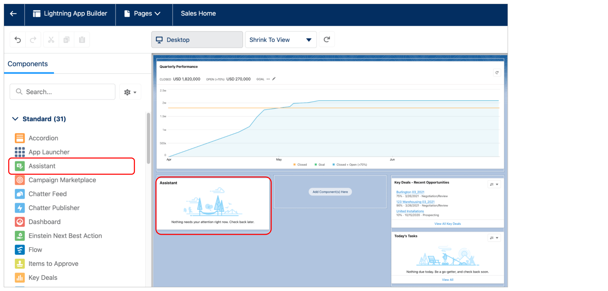

## Forecast

The Salesforce Administrator of Cosmic Fitness Solutions has activated a forecast type based on the 'Amount' and 'Close Date' fields on the Opportunity object. One of the sales managers has been assigned as a forecast manager. She would like to share the forecasts she can view on the Forecasts page in Lightning Experience with another sales manager. What should the Salesforce Administrator recommend for this use case?

- Use the 'Share' button on the Forecasts page to share the forecasts.

***Forecast managers in a role-based forecasts hierarchy can share their forecasts page with any Salesforce user using the 'Share' button on the page. The access level of 'View Only', or 'View and Edit' can be selected while sharing the forecasts. Users with 'View and Edit' access can make adjustments.***

*It is not possible to export forecasts using a link on the Forecasts page. Building a Forecasts page is not necessary for the purpose of sharing forecasts. There is no 'Subscribe' feature for forecasts.*

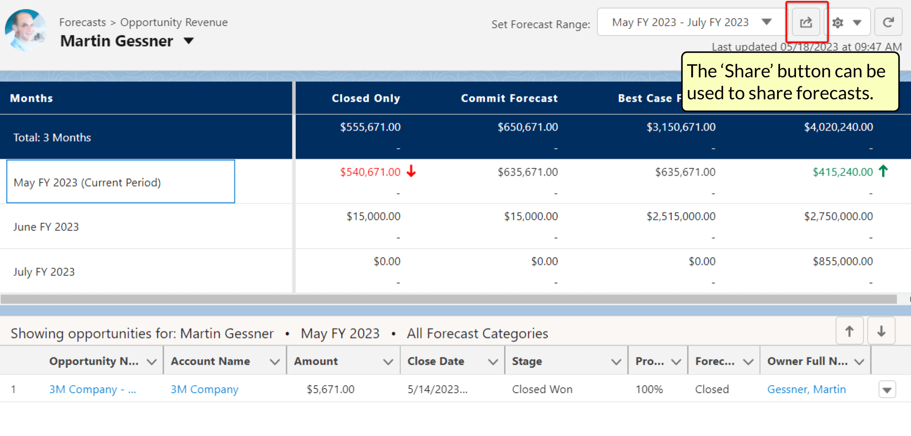

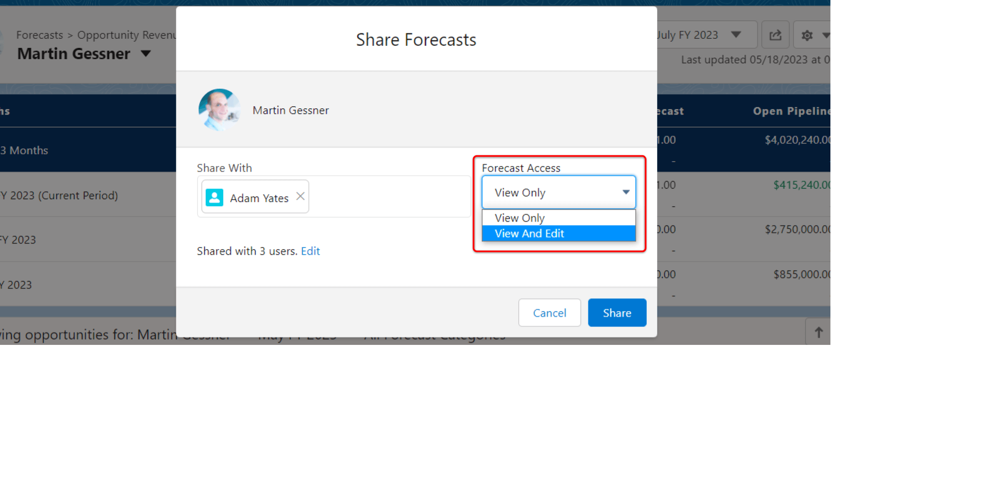

The Sales Managers at Cosmic Computing want to view Opportunities with an annual recurring revenue of more than 100,000 on their Forecasts page. 'Annual Recurring Revenue' is an Opportunity custom currency field. Furthermore, they want to calculate the gap-to-quota value and view it within the Forecasts page. How can this be accomplished?

- Add a new forecast filter within the forecast type.

- Create a new caulculated forecast column via Forecasts Settings.

## Territory

Cosmic Repair Solutions has set up Sales Territories in their Salesforce org. The Sales Director of the company would like to allow sales representatives to view the sales forecasts for the territories to which they are assigned. Which forecast types should be used for this requirement?

- Opportunity Revenue by Territory

- Opportunity Quantity by Territory

***Sales Territories can be used with Pipeline Forecasting. Opportunity Revenue by Territory and Opportunity Quantity by Territory forecast types can be added to enable territory forecasts and allow sales users to view opportunity revenue forecasts and opportunity quantity forecasts by territory. Up to 4 forecast types can be active in Forecast Types.***

*The Opportunity Revenue forecast type allows forecasts to be based on the fields 'Amount', 'Close Date', and any custom date field on the Opportunity object.*

*Note: In Summer '24, Enterprise Territory Management has been renamed to Sales Territories. Users can manage territories as they previously did with Enterprise Territory Management under the name Sales Territories.*

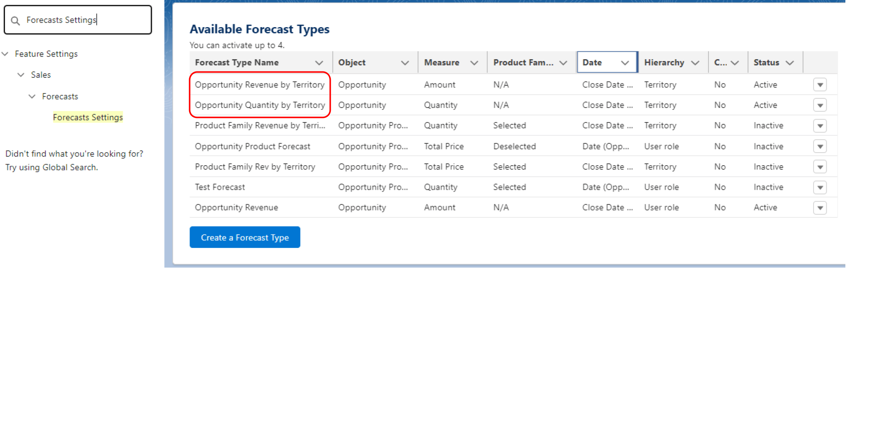

## Sales Process

Which are true regarding how Salesforce supports the sales process?

- Salesforce features include leads, campaigns, products, price books, opportunities, and quotes.

- Salesforce supports selling different products or services with different processes.

- Opportunity Teams can be used to allow a group of people working on a deal to be associated with an opportunity.

***Contact Roles for opportunities track which contacts are related to the opportunity and the role they play. Contacts from other accounts can be linked to the opportunity using contact roles. It is a Customizable Campaign Influence and not Team Selling that is used to attribute a percentage of success to influential campaigns. Team Selling is a feature that allows members of an Opportunity team to work on a deal together and split generated commissions or revenue.***

*Salesforce standard objects which include Leads, Campaigns, Products, Price Books, Opportunities, and Quotes support different aspects of the sales process as a default. Different sales processes specific to the organization can also be configured for various types of products, product lines, or services. Lastly, the Opportunity Team can be configured to add multiple users to an Opportunity wherein each member of the team can be assigned roles and special access.*

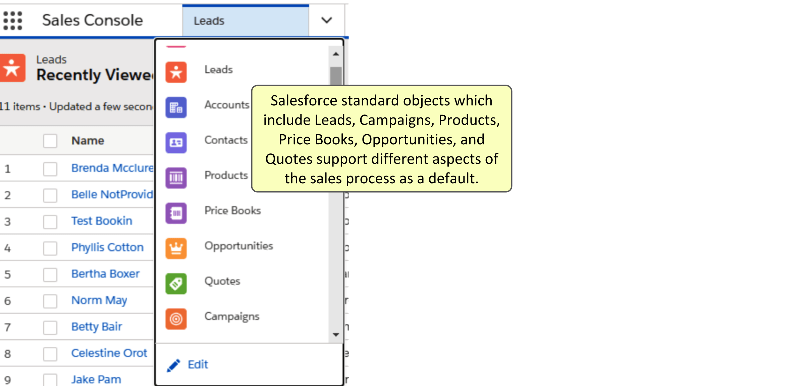

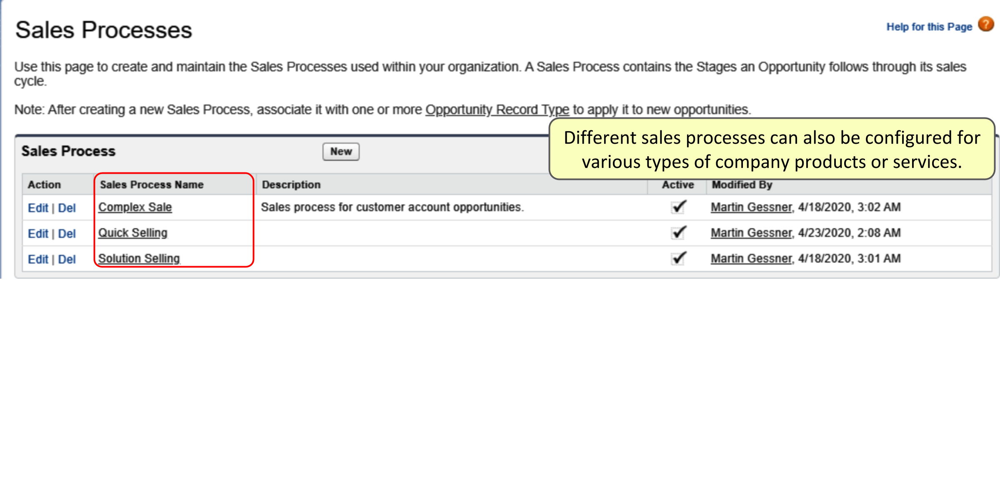

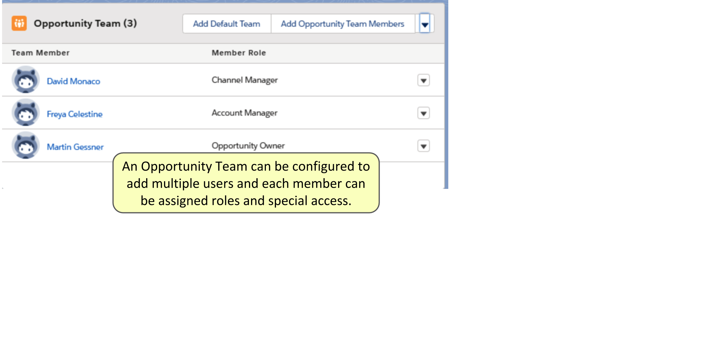

## Macros

A Sales Cloud consultant has set up a console app in Lightning Experience to improve the productivity of sales reps in the organization. Which of the following should be considered for creating and running macros in the app to further improve the productivity of sales reps?

- Macro Builder is used to craete macros in Lightning Experience.

- Individual macros cannot be run on list views.

***Standard objects, except 'Campaign', and custom objects that allow quick actions and have a customizable page layout support macros. In Lightning Experience, Macro Builder is a point-and-click tool that is used to create macros.***

*It is not possible to run individual macros on list views. Macro instructions allow using email templates and adding email attachments.*

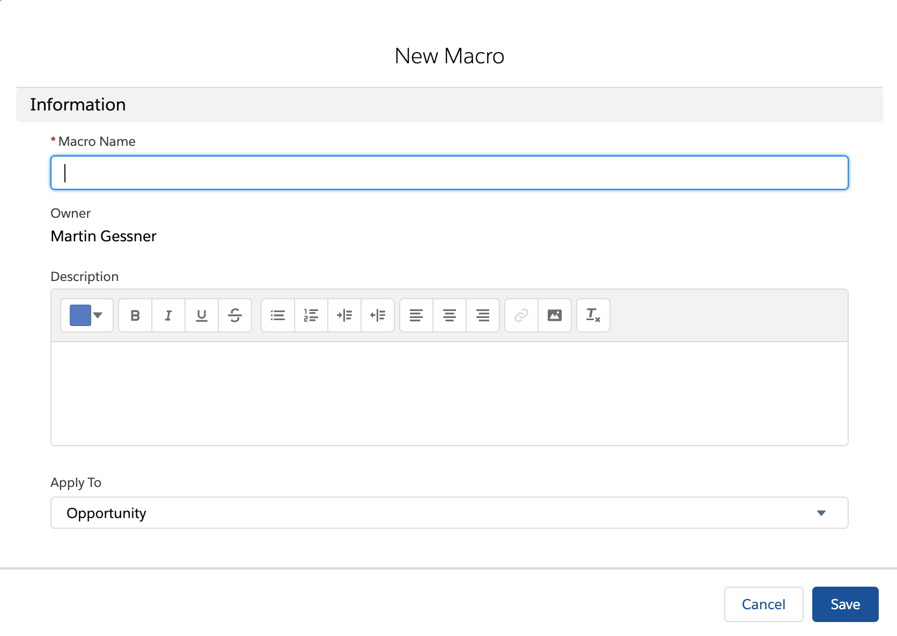](images/clipboard-1260331590.png)

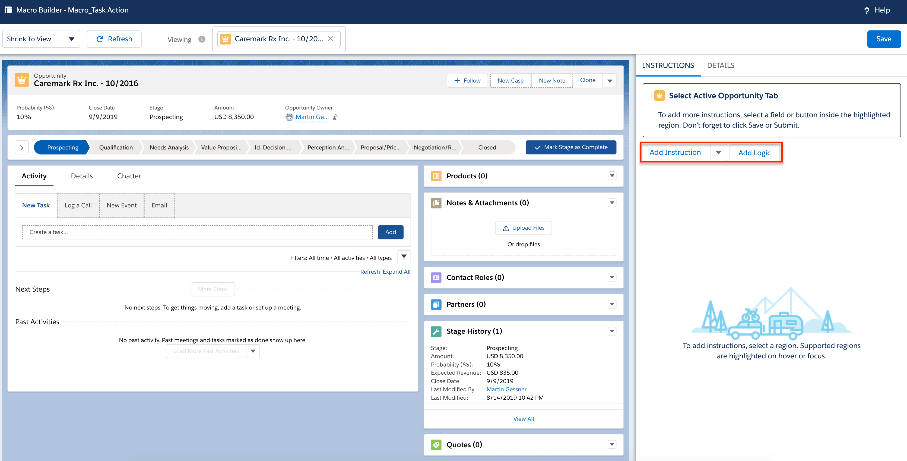

## Product

Cosmic Enterprises will be adding a new product that will be delivered once ordered but billed in quarterly installments for one year. How can this be reflected in Salesforce?

- Create a default revenue schedule for the product.

As the product is delivered at one time but the revenue will be received in installments, a revenue schedule that defines the revenue amounts and number of installments should be created.

A sales manager contacted the Salesforce Administrator with an issue that he is not able to add a product to an opportunity. What does the Salesforce Administrator need to check?

- The product has been added to a price book in the currency of the opportunity, and the price book entry is active.

- The product is active.

- The product has a standard price entry in the currency of the opportunity.

The 'Active' checkbox should be selected to ensure that a product is active before it can be added to an opportunity. Products need a standard price before they can be added to a price book, which leads to a price book entry creation. For multi-currency orgs, the opportunity Currency is tied to the currency of the associated price book entry. If there is an existing opportunity line item, the currency of the product line item to be inserted should be in conjunction with the opportunity currency. The sales price is specified for a product that is added to an opportunity or quote.

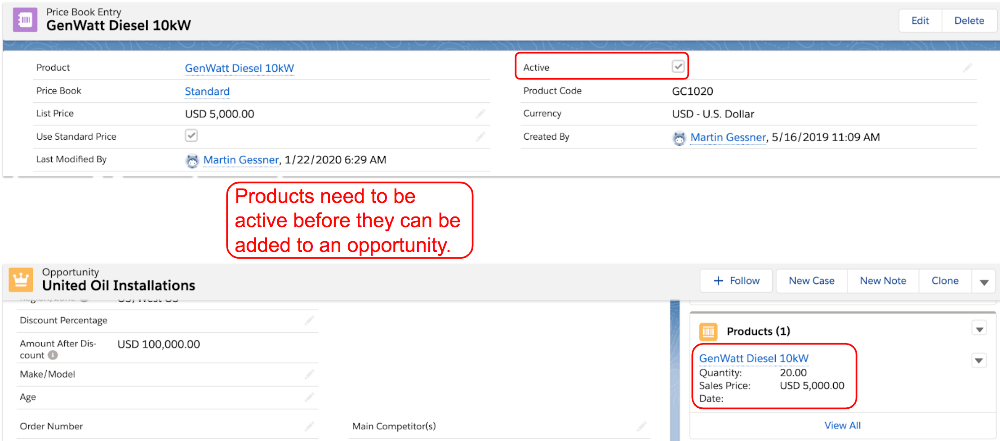

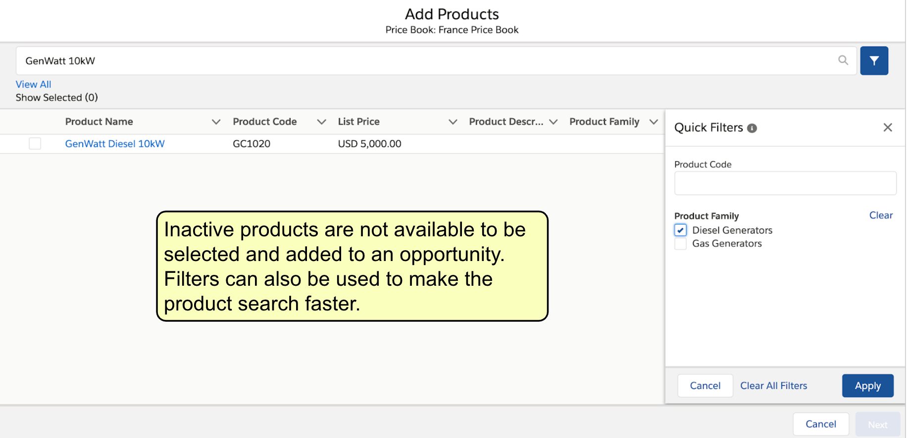

Galactic Sweepers offers a weekly office cleaning service that is invoiced monthly. What should be created to represent this?

- A default Quantity and Revenue Schedule

A Revenue and Quantity Schedule is suitable if the customers receive their order on a delivery schedule and also pay for the products using a payment schedule.

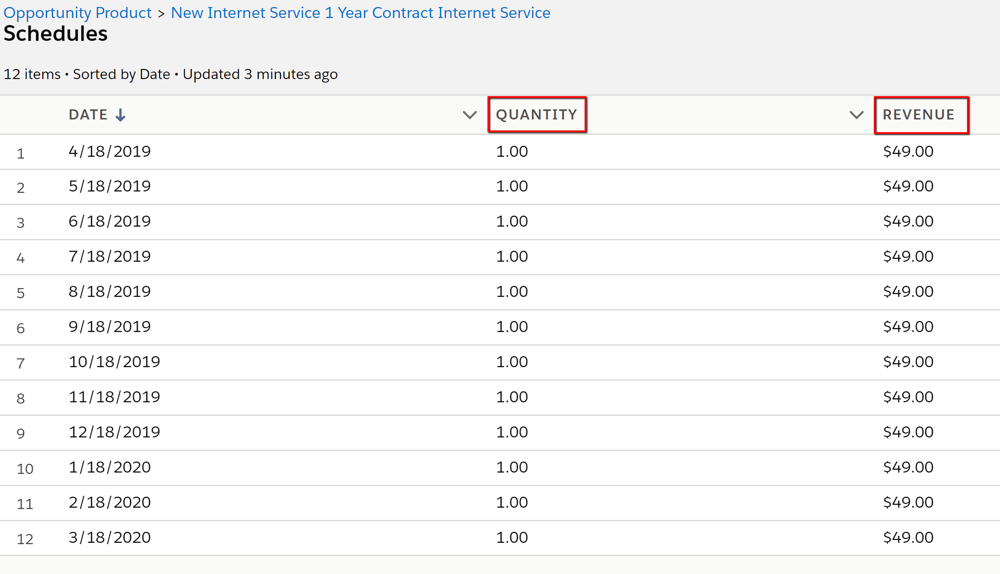

## Account

A sales representative is currently working on an account and would like to collaborate with two other sales representatives and a partner user. These users should be able to view and edit the account for a limited period of time. What is a possible solution for this requirement?

- Share the account with the users using the 'Sharing' button.

- Add and remove users to the account team from the 'Account Team' related list.

***Internal and partner users can be added to an account team in Lightning Experience. From the 'Account Team' related list on an account, either a team member or a default account team can be added. Team members can be given 'Read/Write' access to an account. The related list must be added to the account page layout by an administrator to use this functionality.***

*The 'Sharing' button can also be used to share a record with other users, groups, roles, and territories. A sharing rule is used to grant record access to users in groups, roles, and territories. A permission set can be used to grant additional access to objects, but it cannot be used to grant access to specific records of an object.*

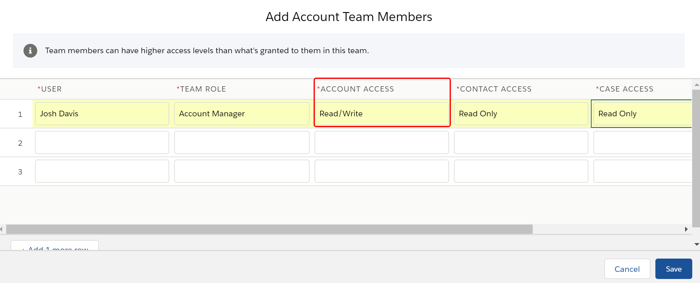

## Lead

### Einstein Lead Scoring

***With Einstein Lead Scoring, leads can be scored separately according to their segments. Since lead and conversion history can be evaluated based on the associated marketing or advertising campaign, it will be easier to determine which campaigns prove to be more successful.***

*Einstein Activity Capture is used to connect email and calendar applications to the Salesforce org and helps reduce data entry work done by agents. Einstein Opportunity Insights evaluates opportunities and gives modeled predictions about the likelihood to close them based on data from previously closed opportunities. Campaign hierarchy is used to organize and link individual marketing campaigns together through parent and child relationships.*

- Einstein Lead Scoring.

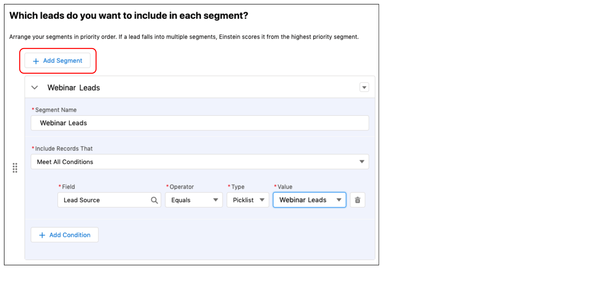

## Sales Pipeline Visibility and Forecasting

## Pipeline Inspection

The Sales Managers at Costa Gears are taking a more proactive role in managing the opportunity pipeline.\
The Sales Cloud Consultant recommended that they utilize Pipeline Inspection. Which of the following capabilities are features of Pipeline Inspection?

- Tiered Einstein opportunity scores are displayed along with key factors and score changes.

- Filters can be applied to narrow the view by criteria or to help identify areas of concern.

- Key performance indicators for sales pipelines are displayed as metrics at the top of the page.

***Pipeline Inspection is available as part of the Sales Cloud license at no extra cost with Enterprise, Performance, and Unlimited editions. It provides sales managers with better visibility of their pipeline by providing information on key metrics (based on the available number and currency fields), opportunities, and weekly changes. Metrics such as new opportunities created, increases or decreases in amounts, and overdue opportunities, can be displayed for the sales teams.***

*Pipeline views can be created using different filters to help identify areas of concern. Pipeline Inspection users who have the 'Revenue Intelligence User' or the 'Revenue Intelligence Admin' permission set can see the changes to opportunities in different forecast categories over time from the 'Flow' tab. Inline editing of these fields is no longer possible, aligning the list view behavior with the Opportunity page layout configuration. However, field-level security settings continue to take precedence, overriding the Opportunity page layout settings if necessary.*

*Einstein Deal Insights, powered by Einstein's machine learning capability, predicts the opportunities unlikely to be won in the current month. Lastly, Einstein Conversation Insights and Email Insights are also features of Pipeline Inspection. Einstein Conversation Insights and Email Insights provide sales agents with the information they need to analyze all customer interactions to track deals. These functionalities encompass suggested actions, such as reviewing call and email logs, producing call summaries for voice and video calls, and generating editable summaries to incorporate future actions and client input.*

<https://help.salesforce.com/s/articleView?id=sales.pipeline_inspection_drive_revenue_using_parent.htm&type=5>

## Dynamic Highlights Panel

Cosmic Beans handles several types of accounts that range from individual to corporate consumers of their world-class coffee beans. The Dynamic Highlights Panel component has been added to the Account record page. How will this configuration impact the sales team when viewing an account?

- Sales users may see different sets of fields displayed on the Dynamic Highlights Panel depending on the account.

The Dynamic Highlights Panel component is an advanced alternative to the traditional Highlights Panel component in Lightning App Builder. While the Highlights Panel supports up to 7 fields only, the Dynamic Highlights Panel can display up to 12 fields. Unlike the fields in the Highlights Panel that are static, the fields in the Dynamic Highlights Panel support field visibility and can be displayed conditionally based on field values, device, or other criteria. While fields in the Highlights Panel are configured via the compact layout, fields in the Dynamic Highlights Panel are configured directly in Lightning App Builder.

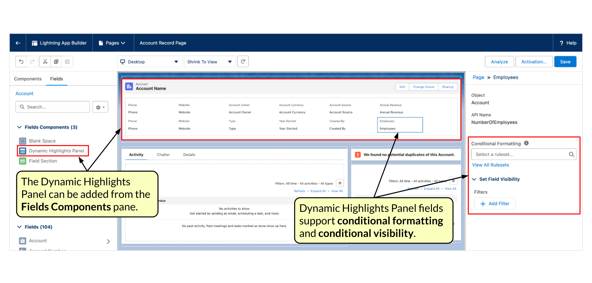

# Objective 2

## Campaign

Marketing and sales users at Global Systems Inc. would like more visibility into lead and contact participation in this year's Trade Show. How would a Salesforce Administrator build this into the application?

- Associate the lead or contact with a campaign when they register for the event.

Creating a custom object, cross-object formula, or requesting for customers to send their participation confirmation via email is not necessary since this can be done when leads and contacts register for the event. They can be associated to a campaign as campaign members to track their participation.

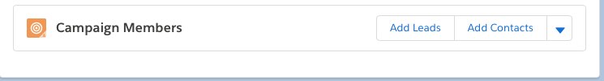

## Campaign Management

Which of the following are correct regarding Campaign Management?

- Campaigns can be grouped together in a hierarchy

- Campaign member can be added from reports

- Campaign members can be added from a Contact or Lead list view.

***A campaign hierarchy allows one to group campaigns together within a specific marketing program or initiative, which enables analyzing related marketing efforts more efficiently. It is possible to add members to a campaign from Lead, Contact, and Account tabular, summary, and matrix reports. Moreover, it is also possible to add up to 200 members to a campaign at once from Lead or Contact list views.***

*Individual campaigns can be shared to other users by clicking on the 'Sharing' button on a campaign record. Data Loader can be used to update a large number of campaign members, but it is also possible to update campaign member statuses from the Campaign detail page using the 'Manage Members' button or the 'Campaign Members' related list.*

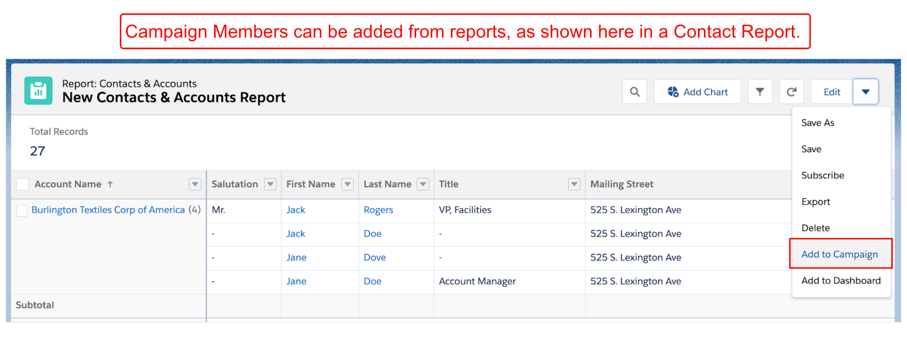

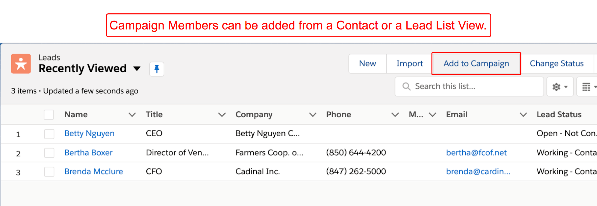](images/clipboard-1982677010.png)

## Campaign Influence

What does the campaign influence feature allow?

- Associate one primary campaign that has influenced the opportunity.

- Add multiple campaigns that have influenced an opportunity to the campaign related list.

***Multiple campaigns that have influenced an opportunity can be added to an opportunity related list. Although multiple campaigns can be influential, only one campaign can be selected as the Primary Campaign Source on the opportunity.***

*An active campaign must first be related to a contact that is assigned a contact role on the opportunity in order for it to be automatically associated. Campaigns influence opportunities, not the other way around.*

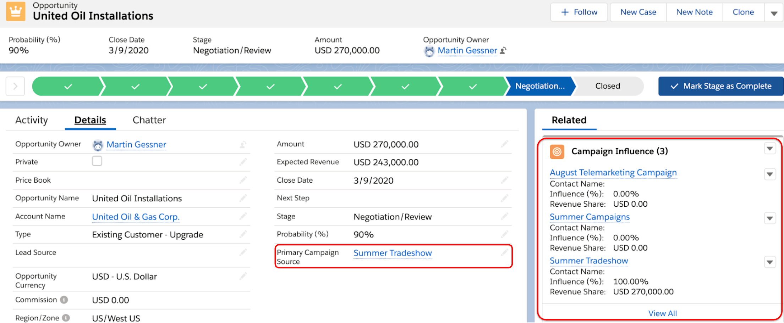

Instead of attributing revenue to the primary campaign associated with an opportunity, how can revenue be evenly and automatically attributed to all campaigns related to an opportunity?

- Use a flow to distribute revenue accordingly

- Create a custom campaign influence attribution model

To distribute revenue between multiple campaigns, a new campaign influence attribution model would need to be created. Flow or Apex code can be used to automatically distribute revenue across the campaign influence records. The model should be locked, to prevent users from manually adding campaign influence records.

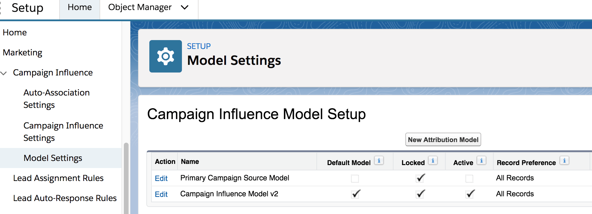

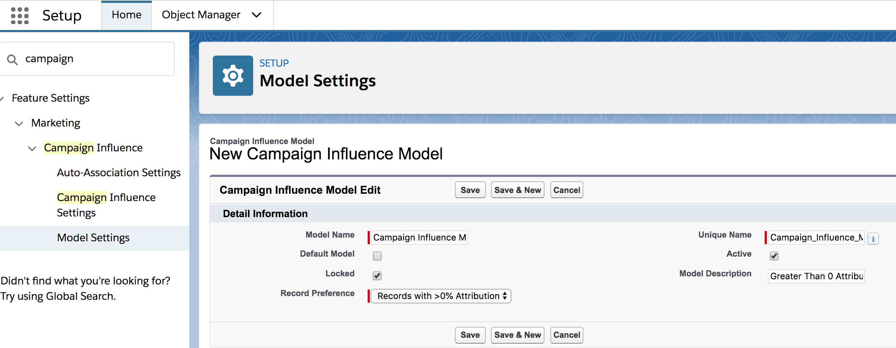

## Campaign Hierarchy

What is true regarding campaign hierarchies?

- Each campaign can have one parent campaign in the hierarchy

- A campaign hierarchy can be viewed by clicking the 'View Campaign Hierarchy' button

- A campaign hierarchy shows grouped campaigns within a specific marketing initiative

A campaign hierarchy shows grouped campaigns within a specific marketing initiative. Each campaign can have only one parent campaign, but it can have an unlimited number of sibling campaigns. 'View Campaign Hierarchy' buttons on a campaign detail page can be used to view the campaign hierarchy.

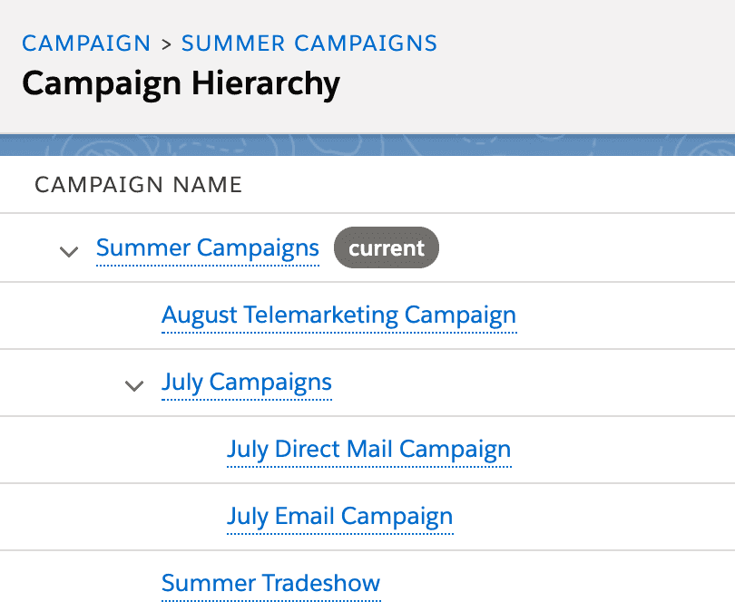

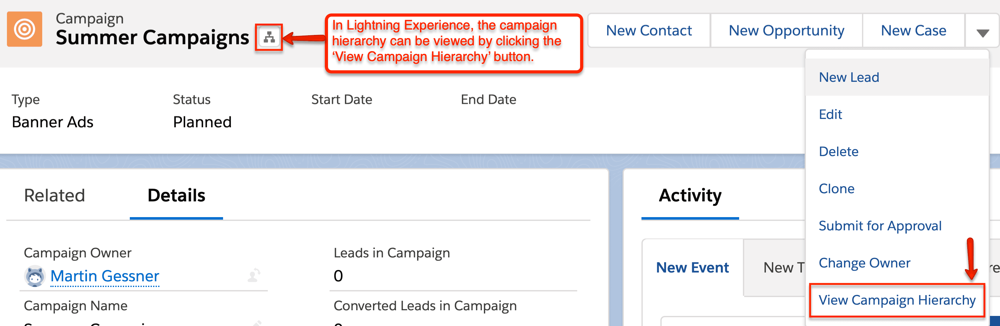

## Data Import Wizard

Which of the following can be used to add or update Campaign Members from the Campaign record page?

- Data Import Wizard

***In Lightning Experience, the 'Manage Campaign Members' and 'Import Leads and Contacts' options will navigate to the Data Import Wizard. The Data Import Wizard can be used to add or update up to 50,000 campaign members.***

*The Campaign Update Wizard is a retired functionality that has been replaced by the Data Import Wizard. Although a custom report that returns lead, contact, or account records can be used to add campaign members, it is not available by default on a campaign record page. Also, there is no Add/Update Members button on the page.*

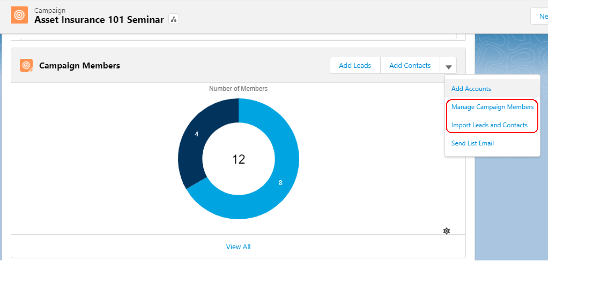

## Send List Email action

Global Insurance would like to send an email to each member of a campaign. They are using Lightning Experience. What can be suggested as the most efficient way of emailing campaign members?

- Use the Send List Email action from Campaign Member view.

In Lightning Experience, a list email will send an individual email to each recipient in a list without manually selecting each record. It can be used from a lead or contact list view or campaign member view. In addition, list emails can be scheduled to send at a particular date and time.

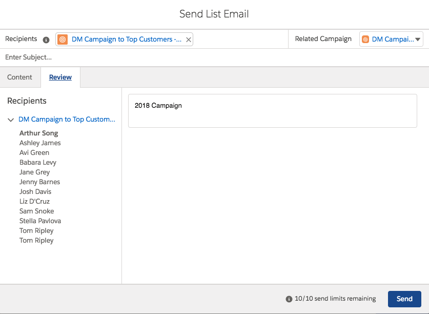

A sales representative who uses Lightning Experience would like to send a personalized email to some of the campaign members related to a campaign. Which of the following should be used by the sales representative to send a list email for this use case?

- Campaign Members related list detailed view.

***The best option here is to use the 'Campaign Members' related list detailed view by clicking the 'View All' button at the bottom of the related list and selecting specific campaign members as recipients.***

*Campaign members can be sent a list email using the 'Campaign Members' related list from the Campaign page, but specific accounts, contacts, and/or leads cannot be selected individually. The same is true about using the 'List Emails' tab. The 'Accounts' tab does not allow sending a list email.*

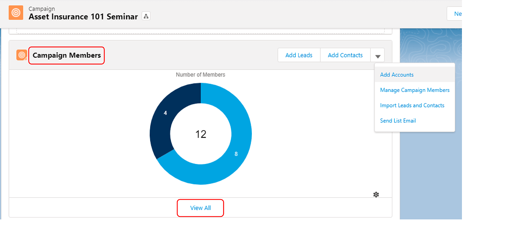

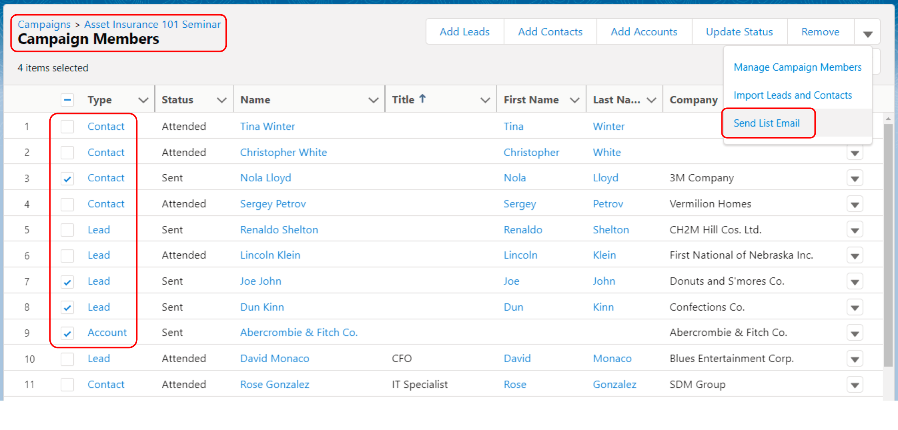

## Lead

A company's Salesforce org is currently configured to create opportunity records by default on lead conversion. The Sales Director of the company has decided that sales reps should only be responsible for converting leads into accounts and contacts. Sales reps are not permitted to create opportunity records when leads are converted, and they should not be allowed to override this rule. What is the quickest way for the Salesforce Administrator to prevent sales reps from being able to create opportunity records on lead conversion?

- The Salesforce Administrator should go to 'Lead Settings' under 'Setup' and select 'Hide Opportunity Section of Convert Lead Window.'

***Salesforce provides a 'Convert Lead' window with sections for lead conversion to account, contact, and opportunity records. Salesforce Administrators are also allowed to customize the 'Convert Lead' window to remove the section for the potential opportunity record. In order to remove the opportunity section, Salesforce Administrators should check the appropriate checkbox in 'Lead Conversion Settings' under 'Lead Settings'.***

*The 'Convert Lead' window has a 'Don't create an opportunity upon conversion' checkbox. Checking this box will prevent an opportunity record from being generated upon lead conversion. However, this is not the best answer because a sales rep would have to check the box on every conversion, and it is probable that sales reps would occasionally forget to do so. Removing the entire opportunity section is a more effective way to prevent the generation of opportunity records. Removing the 'edit' or 'create' permissions is not the best response because either one would restrict the actions available to the sales reps far beyond the scope of what the company wishes.*

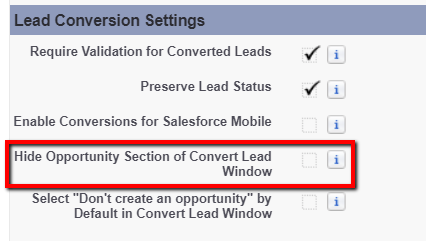

What happens when a lead is converted?

- A name is generated automatically for the opportunity during the lead conversion process

- The owner of the records created can be selected right before conversion.

***Users can only view converted leads if they have the 'View and Edit Converted Leads' permission. There is a checkbox field 'Do not create a new opportunity upon conversion' visible for the users during lead conversion, which makes the creation of an opportunity optional.***

*Before conversion, the owner of the newly created records can be selected using the required 'Record Owner' field. The 'Company' field in the lead record is mapped to the 'Opportunity Name' field, automatically generating an editable name during the lead conversion process.*

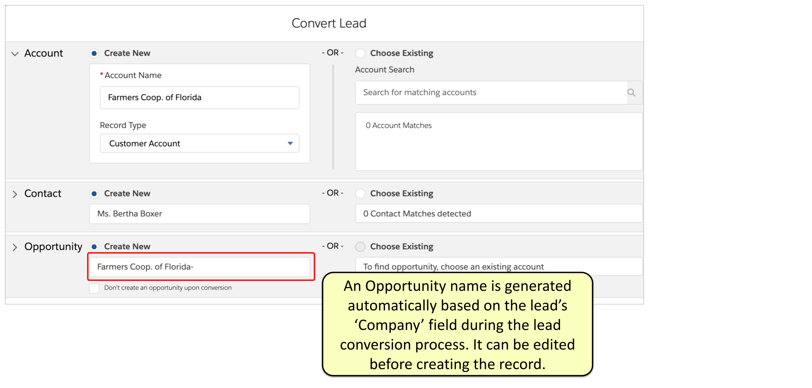

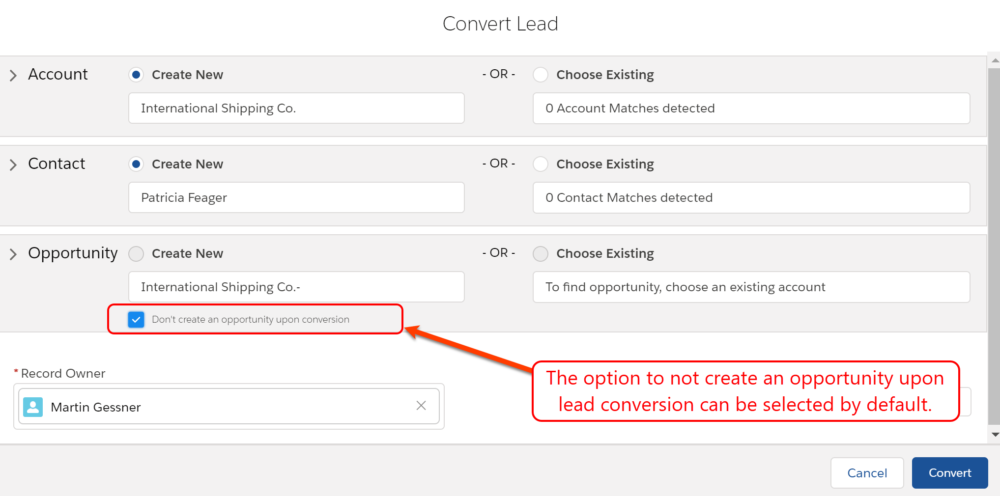

## Path

The marketing team of Cosmic Learning Solutions uses Lightning Experience to manage campaigns in Salesforce. Each campaign has a lifecycle, and a custom picklist field is used by marketing users to specify the stage of a campaign. The Marketing Director would like to add guidance for the users, especially those who are new to the company, by providing stage-specific tips, best practices, and other company information necessary to move a campaign to the next stage. How can a Sales Cloud Consultant meet this requirement?

- Create a new Path using the custom picklist field for the Campaign object.

- Use Lightning App Builder to add the Path feature that allows visualizing and tracking the stages of campaigns.

***In Lightning Experience, a Path can be created for an object to visually display steps related to a business process associated with the object and provide guidance to users. The guidance can be in the form of tips, links, best practices, or company policy information related to each stage of the business process. The fields that appear for each stage and the guidance text can be configured. After creating a Path, the 'Path' component needs to be added to the object's record page using the Lightning App Builder.***

*Creating a custom Lightning component for this requirement is unnecessary since the 'Path' feature is already available for it. It would also require programmatic development experience and assistance from a developer. Einstein Discovery is a feature that is available for an extra cost and can provide explanations and recommendations for a Salesforce object based on data analysis. However, it cannot be used to provide specific tips and best practices or other company information that needs to be provided for each stage.*

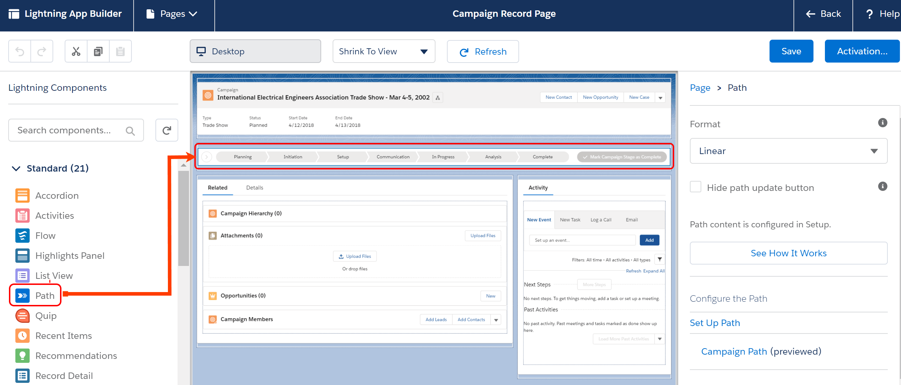](images/clipboard-1924016964.png)

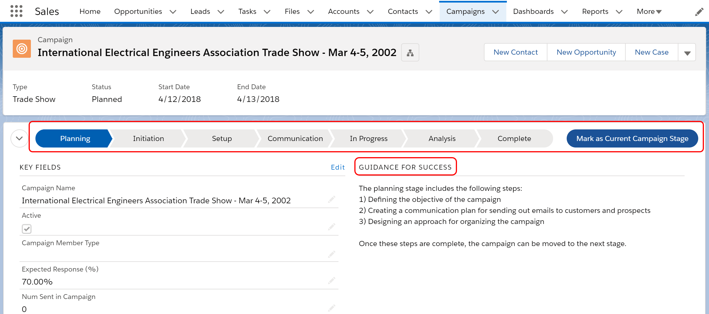

## Web to Lead

Fast Finance would like to enable Web-to-Lead, but is concerned about the creation of lead records that contain spam. Which of the following represents the best solution to prevent receiving spam via Web-to-Lead?

- Requier reCAPTCHA verification

***The best solution is to prevent the lead data from entering Salesforce if it is spam. When the 'Require reCAPTCHA Verification' setting is enabled, leads that do not use reCAPTCHA are rejected.***

*An auto-response or validation rule would not prevent the creation of spam leads. A validation rule can check if the data entered is valid, but it would not prevent the entry of fake data. Aside from the fact that Email domain restriction is not applicable to Web-to-Lead forms, it is also not a suitable solution to identify and reject spam leads.*

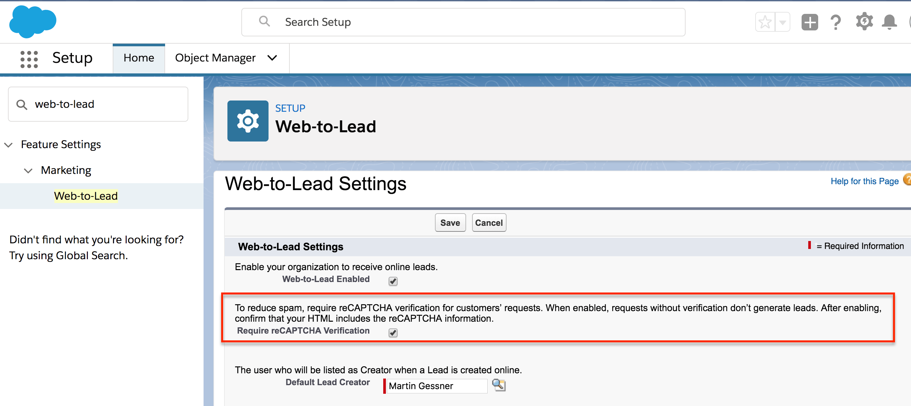

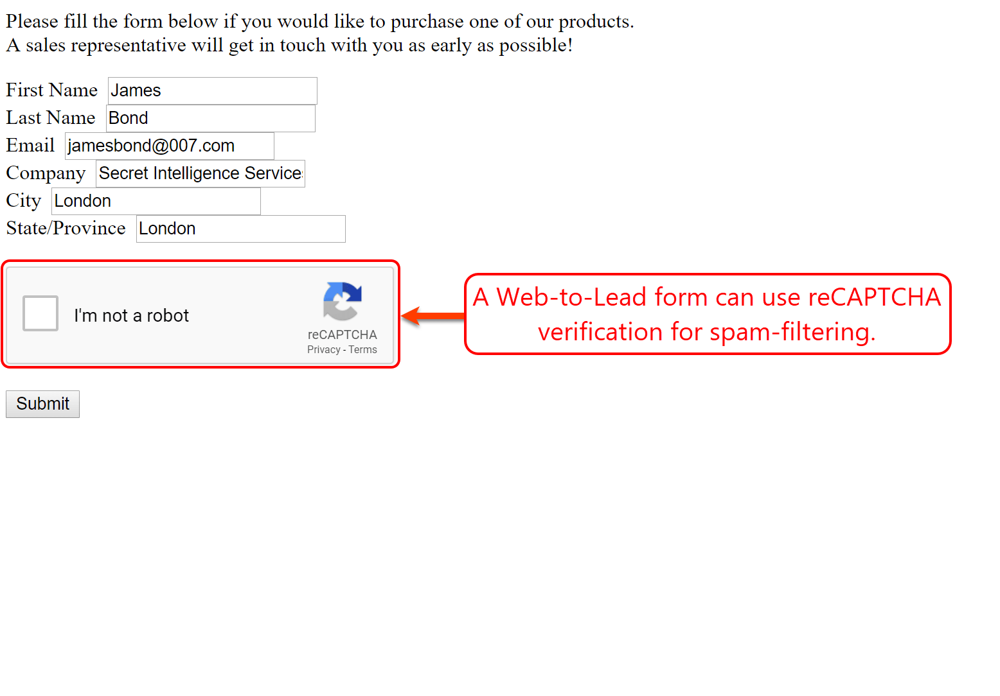

## Assignment rules

To help automate assigning records to the correct users, an administrator is asked to setup assignment rules. What must the administrator keep in mind regarding assignment rules?

- Assignment rules can assign records to users or queues

Assignment rules can only be set up on cases and leads. Assignment rules can assign records to users or queues. Multiple rules cannot be active at one time. There can be multiple criteria that are evaluated according to the order specified within the rule. Lead assignment rules will run whether the lead is created manually, generated from a Web-to-Lead form, or imported via the Data Import Wizard or Data Loader.

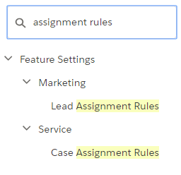

## VOIP

Modaxy Communications is a VOIP(voice over internet protocol) solutions provider.

Alex, the Sales Director, wants to have inquiries regarding their new service and phone hardware bundle automatically to a team consisting of his best sales reps.

What can be done to facilitate this?

- Set up an assignment rule that routes the new service and phone hardware bundle leads to a queue.

- Identify sales reps with the best sales numbers, and create a queue with those reps as members.

***Lead assignment rules can be configured to automatically assign leads that match specific criteria, such as those related to the new service and phone hardware bundle, to a designated queue. Queues can include specific users (in this case, the top-performing sales reps) to ensure that qualified leads are distributed effectively.***

*A flow could technically be used to assign leads, but this would introduce unnecessary complexity since lead assignment rules are designed specifically for automated routing. A list view is a filtering tool and cannot automate assignments*

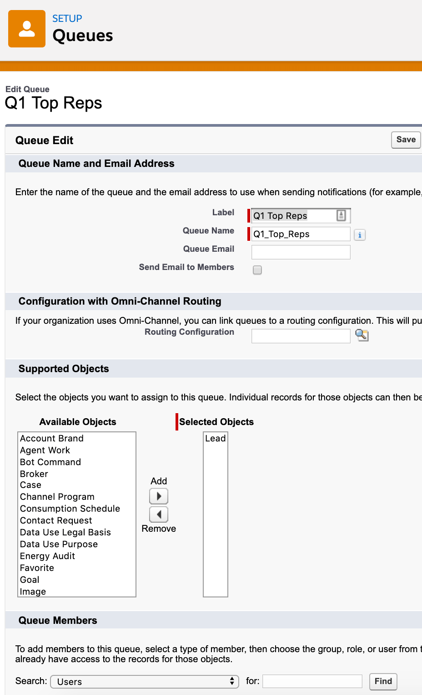

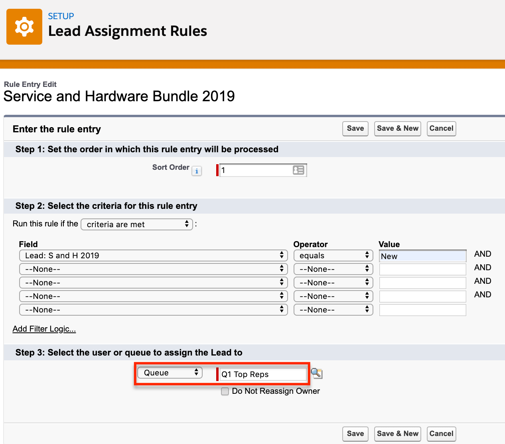
