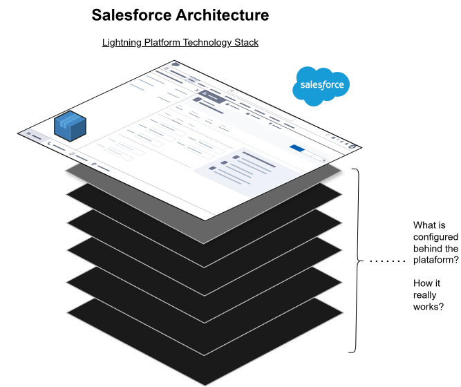
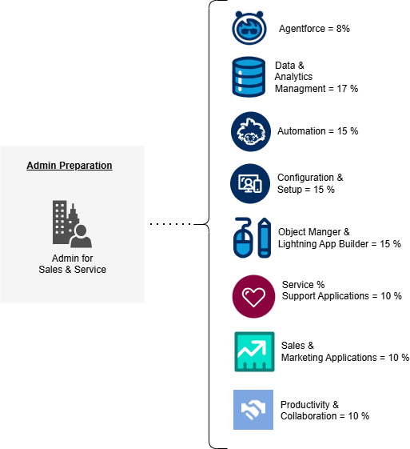

```{r setup, include=FALSE}
# Este bloque oculto obliga a renv a registrar estos paquetes
library(bookdown)
library(knitr)
library(rmarkdown)
```

# Welcome! {.unnumbered}

This is a Study guide to prepare to the Salesforce Admin Exam.

Actually the weight about the Exam is:

- **Agentforce= 8%** \<-- New topic!
- Data and Analytics Managment = 17 %
- Configuration and Setup = 15 %
- Automation = 15%
- Object Manager and Lightning App Builder = 15 %
- Sales and Marketing Applications = 10%
- Service and Support Applications = 10 %
- Productivity and Collaboration = 10%

This document is trying to help me, another way to study and also to share with people how like to go deeper to the platform.

The concept behind this project is trying to going deeper to every layer, on which can visualize like this image:

{width="900"}

# Study Guide {.unnumbered}

\
What I really need to know about each topic for the Admin Exam?

As I mention on the following image, here is the weight about each topic:



I will try to do and schema and resume about each topic.
